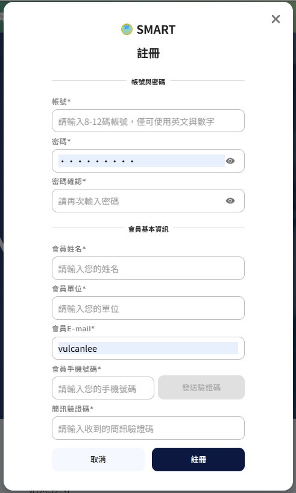
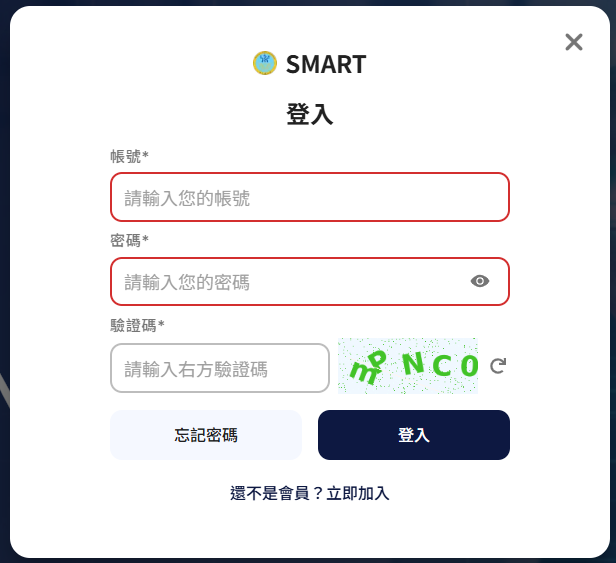
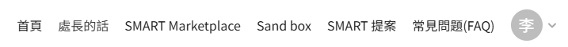
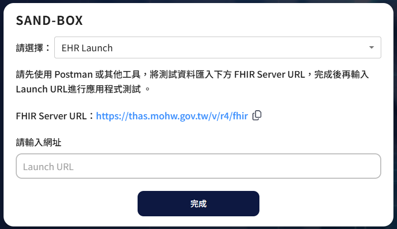
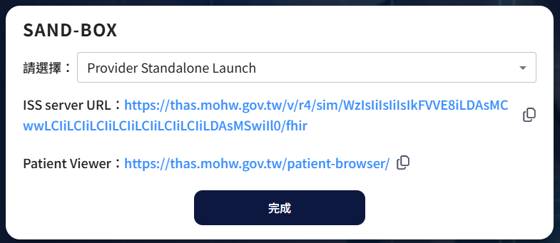

# FHIR 01 如何註冊 Smart On FHIR的沙盒 Sandbox

由於最近接到一個任務，那就是要完成一個 Smart App應用程式並且要能夠通過 Smart On FHIR 的認證，最終要能夠上架到 Smart 市集上，因此，便有了這一系列的文章，將如何透過 .NET 相關技術，開發出存取 FHIR 醫療紀錄的應用程式開發過程的說明。

一旦完成認證，這個 Smart App 便可以順利無縫且安全的存取醫療院所的 EHR 資料。

這裡是第一篇文章，那就是說明關於如何使用衛福部所提供的 Smart On FHIR 沙盒環境來進行註冊，當完成這個程序之後，便可以開始著手進行一個 Smart App 智慧醫療應用程式的開發。

# 註冊 Smart On FHIR 沙盒環境

* 進入衛福部 Smart On FHIR 網頁：[台灣 Smart On FHIR](https://thas.mohw.gov.tw/)
  
* 若沒有使用過系統，則需要先申請一個帳號
* 點選右上角的「註冊」
  
* 填入相關註冊需要用到的帳號與密碼，和會員基本資訊
* 並且需要完成會員手機號碼的驗證程序
* 最後，點選右下方的「註冊」
* 完成註冊程序
* 接著，使用剛剛註冊的帳號密碼進行登入
* 點選右上角的「登入」
* 此時，網頁上將會出現了 SMART 登入的畫面
  
* 依序填入帳號與密碼和驗證碼
* 點選「登入」
* 登入成功之後，便會進入到 Smart On FHIR 的主畫面
  
* 現在可以進入到申請沙盒環境的申請
* 點選上方的「Sand box」
* 此時，畫面將會出現如下圖所示
  
* 這裡看到的 [SAND-BOX] 對話窗，會有一個 [請選擇] 下拉選單，這裡的選單將會有兩個選項
  * EHR Launch
  * Provider Standalone Launch
* 其中，EHR Launch 畫面如上圖 ，而 Provider Standalone Launch 畫面如下圖所示
  
* 這兩個選項的差異在於，EHR Launch 是模擬從醫療院所的 EHR 系統中啟動 Smart App 的情境，而 Provider Standalone Launch 則是模擬醫療人員獨立啟動 Smart App 的情境
* 這裡是 EHR Launch 的運作流程圖 
* 對於如何開發出 [EHR Launch] / [Provider Standalone Launch] 的 Smart App 應用程式，並且如何完成沙盒環境的測試，將會在後續的文章中進行說明