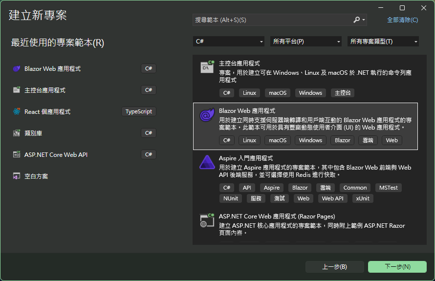
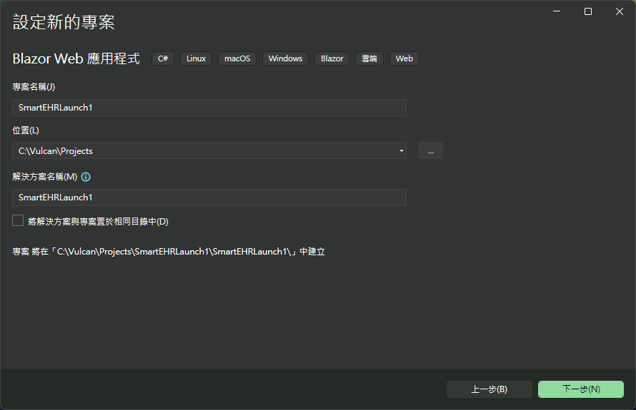
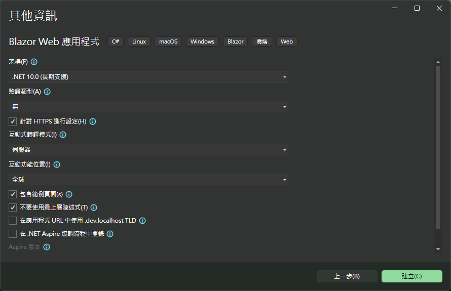
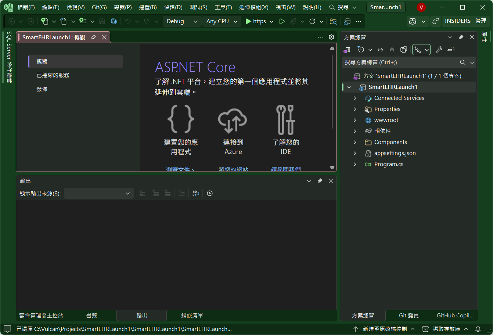

# FHIR 02 建立 EHR Launch App

# 建立 Blazor 專案
* 開啟 Visual Studio 2026
* 選擇「建立新專案」
* 在 [建立新專案] 視窗中，在右方清單內，找到並選擇「Blazor Web 應用程式」 項目

* 然後點擊右下方「下一步」按鈕
* 此時將會看到 [設定新的專案] 對話窗
* 在該對話窗的 [專案名稱] 欄位中，輸入專案名稱，例如 "SmartEHRLaunch1"
* 
* 然後點擊右下方「下一步」按鈕
* 接著會看到 [其他資訊] 對話窗
* 在這個對話窗內，確認使用底下的選項
    * 架構：.NET 10.0 (或更新版本)
    * 驗證類型：無
    * 勾選 針對 HTTPS 進行設定
    * 互動式轉譯模式：伺服器
    * 互動功能位置：全球
    * 勾選 包和範例頁面
    * 勾選 不要使用最上層陳述式 (這是我的個人習慣)
    * 不要勾選 在應用程式 URL 中使用 .dev.localhost TLD
    * 不要勾選 在 .NET Aspire 協調流程中登錄
    
* 然後點擊右下方「建立」按鈕
* 現在，已經完成了這個 Blazor 專案的建立

## 建立 Smart App 沙盒進入點頁面

在這個 Smart On FHIR 官方網頁上的 [App Launch: Launch and Authorization](https://hl7.org/fhir/smart-app-launch/app-launch.html) 網頁內容，說明了要開發出一個 Smart On FHIR App，必須要有一個「啟動點 (Launch Endpoint)」頁面，這個頁面會負責處理來自 EHR 系統的啟動請求，並且引導使用者進行授權流程。接下來就是要能夠處理授權處理，最後就是要使用授權碼來取得存取權杖 (Access Token)，然後使用這個存取權杖來存取 FHIR 資源。

由於要將這些全部作法寫在一篇文章內，會顯得過於冗長，因此這篇文章先示範如何建立一個「啟動點 (Launch Endpoint)」頁面，讓這個頁面能夠接收來自 EHR 系統的啟動請求，並且將這些請求參數顯示在頁面上。

在這裡將會說明採用 [EHR Launch] 模式，透過沙盒來啟動這個 App，對於採用 [Standalone Launch] 模式的 App，則會透過其他的文章來說明這樣的系統開如何開發出來。

