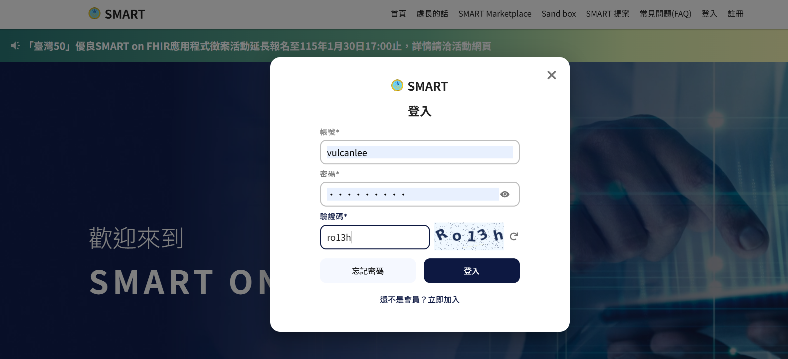
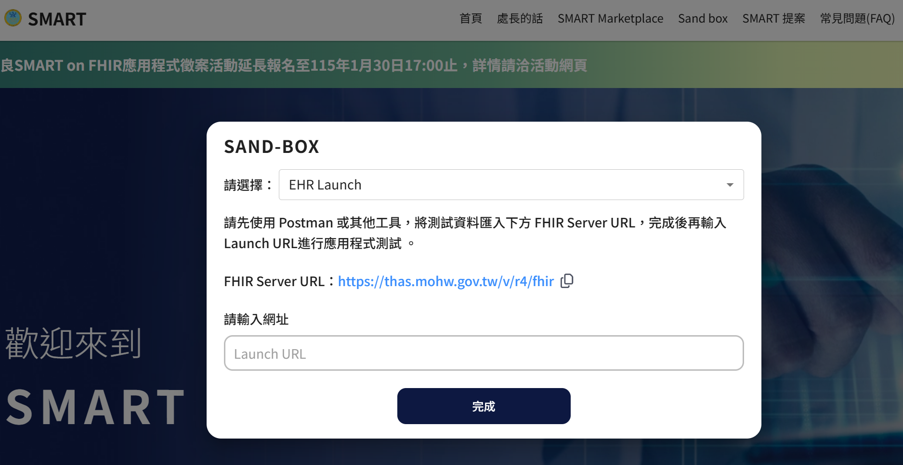
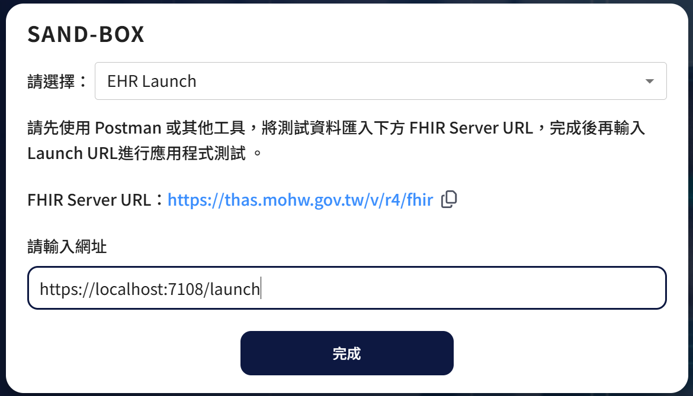
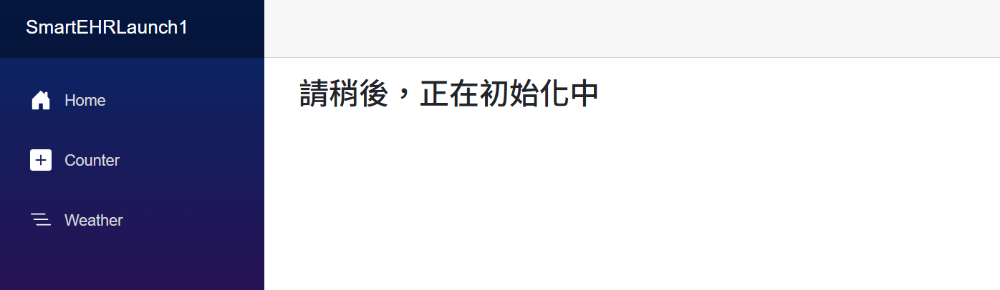
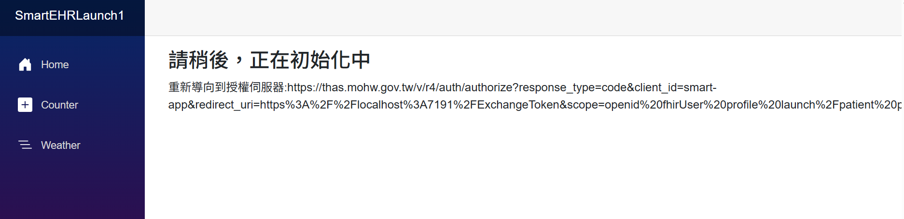
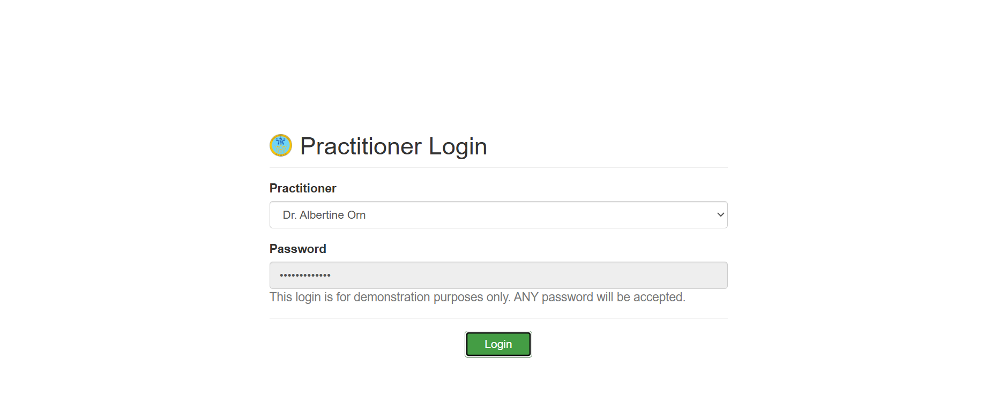
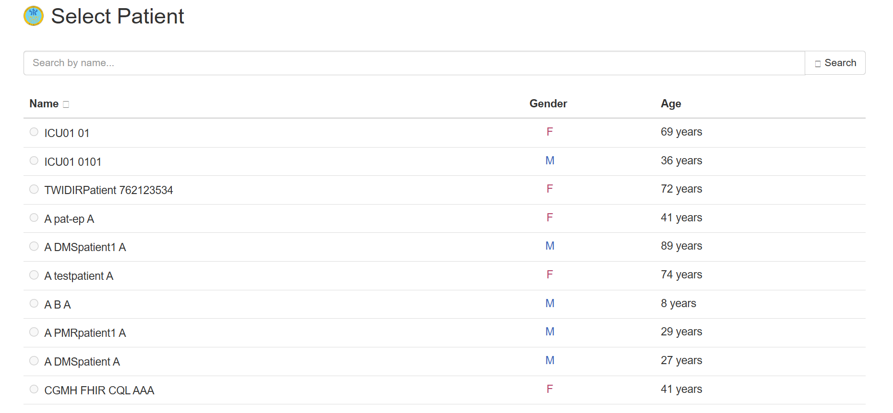
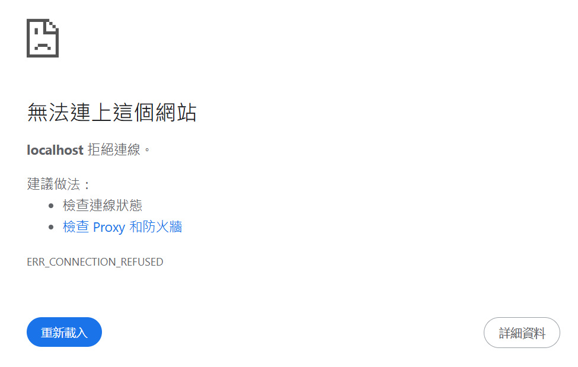

# FHIR 03 說明透過 EHR Launch 取得授權碼的程式碼做法與實測過程

在上一篇文章中 [FHIR 02 建立 EHR Launch App](https://csharpkh.blogspot.com/2026/01/FHIR-02EHR-Launch-App.html)  ，我們已經成功建立了一個 EHR Launch App，並且在 EHR 系統中註冊完成。 接下來，我們將說明如何透過 EHR Launch 模式來取得授權碼 (Authorization Code)，並且展示實際的程式碼做法與測試過程。

若這個系統可以正常運作，那麼將會來了解這個專案內的程式碼作法，並且說明 Launch 這個頁面的運作流程與程式碼設計過程。

## 執行結果說明

依照底下步驟操作，完成使用 Smart On FHIR 沙盒環境來進行 EHR Launch 的授權碼取得流程：

* 開啟並且執行 [SmartEHRLaunch1]
* 這裡是執行後的螢幕截圖，也就是 Blazor 開發框架的範例的啟動畫面

* 開啟沙盒驗證網頁 [https://thas.mohw.gov.tw/]
* 這裡需要先進行身分驗證，點選 [登入] 文字連結
* 在登入對話窗內，依序輸入帳號、密碼、驗證碼

* 最後點選 [登入] 按鈕，完成身分驗證作業
* 點選上方的 [Sand Box] 連結，進入沙盒系統
* 現在出現了 [SAND-BOX] 對話窗

* 對於 [請選擇] 下拉選單，選擇 [EHR Launch] 項目，也就是預設值
* 在 [請輸入網址] 欄位中，輸入 `https://localhost:7108/launch`

* 其中， [https://localhost:7108/launch] 端點，就是剛剛撰寫程式碼的 Razor 元件頁面
* 點選 [完成] 按鈕，系統會導向到 EHR Launch 頁面

* 在 [Launch] 端點頁面中，將會顯示出文字 [請稍後，正在初始化中]
* 此時的網址列將會為 ： `https://localhost:7108/launch?iss=https://thas.mohw.gov.tw/v/r4/fhir&launch=WzAsIiIsIiIsIkFVVE8iLDAsMCwwLCIiLCIiLCIiLCIiLCIiLCIiLCIiLDAsMSwiIl0`
* 這個網址將會是 Sandbox 系統導向到我們的 EHR Launch 頁面的網址，從這裡也看到了兩個重要的參數：
  * `iss` ：代表 EHR 系統的 FHIR 伺服器位址 [https://thas.mohw.gov.tw/v/r4/fhir](https://thas.mohw.gov.tw/v/r4/fhir) ，這個將會是我們後續要與之互動的 FHIR 伺服器
  * `launch` ：代表這次啟動的 Launch 參數，也就是 EHR 的系統所產生的 Launch Context
* 接著，系統會自動將我們的瀏覽器，重新導向到授權伺服器: `https://thas.mohw.gov.tw/v/r4/auth/authorize?response_type=code&client_id=smart-app&redirect_uri=https%3A%2F%2Flocalhost%3A7191%2FExchangeToken&scope=openid%20fhirUser%20profile%20launch%2Fpatient%20patient%2F%2A.read%20patient%2FEncounter.read%20patient%2FMedicationRequest.read%20patient%2FServiceRequest.read&state=15fb5f43e861447cbb482a399c4fe7ab&launch=WzAsIiIsIiIsIkFVVE8iLDAsMCwwLCIiLCIiLCIiLCIiLCIiLCIiLCIiLDAsMSwiIl0&aud=https%3A%2F%2Fthas.mohw.gov.tw%2Fv%2Fr4%2Ffhir`
* 此時網頁畫面出會出現底下螢幕截圖，會有這樣的效果，是程式碼會暫停一段時間，故意讓使用者看到準備要切換到該網頁的畫面

* 現在，將會進入到 Sand Box 的授權伺服器，要取得授權碼，當取得了授權碼之後，就會使用 redirect_uri 參數，重新導向回到我們開發的頁面端點 `https://localhost:7191/ExchangeToken` ，並且在網址列中帶入授權碼參數 code
* 在網頁上，將會看到下面的畫面截圖，準備進入到身分驗證階段，此時的 URL 為： `https://thas.mohw.gov.tw/provider-login?response_type=code&client_id=smart-app&redirect_uri=https%3A%2F%2Flocalhost%3A7191%2FExchangeToken&scope=openid+fhirUser+profile+launch%2Fpatient+patient%2F*.read+patient%2FEncounter.read+patient%2FMedicationRequest.read+patient%2FServiceRequest.read&state=ab81aeae4fe84986bcca1e51948fa824&launch=WzAsIiIsIiIsIkFVVE8iLDAsMCwwLCIiLCIiLCIiLCIiLCIiLCIiLCIiLDAsMSwiIl0&aud=https%3A%2F%2Fthas.mohw.gov.tw%2Fv%2Fr4%2Ffhir&login_type=provider`

* 在這裡使用預設的帳號與密碼，點選 [Login] 按鈕
* 現在的畫面將會切換到選擇病患的畫面，此時的網址為： `https://thas.mohw.gov.tw/select-patient?response_type=code&client_id=smart-app&redirect_uri=https%3A%2F%2Flocalhost%3A7191%2FExchangeToken&scope=openid+fhirUser+profile+launch%2Fpatient+patient%2F*.read+patient%2FEncounter.read+patient%2FMedicationRequest.read+patient%2FServiceRequest.read&state=15fb5f43e861447cbb482a399c4fe7ab&launch=WzAsIiIsIiIsIkFVVE8iLDAsMCwwLCIiLCIiLCIiLCIiLCIiLCIiLCIiLDAsMSwiIl0&aud=https%3A%2F%2Fthas.mohw.gov.tw%2Fv%2Fr4%2Ffhir&login_type=provider&login_success=1&provider=147533`

* 點選任一病患項目，準備進入到下一個階段
* 可是，卻看到的底下畫面

* 在此看到了 [無法連上這個網站] 的訊息，這是因為我們的 redirect_uri 端點 `https://localhost:7191/ExchangeToken?code=eyJhbGciOiJIUzI1NiIsInR5cCI6IkpXVCJ9.eyJjb250ZXh0Ijp7Im5lZWRfcGF0aWVudF9iYW5uZXIiOnRydWUsInNtYXJ0X3N0eWxlX3VybCI6Imh0dHBzOi8vdGhhcy5tb2h3Lmdvdi50dy9zbWFydC1zdHlsZS5qc29uIiwicGF0aWVudCI6InBhdGllbnQtVFdFTVItRE1TLTEyMzQ1Njc4OS1BMTIzNDU2Nzg5In0sImNsaWVudF9pZCI6InNtYXJ0LWFwcCIsInJlZGlyZWN0X3VyaSI6Imh0dHBzOi8vbG9jYWxob3N0OjcxOTEvRXhjaGFuZ2VUb2tlbiIsInNjb3BlIjoib3BlbmlkIGZoaXJVc2VyIHByb2ZpbGUgbGF1bmNoL3BhdGllbnQgcGF0aWVudC8qLnJlYWQgcGF0aWVudC9FbmNvdW50ZXIucmVhZCBwYXRpZW50L01lZGljYXRpb25SZXF1ZXN0LnJlYWQgcGF0aWVudC9TZXJ2aWNlUmVxdWVzdC5yZWFkIiwicGtjZSI6ImF1dG8iLCJjbGllbnRfdHlwZSI6InB1YmxpYyIsInVzZXIiOiJQcmFjdGl0aW9uZXIvMTQ3NTMzIiwiaWF0IjoxNzY4MTI5MjYzLCJleHAiOjE3NjgxMjk1NjN9.yK4RJXRG34pjsdf53PhM6uiZnGOM89w0UdT6-8Wjd_8&state=15fb5f43e861447cbb482a399c4fe7ab` 
* 會有這樣的結果，是因為我們上為設計 [ExchangeToken] 頁面程式碼，才會看到這樣的結果導致的
* 對於 `eyJhbGciOiJIUzI1NiIsInR5cCI6IkpXVCJ9.eyJjb250ZXh0Ijp7Im5lZWRfcGF0aWVudF9iYW5uZXIiOnRydWUsInNtYXJ0X3N0eWxlX3VybCI6Imh0dHBzOi8vdGhhcy5tb2h3Lmdvdi50dy9zbWFydC1zdHlsZS5qc29uIiwicGF0aWVudCI6InBhdGllbnQtVFdFTVItRE1TLTEyMzQ1Njc4OS1BMTIzNDU2Nzg5In0sImNsaWVudF9pZCI6InNtYXJ0LWFwcCIsInJlZGlyZWN0X3VyaSI6Imh0dHBzOi8vbG9jYWxob3N0OjcxOTEvRXhjaGFuZ2VUb2tlbiIsInNjb3BlIjoib3BlbmlkIGZoaXJVc2VyIHByb2ZpbGUgbGF1bmNoL3BhdGllbnQgcGF0aWVudC8qLnJlYWQgcGF0aWVudC9FbmNvdW50ZXIucmVhZCBwYXRpZW50L01lZGljYXRpb25SZXF1ZXN0LnJlYWQgcGF0aWVudC9TZXJ2aWNlUmVxdWVzdC5yZWFkIiwicGtjZSI6ImF1dG8iLCJjbGllbnRfdHlwZSI6InB1YmxpYyIsInVzZXIiOiJQcmFjdGl0aW9uZXIvMTQ3NTMzIiwiaWF0IjoxNzY4MTI5MjYzLCJleHAiOjE3NjgxMjk1NjN9.yK4RJXRG34pjsdf53PhM6uiZnGOM89w0UdT6-8Wjd_8` 則是授權碼
* 這個授權碼是以 JWT 格式所編碼的字串
* 將過解譯這個 JWT 字串，將會看到這樣的 JSON 物件
```json
{
  "context": {
    "need_patient_banner": true,
    "smart_style_url": "https://thas.mohw.gov.tw/smart-style.json",
    "patient": "patient-TWEMR-DMS-123456789-A123456789"
  },
  "client_id": "smart-app",
  "redirect_uri": "https://localhost:7191/ExchangeToken",
  "scope": "openid fhirUser profile launch/patient patient/*.read patient/Encounter.read patient/MedicationRequest.read patient/ServiceRequest.read",
  "pkce": "auto",
  "client_type": "public",
  "user": "Practitioner/147533",
  "iat": 1768129263,
  "exp": 1768129563
}
```

* 從這裡看到的 [patient] 欄位值 `patient-TWEMR-DMS-123456789-A123456789` ，這就是我們這次所選擇的病患資源 ID
* 到此為止，我們已經成功透過 EHR Launch 模式，取得授權碼，接下來我們將會在下一篇文章中，說明如何使用這個授權碼，來交換取得存取權杖 (Access Token)，並且使用這個存取權杖，來存取 FHIR 伺服器中的病患資源資料

## 專案服務與模型程式碼說明

### SettingService.cs
* 這個服務會注入 `IOptions<SettingModel>` 物件，來取得 [appsettings.json] 設定檔中的相關設定值
* 在 [program.cs] 檔案中，已經完成這個服務的注入設定

```csharp
#region 加入設定強型別注入宣告
builder.Services.Configure<SettingModel>(builder.Configuration
    .GetSection(MagicObjectHelper.SmartAppSettingKey));
#endregion
```

* 這個服務內，只有一個方法 `GetSettingAsync` ，用來取得設定值物件
* 在 [appsettings.json] 設定檔中，主要是要取得 [RedirectUrl] 這個值，用於當通過授權之後，要重新導向到原有專案內的頁面端點

```json
{
  "Logging": {
    "LogLevel": {
      "Default": "Information",
      "Microsoft.AspNetCore": "Warning"
    }
  },
  "AllowedHosts": "*",
  "SmartAppSetting": {
    "FhirServerUrl": "https://thas.mohw.gov.tw/v/r4/fhir",
    "RedirectUrl": "https://localhost:7191/ExchangeToken",
    "ClientId": "smart-app"
  }
}
```

### SmartAppSettingService.cs
* 這個服務將會用於儲存在 Launch 頁面中的狀態值，透過 .NET 提供的 [分散式快取] 機制來存取狀態物件
* 在 [program.cs] 中，使用底下程式碼註冊了 [分散式快取] 服務
```csharp
// 提供 IDistributedCache 的記憶體實作
builder.Services.AddDistributedMemoryCache();
```

* 在 SmartAppSettingService 服務中，在建構式內注入了 `SettingService` 物件，因此可以取得 appsetting.json 內的設定值

```csharp
public SmartAppSettingService(SettingService settingService)
{
    this.settingService = settingService;

    var data = settingService.GetValue();
    Data.FhirServerUrl = data.FhirServerUrl;
    Data.RedirectUrl = data.RedirectUrl;
    Data.ClientId = data.ClientId;
}
```

* 在建構式內，這裡將 [FhirServerUrl] 、 [RedirectUrl] 、 [ClientId] 這三個值，設定到 SmartAppSettingModel 物件內，也就是可以用於要儲存到分散式快取的狀態物件內
* 對於這個方法， UpdateSetting ，則是用來更新分散式快取內的狀態物件

```csharp
public void UpdateSetting(SmartAppSettingModel model)
{
    Data.FhirServerUrl = model.FhirServerUrl;
    Data.ClientId = model.ClientId;
    Data.RedirectUrl = model.RedirectUrl;
    Data.AuthCode = model.AuthCode;
    Data.ClientState = model.ClientState;
    Data.TokenUrl = model.TokenUrl;
    Data.AuthorizeUrl = model.AuthorizeUrl;
    Data.Iss = model.Iss;
    Data.Launch = model.Launch;
    Data.State = model.State;
}
```

### OAuthStateStoreService.cs
* 這個物件將會提供 [分散式快取] 的存取功能
* 在建構式內，注入了 `IDistributedCache` 物件
```csharp
public OAuthStateStoreService(IDistributedCache cache) => _cache = cache;
```
* 這個服務內，提供了三個方法，分別是 `SaveAsync` 、 `LoadAsync` 與 `RemoveAsync`
* 這三個方法，分別用來儲存、載入與刪除分散式快取內的狀態物件，這裡使用了 JSON 序列化與反序列化的方式，來將物件轉換成字串，並且存取到分散式快取內

## Launch.razor 頁面程式碼說明
* 在這個頁面，使用了底下語法，來接收使用 Query String 參數傳遞過來的值
```html
[SupplyParameterFromQuery(Name = "iss")]
public string? Iss { get; set; }
[SupplyParameterFromQuery(Name = "launch")]
public string? LaunchCode { get; set; }
```

* 在 OnAfterRenderAsync 方法中，這裡會先檢查是否為第一次渲染頁面
* 在第一次渲染事件發生的時候，將會執行底下的敘述

```csharp
protected override async System.Threading.Tasks.Task OnAfterRenderAsync(bool firstRender)
{
    if (firstRender)
    {
        KeepLaunchIss();
        var bar = await GetMetadataAsync();
        var authUrl = await GetAuthorizeUrlAsync();
        authUrlMessage = $"重新導向到授權伺服器:{authUrl}";

        StateHasChanged();

        await System.Threading.Tasks.Task.Delay(5000);

        NavigationManager.NavigateTo(authUrl);
    }
}
```


