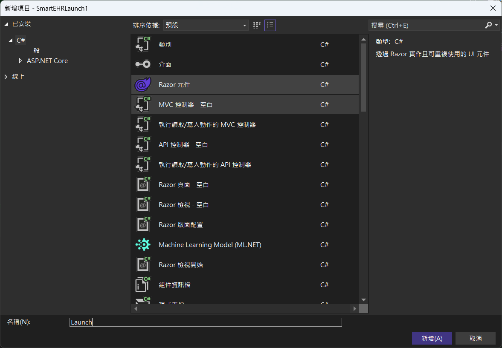
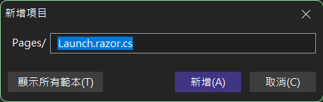
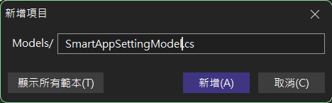

# FHIR 06 建立 Standalone Launch App

前面的一系列文章，說明了如何建立一個符合 Smart On FHIR 規範的 EHR Launch 的應用系統，這篇文章將會示範如何建立一個符合 Smart On FHIR 規範的 Standalone Launch 的應用系統。

根據 Smart On FHIR 規格說明，這裡開發出來的 Standalone Launch 系統，並不會是透過 EHR 系統來觸發啟動，而是獨立運行與啟動，在操作這個系統的過程中，Smart App 會先到指定的 FHIR Server 上，讀取該服務上的 Meta Data 資訊，接著根據取得的這些資訊，主動引導使用者前往 FHIR Server 系統的授權端點，並且傳送一些參數到該端點內，這些參數包括了 response_type、client_id、redirect_uri、scope、state、launch 與 aud 等等，這些參數將會用於授權流程中。一旦取得了授權碼之後，接著便會回到 Smart App 網頁內，在這個 Smart App 網頁內使用這個授權碼，來向授權伺服器的 Token Endpoint 交換存取權杖 (Access Token)，最後，便可以使用這個存取權杖來呼叫 FHIR API，取得所需的 FHIR 資源。

為了要完成 Smart On FHIR 之 Standalone Launch App 的開發，並且符合沙盒的要求，這篇文章將會示範如何建立一個 Standalone Launch App 的專案，透過 Smart On FHIR 的規範，取得一個病患 ID，接著呼叫 FHIR API，取得該病患的姓名與身高、體重。

# 建立 Blazor 專案
* 開啟 Visual Studio 2026
* 選擇「建立新專案」
* 在 [建立新專案] 視窗中，在右方清單內，找到並選擇「Blazor Web 應用程式」 項目
* 然後點擊右下方「下一步」按鈕
* 此時將會看到 [設定新的專案] 對話窗
* 在該對話窗的 [專案名稱] 欄位中，輸入專案名稱，例如 "SmartStandalone1"
* 然後點擊右下方「下一步」按鈕
* 接著會看到 [其他資訊] 對話窗
* 在這個對話窗內，確認使用底下的選項
    * 架構：.NET 10.0 (或更新版本)
    * 驗證類型：無
    * 勾選 針對 HTTPS 進行設定
    * 互動式轉譯模式：伺服器
    * 互動功能位置：全球
    * 勾選 包和範例頁面
    * 勾選 不要使用最上層陳述式 (這是我的個人習慣)
    * 不要勾選 在應用程式 URL 中使用 .dev.localhost TLD
    * 不要勾選 在 .NET Aspire 協調流程中登錄
* 然後點擊右下方「建立」按鈕
* 現在，已經完成了這個 Blazor 專案的建立

## 安裝需要用到的 NuGet 套件

* 滑鼠右擊 [SmartStandalone1] 專案節點
* 點選彈出功能表的 [管理 NuGet 套件] 項
* 在 [瀏覽] 索引標籤中，搜尋並且安裝底下的 NuGet 套件
    * Hl7.Fhir.R4
    
## 建立 Standalone Launch 進入點頁面

在這裡將會說明採用 [Standalone Launch] 模式，則會透過其他的文章來說明這樣的系統開如何開發出來。

* 在剛剛建立的 [SmartStandalone1] 專案中，滑鼠右擊 [Components] > [Pages] 資料夾
* 點選彈出功能表的 [加入] > [Razor 元件] 項目
* 在 [新增項目] 對話窗的最下方之 [名稱] 欄位中，輸入頁面名稱為 [Launch]
* 然後點擊右下方的 [新增] 按鈕

* 接下要來建立這個頁面的 Code Behind 的程式碼檔案
* 在剛剛建立的 [SmartStandalone1] 專案中，滑鼠右擊 [Components] > [Pages] 資料夾
* 點選彈出功能表的 [加入] > [新增項目] 項目
* 底下操作將會是在 [顯示精簡檢視] 模式下操作
* 在 [新增項目] 對話窗的文字輸入盒中，輸入檔案名稱為 [Launch.razor.cs]
* 然後點擊右下方的 [新增] 按鈕

* 在剛剛建立的 [Launch.razor.cs] 程式碼檔案中，輸入底下的程式碼內容

```csharp
namespace SmartStandalone1.Components.Pages;

public partial class Launch
{
}
```
* 這樣正式完成這個頁面的 Code Behind 的程式碼檔案建立

## 建立神奇物件的資料夾與類別

* 滑鼠右擊 [SmartStandalone1] 專案節點
* 點選彈出功能表的 [加入] > [新增資料夾] 項目
* 建立這個 [Helpers] 資料夾
* 滑鼠右擊 [Helpers] 資料夾
* 點選彈出功能表的 [加入] > [新增項目] 項目
* 在文字輸入盒內輸入檔案名稱為 [MagicObjectHelper.cs]
* 然後點擊右下方的 [新增] 按鈕
* 使用底下程式碼內容來取代剛剛建立的 [MagicObjectHelper.cs] 程式碼檔案內容

```csharp
namespace SmartStandalone1.Helpers;

public class MagicObjectHelper
{
    public const string SmartAppSettingKey = "SmartAppSetting";
}
```

## 建立需要用到的資料模型用的資料夾與類別

* 滑鼠右擊 [SmartStandalone1] 專案節點
* 點選彈出功能表的 [加入] > [新增資料夾] 項目
* 建立這個 [Models] 資料夾
* 滑鼠右擊 [SmartStandalone1] 專案節點
* 點選彈出功能表的 [加入] > [新增資料夾] 項目
* 建立這個 [Servicers] 資料夾
* 滑鼠右擊 [Models] 資料夾
* 點選彈出功能表的 [加入] > [新增項目] 項目
* 在文字輸入盒內輸入檔案名稱為 [SmartAppSettingModel.cs]
* 然後點擊右下方的 [新增] 按鈕

* 使用底下程式碼內容來取代剛剛建立的 [SmartAppSettingModel.cs] 程式碼檔案內容

```csharp
namespace SmartStandalone1.Models;

/// <summary>
/// Smart On FHIR 設定模型，用於儲存與 FHIR 伺服器互動所需的各項設定值。
/// </summary>
public class SmartAppSettingModel
{
    /// <summary>
    /// FHIR 伺服器的基底網址。
    /// </summary>
    public string FhirServerUrl { get; set; }

    /// <summary>
    /// Gets or sets the unique identifier for the client application.
    /// </summary>
    public string ClientId { get; set; }

    /// <summary>
    /// 授權完成後 Smart App 的重新導向網址。
    /// </summary>
    public string RedirectUrl { get; set; }

    /// <summary>
    /// 從授權伺服器取得的授權碼 (Authorization Code)。
    /// </summary>
    public string AuthCode { get; set; }

    /// <summary>
    /// 用於驗證請求完整性的客戶端狀態字串。
    /// </summary>
    public string ClientState { get; set; } = "local_state";

    /// <summary>
    /// 交換 Access Token 的授權伺服器 Token Endpoint 位址。
    /// </summary>
    public string TokenUrl { get; set; }
    /// <summary>
    /// 用於與外部提供者啟動授權流程的 URL。
    /// </summary>
    public string AuthorizeUrl { get; set; }
    /// <summary>
    /// 可用來是否透過 EHR Launch 來啟動授權流程的參數。
    /// </summary>
    public string Iss { get; set; }
    public string Launch { get; set; }
    public string State { get; set; }
}
```

* 這個資料模型，將會用於儲存與 Smart On FHIR 互動所需的各項設定值
* 滑鼠右擊 [Servicers] 資料夾
* 點選彈出功能表的 [加入] > [新增項目] 項目
* 在文字輸入盒內輸入檔案名稱為 [SmartAppSettingService.cs]
* 然後點擊右下方的 [新增] 按鈕
* 使用底下程式碼內容來取代剛剛建立的 [SmartAppSettingService.cs] 程式碼檔案內容

```csharp
using SmartStandalone1.Models;

namespace SmartStandalone1.Servicers;

public class SmartAppSettingService
{
    private readonly SettingService settingService;
    public SmartAppSettingModel Data = new SmartAppSettingModel();

    public SmartAppSettingService(SettingService settingService)
    {
        this.settingService = settingService;

        var data = settingService.GetValue();
        Data.FhirServerUrl = data.FhirServerUrl;
        Data.RedirectUrl = data.RedirectUrl;
        Data.ClientId = data.ClientId;
    }

    public void UpdateSetting(SmartAppSettingModel model)
    {
        Data.FhirServerUrl = model.FhirServerUrl;
        Data.ClientId = model.ClientId;
        Data.RedirectUrl = model.RedirectUrl;
        Data.AuthCode = model.AuthCode;
        Data.ClientState = model.ClientState;
        Data.TokenUrl = model.TokenUrl;
        Data.AuthorizeUrl = model.AuthorizeUrl;
        Data.Iss = model.Iss;
        Data.Launch = model.Launch;
        Data.State = model.State;
    }
}
```

* 這個服務類別，將會用於提供 Smart On FHIR 設定模型的相關服務
* 在專案根目錄下的 [Program.cs] 程式碼檔案中，找到 `var app = builder.Build();` 程式碼
* 在這行程式碼前，加入底下的程式碼內容，以便將這個服務類別註冊到依賴注入容器中

```csharp
#region 客製化註冊服務
builder.Services.AddScoped<SmartAppSettingService>();
#endregion
```

* 滑鼠右擊 [Models] 資料夾
* 點選彈出功能表的 [加入] > [新增項目] 項目
* 在文字輸入盒內輸入檔案名稱為 [SettingModel.cs]
* 然後點擊右下方的 [新增] 按鈕
* 使用底下程式碼內容來取代剛剛建立的 [SettingModel.cs] 程式碼檔案內容

```csharp
namespace SmartStandalone1.Models;

public class SettingModel
{
    public string FhirServerUrl { get; set; }
    public string RedirectUrl { get; set; }
    public string ClientId { get; set; }
}
```

* 這個資料模型，將會用於儲存 appsetting.json 的系統設定值
* 滑鼠右擊 [Servicers] 資料夾
* 點選彈出功能表的 [加入] > [新增項目] 項目
* 在文字輸入盒內輸入檔案名稱為 [SettingService.cs]
* 然後點擊右下方的 [新增] 按鈕
* 使用底下程式碼內容來取代剛剛建立的 [SettingService.cs] 程式碼檔案內容

```csharp
using Microsoft.Extensions.Options;
using SmartStandalone1.Models;

namespace SmartStandalone1.Servicers;

public class SettingService
{
    private readonly SettingModel settingModel;

    public SettingService(IOptions<SettingModel> options)
    {
        settingModel = options.Value;
    }

    public SettingModel GetValue()
    {
        return settingModel;
    }
}
```

* 在專案根目錄下的 [Program.cs] 程式碼檔案中，找到 `#region 客製化註冊服務` 程式碼
* 在這行程式碼後，加入底下的程式碼內容，以便將這個服務類別註冊到依賴注入容器中

```csharp
builder.Services.AddScoped<SettingService>();
``` 

* 在專案根目錄下的 [Program.cs] 程式碼檔案中，找到 `#region 客製化註冊服務` 程式碼
* 在這行程式碼前，加入底下的程式碼內容，以便將這個服務類別註冊到依賴注入容器中

```csharp
#region 加入設定強型別注入宣告
builder.Services.Configure<SettingModel>(builder.Configuration
    .GetSection(MagicObjectHelper.SmartAppSettingKey));
#endregion
```

## 加入該系統的 Configuration 內容

* 開啟專案根目錄下的 [appsettings.json] 設定檔案
* 找到 `"AllowedHosts": "*"` 這個內容
* 在這行程式碼前，加入底下的 json 內容

```json
"SmartAppSetting": {
    "FhirServerUrl": "https://thas.mohw.gov.tw/v/r4/sim/WzIsIiIsIiIsIkFVVE8iLDAsMCwwLCIiLCIiLCIiLCIiLCIiLCIiLCIiLDAsMSwiIl0/fhir",
    "RedirectUrl": "https://localhost:7191/ExchangeToken",
    "ClientId": "smart-app"
}
```

## 建立 OAuthStateStoreService 服務

* 這裡的服務，將會用於儲存 OAuth 狀態資訊，因為，這些資訊將會在進行 OAuth 認證過程中，因為頁面切換而造成遺失
* 滑鼠右擊 [Servicers] 資料夾
* 點選彈出功能表的 [加入] > [新增項目] 項目
* 在文字輸入盒內輸入檔案名稱為 [OAuthStateStoreService.cs]
* 然後點擊右下方的 [新增] 按鈕
* 使用底下程式碼內容來取代剛剛建立的 [OAuthStateStoreService.cs] 程式碼檔案內容

```csharp
using Microsoft.Extensions.Caching.Distributed;
using System.Text.Json;

namespace SmartStandalone1.Servicers;

public class OAuthStateStoreService
{
    private const string KeyPrefix = "oauth:state:";
    private static readonly JsonSerializerOptions JsonOpts = new(JsonSerializerDefaults.Web);

    private readonly IDistributedCache _cache;

    public OAuthStateStoreService(IDistributedCache cache) => _cache = cache;

    public async Task<string> SaveAsync<T>(string stateId, T state, TimeSpan ttl, CancellationToken ct = default)
    {
        var key = KeyPrefix + stateId;

        var json = JsonSerializer.Serialize(state, JsonOpts);

        var options = new DistributedCacheEntryOptions
        {
            AbsoluteExpirationRelativeToNow = ttl
        };

        await _cache.SetStringAsync(key, json, options, ct);
        return stateId;
    }

    public async Task<T?> LoadAsync<T>(string stateId, CancellationToken ct = default)
    {
        if (string.IsNullOrWhiteSpace(stateId)) return default;

        var key = KeyPrefix + stateId;
        var json = await _cache.GetStringAsync(key, ct);

        if (string.IsNullOrWhiteSpace(json)) return default;

        return JsonSerializer.Deserialize<T>(json, JsonOpts);
    }

    public Task RemoveAsync(string stateId, CancellationToken ct = default)
    {
        if (string.IsNullOrWhiteSpace(stateId)) return Task.CompletedTask;
        return _cache.RemoveAsync(KeyPrefix + stateId, ct);
    }
}
```

* 在專案根目錄下的 [Program.cs] 程式碼檔案中，找到 `#region 客製化註冊服務` 程式碼
* 在這行程式碼前，加入底下的程式碼內容，以便將這個服務類別註冊到依賴注入容器中

```csharp
builder.Services.AddScoped<OAuthStateStoreService>();
```

* 由於，在這個系統中，將會採用分散式快取 (Distributed Cache) 來儲存 OAuth 狀態資訊，因此，需要進行分散式快取服務的註冊
* 在專案根目錄下的 [Program.cs] 程式碼檔案中，找到 `#region 客製化註冊服務` 程式碼
* 在這行程式碼前，加入底下的程式碼內容，以便將這個服務類別註冊到依賴注入容器中

```csharp
// 提供 IDistributedCache 的記憶體實作
builder.Services.AddDistributedMemoryCache();
```


## 設計 Launch 頁面與邏輯

* 在 [Components] > [Pages] 資料夾下
* 找到並且開啟 [Launch.razor] 程式碼檔案
* 使用底下程式碼內容來取代剛剛建立的 [Launch.razor] 程式碼檔案內容

```html
@page "/launch"
@inject NavigationManager NavigationManager
<h3>請稍後，正在初始化中</h3>

<div>@authUrlMessage</div>

@code {
    [SupplyParameterFromQuery(Name = "iss")]
    public string? Iss { get; set; }
    [SupplyParameterFromQuery(Name = "launch")]
    public string? LaunchCode { get; set; }

}
```

* 在 [Components] > [Pages] 資料夾下
* 找到並且開啟 [Launch.razor.cs] 程式碼檔案
* 使用底下程式碼內容來取代剛剛建立的 [Launch.razor.cs] 程式碼檔案內容

```csharp
using Hl7.Fhir.Model;
using Microsoft.AspNetCore.Components;
using SmartStandalone1.Models;
using SmartStandalone1.Servicers;

namespace SmartStandalone1.Components.Pages;

public partial class Launch
{
    // https://localhost:7191/launch

    // https://localhost:7191/launch?iss=https://thas.mohw.gov.tw/v/r4/fhir&launch=WzAsIiIsIiIsIkFVVE8iLDAsMCwwLCIiLCIiLCIiLCIiLCIiLCIiLCIiLDAsMSwiIl0
    [Inject]
    public SmartAppSettingService SmartAppSettingService { get; init; }
    [Inject]
    public OAuthStateStoreService OAuthStateStoreService { get; init; }

    string authUrlMessage = string.Empty;

    protected override async System.Threading.Tasks.Task OnAfterRenderAsync(bool firstRender)
    {
        if (firstRender)
        {
            KeepLaunchIss();
            var bar = await GetMetadataAsync();
            var authUrl = await GetAuthorizeUrlAsync();
            authUrlMessage = $"重新導向到授權伺服器:{authUrl}";

            StateHasChanged();

            await System.Threading.Tasks.Task.Delay(4000);

            NavigationManager.NavigateTo(authUrl);
        }
    }

    public void KeepLaunchIss()
    {
        if (string.IsNullOrEmpty(Iss) || string.IsNullOrEmpty(LaunchCode))
        {
            SmartAppSettingService.Data.Iss = null;
            SmartAppSettingService.Data.Launch = null;
            return;
        }
        SmartAppSettingService.Data.Iss = Iss;
        SmartAppSettingService.Data.Launch = LaunchCode;
        SmartAppSettingService.Data.FhirServerUrl = Iss;
    }

    public async Task<bool> GetMetadataAsync()
    {
        Hl7.Fhir.Rest.FhirClient fhirClient = new Hl7.Fhir.Rest.FhirClient(SmartAppSettingService.Data.FhirServerUrl);

        CapabilityStatement capabilities = (CapabilityStatement)(await fhirClient.GetAsync("metadata"));

        foreach (CapabilityStatement.RestComponent restComponent in capabilities.Rest)
        {
            if (restComponent.Security == null)
            {
                continue;
            }

            foreach (Extension securityExt in restComponent.Security.Extension)
            {
                if (securityExt.Url != "http://fhir-registry.smarthealthit.org/StructureDefinition/oauth-uris")
                {
                    continue;
                }

                if ((securityExt.Extension == null) || (securityExt.Extension.Count == 0))
                {
                    continue;
                }

                foreach (Extension smartExt in securityExt.Extension)
                {
                    switch (smartExt.Url)
                    {
                        case "authorize":
                            SmartAppSettingService.Data.AuthorizeUrl = ((FhirUri)smartExt.Value).Value.ToString();
                            break;

                        case "token":
                            SmartAppSettingService.Data.TokenUrl = ((FhirUri)smartExt.Value).Value.ToString();
                            break;
                    }
                }
            }
        }

        if (string.IsNullOrEmpty(SmartAppSettingService.Data.AuthorizeUrl) || string.IsNullOrEmpty(SmartAppSettingService.Data.TokenUrl))
        {
            return false;
        }

        return true;
    }

    public async System.Threading.Tasks.Task<string> GetAuthorizeUrlAsync()
    {
        var state = Guid.NewGuid().ToString("N");
        SmartAppSettingService.Data.State = state;

        await OAuthStateStoreService.SaveAsync<SmartAppSettingModel>(state, SmartAppSettingService.Data, TimeSpan.FromMinutes(10));

        Console.WriteLine($"Generated state: {SmartAppSettingService.Data.State}");
        string launchUrl = $"{SmartAppSettingService.Data.AuthorizeUrl}?response_type=code" +
            $"&client_id={SmartAppSettingService.Data.ClientId}" +
            $"&redirect_uri={Uri.EscapeDataString(SmartAppSettingService.Data.RedirectUrl)}" +
            $"&scope={Uri.EscapeDataString("openid fhirUser profile launch/patient patient/*.read patient/Encounter.read patient/MedicationRequest.read patient/ServiceRequest.read")}" +
            $"&state={SmartAppSettingService.Data.State}" +
            $"&launch={SmartAppSettingService.Data.Launch}" +
            $"&aud={Uri.EscapeDataString(SmartAppSettingService.Data.FhirServerUrl)}";
        return launchUrl;
    }
}
```


