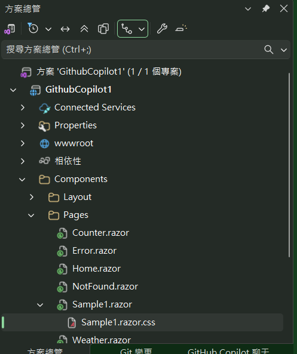
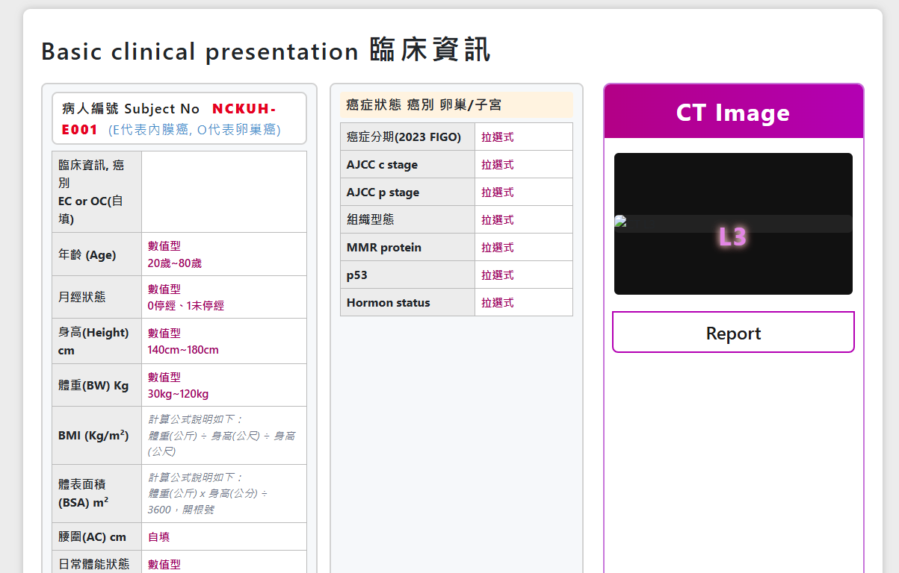

# Github Copilot 1 : 透過ChatGPT將畫面直接產生出 Blazor 頁面

## 前言

最近這段時間，都在從事於 FHIR & AI 相關的醫療專案開發，在這一年中，透過AI的輔助，讓許多系統的開發可以順利、快速、有效地進行，而在這些AI工具中，Github Copilot 無疑是我最常使用的工具之一。而面對身旁的同事們，常常會問到：「你是怎麼使用 Github Copilot 來加速開發的？」、「Github Copilot 究竟能幫助我們多少？」等問題。為了讓大家更了解這個工具的強大功能，所以，我將會透過一系列的文章，逐步來分享我在這些應用的經驗。這篇文章將分享我如何利用 Github Copilot 來快速產生 Blazor 頁面。

首先，為了要能夠快速協助醫生將其需求，在最短的時間內，採用 MVP 的方式開發出來，透過不斷的迭帶，來讓醫生能夠在最短的時間內，看到系統的雛形，並且能夠快速地進行調整與修改。

所以，一開始在雙方進行需求溝通的過程中，將採用另外一種模式，讓醫師使用簡報檔案，來描述其需求畫面，在簡報畫面中，加入相關註解與說明，而且版面配置也請醫師儘可能的透過簡報來呈現出來。

依據以往的開發方式，將會需要採用類似 Figma 這類工具，並且將這些簡報檔案，設計出來，並且進行切板與接下來轉換成 Blazor 頁面。如此，這樣又多出了一個過程，衍伸出來的也包含了討論與修正的時間，而且，對於網頁設計師而言，收到這些視覺設計稿之後，還需要進行切版，並且轉換成 Blazor 頁面，這些都會增加開發的時間。

以往，我可能會將該畫面貼到 ChatGPT 這類工具，並且請它協助我產生出 HTML 與 CSS 的程式碼，不過，這樣的方式，需要多次的透過剪貼簿來進行將內容轉移。這樣的操作體驗似乎也是不太方便與流暢。

在當時我對於 Github Copilot 這樣的工具也不太孰悉，不過，當下我便想到，或許可以嘗試看看，是否能夠直接將這些簡報畫面，貼到 Visual Studio Code 的編輯器中，並且請 Github Copilot 協助我來產生出 Blazor 頁面的程式碼。因此，立馬進行與驗證這樣的想法。

底下為 AI 臨床試驗平台的儀表板畫面，這是醫師直接使用 PowerPoint 繪製出來的畫面。


首先，我這裡將這個畫面貼到 OpenAI 的 ChatGPT 網頁中，並且請它協助我產生出 Blazor 頁面的程式碼，底下為我給 ChatGPT 的指令內容：

> 因為這個時間點，GPT的最新版本為 5.1 版本，當時僅有 4.1 版，因此，為了要能夠重現當時狀況，這裡還是採用 4.1 的版本


```
將這個畫面轉成 html & css
```


## 建立 Blazor 專案

* 這裡建立一個 Blazor Server 專案
* 在 [Components] > [Pages] 目錄下，建立一個 [Sample1.razor] & [Sample1.razor.css] 檔案

* 將產生出來的程式碼，貼到 Sample1.razor 頁面中。
* 這是完成的程式碼
```html
@page "/Sample1"

    <style>
        body {
          background: #ececec;
          margin: 0;
          font-family: "Segoe UI", Arial, "Microsoft JhengHei", "微軟正黑體", sans-serif;
        }
        .container {
          margin: 20px auto;
          padding: 24px;
          background: #fff;
          border-radius: 10px;
          max-width: 1150px;
          box-shadow: 0 0 10px #bbb;
        }
        .title {
          font-size: 2em;
          font-weight: 600;
          letter-spacing: 2px;
          margin-bottom: 18px;
        }
        .title span {
          font-weight: 900;
          font-size: 1.2em;
          letter-spacing: 4px;
        }
        .flex-row {
          display: flex;
          gap: 16px;
        }
        .section {
          border: 2px solid #d2d2d2;
          border-radius: 8px;
          padding: 10px 12px 16px 12px;
          background: #f6f8fa;
          flex: 1;
          min-width: 340px;
          margin-bottom: 16px;
        }
        .subject-no {
          background: #fff;
          border: 2px solid #d2d2d2;
          border-radius: 8px;
          margin-bottom: 8px;
          padding: 6px 12px;
          font-size: 1.15em;
          font-weight: 600;
          color: #1a1a1a;
          letter-spacing: 1px;
        }
        .subject-no .highlight {
          color: #e6001f;
          font-weight: 900;
          margin-left: 10px;
          letter-spacing: 2px;
        }
        .sub-label {
          font-size: 0.95em;
          color: #428bca;
          font-weight: 400;
          margin-left: 7px;
          letter-spacing: 1px;
        }
        .table-block {
          width: 100%;
          border-collapse: collapse;
          margin-top: 6px;
        }
        .table-block th,
        .table-block td {
          border: 1px solid #bbb;
          padding: 6px 8px;
          font-size: 1em;
          text-align: left;
          background: #fff;
        }
        .table-block th {
          background: #ececec;
          font-weight: 700;
        }
        .table-block .sub-field {
          color: #9e005d;
          font-weight: 600;
          font-size: 0.92em;
        }
        .table-block .calculation {
          color: #6a7287;
          font-size: 0.90em;
          font-style: italic;
        }
        .section-header {
          font-size: 1.12em;
          font-weight: 700;
          letter-spacing: 1px;
          margin-bottom: 6px;
          background: #fff3e0;
          padding: 4px 8px;
          border-radius: 4px;
        }
        .ct-section {
          flex: 0 0 350px;
          display: flex;
          flex-direction: column;
          align-items: center;
          background: #fff;
          border: 2px solid #c876da;
          border-radius: 10px;
          padding: 0 0 18px 0;
          margin-left: 10px;
          min-width: 330px;
          max-width: 370px;
          margin-bottom: 16px;
        }
        .ct-title {
          background: linear-gradient(90deg, #b30086 0%, #b300b3 100%);
          color: #fff;
          font-size: 2em;
          font-weight: 700;
          text-align: center;
          padding: 12px 0;
          width: 100%;
          border-radius: 8px 8px 0 0;
          letter-spacing: 1.5px;
          margin-bottom: 0;
        }
        .ct-image {
          width: 92%;
          margin: 20px 0 16px 0;
          border-radius: 6px;
          background: #111;
          display: flex;
          align-items: center;
          justify-content: center;
          min-height: 190px;
          position: relative;
          overflow: hidden;
        }
        .ct-image img {
          width: 100%;
          border-radius: 6px;
          object-fit: contain;
          background: #222;
        }
        .ct-image .l3-label {
          position: absolute;
          top: 50%;
          left: 50%;
          transform: translate(-50%, -20%);
          color: #e386e5;
          font-size: 2.1em;
          font-weight: 700;
          letter-spacing: 2px;
          pointer-events: none;
          text-shadow: 0 0 10px #fff, 0 0 12px #c44;
        }
        .ct-report {
          width: 94%;
          margin: 0 auto;
          border: 2px solid #b300b3;
          border-radius: 0 0 8px 8px;
          background: #fff;
          font-size: 1.5em;
          text-align: center;
          color: #1a1a1a;
          padding: 8px 0;
          font-weight: 600;
          margin-top: 6px;
          margin-bottom: 0;
        }
        /* 底部按鈕列 */
        .footer-buttons {
          margin-top: 18px;
          display: flex;
          gap: 16px;
          justify-content: center;
        }
        .footer-buttons .btn {
          padding: 16px 32px;
          font-size: 1.12em;
          border-radius: 18px;
          border: none;
          font-weight: bold;
          color: #fff;
          cursor: pointer;
          min-width: 130px;
          box-shadow: 0 2px 6px #aaa;
          letter-spacing: 2px;
          transition: background 0.15s;
        }
        .btn-clinic { background: #2ecc71; }
        .btn-img    { background: #b55ca6; }
        .btn-blood  { background: #26a5dd; }
        .btn-ctcae  { background: #69c830; }
        .btn-ctcae strong { font-weight: 900; letter-spacing: 1.5px; }
        .btn-form   { background: #268dce; }
        .btn-follow { background: #94259b; }
        .footer-buttons .btn:hover { filter: brightness(0.95); }
    </style>
  
    <div class="container">
        <div class="title">
            Basic clinical presentation <span>臨床資訊</span>
        </div>
        <div class="flex-row">
            <!-- 左側：臨床資料 -->
            <div class="section" style="flex:1.1;">
                <div class="subject-no">
                    病人編號 Subject No
                    <span class="highlight">NCKUH-E001</span>
                    <span class="sub-label">(E代表內膜癌, O代表卵巢癌)</span>
                </div>
                <table class="table-block">
                    <tr>
                        <th style="width:120px;">臨床資訊, 癌別<br>EC or OC(自填)</th>
                        <td></td>
                    </tr>
                    <tr>
                        <th>年齡 (Age)</th>
                        <td class="sub-field">數值型<br>20歲~80歲</td>
                    </tr>
                    <tr>
                        <th>月經狀態</th>
                        <td class="sub-field">數值型<br>0停經、1未停經</td>
                    </tr>
                    <tr>
                        <th>身高(Height) cm</th>
                        <td class="sub-field">數值型<br>140cm~180cm</td>
                    </tr>
                    <tr>
                        <th>體重(BW) Kg</th>
                        <td class="sub-field">數值型<br>30kg~120kg</td>
                    </tr>
                    <tr>
                        <th>BMI (Kg/m²)</th>
                        <td class="calculation">
                            計算公式說明如下：<br>
                            體重(公斤) ÷ 身高(公尺) ÷ 身高(公尺)
                        </td>
                    </tr>
                    <tr>
                        <th>體表面積(BSA) m²</th>
                        <td class="calculation">
                            計算公式說明如下：<br>
                            體重(公斤) x 身高(公分) ÷ 3600，開根號
                        </td>
                    </tr>
                    <tr>
                        <th>腰圍(AC) cm</th>
                        <td class="sub-field">自填</td>
                    </tr>
                    <tr>
                        <th>日常體能狀態(PS)</th>
                        <td class="sub-field">數值型<br>0, 1, 2</td>
                    </tr>
                </table>
            </div>
            <!-- 中間：癌症狀態 -->
            <div class="section" style="flex:0.9;">
                <div class="section-header">癌症狀態 癌別 卵巢/子宮</div>
                <table class="table-block">
                    <tr>
                        <th style="width:180px;">癌症分期(2023 FIGO)</th>
                        <td class="sub-field">拉選式</td>
                    </tr>
                    <tr>
                        <th>AJCC c stage</th>
                        <td class="sub-field">拉選式</td>
                    </tr>
                    <tr>
                        <th>AJCC p stage</th>
                        <td class="sub-field">拉選式</td>
                    </tr>
                    <tr>
                        <th>組織型態</th>
                        <td class="sub-field">拉選式</td>
                    </tr>
                    <tr>
                        <th>MMR protein</th>
                        <td class="sub-field">拉選式</td>
                    </tr>
                    <tr>
                        <th>p53</th>
                        <td class="sub-field">拉選式</td>
                    </tr>
                    <tr>
                        <th>Hormon status</th>
                        <td class="sub-field">拉選式</td>
                    </tr>
                </table>
            </div>
            <!-- 右側：CT 影像區 -->
            <div class="ct-section">
                <div class="ct-title">CT Image</div>
                <div class="ct-image">
                    <!-- 替換成你自己的 CT 影像路徑 -->
                    
                    <div class="l3-label">L3</div>
                </div>
                <div class="ct-report">Report</div>
            </div>
        </div>
        <!-- 底部按鈕列 -->
        <div class="footer-buttons">
            <button class="btn btn-clinic">臨床資料</button>
            <button class="btn btn-img">影像資料</button>
            <button class="btn btn-blood">抽血資料</button>
            <button class="btn btn-ctcae"><strong>CTCAE 5.0</strong></button>
            <button class="btn btn-form">問卷</button>
            <button class="btn btn-follow">追蹤資料</button>
        </div>
    </div>
```
* 執行該 Blazor 專案
* 開啟瀏覽器，檢視該頁面 https://localhost:7299/sample1
* 得到底下的畫面



這樣的處理過程，似乎能夠讓一個圖片畫面快速的轉換成為 Blazor 的頁面，但是，似乎還是有些不太流暢的地方，因為當要進行修正或調整的時候，還是需要反覆地將修改後的程式碼貼回到 ChatGPT 內，並將生成後的結果再度貼回到 VS 2026 內，重新執行來觀看結果，若此時將 HTML & CCS 分離出來，將 CSS 內容儲存到 [Sample1.razor.css] 內，剪貼的過程會更加複雜與繁瑣，接下來，我將會嘗試看看，是否能夠直接在 Visual Studio 2026 編輯器中，直接貼上這個圖片，並且請 Github Copilot 協助我來產生出 Blazor 頁面的程式碼。