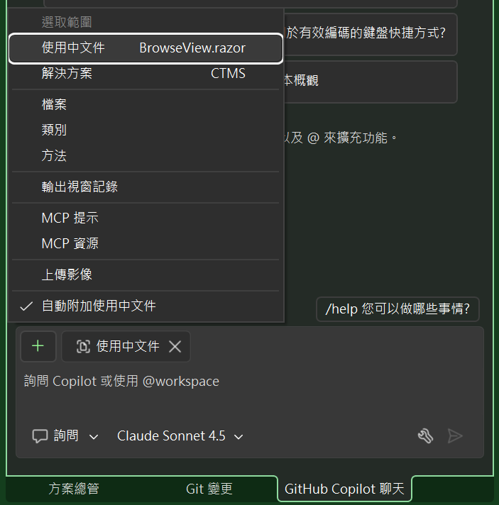
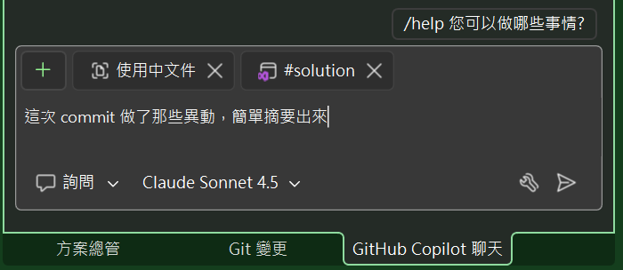
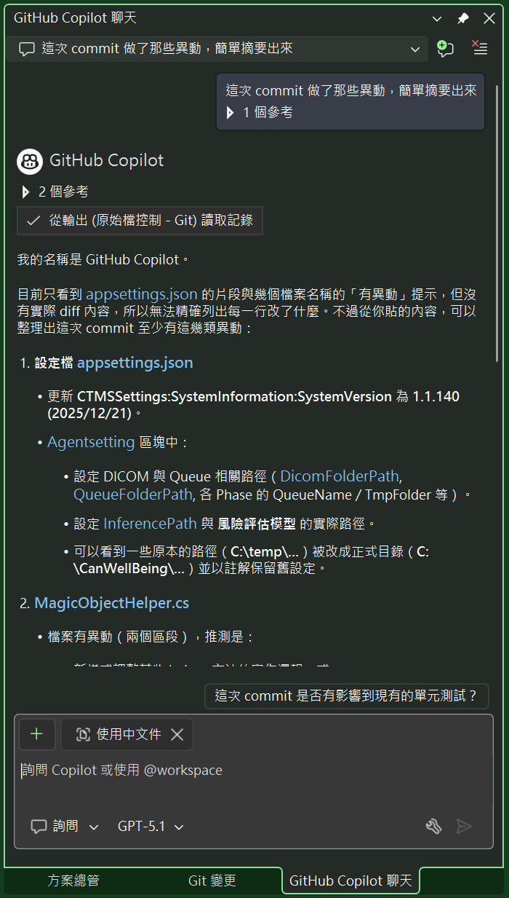
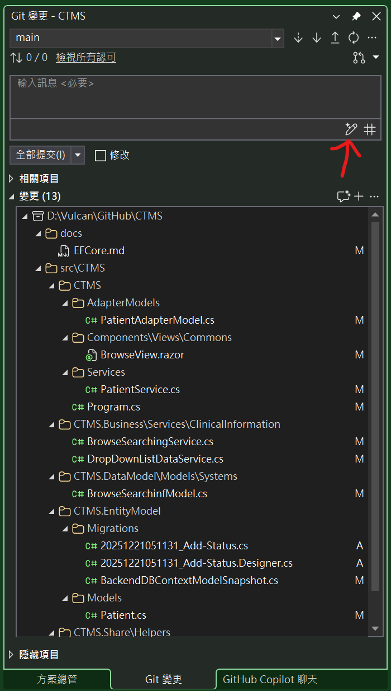
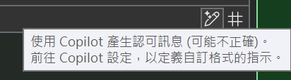
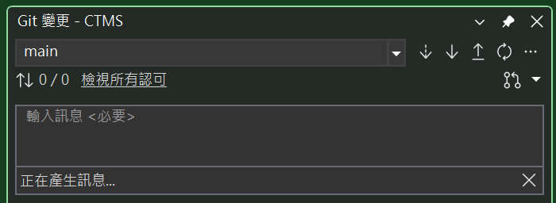
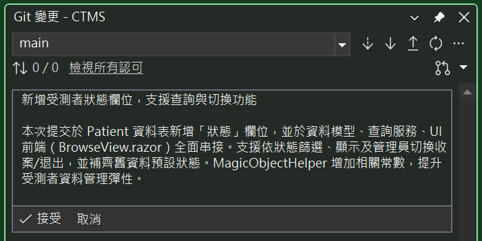

# Github Copilot 10 : 自動產生Commit訊息

接下來示範如何使用 Github Copilot 10 自動產生 Commit 訊息，這也是我最喜歡用道的功能，以往當專案程式碼或者內容有異動的時候，我們都需要手動輸入 Commit 訊息，現在有了 Github Copilot 10 之後，可以自動幫我們產生 Commit 訊息，因為有了這樣的功能，便可以很輕鬆的取得與輸入這次 Commit 做了那些異動的摘要文字。

在這個之前，先透過 Github Copilot 來進行分析，這次的 commit 做了那些異動

* 切換到 Github Copilot 聊天室窗
* 點選下方聊天文字輸入區旁的「+」號按鈕
* 選擇第三個選項 [解決方案]



* 在聊天文字輸入盒內，輸入底下 Prompt 指令

```
這次 commit 做了那些異動，簡單摘要出來
```

* 底下是完成後的畫面截圖，可以看到 Github Copilot 10 已經自動幫我們產生這次 Commit 的摘要訊息了



* 稍待一段時間，Github Copilot 10 會自動幫我們彙整出這次的異動摘要內容



但是，這些資訊對於要寫成一個 Commit 訊息，似乎不是很容易閱讀，因此，在這裡將要採用底下的作法

* 切換到 [Git 視窗]
* 在此視窗的右上方，找到 [使用 Copilot 產生認可訊息] 按鈕，點選它




* 等候 Copilot 產生 Commit 摘要說明



* 最後，Copilot 會自動幫我們產生一個很不錯的 Commit 訊息


* 現在，可以點選 [接受] 按鈕
* 接著，提交此次程式碼異動的 Commit 訊息


