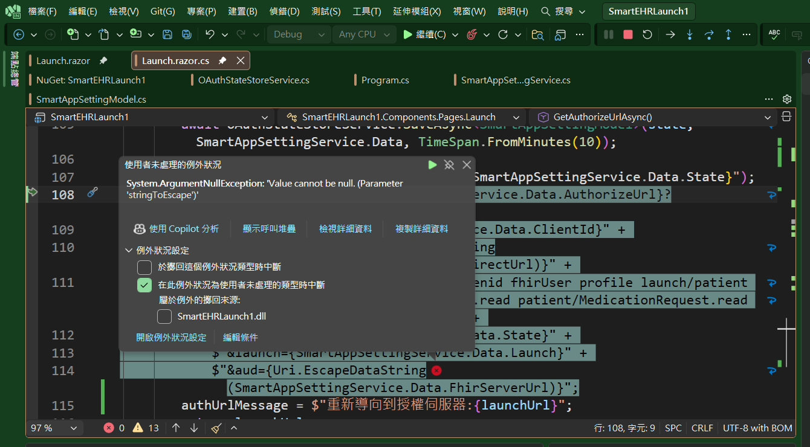
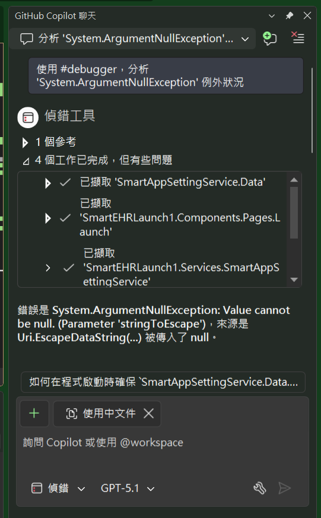
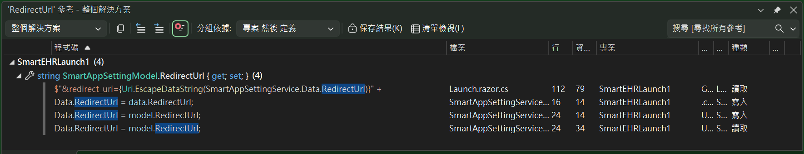
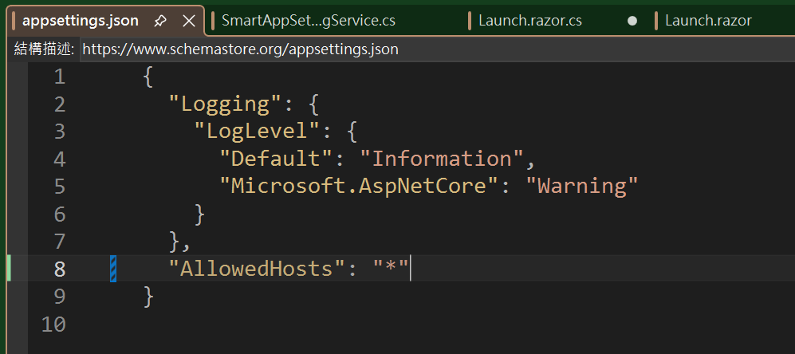
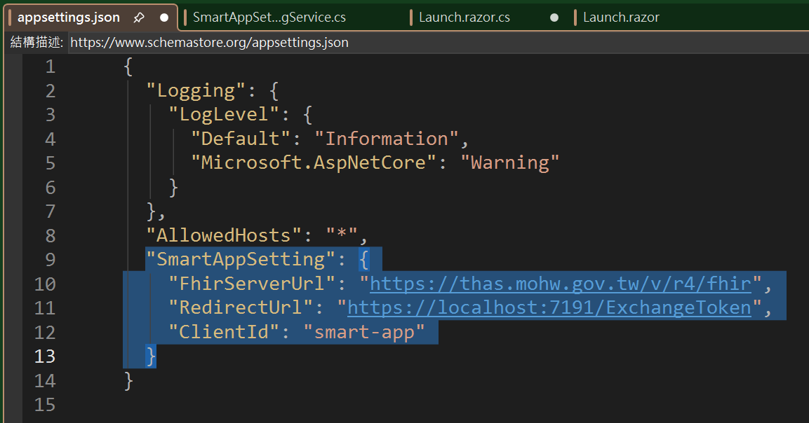
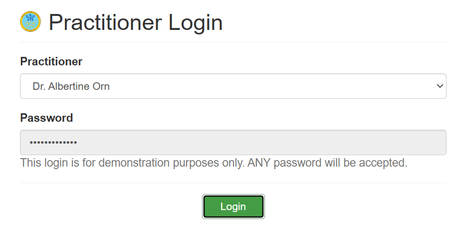

# Github Copilot 11 : 執行時期遇到錯誤的協助的協助

在這篇文章中所提到的內容，其實是所有程式設計師夢寐以求的技能，也就是在執行階段遇到錯誤的時候，可以有一個強大的助理來幫忙分析與解決問題，在沒有大語言模型 AI 出現的之前，當發生了執行時期的錯誤，通常只能靠著程式設計師自己去分析與解決問題，這個過程通常是非常痛苦的，尤其是當錯誤發生的原因不是很明顯的時候，更是讓人感到挫折與無助；另外就是去尋求高階或者資深的工程師地幫忙來探索與解決此一問題。

這些問題的處理過程所消耗的成本實在巨大，想要解決這些問題，需要具有長時間的經驗累積與工程師的智慧才能做到，但是現在有了大語言模型 AI 的協助，這些問題的處理過程可以大幅度的縮短，甚至可以讓程式設計師在遇到問題的時候，可以直接透過 AI 來協助分析與解決問題，這樣的技術進步，對於程式設計師來說，是一個非常大的福音。

在這裡將會舉出一個實際問題的例子，來說明如何利用 Github Copilot 來協助解決執行時期遇到的錯誤問題。

在這個專案，SmartEHRLaunch1 專案中，這是一個 Smart On FHIR App，而 Smart App 需要能夠支援 OAuth2 授權機制，這個 Smart App 需要透過沙盒的 EHR Launch 模式來啟動，因此，需要透過沙盒來啟動這個應用程式，因此，當這個應用程式網頁後，將會收到來自於 Smart On FHIR 沙盒的兩個參數，分別是 Iss 與 Lauch。

此時這個 Smart App 需要透過這兩個參數，取得 FHIR Server 的相關連線資訊，例如，要取得 OAuth2 授權碼的服務端點，並且使用這個服務端點進行轉向到授權主機上，一旦得到授權碼之後，將會回傳到指定 Redirect Url 頁面，並且將授權碼使用參數方式傳送進來。現在的程式碼因為設計上有問題，因此，在進行授權登入的時候，會需要組成一個授權網址，並且導向到該網址來進行授權登入的動作，這個過程中會需要組成一個授權網址，這個網址的組成過程中，會需要使用到一些參數值，例如 RedirectUrl、FhirServerUrl、AuthorizeUrl 等等。

當修改完成程式之後，進入到執行階段，突然拋出如下例外異常通知，遇到這樣的問題，通常是所有的程式設計師都會感到頭痛與絕望無助的時候，例如，遇到底下的狀況



這裡遇到的 [使用者未處理的例外狀況] 詳細資訊如下

```
System.ArgumentNullException
  HResult=0x80004003
  Message=Value cannot be null. (Parameter 'stringToEscape')
  Source=System.Private.CoreLib
  StackTrace: 
   於 System.ArgumentNullException.Throw(String paramName)
   於 System.ArgumentNullException.ThrowIfNull(Object argument, String paramName)
   於 System.UriHelper.EscapeString(String stringToEscape, Boolean checkExistingEscaped, SearchValues`1 noEscape)
   於 SmartEHRLaunch1.Components.Pages.Launch.<GetAuthorizeUrlAsync>d__18.MoveNext() 在 C:\Vulcan\Projects\SmartEHRLaunch1\SmartEHRLaunch1\Components\Pages\Launch.razor.cs:行 108 中
   於 SmartEHRLaunch1.Components.Pages.Launch.<OnAfterRenderAsync>d__15.MoveNext() 在 C:\Vulcan\Projects\SmartEHRLaunch1\SmartEHRLaunch1\Components\Pages\Launch.razor.cs:行 27 中
   於 Microsoft.AspNetCore.Components.RenderTree.Renderer.<GetErrorHandledTask>d__101.MoveNext()
```

此時，在這個 [使用者未處理的例外狀況] 對話窗中，會看到 [使用 Copilot 分析] 功能，這是在沒有使用 Github Copilot 功能前所沒有看過的，所以，可以點選該例外狀況對話窗中的 [使用 Copilot 分析] 按鈕，看看會有甚麼結果

現在切換到 [Github Copilot] 視窗中，會看到 Copilot 已經針對這個例外狀況進行了分析，並且提供了解決方案的建議內容



從 Copilot 所提供的建議內容看到 `使用 #debugger，分析 'System.ArgumentNullException' 例外狀況` 這樣的訊息，表示此時 Copilot 正在抓取 VS 2026 內的相關資訊來進行分析，發現是因為在組成授權網址的時候，某個參數值是 null，因此導致這個例外狀況的發生

```
錯誤是 System.ArgumentNullException: Value cannot be null. (Parameter 'stringToEscape')，來源是 Uri.EscapeDataString(...) 被傳入了 null。
從除錯資料可知：
•	RedirectUrl 為 null
•	FhirServerUrl 有值
•	AuthorizeUrl 有值
因此在這行發生錯誤：

$"&redirect_uri={Uri.EscapeDataString(SmartAppSettingService.Data.RedirectUrl)}"
```

從上述的解釋內容，可以知道 RedirectUrl 參數值是 null，因此導致這個例外狀況的發生，現在便可以按照這個線索，來查看為什麼 RedirectUrl 會是 null，接著便可以進行修正，解決這個問題。

現在使用 VS 2026 提供的 [尋找所有參考] 功能，查看這個 RedirectUrl 參數值是從哪裡被設定的。



此時察看到底下程式碼

```csharp
public SmartAppSettingService(SettingService settingService)
{
    this.settingService = settingService;

    var data = settingService.GetValue();
    Data.FhirServerUrl = data.FhirServerUrl;
    Data.RedirectUrl = data.RedirectUrl;
    Data.ClientId = data.ClientId;
}
```

最後發現到，這個系統並沒在 appsetting.json 內，定義了 RedirectUrl 這個參數值，因此，導致這個參數值是 null，進而導致在組成授權網址的時候，發生了例外狀況。



只要在 appsetting.json 內，加入 RedirectUrl 這個參數值，並且指定正確的 Redirect Url 網址，便可以解決這個問題。



經過上述的過程，便可以看到，當遇到執行時期的錯誤問題時，並不是程式碼的邏輯上出了問題，而是在於設定檔案內容上出了問題。

現在，將這個問題修正之後，再次執行這個 Smart On FHIR App，便可以順利的進入到授權頁面，並且進行授權登入的動作，整個過程順利完成。



透過 Github Copilot 所提供的 [使用 Copilot 分析] 功能，便可以快速的找出問題的根源，並且進行修正，這樣的功能對於程式設計師來說，是一個非常大的幫助，可以大幅度的提升開發效率，減少在除錯上的時間花費。

