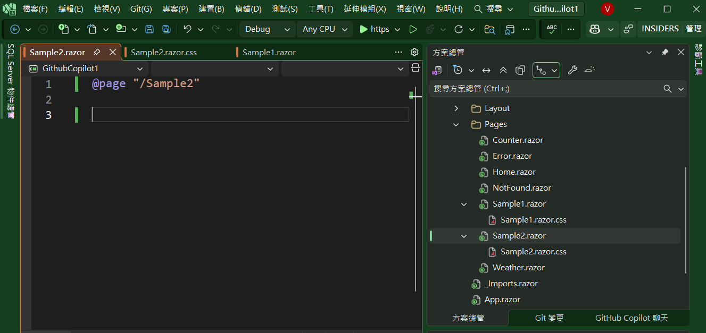
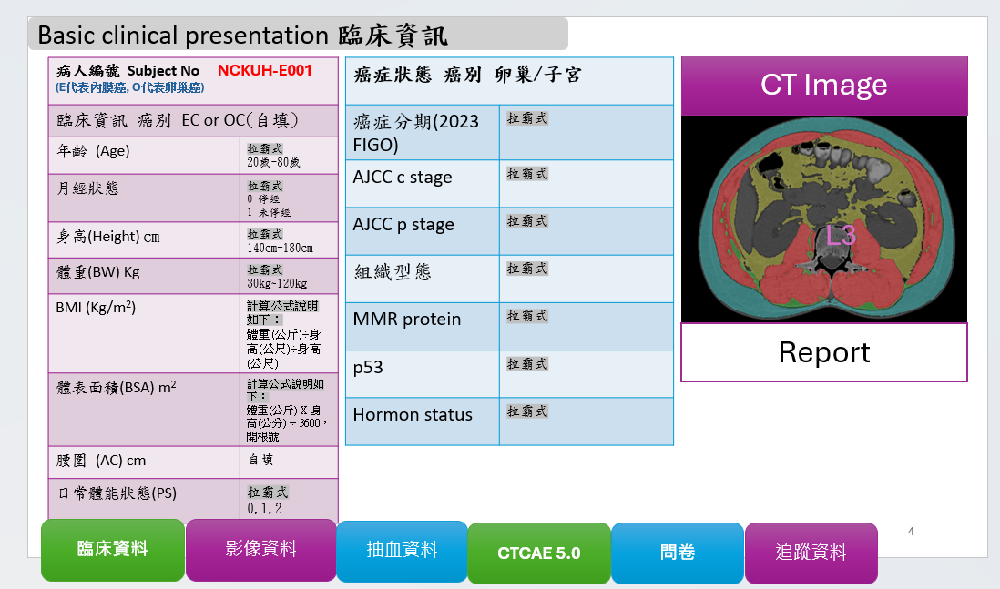
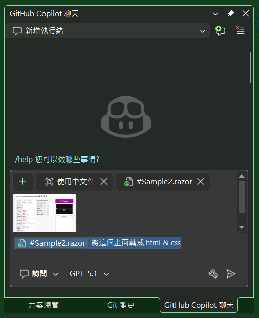
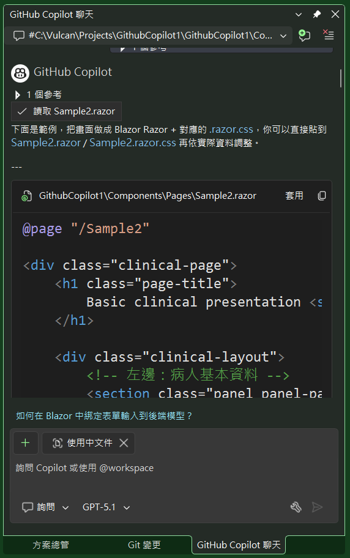
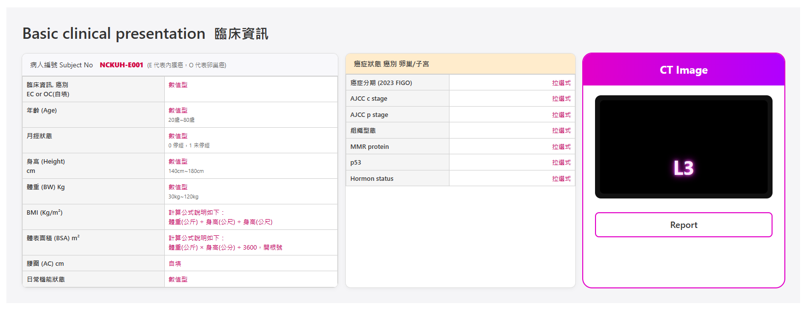

# Github Copilot 2 : 透過Copilot將畫面直接產生出 Blazor 頁面

在這裡將會沿用上一篇文章所建立起來的Blazor專案，並且嘗試看看，是否能夠直接在 Visual Studio 2026 編輯器中，直接貼上這個圖片，並且請 Github Copilot 協助我來產生出 Blazor 頁面的程式碼。

## 建立一個空白頁面
* 首先，在 [Components] > [Pages] 目錄下，建立一個 [Sample2.razor] & [Sample2.razor.css] 檔案


* 切換到 VS 2026 IDE 畫面內的 Github Copilot 視窗
* 將下列的圖片，直接貼到 Github Copilot 視窗


* 接著，在圖片的下方，輸入下列的提示語句 (Prompt)：
  * "#Sample2.razor' 將這個畫面轉成 html & css"  

* 此時，Github Copilot 便會開始產生出 Blazor 頁面的程式碼

* 現在可以看到可以將產生出來程式碼，複製到剪貼簿中，或者選擇套用
* 這裡選擇另外一種做法，那就是 [套用] 的按鈕
* 從左邊的視窗中，可以看到所產生的程式碼已經複製到 [Sample2.razor] 頁面中
* 在 [Sample2.razor] 視窗中，按下 [Tab] 按鍵，套用這次的變更
* 在 Copilot 視窗內，往下捲動，可以看到 [Sample2.razor.css] 的程式碼
* 在左邊的 [Sample2.razor.css] 視窗中，按下 [Tab] 按鍵，套用這次的變更
* 最後，執行該 Blazor 專案
* 開啟瀏覽器，檢視該頁面 https://localhost:7299/Sample2
* 得到底下的畫面


這樣的處理過程，似乎能夠讓一個圖片畫面快速的轉換成為 Blazor 的頁面，並且整個過程都在 Visual Studio 2026 編輯器內完成，省去了來回切換 ChatGPT 與 VS 2026 的繁瑣過程，不知道大家喜歡哪種做法，但對於我自己而言，我一開始並不信任與接受 Github Copilot 的用法，經過幾次試用與體驗之後，我慢慢地喜歡與接受這個工具了。

接下來，我將會嘗試看看，利用 Github Copilot 來協助我做出專案開發的改善與修正的幫助。

## Sample2.razor
```razor
@page "/Sample2"

<div class="clinical-page">
    <h1 class="page-title">
        Basic clinical presentation <span class="title-zh">臨床資訊</span>
    </h1>

    <div class="clinical-layout">
        <!-- 左邊：病人基本資料 -->
        <section class="panel panel-patient">
            <header class="panel-header">
                <span>病人編號 Subject No</span>
                <span class="subject-no">NCKUH-E001</span>
                <span class="subject-note">(E 代表內膜癌，O 代表卵巢癌)</span>
            </header>

            <table class="info-table">
                <tbody>
                    <tr>
                        <th>臨床資訊, 癌別<br />EC or OC(自填)</th>
                        <td class="value-text">數值型</td>
                    </tr>
                    <tr>
                        <th>年齡 (Age)</th>
                        <td class="value-text">
                            數值型<br />
                            <span class="hint">20歲~80歲</span>
                        </td>
                    </tr>
                    <tr>
                        <th>月經狀態</th>
                        <td class="value-text">
                            數值型<br />
                            <span class="hint">0 停經，1 未停經</span>
                        </td>
                    </tr>
                    <tr>
                        <th>身高 (Height)<br />cm</th>
                        <td class="value-text">
                            數值型<br />
                            <span class="hint">140cm~180cm</span>
                        </td>
                    </tr>
                    <tr>
                        <th>體重 (BW) Kg</th>
                        <td class="value-text">
                            數值型<br />
                            <span class="hint">30kg~120kg</span>
                        </td>
                    </tr>
                    <tr>
                        <th>BMI (Kg/m²)</th>
                        <td class="value-text">
                            計算公式說明如下：<br />
                            體重(公斤) ÷ 身高(公尺) ÷ 身高(公尺)
                        </td>
                    </tr>
                    <tr>
                        <th>體表面積 (BSA) m²</th>
                        <td class="value-text">
                            計算公式說明如下：<br />
                            體重(公斤) × 身高(公分) ÷ 3600，開根號
                        </td>
                    </tr>
                    <tr>
                        <th>腰圍 (AC) cm</th>
                        <td class="value-text">自填</td>
                    </tr>
                    <tr>
                        <th>日常機能狀態</th>
                        <td class="value-text">數值型</td>
                    </tr>
                </tbody>
            </table>
        </section>

        <!-- 中間：癌症狀態 -->
        <section class="panel panel-cancer">
            <header class="panel-header panel-header-highlight">
                癌症狀態 癌別 卵巢/子宮
            </header>

            <table class="info-table">
                <tbody>
                    <tr>
                        <th>癌症分期 (2023 FIGO)</th>
                        <td class="link-like">拉選式</td>
                    </tr>
                    <tr>
                        <th>AJCC c stage</th>
                        <td class="link-like">拉選式</td>
                    </tr>
                    <tr>
                        <th>AJCC p stage</th>
                        <td class="link-like">拉選式</td>
                    </tr>
                    <tr>
                        <th>組織型態</th>
                        <td class="link-like">拉選式</td>
                    </tr>
                    <tr>
                        <th>MMR protein</th>
                        <td class="link-like">拉選式</td>
                    </tr>
                    <tr>
                        <th>p53</th>
                        <td class="link-like">拉選式</td>
                    </tr>
                    <tr>
                        <th>Hormon status</th>
                        <td class="link-like">拉選式</td>
                    </tr>
                </tbody>
            </table>
        </section>

        <!-- 右邊：CT Image -->
        <section class="panel panel-ct">
            <header class="ct-header">
                CT Image
            </header>

            <div class="ct-content">
                <div class="ct-image-frame">
                    <div class="ct-image-placeholder">
                        <!-- 這裡之後可以換成  -->
                        <span class="ct-level-label">L3</span>
                    </div>
                </div>
            </div>

            <button class="report-button">
                Report
            </button>
        </section>
    </div>
</div>
```

## Sample2.razor.css
```css
.clinical-page {
    padding: 32px;
    background-color: #f5f5f7;
    font-family: "Segoe UI", system-ui, -apple-system, BlinkMacSystemFont, "Microsoft JhengHei", sans-serif;
    color: #333;
}

.page-title {
    font-size: 32px;
    font-weight: 600;
    margin: 0 0 24px;
}

.page-title .title-zh {
    margin-left: 8px;
    font-size: 28px;
}

.clinical-layout {
    display: grid;
    grid-template-columns: 2.2fr 1.6fr 1.4fr;
    gap: 16px;
}

.panel {
    background-color: #ffffff;
    border-radius: 10px;
    box-shadow: 0 0 0 1px #ddd, 0 3px 8px rgba(0, 0, 0, 0.05);
    overflow: hidden;
    display: flex;
    flex-direction: column;
}

/* 左邊病人資訊 */
.panel-patient .panel-header {
    padding: 12px 16px;
    border-bottom: 1px solid #d0d0d0;
    background-color: #f8f8fb;
    display: flex;
    flex-wrap: wrap;
    align-items: baseline;
    gap: 4px 8px;
    font-size: 14px;
}

.subject-no {
    font-weight: 800;
    color: #d20040;
    margin-left: 6px;
}

.subject-note {
    font-size: 12px;
    color: #666;
}

/* 中間癌症狀態 */
.panel-cancer .panel-header-highlight {
    padding: 10px 16px;
    background-color: #ffeccc;
    border-bottom: 1px solid #d0d0d0;
    font-weight: 600;
    font-size: 14px;
}

/* CT Panel */
.panel-ct {
    background-color: #ffffff;
    border-radius: 18px;
    box-shadow: 0 0 0 2px #e200c8;
    padding-bottom: 16px;
}

.ct-header {
    background: linear-gradient(90deg, #e200c8, #b000ff);
    color: #ffffff;
    font-weight: 700;
    text-align: center;
    padding: 16px 8px;
    font-size: 22px;
}

.ct-content {
    padding: 20px 24px 12px;
}

.ct-image-frame {
    border-radius: 12px;
    background-color: #111;
    padding: 10px;
}

.ct-image-placeholder {
    position: relative;
    width: 100%;
    height: 190px;
    background-color: #000;
    border-radius: 8px;
    overflow: hidden;
}

.ct-level-label {
    position: absolute;
    left: 50%;
    bottom: 24px;
    transform: translateX(-50%);
    font-size: 40px;
    font-weight: 700;
    color: #ffe6ff;
    text-shadow: 0 0 6px #ff66ff, 0 0 16px #ff00ff;
}

/* Report 按鈕 */
.report-button {
    margin: 16px 24px 0;
    width: calc(100% - 48px);
    padding: 10px;
    border-radius: 8px;
    border: 2px solid #e200c8;
    background-color: #ffffff;
    color: #333;
    font-size: 18px;
    font-weight: 600;
    cursor: pointer;
    transition: all 0.15s ease-in-out;
}

.report-button:hover {
    background-color: #ffe6ff;
}

/* 通用表格樣式 */
.info-table {
    width: 100%;
    border-collapse: collapse;
    font-size: 13px;
}

.info-table th,
.info-table td {
    border: 1px solid #d0d0d0;
    padding: 6px 8px;
    vertical-align: top;
}

.info-table th {
    width: 45%;
    background-color: #f5f5f5;
    font-weight: 600;
}

.info-table td {
    background-color: #ffffff;
}

.value-text {
    color: #c4005b;
}

.value-text .hint {
    color: #666;
    font-size: 11px;
}

.link-like {
    color: #c4005b;
    text-align: right;
}

/* RWD 簡單處理 */
@media (max-width: 992px) {
    .clinical-layout {
        grid-template-columns: 1fr;
    }

    .panel-ct {
        order: -1;
    }
}
```