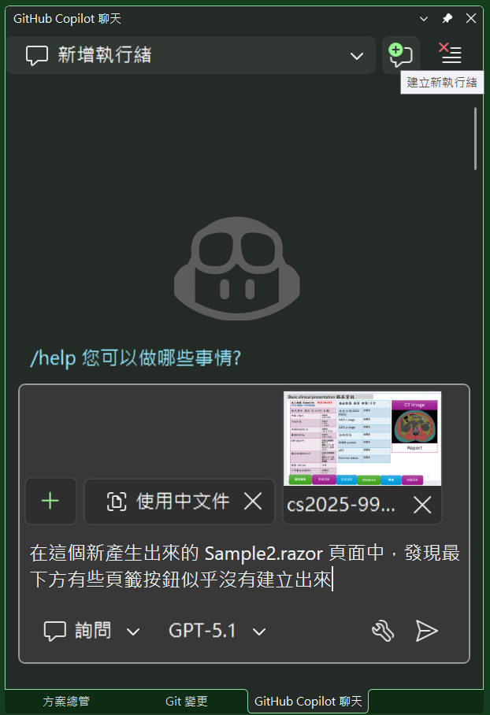
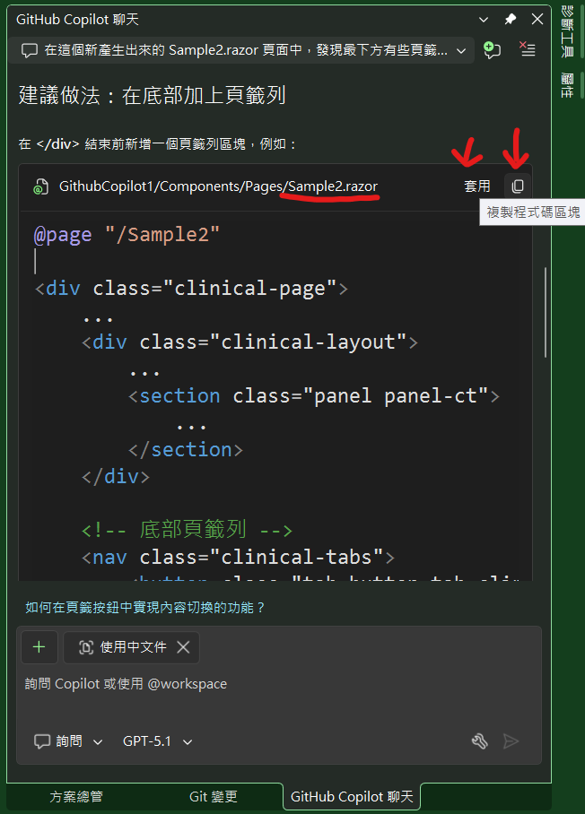
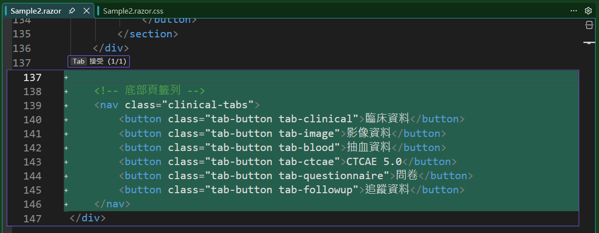
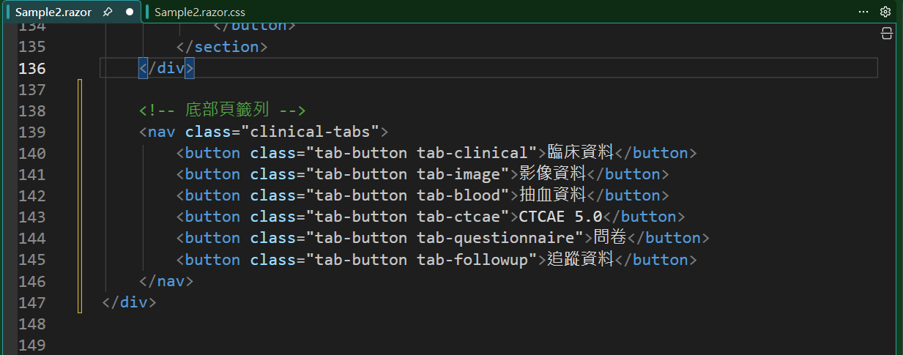
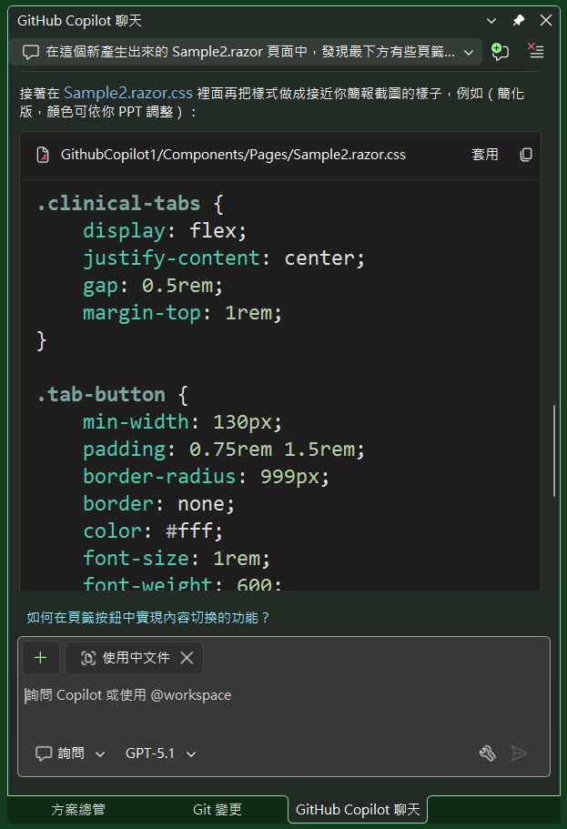
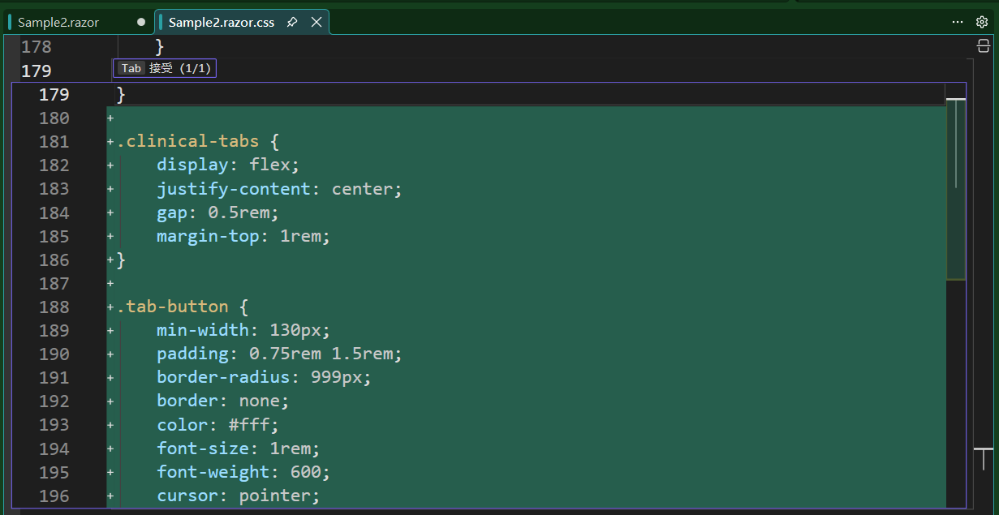
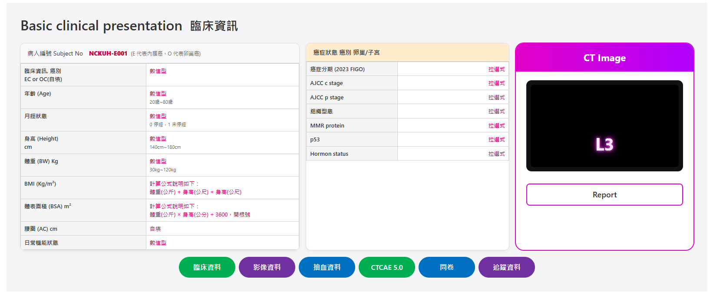

# Github Copilot 3 : 使用Copilot進行 Blazor 頁面畫面的調整

在上一篇文章所建立起來的Blazor專案，已經將原先醫師提供的 PowerPoint 畫面


透過 Github Copilot 的能力，產生出一個新的 Blazor 頁面(Sample2.razor)與 Sample2.razor.css 樣式檔案，並且能夠成功地在瀏覽器中呈現出來。


接下來，將會嘗試看看，是否能夠利用 Github Copilot 來協助我，對於這個頁面進行一些調整與改善的工作。

## 準備使用 Github Copilot 進行頁面調整
在這個新產生出來的 Sample2.razor 頁面中，發現最下方有些頁籤按鈕似乎沒有建立出來，因此，將剛剛建立好新頁面的專案再度開啟起來。

* 首先，使用方案總管理員，將剛剛建立好的 [Sample2.razor] 與 [Sample2.razor.css] 檔案打開，並且將正在顯示程式碼的視窗設定為 [Sample2.razor] 頁面，這裡的目的在於讓 Github Copilot 能夠知道目前正在使用中的頁面是哪一個，如此，當我們在下達 Prompt 的時候，便可以不用使用其他方式告知 Copilot 目前正在處理的頁面是哪一個。
* 切換到 VS 2026 IDE 畫面內的 Github Copilot 視窗



* 在 Github Copilot 視窗右上方，點選 [建立新執行緒] 按鈕，在這裡的主要目的是在於清空之前的對話記憶
* 接著，將醫師提供的原始需求畫面貼到 Github Copilot 視窗中
* 在圖片的下方，輸入下列的提示語句 (Prompt)：
  * "在這個新產生出來的 Sample2.razor 頁面中，發現最下方有些頁籤按鈕似乎沒有建立出來"
  * 當然，要下達甚麼 Prompt，還是要看每個人自己的習慣與經驗

## Github Copilot 產生調整建議

> 這裡將會是 Github Copilot 所產生出來的建議內容，由這些結果可以看的出來，Copilot 似乎能夠理解目前頁面中缺少的部分，並且給出一些建議的做法來補足這些缺失的內容。
>
> 接下來就要測試看看，Github Copilot 所產生出來的建議內容，是否能夠成功地幫助我們來完成這些頁面的調整工作。
>
>請注意，這些內容是由 AI 自動產生的，可能會有錯誤或不完整的地方，請務必自行檢查與測試。

你現在這個 `Sample2.razor` 檔案裡，最下面其實「完全沒有」任何頁籤（Tab）或按鈕的標記，所以畫面自然不會出現你截圖中那排：

- 臨床資料
- 影像資料
- 抽血資料
- CTCAE 5.0
- 問卷
- 追蹤資料

目前頁面在 `</div>` 結束前的最後一段只有：

```razor
        <!-- 右邊：CT Image -->
        <section class="panel panel-ct">
            ...
            <button class="report-button">
                Report
            </button>
        </section>
    </div>
</div>
```

也就是說：  
1. 頁籤在這個新產生出來的 `.razor` 檔裡根本還沒寫；  
2. 或是原來範例是畫在 PowerPoint / Figma / 其他頁面，還沒被你轉成 HTML/CSS。

---

## 建議做法：在底部加上頁籤列

在 `</div>` 結束前新增一個頁籤列區塊，例如：

```razor
@page "/Sample2"

<div class="clinical-page">
    ...
    <div class="clinical-layout">
        ...
        <section class="panel panel-ct">
            ...
        </section>
    </div>

    <!-- 底部頁籤列 -->
    <nav class="clinical-tabs">
        <button class="tab-button tab-clinical">臨床資料</button>
        <button class="tab-button tab-image">影像資料</button>
        <button class="tab-button tab-blood">抽血資料</button>
        <button class="tab-button tab-ctcae">CTCAE 5.0</button>
        <button class="tab-button tab-questionnaire">問卷</button>
        <button class="tab-button tab-followup">追蹤資料</button>
    </nav>
</div>
```

接著在 `Sample2.razor.css` 裡面再把樣式做成接近你簡報截圖的樣子，例如（簡化版，顏色可依你 PPT 調整）：

```css
.clinical-tabs {
    display: flex;
    justify-content: center;
    gap: 0.5rem;
    margin-top: 1rem;
}

.tab-button {
    min-width: 130px;
    padding: 0.75rem 1.5rem;
    border-radius: 999px;
    border: none;
    color: #fff;
    font-size: 1rem;
    font-weight: 600;
    cursor: pointer;
}

/* 各頁籤顏色，可依 PPT 微調 */
.tab-clinical      { background-color: #00b050; }
.tab-image         { background-color: #7030a0; }
.tab-blood         { background-color: #0070c0; }
.tab-ctcae         { background-color: #00b050; }
.tab-questionnaire { background-color: #0070c0; }
.tab-followup      { background-color: #7030a0; }
```

如果你原本期望這些頁籤有「切換內容」的行為，可以再往下一步，把 `@code` 區塊加進來，用一個 `activeTab` 狀態來切換要顯示的內容，我可以再幫你補一版有互動的範例。

## 透過 Github Copilot 產生的完整程式碼範例

* 在 Github Copilot 的視窗中來捲動，可以到如下圖的內容


* 在這裡捲動到關於 Sample2.razor 檔案的修正建議區域
* 該區域的右上方將會看到兩個按鈕，一個是套用，一個是複製程式碼區塊
* 對於複製程式碼區塊，點選後，便可以將該區塊的程式碼複製到剪貼簿中
* 對於複製下來的程式碼就如同看到的畫面內容一樣，在此將剪貼簿的內容貼到文字編輯器來檢視，如下圖


* 從圖片中可以看到，接貼簿內的內容，同樣有包含 ... 這樣的內容，因此，似乎無法將這些剪貼簿的內容直接貼到 Blazor 頁面中，因為，在此應該是僅需要將 nav 區塊的內容貼到 Sample2.razor 頁面中即可
* 但並不是說這樣的功能結果不好用或不能用，面對不同的情況，有些時候是需要使用這樣的方法反而比較好的
* 現在來嘗試體驗套用按鈕的效果
* 點選套用按鈕後，會發現 Sample2.razor 頁面的內容已經被 Copilot 自動地修改過了



* 在 [Sample2.razor] 視窗將會如上圖樣貌，點選 [Sample2.razor.css] 頁籤來檢視，並且按下 [Tab] 鍵來進行套用
* 下圖為套用後修正結果



* 在 Copilot 視窗中，找到如下圖區域(也就是有這段文字的區域 ： 接著在 Sample2.razor.css 裡面再把樣式做成接近你簡報截圖的樣子)



* 點選右上方 [套用] 按鈕
* 切換到 [Sample2.razor.css] 頁籤視窗後，會發現 Sample2.razor.css 頁面的內容已經被 Copilot 自動地修改過了

* 點選 [Sample2.razor.css] 頁籤來檢視，並且按下 [Tab] 鍵來進行套用

## 執行檢查修正結果

現在執行該網站程式碼，打開瀏覽器，輸入這個網址，https://localhost:7299/Sample2，將會看到底下畫面



從上圖可以看到，頁籤列已經成功地被建立出來，並且能夠正確地顯示在頁面的底部位置，這樣的結果表示，透過 Github Copilot 所產生出來的建議內容，確實能夠幫助我們來完成這些頁面的調整工作。

## Sample2.razor 最終程式碼

```razor
@page "/Sample2"

<div class="clinical-page">
    <h1 class="page-title">
        Basic clinical presentation <span class="title-zh">臨床資訊</span>
    </h1>

    <div class="clinical-layout">
        <!-- 左邊：病人基本資料 -->
        <section class="panel panel-patient">
            <header class="panel-header">
                <span>病人編號 Subject No</span>
                <span class="subject-no">NCKUH-E001</span>
                <span class="subject-note">(E 代表內膜癌，O 代表卵巢癌)</span>
            </header>

            <table class="info-table">
                <tbody>
                    <tr>
                        <th>臨床資訊, 癌別<br />EC or OC(自填)</th>
                        <td class="value-text">數值型</td>
                    </tr>
                    <tr>
                        <th>年齡 (Age)</th>
                        <td class="value-text">
                            數值型<br />
                            <span class="hint">20歲~80歲</span>
                        </td>
                    </tr>
                    <tr>
                        <th>月經狀態</th>
                        <td class="value-text">
                            數值型<br />
                            <span class="hint">0 停經，1 未停經</span>
                        </td>
                    </tr>
                    <tr>
                        <th>身高 (Height)<br />cm</th>
                        <td class="value-text">
                            數值型<br />
                            <span class="hint">140cm~180cm</span>
                        </td>
                    </tr>
                    <tr>
                        <th>體重 (BW) Kg</th>
                        <td class="value-text">
                            數值型<br />
                            <span class="hint">30kg~120kg</span>
                        </td>
                    </tr>
                    <tr>
                        <th>BMI (Kg/m²)</th>
                        <td class="value-text">
                            計算公式說明如下：<br />
                            體重(公斤) ÷ 身高(公尺) ÷ 身高(公尺)
                        </td>
                    </tr>
                    <tr>
                        <th>體表面積 (BSA) m²</th>
                        <td class="value-text">
                            計算公式說明如下：<br />
                            體重(公斤) × 身高(公分) ÷ 3600，開根號
                        </td>
                    </tr>
                    <tr>
                        <th>腰圍 (AC) cm</th>
                        <td class="value-text">自填</td>
                    </tr>
                    <tr>
                        <th>日常機能狀態</th>
                        <td class="value-text">數值型</td>
                    </tr>
                </tbody>
            </table>
        </section>

        <!-- 中間：癌症狀態 -->
        <section class="panel panel-cancer">
            <header class="panel-header panel-header-highlight">
                癌症狀態 癌別 卵巢/子宮
            </header>

            <table class="info-table">
                <tbody>
                    <tr>
                        <th>癌症分期 (2023 FIGO)</th>
                        <td class="link-like">拉選式</td>
                    </tr>
                    <tr>
                        <th>AJCC c stage</th>
                        <td class="link-like">拉選式</td>
                    </tr>
                    <tr>
                        <th>AJCC p stage</th>
                        <td class="link-like">拉選式</td>
                    </tr>
                    <tr>
                        <th>組織型態</th>
                        <td class="link-like">拉選式</td>
                    </tr>
                    <tr>
                        <th>MMR protein</th>
                        <td class="link-like">拉選式</td>
                    </tr>
                    <tr>
                        <th>p53</th>
                        <td class="link-like">拉選式</td>
                    </tr>
                    <tr>
                        <th>Hormon status</th>
                        <td class="link-like">拉選式</td>
                    </tr>
                </tbody>
            </table>
        </section>

        <!-- 右邊：CT Image -->
        <section class="panel panel-ct">
            <header class="ct-header">
                CT Image
            </header>

            <div class="ct-content">
                <div class="ct-image-frame">
                    <div class="ct-image-placeholder">
                        <!-- 這裡之後可以換成  -->
                        <span class="ct-level-label">L3</span>
                    </div>
                </div>
            </div>

            <button class="report-button">
                Report
            </button>
        </section>
    </div>

    <!-- 底部頁籤列 -->
    <nav class="clinical-tabs">
        <button class="tab-button tab-clinical">臨床資料</button>
        <button class="tab-button tab-image">影像資料</button>
        <button class="tab-button tab-blood">抽血資料</button>
        <button class="tab-button tab-ctcae">CTCAE 5.0</button>
        <button class="tab-button tab-questionnaire">問卷</button>
        <button class="tab-button tab-followup">追蹤資料</button>
    </nav>
</div>

```

## Sample2.razor.css 最終程式碼

```css
.clinical-page {
    padding: 32px;
    background-color: #f5f5f7;
    font-family: "Segoe UI", system-ui, -apple-system, BlinkMacSystemFont, "Microsoft JhengHei", sans-serif;
    color: #333;
}

.page-title {
    font-size: 32px;
    font-weight: 600;
    margin: 0 0 24px;
}

.page-title .title-zh {
    margin-left: 8px;
    font-size: 28px;
}

.clinical-layout {
    display: grid;
    grid-template-columns: 2.2fr 1.6fr 1.4fr;
    gap: 16px;
}

.panel {
    background-color: #ffffff;
    border-radius: 10px;
    box-shadow: 0 0 0 1px #ddd, 0 3px 8px rgba(0, 0, 0, 0.05);
    overflow: hidden;
    display: flex;
    flex-direction: column;
}

/* 左邊病人資訊 */
.panel-patient .panel-header {
    padding: 12px 16px;
    border-bottom: 1px solid #d0d0d0;
    background-color: #f8f8fb;
    display: flex;
    flex-wrap: wrap;
    align-items: baseline;
    gap: 4px 8px;
    font-size: 14px;
}

.subject-no {
    font-weight: 800;
    color: #d20040;
    margin-left: 6px;
}

.subject-note {
    font-size: 12px;
    color: #666;
}

/* 中間癌症狀態 */
.panel-cancer .panel-header-highlight {
    padding: 10px 16px;
    background-color: #ffeccc;
    border-bottom: 1px solid #d0d0d0;
    font-weight: 600;
    font-size: 14px;
}

/* CT Panel */
.panel-ct {
    background-color: #ffffff;
    border-radius: 18px;
    box-shadow: 0 0 0 2px #e200c8;
    padding-bottom: 16px;
}

.ct-header {
    background: linear-gradient(90deg, #e200c8, #b000ff);
    color: #ffffff;
    font-weight: 700;
    text-align: center;
    padding: 16px 8px;
    font-size: 22px;
}

.ct-content {
    padding: 20px 24px 12px;
}

.ct-image-frame {
    border-radius: 12px;
    background-color: #111;
    padding: 10px;
}

.ct-image-placeholder {
    position: relative;
    width: 100%;
    height: 190px;
    background-color: #000;
    border-radius: 8px;
    overflow: hidden;
}

.ct-level-label {
    position: absolute;
    left: 50%;
    bottom: 24px;
    transform: translateX(-50%);
    font-size: 40px;
    font-weight: 700;
    color: #ffe6ff;
    text-shadow: 0 0 6px #ff66ff, 0 0 16px #ff00ff;
}

/* Report 按鈕 */
.report-button {
    margin: 16px 24px 0;
    width: calc(100% - 48px);
    padding: 10px;
    border-radius: 8px;
    border: 2px solid #e200c8;
    background-color: #ffffff;
    color: #333;
    font-size: 18px;
    font-weight: 600;
    cursor: pointer;
    transition: all 0.15s ease-in-out;
}

.report-button:hover {
    background-color: #ffe6ff;
}

/* 通用表格樣式 */
.info-table {
    width: 100%;
    border-collapse: collapse;
    font-size: 13px;
}

.info-table th,
.info-table td {
    border: 1px solid #d0d0d0;
    padding: 6px 8px;
    vertical-align: top;
}

.info-table th {
    width: 45%;
    background-color: #f5f5f5;
    font-weight: 600;
}

.info-table td {
    background-color: #ffffff;
}

.value-text {
    color: #c4005b;
}

.value-text .hint {
    color: #666;
    font-size: 11px;
}

.link-like {
    color: #c4005b;
    text-align: right;
}

/* RWD 簡單處理 */
@media (max-width: 992px) {
    .clinical-layout {
        grid-template-columns: 1fr;
    }

    .panel-ct {
        order: -1;
    }
}

.clinical-tabs {
    display: flex;
    justify-content: center;
    gap: 0.5rem;
    margin-top: 1rem;
}

.tab-button {
    min-width: 130px;
    padding: 0.75rem 1.5rem;
    border-radius: 999px;
    border: none;
    color: #fff;
    font-size: 1rem;
    font-weight: 600;
    cursor: pointer;
}

/* 各頁籤顏色，可依 PPT 微調 */
.tab-clinical      { background-color: #00b050; }
.tab-image         { background-color: #7030a0; }
.tab-blood         { background-color: #0070c0; }
.tab-ctcae         { background-color: #00b050; }
.tab-questionnaire { background-color: #0070c0; }
.tab-followup      { background-color: #7030a0; }
```


