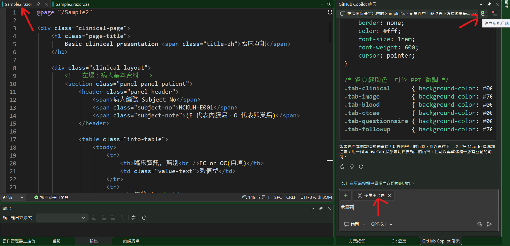
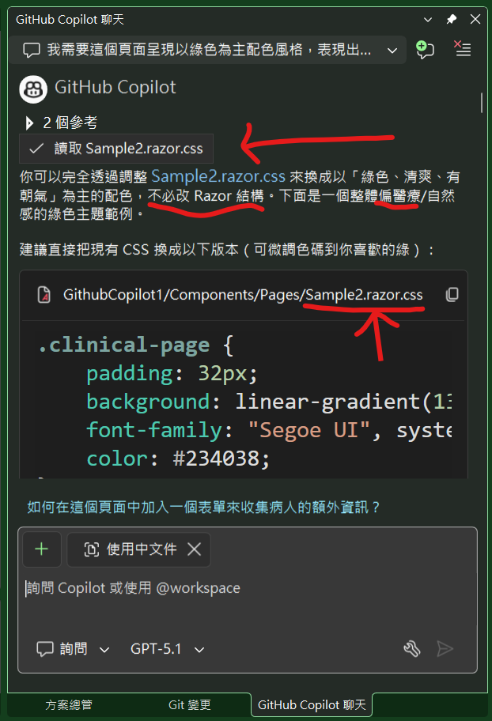
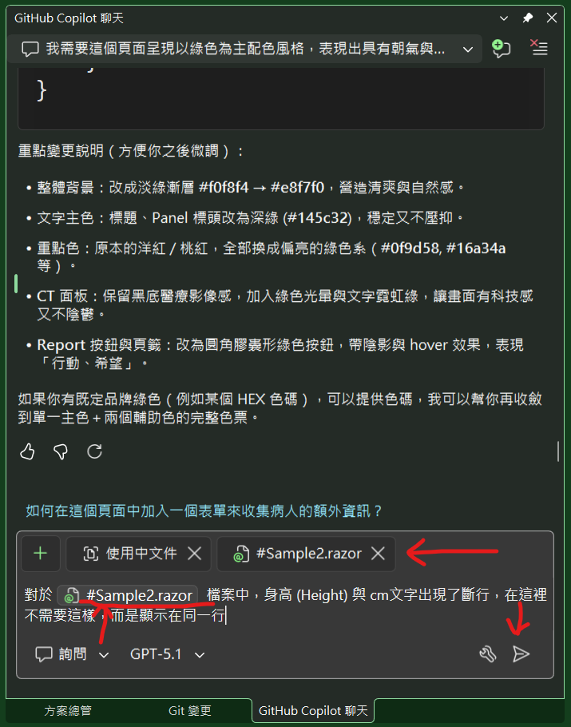
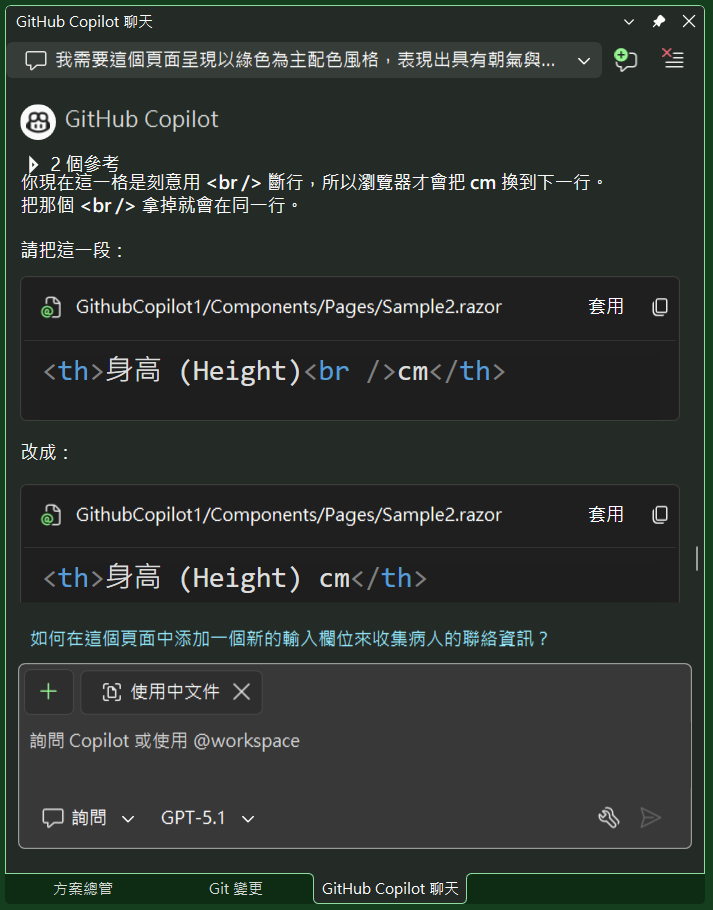
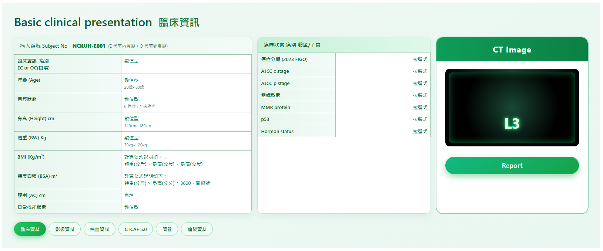

# Github Copilot 4 : 透過Prompt或圖片變更Blazor頁面風格

在上一篇文章將原先醫師提供的 PowerPoint 畫面所欠缺的最下方的頁籤按鈕列，成功地加入到 Blazor 頁面中之後，接下來將會嘗試看看，是否能夠利用 Github Copilot 來協助我，對於這個頁面進行一些調整與改善的工作。

這是上一篇文章的頁面截圖


在接下來的這篇文章中，將會來探討如何透過 Github Copilot 4 所提供的功能，來協助我對於這個 Blazor 頁面的風格進行一些調整與變更。透過輸入適當的 Prompt 來觀看與了解如何進行這樣的操作。

## 修正 [Sample2.razor] 的頁面風格

* 延續剛剛建立的專案，打開 [Sample2.razor] 頁面
* 切換到 [GitHub Copilot] 視窗
* 點選該視窗中右上方的 [建立新執行緒] 按鈕
* 現在已經開啟了一個新一輪的對話

* 在對話視窗中，輸入以下的 Prompt 指令，然後按下 Enter 鍵
  ```
  我需要這個頁面呈現以綠色為主配色風格，表現出具有朝氣與希望
  ```
* 由於 Github Copilot 預設設定會加入 [使用中文件] 的選項，因此，對於已經開啟且正在顯示視窗內的 [Sample2.razor] 頁面，會自動進行一些調整
* 一旦 AI 分析與生成結束後，可以從視窗中看到底下結果

* 從 Github Copilot視窗中，可以觀察到
  * 這裡讀取了兩個檔案，分別是 [Sample2.razor] 與 [Sample2.razor.css]
  * 從 Prompt 的敘述，AI 可以理解到，這次的動作，不需要修改 Razor 結構，而是需要調整 CSS 的部分，也就是要調整 [Sample2.razor.css] 檔案
  * AI 從 [Sample2.razor] 檔案中，看的出來這是一個偏向醫療方面的應用網頁設計
  * 因此，依據 Prompt 需求，AI 會將配色調整為綠色系
* 在 [GitHub Copilot] 視窗中，點選 [Sample2.razor.css] 產出內容的右上方之 [套用] 按鈕
* 現在在 Visual Studio 2026 中，正在修改的程式碼視窗，自動切換到 [Sample2.razor.css] 檔案
* 點選該視窗，按下 [Tab] 鍵，將剛剛 AI 產出的 CSS 程式碼，套用到這個檔案中
* 儲存 [Sample2.razor.css] 檔案
* 底下是 Github Copilot 對於這次請求的處理摘要

* 重點變更說明（方便你之後微調）：
  * 整體背景：改成淡綠漸層 #f0f8f4 → #e8f7f0，營造清爽與自然感。
  * 文字主色：標題、Panel 標頭改為深綠 (#145c32)，穩定又不壓抑。
  * 重點色：原本的洋紅 / 桃紅，全部換成偏亮的綠色系（#0f9d58, #16a34a 等）。
  * CT 面板：保留黑底醫療影像感，加入綠色光暈與文字霓虹綠，讓畫面有科技感又不陰鬱。
  * Report 按鈕與頁籤：改為圓角膠囊形綠色按鈕，帶陰影與 hover 效果，表現「行動、希望」。
  * 如果你有既定品牌綠色（例如某個 HEX 色碼），可以提供色碼，我可以幫你再收斂到單一主色＋兩個輔助色的完整色票。


## 檢視修正結果

* 執行這個專案
* 在瀏覽器中，打開 [https://localhost:7299/Sample2](https://localhost:7299/Sample2) 頁面
* 將會看到底下結果

* 可以看到，整個頁面的配色風格，已經變更為綠色系，呈現出具有朝氣與希望的感覺

## Sample2.razor.css 原始程式碼

```css
.clinical-page {
    padding: 32px;
    background: linear-gradient(135deg, #f0f8f4, #e8f7f0);
    font-family: "Segoe UI", system-ui, -apple-system, BlinkMacSystemFont, "Microsoft JhengHei", sans-serif;
    color: #234038;
}

.page-title {
    font-size: 32px;
    font-weight: 600;
    margin: 0 0 24px;
    color: #145c32;
}

.page-title .title-zh {
    margin-left: 8px;
    font-size: 28px;
    color: #1f7a3a;
}

.clinical-layout {
    display: grid;
    grid-template-columns: 2.2fr 1.6fr 1.4fr;
    gap: 16px;
}

.panel {
    background-color: #ffffff;
    border-radius: 12px;
    box-shadow: 0 0 0 1px rgba(29, 134, 73, 0.12), 0 6px 16px rgba(15, 94, 54, 0.08);
    overflow: hidden;
    display: flex;
    flex-direction: column;
}

/* 左邊病人資訊 */
.panel-patient .panel-header {
    padding: 12px 16px;
    border-bottom: 1px solid rgba(22, 96, 60, 0.25);
    background: linear-gradient(90deg, #e6f7ee, #f3fbf7);
    display: flex;
    flex-wrap: wrap;
    align-items: baseline;
    gap: 4px 8px;
    font-size: 14px;
    color: #145c32;
}

.subject-no {
    font-weight: 800;
    color: #0d8040;
    margin-left: 6px;
}

.subject-note {
    font-size: 12px;
    color: #497562;
}

/* 中間癌症狀態 */
.panel-cancer .panel-header-highlight {
    padding: 10px 16px;
    background: linear-gradient(90deg, #c4f1d6, #e0f8eb);
    border-bottom: 1px solid rgba(22, 96, 60, 0.25);
    font-weight: 600;
    font-size: 14px;
    color: #145c32;
}

/* CT Panel */
.panel-ct {
    background-color: #ffffff;
    border-radius: 18px;
    box-shadow: 0 0 0 2px rgba(0, 158, 96, 0.45);
    padding-bottom: 16px;
}

.ct-header {
    background: linear-gradient(90deg, #0f9d58, #0b8043);
    color: #ffffff;
    font-weight: 700;
    text-align: center;
    padding: 16px 8px;
    font-size: 22px;
    letter-spacing: 0.04em;
}

/* 保留黑底 CT 畫面，但加一點綠色光感讓感覺現代、有希望 */
.ct-content {
    padding: 20px 24px 12px;
}

.ct-image-frame {
    border-radius: 12px;
    background: radial-gradient(circle at top, #1c3b32 0, #050909 60%, #000 100%);
    padding: 10px;
}

.ct-image-placeholder {
    position: relative;
    width: 100%;
    height: 190px;
    background: radial-gradient(circle at center, #1a4734 0, #000 65%);
    border-radius: 8px;
    overflow: hidden;
    box-shadow: inset 0 0 18px rgba(19, 176, 102, 0.6);
}

.ct-level-label {
    position: absolute;
    left: 50%;
    bottom: 24px;
    transform: translateX(-50%);
    font-size: 40px;
    font-weight: 700;
    color: #e3ffe8;
    text-shadow: 0 0 6px #52ff9a, 0 0 16px #00d46d;
}

/* Report 按鈕：綠色行動按鈕，表現「行動力 / 希望」 */
.report-button {
    margin: 16px 24px 0;
    width: calc(100% - 48px);
    padding: 10px;
    border-radius: 999px;
    border: none;
    background: linear-gradient(135deg, #12b981, #16a34a);
    color: #ffffff;
    font-size: 18px;
    font-weight: 600;
    cursor: pointer;
    transition: transform 0.12s ease-out, box-shadow 0.12s ease-out, filter 0.12s ease-out;
    box-shadow: 0 6px 16px rgba(22, 163, 74, 0.45);
}

.report-button:hover {
    filter: brightness(1.05);
    transform: translateY(-1px);
    box-shadow: 0 10px 24px rgba(22, 163, 74, 0.6);
}

.report-button:active {
    transform: translateY(0);
    box-shadow: 0 4px 12px rgba(22, 163, 74, 0.5);
}

/* 通用表格樣式：略帶綠色邊與標題底色 */
.info-table {
    width: 100%;
    border-collapse: collapse;
    font-size: 13px;
}

.info-table th,
.info-table td {
    border: 1px solid rgba(148, 191, 164, 0.9);
    padding: 6px 8px;
    vertical-align: top;
}

.info-table th {
    width: 45%;
    background: linear-gradient(90deg, #e7f6ed, #f3fbf8);
    font-weight: 600;
    color: #145c32;
}

.info-table td {
    background-color: #ffffff;
}

.value-text {
    color: #047857;
}

.value-text .hint {
    color: #658a75;
    font-size: 11px;
}

.link-like {
    color: #0f766e;
    text-align: right;
}

/* 底部頁籤列：綠色主題 Tabs */
.clinical-tabs {
    margin-top: 24px;
    display: flex;
    flex-wrap: wrap;
    gap: 8px;
}

.tab-button {
    border-radius: 999px;
    border: 1px solid rgba(22, 163, 74, 0.4);
    background-color: #f0fdf4;
    color: #166534;
    padding: 8px 16px;
    font-size: 13px;
    font-weight: 500;
    cursor: pointer;
    transition: background-color 0.12s ease-out, color 0.12s ease-out, box-shadow 0.12s ease-out, transform 0.12s ease-out;
}

.tab-button:hover {
    background-color: #bbf7d0;
    box-shadow: 0 3px 10px rgba(21, 128, 61, 0.25);
    transform: translateY(-1px);
}

.tab-clinical {
    background: linear-gradient(135deg, #22c55e, #16a34a);
    color: #ffffff;
    border-color: transparent;
    box-shadow: 0 4px 14px rgba(34, 197, 94, 0.55);
}

/* RWD 簡單處理 */
@media (max-width: 992px) {
    .clinical-layout {
        grid-template-columns: 1fr;
    }

    .panel-ct {
        order: -1;
    }
}
```

## 再次進行調整

* 面對這樣的結果，若覺得還不夠理想，還是可以請 Github Copilot 再次進行不同顏色與想法調整
* 現在要來嘗試針對 Razor 檔案進行修正
* 切換到 [GitHub Copilot] 視窗
* 在此，並不需要在 Github Copilot 視窗中，建立新的對話執行緒
* 直接在現有的對話視窗中，輸入以下的 Prompt 指令，然後按下 Enter 鍵
  ```
  對於 #Sample2.razor  檔案中，身高 (Height) 與 cm文字出現了斷行，在這裡不需要這樣，而是顯示在同一行
  ```
* 底下畫面為這次操作的截圖

* 在 Github Copilot 聊天視窗中，按下 [傳送] 按鈕
* 一旦 AI 完成分析後，將會看到底下的輸出

* 從這裡可以看到，AI 已經理解到這次的需求，是要調整 Razor 檔案中的結構
* 在 [GitHub Copilot] 視窗中，點選 [Sample2.razor] 產出內容的右上方之 [套用] 按鈕

## 檢視修正結果
* 再次執行這個專案
* 在瀏覽器中，打開 [https://localhost:7299/Sample2](https://localhost:7299/Sample2) 頁面
* 將會看到底下結果

* 可以看到，身高 (Height) 與 cm 文字已經顯示在同一行，不會再出現斷行的情況


