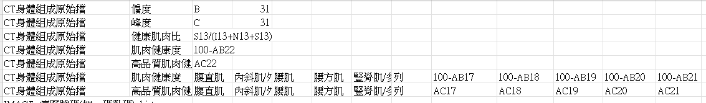
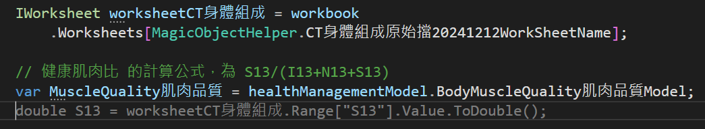
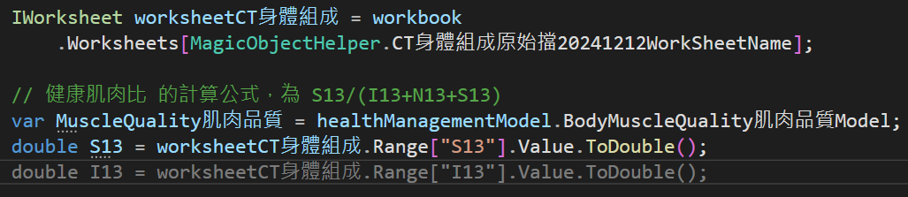
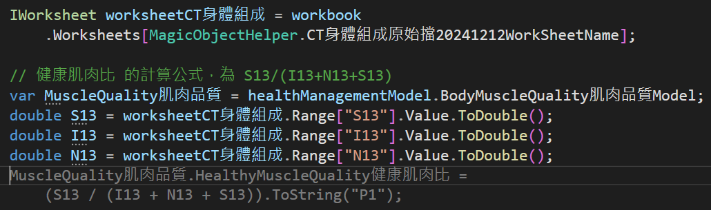

# Github Copilot 5 : 程式碼自動完成輔助

在這一篇文章，將會來分享我在使用 Github Copilot 的自動程式碼輔助生成的經驗。這是一個關於醫院的運動員儀表板的專案開發，在這個專案中，我會示範如何利用 Github Copilot 來協助完成一些程式碼的撰寫工作，並且展示這些功能如何提升開發效率。

該系統將會透過 Excel 檔案來提供身體組成與其他相關數據，其中有些數據則需要從不同的 Sheet 內的不同 cell 來進行計算而得到，其公式如下圖所示：



這些數據將會透過 Blazor 頁面來進行顯示，並且這類型的專案通常需要撰寫大量的程式碼來處理資料的讀取、計算以及顯示等工作，一旦在程式碼中的公式撰寫錯誤，或者指定錯誤 cell 來源，將會造成整體呈現的數據失真。

另外，一旦需要進行功能的擴充，或者是修改計算公式時，也需要花費大量的時間來進行程式碼的調整與測試。

這個專案採用了 MVP 的方式來進行開發，所以，能夠快速與準確的撰寫程式碼是非常重要的任務。

透過 Github Copilot 的協助，我能夠更快速地完成這些任務，並且減少了手動撰寫程式碼的時間。

以下是我在這個專案中使用 Github Copilot 的一些範例：

對於讀取 Excel 檔案內容的部分，這裡採用的是 Syncfusion.XlsIO 套件來進行 Excel 檔案的讀取工作，以下是我使用 Copilot 來協助完成讀取 Excel 檔案的程式碼：

```csharp
IWorksheet worksheetCT身體組成 = workbook
            .Worksheets[MagicObjectHelper.CT身體組成原始擋20241212WorkSheetName];
```

根據螢幕截圖，對於 健康肌肉比 的計算公式，為 S13/(I13+N13+S13)

首先，將這段註解寫到程式碼中

```csharp
// 健康肌肉比 的計算公式，為 S13/(I13+N13+S13)
```

接著，使用 Copilot 來協助完成程式碼的撰寫

在該註解寫完之後，按下 Enter 按鍵，Copilot 會自動建議以下的程式碼：

```csharp
var MuscleQuality肌肉品質 = healthManagementModel.BodyMuscleQuality肌肉品質Model;
```

接著，再度按下 Enter ，Copilot 會自動建議以下的程式碼：

```csharp
double S13 = worksheetCT身體組成.Range["S13"].Value.ToDouble();
```

在這裡將會讀取 Sheet 名稱為 MagicObjectHelper.CT身體組成原始擋20241212WorkSheetName ，其中第 S13 cell 的值，並且轉換成 double 型別。接著儲存到 S13 變數內



接著，再度按下 Enter ，Copilot 會自動建議以下的程式碼：

```csharp
double I13 = worksheetCT身體組成.Range["I13"].Value.ToDouble();
```



接著，再度按下 Enter ，Copilot 會自動建議以下的程式碼：

```csharp
double N13 = worksheetCT身體組成.Range["N13"].Value.ToDouble();
```

現在將會是重點，此時，再度按下 Enter ，Copilot 會自動建議如圖程式碼：

!

從這裡可看到所建議的程式碼雖然已經產生，但是，還是會有些錯誤，不過，關於公式的部分是正確的，接著，只需要將程式碼稍作修改即可，最終的程式碼如下所示：

```csharp
var 健康肌肉比 = (S13 / (I13 + N13 + S13)).ToString("F2");
```

在這裡簡短的操作示範中看到，因為最初有加入計算公式的註解，讓 Copilot 能夠更精準的理解我要完成的任務，並且提供相對應的程式碼建議，雖然最後還是需要進行一些修改，但是，大幅減少了撰寫程式碼的時間。

當然，日後若公式有所變更，這裡也僅需要修改註解中的公式，然後再公式的程式碼進行刪除，接著，在按下 Enter 鍵，Copilot 就會再次根據新的註解內容來提供新的程式碼建議，這樣的方式能夠大幅提升程式碼撰寫的效率，並且減少錯誤發生的機率。


