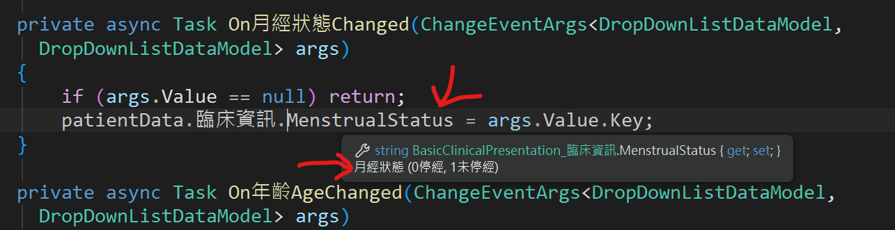
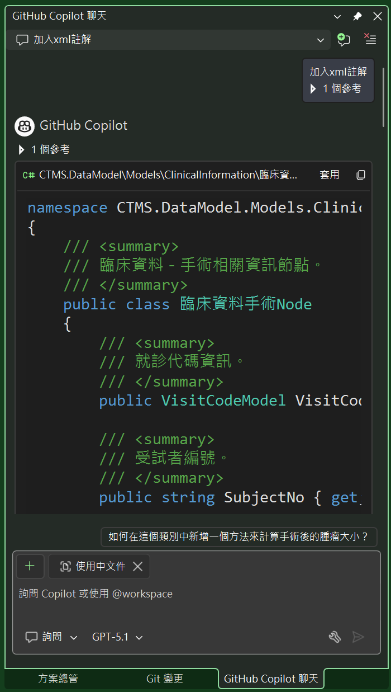
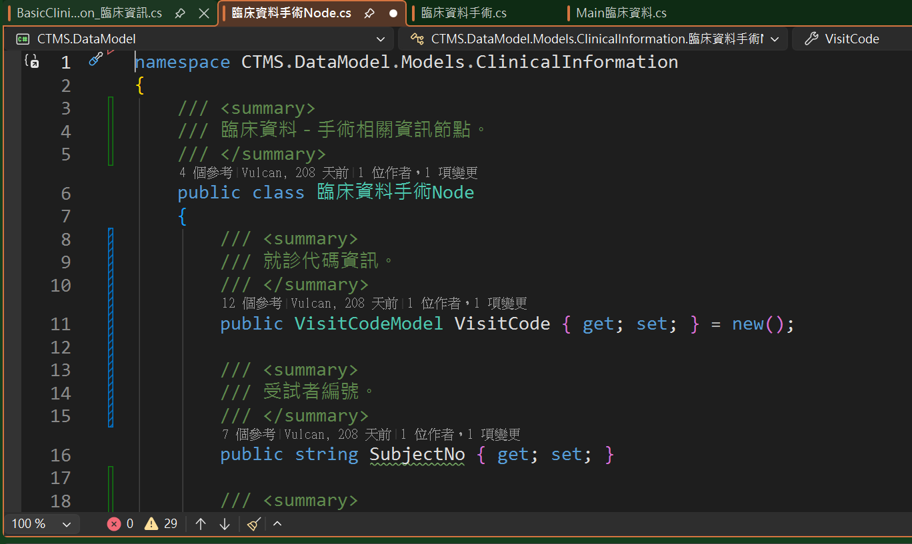

# Github Copilot 6 : 為程式碼自動加入註解

適度的在程式碼中加入適當的註解，將會有助於日後專案維護的效率，雖然，有很多人不贊同在程式碼中加入過多的註解，不過，有些時候，適當的加入程式碼註解，將會有助於整體專案的理解。

這是一個 AI 影響性中心的臨床試驗平台的專案，需要將癌症治療與AI輔助分析進行整合，並且要收集不同週期的各種治療、抽血、問卷的數據，最重要的是，這些都是關於醫療方面的項目，對於像是我們這樣的程式設計人員，這些名稱其實對於我們並沒有受過這樣的專業訓練，因此，程式碼中充斥著這些醫學名詞，特別是在 Data Model 的定義上，首先，面對到的是如何取個適當的屬性名稱，最重要的是日後看到這個名稱，能夠與畫面上的欄位結合起來，畢竟，我這裡設計的畫面語系是中文文字。

例如底下這個類別 [臨床資料手術Node] 是一個要記錄臨床手術相關內容的類別，各個欄位的名稱來自於醫師提供的，並且要對應到畫面上

```csharp
public class 臨床資料手術Node
{
    public VisitCodeModel VisitCode { get; set; }=new();
    public string SubjectNo { get; set; }
    public DateTime 手術日期 { get; set; }
    public string 術式 { get; set; }
    public string OPOutcome { get; set; }
    public string Ascites { get; set; }
    public string Uterus { get; set; }
    public string UterusSite { get; set; }
    public string UterusTumorNumber { get; set; }
    public string UterusTumorSize { get; set; }
    public string Cervix { get; set; }
    public string CervixSite { get; set; }
    public string CervixTumorNumber { get; set; }
    public string Endometrium { get; set; }
    public string Myometrium { get; set; }
    public string CulDeSac { get; set; }
    public string OvarianSurfaceRuptureOrNotRightOvary { get; set; }
    public string OvarianSurfaceRuptureOrNotLeftOvary { get; set; }
    public string LeftAdnexa { get; set; }
    public string LeftAdnexaTumorNumber { get; set; }
    public string LeftAdnexaTumorSize { get; set; }
    public string RightAdnexa { get; set; }
    public string RightAdnexaTumorNumber { get; set; }
    public string RightAdnexaTumorSize { get; set; }
    public string PelvicPeritonealCavity { get; set; }
    public string PelvicPeritonealCavityTumorSize { get; set; }
    public string ExtrapelvicPeritonealCavity { get; set; }
    public string ExtrapelvicPeritonealCavityOtherFinding { get; set; }
    public string OtherOrganInvolvementGrossLooking { get; set; }
    public string Optimal { get; set; }
    public string ResidualTumor { get; set; }

}
```

另外，若這個類別將會用於 Web API 上的使用，並且這些資訊要能夠讓使用 Swagger 的前端人員，知道這些欄位的意義與用法，此時，也需要適當的加入 xml 註解，如此，這些資訊可以在 Swagger 上呈現出來，因此，如何快速、有效與方便的建立起這些註解資訊，並且不會造成負擔，就是這篇文章想要表達的。

## 為 臨床資料手術Node 加入註解

在以往想要為一個類別內的不同屬性加入這些 XML 註解，這是一個相當具大與浪費時間的工作，也考驗著程式設計人員的耐心，很多人因為習慣或者偷懶，不會想要去做這些的工作，可是，一旦這些註解存在之後，除了可以在 Swagger 中讓前端人員快速理解傳遞參數的欄位意義，並且對於在日常維護工作上，也會有相當的益處，例如，當看到一段程式碼，如下圖



當看到這個欄位 [MenstrualStatus] 究竟是甚麼意思，這個欄位的型別為字串，當要看到該欄位值的時候，其為 0 或者 1 ，這又分別代表甚麼意思呢？

此時，若該資料模型欄位有使用 xml 註解，僅需要將游標移動到該欄位上，VS 2026 就會彈跳出一個小視窗，說明這是一個關於紀錄月經狀態，其數值將會有兩種狀態，分別是 0:停經  1:未停經；看到這些訊息是不是瞬間對於這段程式碼的內容更加清晰了呢？

* 現在，打開 [臨床資料手術Node.cs] 這個檔案，這個檔案定義了 [臨床資料手術Node] 資料模型的類別，內容在上面已經有顯示出來。
* 切換到 [Github Copilot 聊天] 視窗內
* 在該視窗左上方點選 [建立新執行緒] 按鈕
* 在下面聊天面板中，輸入這個 Prompt 指令，並且按下 Enter 鍵

```
加入xml註解
```

* 雖然這個 Prompt 內容簡單又清爽，但是對於這個情境卻絲毫不會有任何影響
* 等待 Github Copilot 完成生成之後，將會看到底下截圖

* 點選 [臨床資料手術Node.cs] 生成結果右上方的套用按鈕
* 直接將生成結過套用到原始 [臨床資料手術Node.cs] 檔案中
* 這是尚未套用前的畫面

* [臨床資料手術Node.cs] 視窗內，按下多次 [Tab] 按鍵，完成套用程序
* 這是套用之後的畫面

* 可以看到，原本沒有任何註解的程式碼，已經被自動加入了完整的 xml 註解


