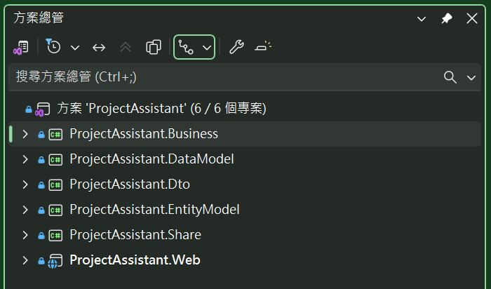
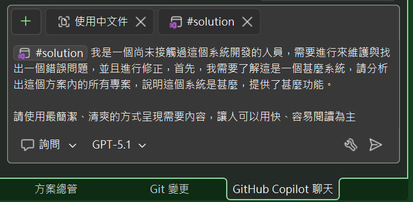
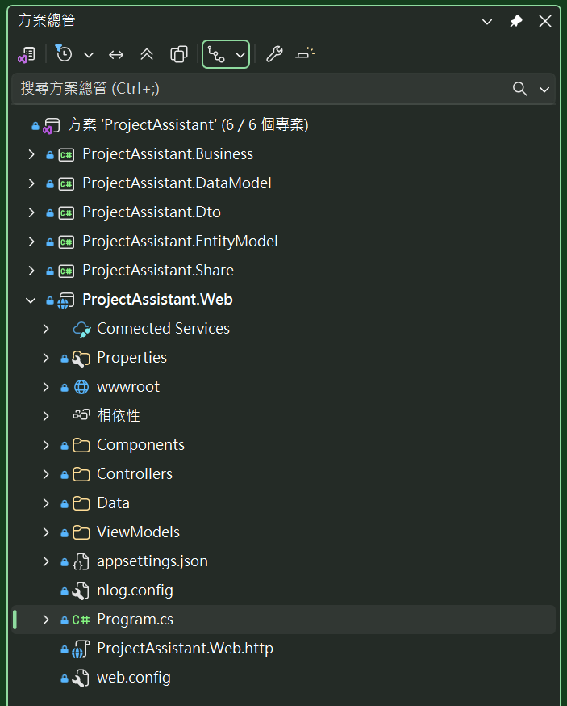
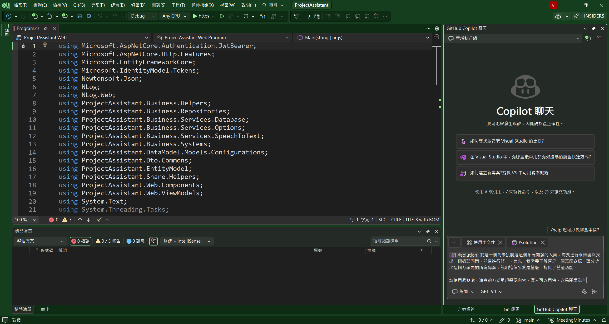
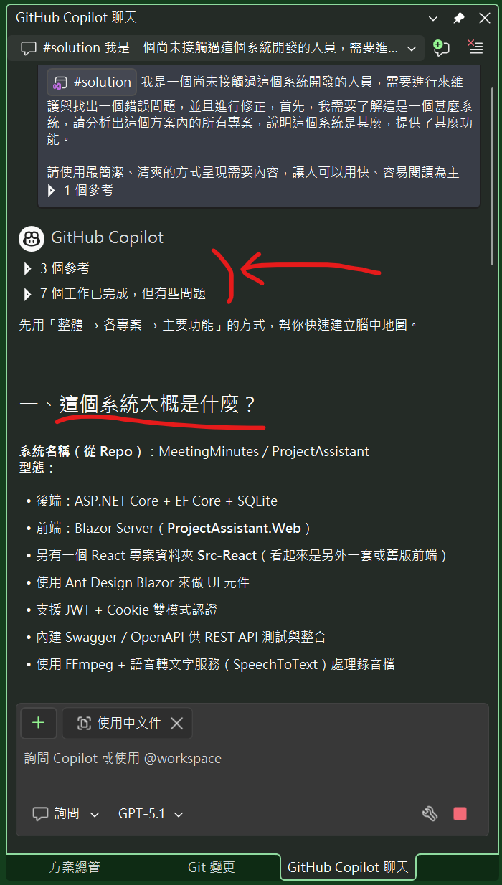

# Github-Copilot-7-分析整個專案架構

身為程式設計師，理所當然的會經常收到新的專案需求，從無到有的進行一個新系統的開發工作，這是相當有趣且充滿挑戰的工作，然而，更多時候，程式設計師並不是從無到有的開始一個新系統的開發工作，而是接手一個已經存在的系統，這個系統可能已經歷經多年開發與維護，程式碼量龐大且複雜，對於新進的程式設計師來說，要快速理解整個系統的架構與運作方式，是一項艱鉅的任務。

面對收到一個指示，需要要來維護現有的系統，然而，你當初卻沒有參與過這個專案，並且收到需要在這個專案系統中，需要進行問題除錯或者要加入一個新的需求或功能，也有可能只收到這個系統的專案原始碼，並且沒有任何說明文件或者可供參考的資料。

面對這樣的情況，應該絕大多數的人，都會無從下手，對於資深人員有可能憑藉著他之前累積的經驗與知識，給他足夠的時間，也許有機會慢慢地探索與理解，分解出這個系統的架構，找出如何解決現在提報的錯誤或者把新的需求新增進去。可以，絕大多數時候，並不是每個程式設計師都這麼的厲害，面對著這樣的情況，如何能夠讓一般人員甚至新手小白，也能夠快速理解整個系統的架構與運作方式，這是相當重要的課題。

若現有系統地原有開發或者維護人員還在組織內，當檢視程式碼的時候，可以直接詢問這些原有的開發或者維護人員，這樣的方式雖然直接且有效率，但是，若這些原有的開發或者維護人員已經離職或者轉調他單位，這時候就只能靠自己檢視程式碼來理解整個系統的架構與運作方式。

在這裡，同樣的使用我這一年所開發的一個專案，如下面節圖，先不說明這是一個甚麼專案，看看能否透過 Github Copilot 的協助，來快速理解這個專案的架構與運作方式。



## 以 Github Copilot 分析專案架構

* 首先開啟這個專案，切換到 [Github Copilot 聊天] 視窗內
* 在該視窗左上方點選 [建立新執行緒] 按鈕
* 在下面聊天面板中，輸入這個 Prompt 指令，並且按下 Enter 鍵

```
#solution 我是一個尚未接觸過這個系統開發的人員，需要進行來維護與找出一個錯誤問題，並且進行修正，首先，我需要了解這是一個甚麼系統，請分析出這個方案內的所有專案，說明這個系統是甚麼，提供了甚麼功能。

請使用最簡潔、清爽的方式呈現需要內容，讓人可以用快、容易閱讀為主
```



在這裡使用 `#solution` 標籤，讓 Github Copilot 知道這是一個針對整個方案的需求，緊接其後，輸入這次的需求的提示文字內容，在這裡，稍後因為要將結果貼到這個部落格文章上，因此，希望以簡潔的方式產出內容，了解這樣的操作效果；若為正常操作過程，可以要求 AI 產生出更詳細的說明與分析內容。

另外，在 [Github Copilot 聊天] 視窗內，可以看到這裡使用兩個參考來源，一個是 [使用中文件]，另外一個是 [#solution]，這表示這次的需求是參考這兩個來源來進行分析與說明。所以，在這裡將會從這個 [ProjectAssistant.Web] 啟動專案內，找到並且開啟 [Program.cs] 檔案。



也可以使用 `#project` 標籤，來針對某一個專案進行分析與說明，這樣的方式，可以讓程式設計師更聚焦在某一個專案內，來了解該專案的內容與功能。

底下將會是完整的畫面截圖



## 檢視 Copilot 生成結果

從 [Github Copilot 聊天] 視窗內，參考下圖，可以看到這次的 Prompt 送達到 AI 之後，實際上有去參考這個方案的其他檔案內容，另外，在這個方案內，其實並沒有人關於 Readme 的文件，來說明這個方案是做甚麼用的，因此，這次的測試結果若符合預期，這就表示 [Github Copilot 聊天] 功能，真的有去閱讀與分析這個方案內的內容，並且產生出相當不錯的說明內容。



底下為 [Github Copilot 聊天] 產生內容

從這個內容敘述，AI 能夠相當清楚地說明這個系統的名稱是甚麼，並且說明這個系統的主要功能，另外，也能夠說明這個方案內的各個專案的用途與功能，對於一個新進的程式設計師來說，這樣的資訊已經足夠讓他快速理解整個系統的架構與運作方式，接下來，就可以針對這些專案內的類別與程式碼，進行更深入的了解與分析。

因此，就算是一個資淺或者小白，也可以透過這樣的方式，了解到這個系統的架構與運作方式，進而能夠有效率地進行維護與開發工作，這對於提升團隊的生產力與協作效率，有著相當大的幫助。

---


這個系統大概是什麼？

**系統名稱（從 Repo）**：MeetingMinutes / ProjectAssistant  
**型態**：  
- 後端：ASP.NET Core + EF Core + SQLite  
- 前端：Blazor Server（`ProjectAssistant.Web`）  
- 另有一個 React 專案資料夾 `Src-React`（看起來是另外一套或舊版前端）  
- 使用 Ant Design Blazor 來做 UI 元件  
- 支援 JWT + Cookie 雙模式認證  
- 內建 Swagger / OpenAPI 供 REST API 測試與整合  
- 使用 FFmpeg + 語音轉文字服務（SpeechToText）處理錄音檔  

**核心領域**（從專案與類別命名推論）：  
- 專案管理（`Project`, `MyTask`, `GanttChartRepository`）  
- 會議管理與會議紀錄（`Meeting`, `MeetingRepository`, `RecordedMediaFileRepository`）  
- 錄音 / 媒體檔管理 + 語音轉文字（`RecordedMediaFile`, `SpeechToTextService`）  
- 使用者與角色權限管理（`MyUser`, `RoleView`, `BuildPermissionJsonHelper` 等）  

可以先把它想成：  
> 一個「專案 + 會議 + 任務」管理系統，  
> 支援錄音上傳，伺服器用 FFmpeg 轉檔，再透過 Speech-to-Text 服務把錄音轉成文字，  
> 前端是 Blazor Server，部分功能另有 React 前端。


## AI 產出的 實際分析結果

先用「整體 → 各專案 → 主要功能」的方式，幫你快速建立腦中地圖。  

---

## 一、這個系統大概是什麼？

**系統名稱（從 Repo）**：MeetingMinutes / ProjectAssistant  
**型態**：  
- 後端：ASP.NET Core + EF Core + SQLite  
- 前端：Blazor Server（`ProjectAssistant.Web`）  
- 另有一個 React 專案資料夾 `Src-React`（看起來是另外一套或舊版前端）  
- 使用 Ant Design Blazor 來做 UI 元件  
- 支援 JWT + Cookie 雙模式認證  
- 內建 Swagger / OpenAPI 供 REST API 測試與整合  
- 使用 FFmpeg + 語音轉文字服務（SpeechToText）處理錄音檔  

**核心領域**（從專案與類別命名推論）：  
- 專案管理（`Project`, `MyTask`, `GanttChartRepository`）  
- 會議管理與會議紀錄（`Meeting`, `MeetingRepository`, `RecordedMediaFileRepository`）  
- 錄音 / 媒體檔管理 + 語音轉文字（`RecordedMediaFile`, `SpeechToTextService`）  
- 使用者與角色權限管理（`MyUser`, `RoleView`, `BuildPermissionJsonHelper` 等）  

可以先把它想成：  
> 一個「專案 + 會議 + 任務」管理系統，  
> 支援錄音上傳，伺服器用 FFmpeg 轉檔，再透過 Speech-to-Text 服務把錄音轉成文字，  
> 前端是 Blazor Server，部分功能另有 React 前端。

---

## 二、方案內主要專案結構（從命名與引用推論）

### 1. `ProjectAssistant.Web`（Blazor 前端 + Web API Host）

用途：整個系統的 Web 入口 + Blazor UI + REST API Host  

關鍵點（從 `Program.cs` 與 `App.razor`）：

- 啟用 Blazor Server：
  - `builder.Services.AddRazorComponents().AddInteractiveServerComponents();`
  - `App.razor` 使用 `<Routes @rendermode="InteractiveServer" />`
- UI：
  - 使用 Ant Design Blazor（`builder.Services.AddAntDesign();`）
- 認證與安全：
  - Cookie + JWT 雙模式認證（`AddAuthentication().AddCookie().AddJwtBearer(...)`）
  - 從 `SystemSettings.JwtTokens` 讀取 Issuer / Audience / SigningKey
- 資料庫：
  - `AddDbContext<BackendDBContext>(options => options.UseSqlite(SQLiteDefaultConnection))`
- Swagger / OpenAPI：
  - `AddOpenApi()`, `AddSwaggerGen(...)`, `app.UseSwagger(); app.UseSwaggerUI();`
- CORS：
  - `AllowReactApp`，允許任意 Origin/Header/Method（為 React 前端使用）
- 上傳與大檔處理：
  - Kestrel `MaxRequestBodySize` 設為 4GB  
  - `FormOptions.MultipartBodyLengthLimit` 也設為 4GB  
- 系統服務註冊（部分）：
  - `SystemSettingsConfigurationService`, `DataFolderHelper`
  - `SpeechToTextService`, `FFmpegDownloader`, `ConverAudioHelper`
  - `BuildPermissionJsonHelper`
  - ViewModel / Repository / Service 都在這裡註冊 DI
- 啟動流程：
  - 初始化資料資料夾（`DataFolderHelper.Initialize(); CheckAndCreateDataFolders();`）
  - 準備 FFmpeg & 語音服務（`speechToTextService.InitializeAsync()`）
  - 自動執行 EF Core Migration（`dbContext.Database.Migrate();`）

→ **你在維護錯誤時，`Program.cs` 是整個管線與服務注入的總入口**。

---

### 2. `ProjectAssistant.Business`（商業邏輯層）

用途：封裝商業邏輯與 Repository。  

已看到的類別：

- `MeetingRepository`
  - 會議 CRUD + 分頁查詢 + 關鍵字搜尋 + 依欄位排序
- `GanttChartRepository`
  - 與專案甘特圖相關的資料存取
- `ProjectRepository`
  - 專案的 CRUD / 查詢
- `PromptSetRepository`, `ChatHistoryRepository`  
  - 可能與 AI 提示 / 對話紀錄有關
- `MyTaskRepository`
  - 任務相關 CRUD
- `RecordedMediaFileRepository`
  - 錄音 / 媒體檔相關 CRUD
- `RoleViewRepository`, `MyUserRepository`
  - 使用者與角色、權限相關
- 服務類別：
  - `SpeechToTextService`
    - 包裝語音轉文字流程，啟動時會 `InitializeAsync()`；多半會呼叫外部 STT 服務（或本地 AI 模型）
  - `SystemSettingsConfigurationService`
    - 管理 `SystemSettings` 的設定
  - `BuildPermissionJsonHelper`
    - 構建權限 JSON 給前端/系統使用
  - `FFmpegDownloader`, `ConverAudioHelper`
    - 負責下載 / 檢查 FFmpeg、媒體檔轉檔（例如把錄音轉成 STT 可接受格式）

→ **所有比較「系統行為 / 功能規則」類的問題，多半在這個專案找。**

---

### 3. `ProjectAssistant.EntityModel`（資料庫實體與 DbContext）

用途：  
- EF Core `DbContext`: `BackendDBContext`  
- 所有資料表實體，例如：
  - `Project`
  - `Meeting`
  - `MyTask`
  - `RecordedMediaFile`
  - `MyUser` 等
- `Migrations` 目錄（例：`20251028080937_Init.cs`）  
  - 定義資料表欄位、關聯

→ **如果錯誤訊息與資料欄位、外鍵、Migration 有關，來這個專案查實體與 Migration。**

---

### 4. `ProjectAssistant.DataModel`（Adapter / 設定模型）

用途：  
- Adapter Models（把 Entity 轉成前端使用的模型）
  - `ProjectAdapterModel`
  - `MeetingAdapterModel`
  - `RecordedMediaFileAdapterModel`
- 設定類別（強型別設定）
  - `SystemSettings`（在 `Program.cs` 中透過 `builder.Configuration.GetSection(nameof(SystemSettings))` 載入）
    - 裡面包含 JWT 設定、連線字串、可能還有語音服務、檔案路徑等

→ **系統設定（appsettings.json → SystemSettings）以及 API 回傳模型的中介結構，多在這裡。**

---

### 5. `ProjectAssistant.Dto`（API 用 DTO）

用途：  
- 傳輸物件（Request / Response）  
  - 例如 `MyUserDto`, `ProjectCreateUpdateDto`, `MeetingSearchRequestDto` 等
- `ApiResult<T>` 這類通用傳回格式  
  - `Program.cs` 內 JWT 失敗時有建立 `ApiResult<object>` 回傳

→ **Controller / API 看到的輸入輸出類型，多數在這裡。**

---

### 6. `ProjectAssistant.Share`（共用工具 / Enum）

用途：  
- 共用 Enum / 常數 / Helper
  - 例：`ProjectAssistant.Share.Enums` 在 `MeetingRepository` 有被使用
  - `MagicObjectHelper`（定義 Cookie / JWT Scheme 名稱等）

→ **多個專案共用的東西，優先來這裡找。**

---

### 7. `Src-React`（React 前端）

路徑：`Src-React\src\components\...`  

- 有 `ProjectDashboard`, `MeetingMinutes` 等元件
- 透過 CORS Policy `AllowReactApp` 與後端溝通
- 看起來是：
  - 舊版 Web 前端、或
  - 另一個給特定使用者使用的前端

→ **目前你主要維護的是 Blazor `ProjectAssistant.Web`；若錯誤來自 React 畫面，才需要進到這個資料夾。**

---

## 三、這個系統提供的主要功能（彙整）

從類別與 Repository 名稱，整理出大致功能清單：

1. **專案管理**
   - 建立 / 修改 / 刪除專案 (`ProjectRepository`, `ProjectViewModel`, `ProjectController`)
   - 顯示專案清單、總覽（React 的 `ProjectDashboard` + Blazor 專案頁面）
   - 與任務、會議、甘特圖關聯

2. **任務（MyTask）與甘特圖管理**
   - 任務 CRUD
   - 以甘特圖方式呈現專案排程（`GanttChartRepository`）

3. **會議與會議紀錄**
   - 會議 CRUD（`MeetingRepository`）
   - 搜尋 / 分頁 / 依建立時間、更新時間排序
   - 每個會議底下可有錄音 / 媒體檔（`RecordedMediaFileRepository`）

4. **錄音檔 / 媒體管理與語音轉文字**
   - 大檔上傳（4GB 上限）
   - 伺服器用 FFmpeg 轉檔（`FFmpegDownloader`, `ConverAudioHelper`）
   - 呼叫 `SpeechToTextService` 把錄音轉為文字  
   - 可能把轉換後的文字關聯到對應會議，作為會議紀錄或摘要

5. **使用者與權限管理**
   - 使用者資料（`MyUser`, `MyUserRepository`, `MyUserService`, `MyUserDto`）
   - 角色 / 視圖權限（`RoleViewRepository`, `RoleViewService`, `BuildPermissionJsonHelper`）
   - 使用 JWT + Cookie 實作登入 / API 授權

6. **API 與外部整合**
   - REST API + Swagger（`AddControllers`, `AddSwaggerGen`, `app.UseSwaggerUI()`）
   - JSON Enum 輸出為字串、處理循環參考
   - CORS 允許 React 前端存取

---

## 四、如果你要開始找「錯誤」建議的閱讀順序

1. **先開 `Docs` 資料夾下的需求 / User Story（如果你有權限讀）**  
   - 例如 `ProjectPlanUserStory.md`（目前工具讀不到，但在檔案系統下應該存在），了解功能定位與名詞定義。

2. **再看前端路由 / 頁面**
   - Blazor：`ProjectAssistant.Web\Components`、`ViewModels`  
   - React（如果錯誤來自 React）：`Src-React\src\components\...`

3. **對應的 Web API**
   - `ProjectAssistant.Web\Controllers\XXXController.cs`

4. **到底層 Repository / Service**
   - `ProjectAssistant.Business\Repositories\...`  
   - `ProjectAssistant.Business\Services\...`  

5. **若是資料庫異常**
   - `ProjectAssistant.EntityModel` 的實體與 `Migrations`

---

如果你接下來能提供「具體錯誤訊息 / 畫面路徑 / API URL」，我可以幫你一步一步沿著上述結構精準定位到可能出錯的類別與程式碼位置，並一起修正。


