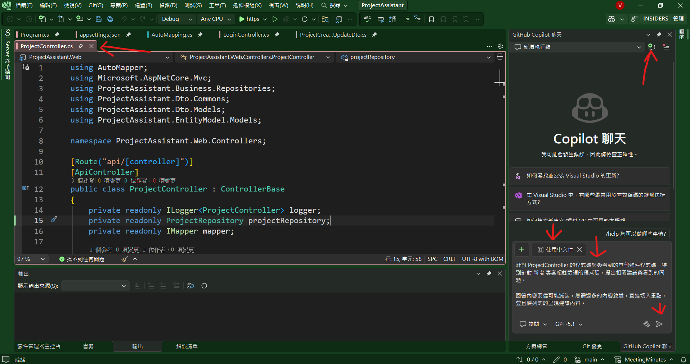
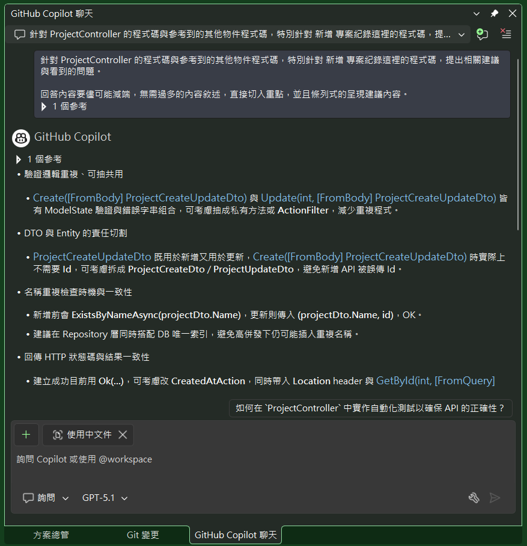

# Github Copilot 8 : 剖析Web API的程式碼並給出建議

現在要面對的又是一個棘手的問題，那就是身為一個程式開發者，在完成程式碼開發之後，如何能夠自行先來做程式碼的剖析與檢查，並且給出改善的建議呢？

在這個例子中，有個專案管理助手的系統，可以讓使用者建立不同的專案清單，輸入甘特圖與會議紀錄資訊，這是一個採用前後端分離的開發方式，前端採用 React 來開發，後端採用 ASP.NET Core Web API 來開發。

因此，身為後端開發者，將會面對到有許多的基本檔要進行 CRUD 的維護程式碼，而當寫好例如專案資料表的 CRUD Web API 之後，總覺得還欠缺甚麼，是否有哪邊設計的不完善，這樣的程式碼是否會造成日後不好維護的問題，甚至是否有甚麼設計模式可以來套用到這個控制器程式碼內，這些設計模式該如何使用，以及又會面對到其他的甚麼副作用，等等這樣一系列的疑問。

面對這樣的問題，這時候就可以利用Github Copilot 來協助我們完成這個任務。在這裡，我把我最近開發的專案小助手系統的專案程式碼，取出關於專案控制器內的新增這塊的程式碼，拿來讓 Github Copilot 來協助我進行程式碼的剖析與檢查，並且給出改善的建議。看看能夠與 Copilot 擦出甚麼燦爛的火花出來。

## Project 專案控制器的新增程式碼

在這裡的部分程式碼中，可以看到這個 [ProjectController] 專案控制器內，實作了一個 [Create] 的新增專案的 API 方法，這個方法會接收一個 [ProjectCreateUpdateDto] 的 DTO 物件，然後進行資料驗證、檢查專案名稱是否重複、將 DTO 轉換成 Entity、呼叫 Repository 來新增專案，最後再將新增完成的 Entity 轉換成 DTO 回傳給前端。

在建構式內，注入了 [ILogger]、[ProjectRepository] 與 [IMapper] 等相依物件，來協助進行日誌記錄、資料存取與物件映射等工作。

另外，為了維持這個系統 API 的使用一致性，回傳的結果都包裝在一個 [ApiResult<T>] 的泛型類別中，來統一回傳成功、驗證錯誤、衝突錯誤與伺服器錯誤等不同的結果。如此，可以讓前端在進行開發與處理 呼叫與回應 API 時，更加方便與一致。

對於資料庫存取的部分，也採用了一個 [ProjectRepository] 這樣的類別，來封裝與專案相關的資料存取邏輯。在這個類別中，有一個 [AddAsync] 的方法，負責將新的專案 Entity 新增到資料庫中，並且設定建立與更新的時間戳記。

對於資料模型部分，也設計了 DTO 這樣的資料模型與 Entity 資料模型，來分別處理前端與後端的資料交換與資料庫的存取，並且使用了 [AutoMapper] 這樣的套件來進行不同型別的物件來進行對應與轉換。

```csharp
[Route("api/[controller]")]
[ApiController]
public class ProjectController : ControllerBase
{
    private readonly ILogger<ProjectController> logger;
    private readonly ProjectRepository projectRepository;
    private readonly IMapper mapper;

    public ProjectController(ILogger<ProjectController> logger,
        ProjectRepository projectRepository,
        IMapper mapper)
    {
        this.logger = logger;
        this.projectRepository = projectRepository;
        this.mapper = mapper;
    }

    [HttpPost]
    public async Task<ActionResult<ApiResult<ProjectDto>>> Create([FromBody] ProjectCreateUpdateDto projectDto)
    {
        try
        {
            if (!ModelState.IsValid)
            {
                var errors = string.Join("; ", ModelState.Values
                    .SelectMany(v => v.Errors)
                    .Select(e => e.ErrorMessage));
                return BadRequest(ApiResult<ProjectDto>.ValidationError(errors));
            }

            // 檢查專案名稱是否重複
            if (await projectRepository.ExistsByNameAsync(projectDto.Name))
            {
                return Conflict(ApiResult<ProjectDto>.ConflictResult($"專案名稱 '{projectDto.Name}' 已存在"));
            }

            // DTO 轉 Entity
            var project = mapper.Map<Project>(projectDto);
            var createdProject = await projectRepository.AddAsync(project);

            // Entity 轉 DTO
            var createdProjectDto = mapper.Map<ProjectDto>(createdProject);
            return Ok(ApiResult<ProjectDto>.SuccessResult(createdProjectDto, "新增專案成功"));
        }
        catch (Exception ex)
        {
            logger.LogError(ex, "新增專案時發生錯誤");
            return StatusCode(500, ApiResult<ProjectDto>.ServerErrorResult("新增專案時發生錯誤", ex.Message));
        }
    }
}
```

對於 [ProjectRepository] 類別的部分，這個類別負責與資料庫進行互動，並且封裝了與專案相關的資料存取邏輯。在底下的程式碼，僅列出了這個類別中 [AddAsync] 的方法，從程式碼中，可以看出這個方法是負責將新的專案 Entity 新增到資料庫中，並且設定建立與更新的時間戳記。

```csharp
public class ProjectRepository
{
    private readonly BackendDBContext context;

    public ProjectRepository(BackendDBContext context)
    {
        this.context = context;
    }

    public async Task<Project> AddAsync(Project project)
    {
        project.CreatedAt = DateTime.Now;
        project.UpdatedAt = DateTime.Now;
        project.GanttChart = null; // 新增專案時不建立甘特圖   

        await context.Project.AddAsync(project);
        await context.SaveChangesAsync();

        return project;
    }
}
```

## 使用 Github Copilot 進行程式碼剖析與建議

* 使用 Visual Studio 開啟這個專案
* 開啟 [ProjectController] 類別，使其成為正在使用中的程式碼視窗
* 切換到 [Github Copilot 聊天] 視窗
* 建立一個新的聊天執行緒，這樣不會受到其他的聊天內容影響
* 這裡維持 [使用中文件] 的設定，讓 [Copilot] 可以直接參考到 [ProjectController] 類別的程式碼內容
* 在聊天視窗中，輸入以下的提示語：

```
針對 ProjectController 的程式碼與參考到的其他物件程式碼，特別針對 新增 專案紀錄這裡的程式碼，提出相關建議與看到的問題。

回答內容要儘可能減端，無需過多的內容敘述，直接切入重點，並且條列式的呈現建議內容。
```



* 按下 [傳送] 按鈕，等待 Copilot 回覆建議內容

## 觀察與分析 Copilot 給出的建議內容

* 稍微等候一段時間，就可以看到 Copilot 回覆了建議內容
* 底下將會摘要部分 Copilot 回應內容，並且說明後續可以進行的處置與動作。


* 從 Copilot 回覆的建議內容中，可以看到以下幾個重點建議：
* 驗證邏輯重複、可抽共用 : `Create` 與 `Update` 皆有 ModelState 驗證與錯誤字串組合，可考慮抽成私有方法或 `ActionFilter`，減少重複程式。
  > 從這裡可以看到一個問題，那就是每個 Controller 內，似乎還有過多重複的程式碼出現，這似乎會造成日後維護上的困難，畢竟，當程式碼越多且邏輯越複雜，必定會造成日後維護期間，理解這些程式碼的難度，當然，也會造成維護時間增加與效率降低，根據其建議，可以考慮將這些重複的程式碼，抽取成共用的方法或是 ActionFilter 來進行處理，這樣就能夠減少重複程式碼的出現。
  >
  > 這樣就又會產生一個問題，那就是這樣的共用方法或 ActionFilter，到底該怎麼設計與實作，這又是另一個需要思考的問題了。
  > 
  > 當然，第一時間除了爬文、看書、觀看影片來了解如何寫 ActionFilter 之外，這裡會想要使用 Copilot 來輔助完成這樣的設計，並且從生成的程式碼中，便可以間接來學習到 ActionFilter 的設計方式與實作細節。

* 名稱重複檢查時機與一致性 : 新增前會 `ExistsByNameAsync(projectDto.Name)`，更新則傳入 `(projectDto.Name, id)`，OK。建議在 Repository 層同時搭配 DB 唯一索引，避免高併發下仍可能插入重複名稱。
  > 這裡凸顯出當初設計這段程式碼所沒有觀察到的盲點，畢竟，這裡提出的問題，在某些情況下確實會發生的，而且一旦發生之後，會有可以無法在短時間內找到這樣的問題，因此，若能夠在一開始設計程式的時候，就把這些未來不確定因素事先排除掉，這樣就能夠避免日後發生這樣的問題。
  >
  > 在此看到了使用 [Github Copilot] 的好處，畢竟，Copilot 能夠從大量的程式碼中，學習到這些潛在的問題，並且提出建議，這樣就能夠讓開發者在設計程式碼的時候，更加完善。

* Repository 相依注入型別 : 目前直接依賴具體類別 `ProjectRepository`，建議改成介面 `IProjectRepository`，方便單元測試及替換實作。
  > 這是一個很好的建議，不過，這是基於一些考量才做出這樣的決定，雖然按照建議是可以得到更好的可維護性與高品質，但是，這是一個 MVP 類型的開發專案，而且有時間壓力，若改用這樣建議的設計方式，可能會增加開發時間與複雜度。

* AutoMapper 使用 : 若有欄位需要由後端產生（例如建立時間、建立人），應在 Entity or Repository 層處理，而不是只從 DTO 映射，避免客戶端可覆寫這些欄位。
  > 這是一個很好的建議，畢竟，開發者之前並沒有這樣的意識與能力做到這樣的建議，所以，這也是一個好的出發點，讓開發者自行挖掘出各項程式碼的問題與瓶頸，並且嘗試進行優化與改善若是讓前端可以直接傳入這些欄位的值，確實會有安全性上的疑慮，因此，若能夠在後端來處理這些欄位的值，這樣就能夠避免這樣的問題發生。

* ModelState 驗證位置 : 若專案其他 Controller 已使用 `ApiController` 自動模型驗證（會自動回 400），目前手動處理 `ModelState` 會不一致，可考慮統一使用框架預設行為，錯誤格式則靠 `InvalidModelStateResponseFactory` 客製。
  > 這也是一個很好的建議，畢竟，若能夠統一使用框架預設行為，這樣就能夠減少重複程式碼的出現，並且讓程式碼更加一致與易讀。不過，這位開發者目前還沒有嘗試過這樣的設計方式，因此，這也是一個需要學習與了解的地方。

## 結語

透過一個簡單的實驗，使用 Github Copilot 來協助進行程式碼的剖析與建議，發現了許多過去沒有注意到的問題與盲點，並且提出了許多改善的建議，這些建議不僅能夠提升程式碼的品質與可維護性，也能夠讓開發者在設計程式碼時，更加完善與周全。

總之，Github Copilot 不僅是一個程式碼生成的工具，更是一個能夠協助開發者進行程式碼審查與建議的好幫手。未來，期待能夠在更多的開發場景中，看到 Copilot 的身影，並且從中獲得更多的啟發與幫助。