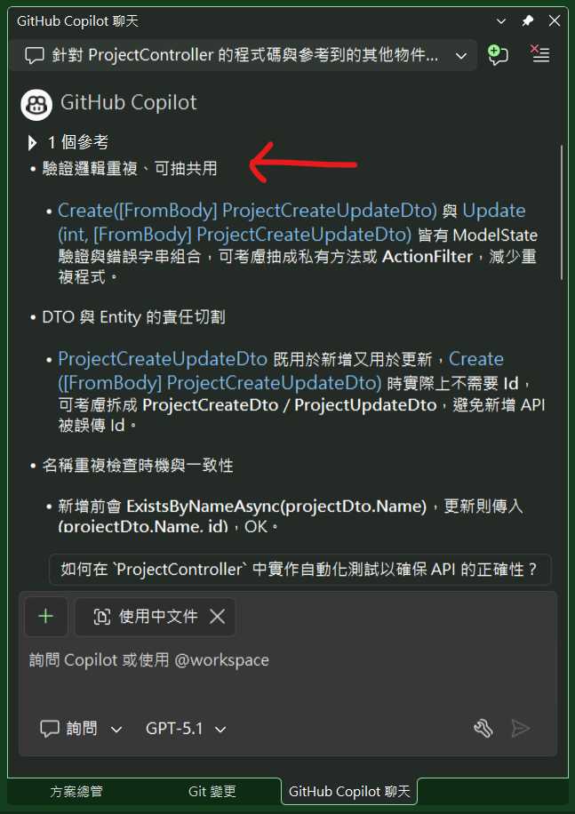
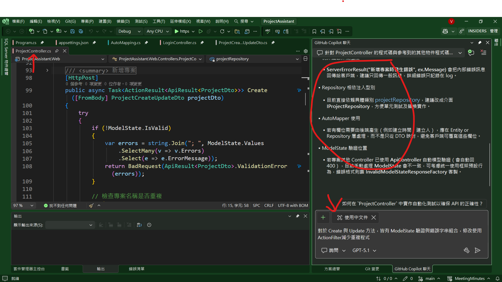
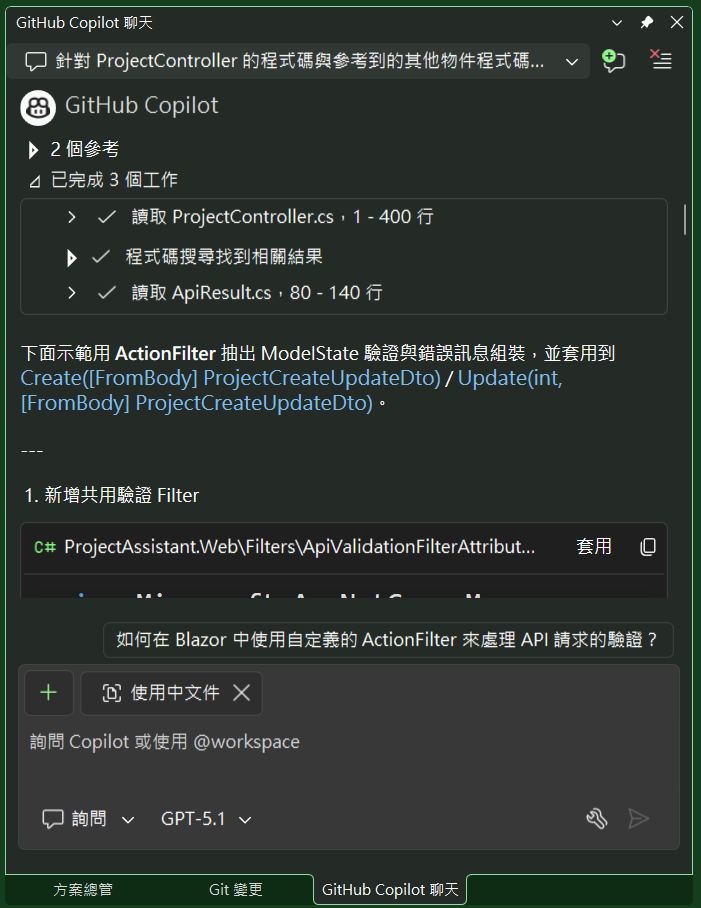
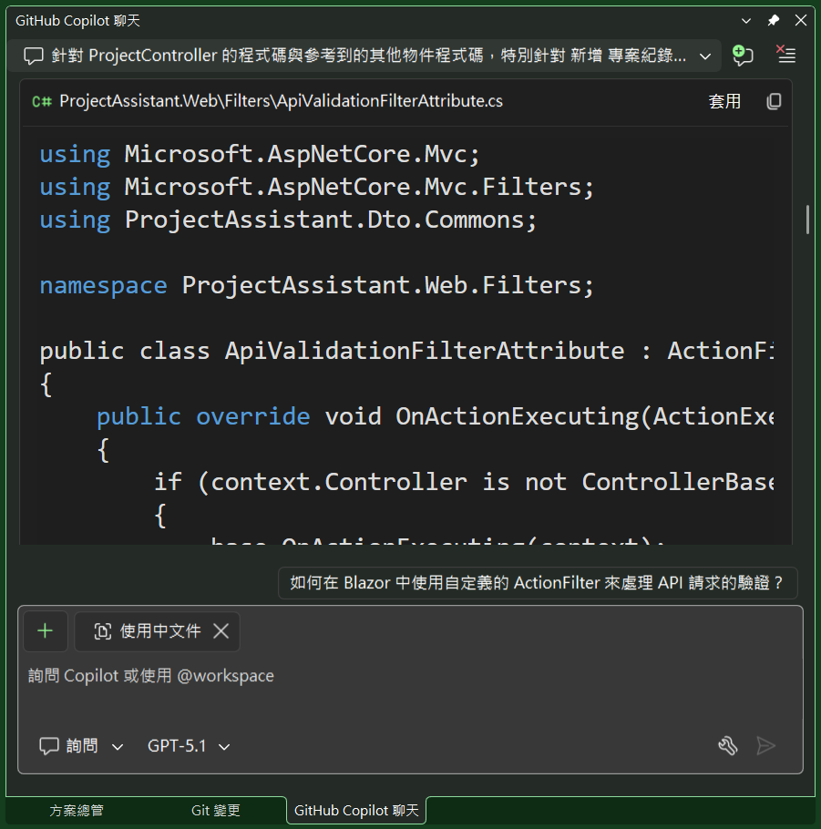
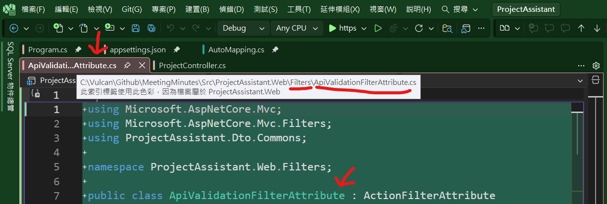
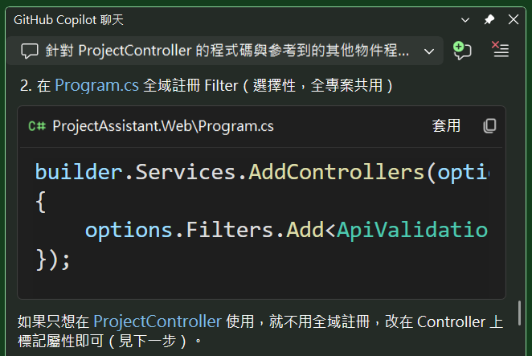
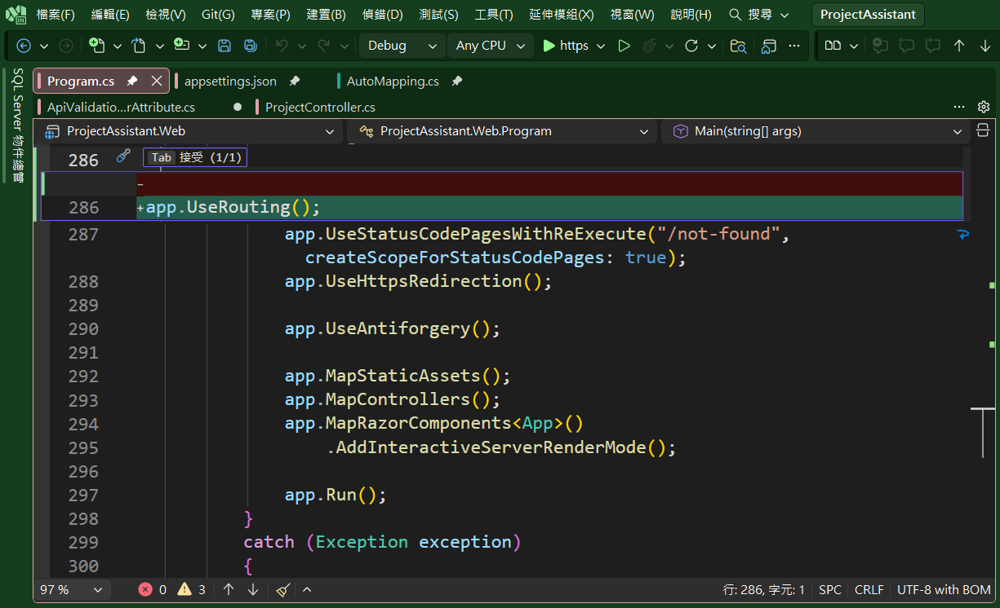
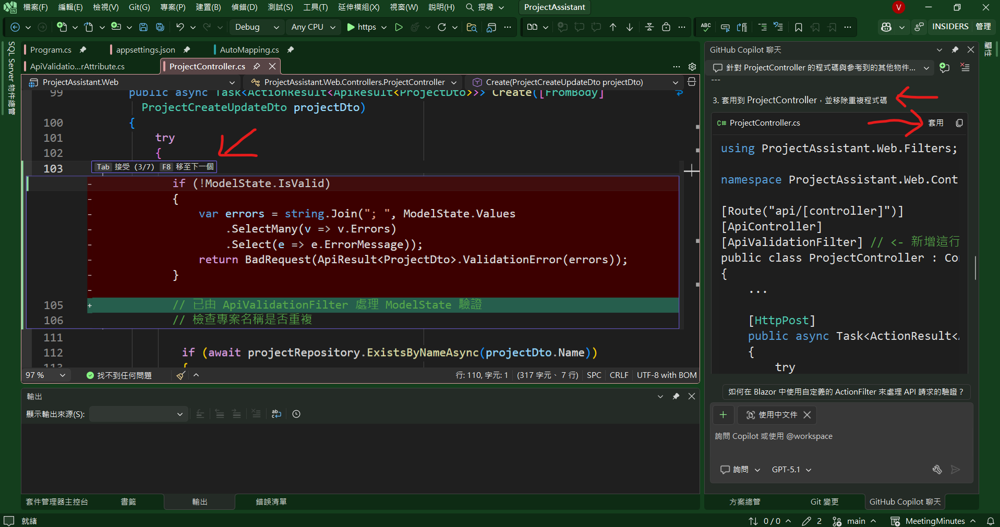

# Github Copilot 9 : 修改使用ActionFilter減少重複程式

在上一篇 [Github Copilot 8 : 剖析Web API的程式碼並給出建議](https://csharpkh.blogspot.com/2025/12/Github-Copilot-8-Web20API.html) 文章中，提到了讓 Github Copilot 來協助我進行程式碼的剖析與檢查，並且給出改善的建議，並且看到不少不錯的建議，有些建議甚至可以直接套用到我的專案程式碼中，又或者這裡提到的技術，是程式設計師已經知道，此時，僅需要依照建議繼續往下修正即可，可是，有些建議，則是並不熟悉的技術，甚至不知道該如何著手，面對時間的壓力與工作量的增加，這時候該如何是好呢？

這裡根據上篇文章提到的 Github Copilot 所給出的建議清單中，選擇了一個不孰悉技術來進行修改，那就是關於 使用 ActionFilter 來減少重複程式碼 的部分。

而 [Github Copilot] 所給出的建議內容如下

>- 驗證邏輯重複、可抽共用  
>  - `Create` 與 `Update` 皆有 ModelState 驗證與錯誤字串組合，可考慮>抽成私有方法或 `ActionFilter`，減少重複程式。



在這裡，假設不知道甚麼是 ActionFilter 的話，但是，建議還是在完成程式碼修正之後，可以參考 Microsoft 官方文件中，關於 [ASP.NET Core 中的篩選條件](https://learn.microsoft.com/zh-tw/aspnet/core/mvc/controllers/filters?view=aspnetcore-10.0) 的說明，去了解更多這方面的技術原理與應用方式。

在這篇文章中提到了底下內容

> ASP.NET Core 中的篩選條件可讓程式碼在要求處理管線中的特定階段之前或之後執行。
> 
> 內建篩選器處理的工作包括：
> 
> 授權，避免存取使用者未獲授權的資源。
> 回應快取，縮短要求管線，傳回快取的回應。
> 可以建立自訂篩選條件來處理跨領域關注。 跨領域關注的範例包括錯誤處理、快取、設定、授> 權及記錄。 篩選能避免重複的程式碼。 例如，錯誤處理的例外篩選器可以統一處理錯誤。

因此，ActionFilter 的使用應該滿適合來解決這樣的問題，可以將重複的程式碼邏輯，抽離出來，放到一個共用的類別中，然後在需要的地方套用這個 ActionFilter，就可以達到減少重複程式碼的目的。

## 現有程式碼

這裡是原有關於 Create 與 Update 的方法程式碼

```csharp
[HttpPost]
public async Task<ActionResult<ApiResult<ProjectDto>>> Create([FromBody] ProjectCreateUpdateDto projectDto)
{
    try
    {
        if (!ModelState.IsValid)
        {
            var errors = string.Join("; ", ModelState.Values
                .SelectMany(v => v.Errors)
                .Select(e => e.ErrorMessage));
            return BadRequest(ApiResult<ProjectDto>.ValidationError(errors));
        }

        // 檢查專案名稱是否重複
        if (await projectRepository.ExistsByNameAsync(projectDto.Name))
        {
            return Conflict(ApiResult<ProjectDto>.ConflictResult($"專案名稱 '{projectDto.Name}' 已存在"));
        }

        // DTO 轉 Entity
        var project = mapper.Map<Project>(projectDto);
        var createdProject = await projectRepository.AddAsync(project);

        // Entity 轉 DTO
        var createdProjectDto = mapper.Map<ProjectDto>(createdProject);
        return Ok(ApiResult<ProjectDto>.SuccessResult(createdProjectDto, "新增專案成功"));
    }
    catch (Exception ex)
    {
        logger.LogError(ex, "新增專案時發生錯誤");
        return StatusCode(500, ApiResult<ProjectDto>.ServerErrorResult("新增專案時發生錯誤", ex.Message));
    }
}

[HttpPut("{id}")]
public async Task<ActionResult<ApiResult>> Update(int id, [FromBody] ProjectCreateUpdateDto projectDto)
{
    try
    {
        if (!ModelState.IsValid)
        {
            var errors = string.Join("; ", ModelState.Values
                .SelectMany(v => v.Errors)
                .Select(e => e.ErrorMessage));
            return BadRequest(ApiResult.ValidationError(errors));
        }

        if (id != projectDto.Id)
        {
            return BadRequest(ApiResult.ValidationError("路由 ID 與專案 ID 不符"));
        }

        // 檢查專案名稱是否與其他專案重複
        if (await projectRepository.ExistsByNameAsync(projectDto.Name, id))
        {
            return Conflict(ApiResult.ConflictResult($"專案名稱 '{projectDto.Name}' 已被其他專案使用"));
        }

        // DTO 轉 Entity
        var project = mapper.Map<Project>(projectDto);
        var success = await projectRepository.UpdateAsync(project);

        if (!success)
        {
            return NotFound(ApiResult.NotFoundResult($"找不到 ID 為 {id} 的專案"));
        }

        return Ok(ApiResult.SuccessResult("更新專案成功"));
    }
    catch (Exception ex)
    {
        logger.LogError(ex, "更新專案 ID {Id} 時發生錯誤", id);
        return StatusCode(500, ApiResult.ServerErrorResult("更新專案時發生錯誤", ex.Message));
    }
}
```

從上述的 Create & Update 方法中，可以看到有重複的 ModelState 驗證邏輯，這部分可以考慮使用 ActionFilter 來進行抽離與共用。

```csharp
if (!ModelState.IsValid)
{
    var errors = string.Join("; ", ModelState.Values
        .SelectMany(v => v.Errors)
        .Select(e => e.ErrorMessage));
    return BadRequest(ApiResult<ProjectDto>.ValidationError(errors));
}
```


```
對於 Create 與 Update 方法，皆有 ModelState 驗證與錯誤字串組合，修改使用ActionFilter減少重複程式
```
## 使用 Github Copilot 來修改程式碼

* 在這裡切換到 [Github Copilot 聊天] 視窗
* 在此將不用建立一個新的聊天視窗，而是直接在之前的聊天視窗中，繼續進行對話，其目的是要將上次的對話內容，作為新對話內容的 Context 一部分。
* 在輸入框中，輸入底下的內容

```
對於 Create 與 Update 方法，皆有 ModelState 驗證與錯誤字串組合，修改使用ActionFilter減少重複程式
```
* 最終結果如下圖截圖
* 按下 Enter 鍵送出訊息


* 現在可以看到 [Github Copilot 聊天] 視窗中，顯示了他讀取了兩個參考，其中提到的參考中兩個檔案，分別是 [ProjectController.cs] 與 [APIResult.cs]，並且完成了三個工作
  * 讀取 ProjectController.cs 1-400行
  * 程式碼搜尋找到相關結果
  * 讀取 APIResult.cs 80-140行
  


* 接著，往下捲動到第一點，關於 建立 ApiValidationFilterAttribute 類別 的區域



* 現在點選關於 [ApiValidationFilterAttribute] 的 [套用] 按鈕，讓 Copilot 自動幫我們修改程式碼。



* 接著在 [ApiValidationFilterAttribute] 視窗中，按下 [Tab] 按鍵，讓 Copilot 自動幫我們產生程式碼。

* 此時，在方案總管視窗內，將會看到 [ApiValidationFilterAttribute.cs] 目錄與檔案產生出來了


* 底下是這個程式碼檔案的內容
* 這裡說明這個新類別的功能
  * 這個 `ApiValidationFilterAttribute` 是一個動作前  置篩選器，用來在 Controller Action 執行前檢查   `ModelState` 是否通過驗證。  
  * 如果模型驗證失敗，就把所有錯誤訊息用 `"; "` 串成一  個字串 `errors`。  
  * 若 Action 的回傳型別是   `ActionResult<ApiResult<T>>`，會用反射呼叫泛型方法，  建立對應 `T` 型別的 `ApiResult<T>.ValidationError  (errors)`，並回傳 400   (`BadRequestObjectResult`)。  
  * 若無法判斷為泛型 `ApiResult<T>`，則退回使用非泛型   `ApiResult.ValidationError(errors)` 包成   `BadRequestObjectResult` 當作回應。

```csharp
using Microsoft.AspNetCore.Mvc;
using Microsoft.AspNetCore.Mvc.Filters;
using ProjectAssistant.Dto.Commons;

namespace ProjectAssistant.Web.Filters;

public class ApiValidationFilterAttribute : ActionFilterAttribute
{
    public override void OnActionExecuting(ActionExecutingContext context)
    {
        if (context.Controller is not ControllerBase controllerBase)
        {
            base.OnActionExecuting(context);
            return;
        }

        var modelState = controllerBase.ModelState;
        if (modelState.IsValid)
        {
            base.OnActionExecuting(context);
            return;
        }

        var errors = string.Join("; ", modelState.Values
            .SelectMany(v => v.Errors)
            .Select(e => e.ErrorMessage));

        // 根據回傳型別決定 ApiResult 泛型
        // 這裡假設 Create 回傳 ApiResult<ProjectDto>、Update 回傳 ApiResult
        var returnType = (context.ActionDescriptor as Microsoft.AspNetCore.Mvc.Controllers.ControllerActionDescriptor)?
            .MethodInfo.ReturnType;

        if (returnType?.IsGenericType == true &&
            returnType.GetGenericTypeDefinition() == typeof(ActionResult<>))
        {
            var innerType = returnType.GetGenericArguments()[0];
            if (innerType.IsGenericType &&
                innerType.GetGenericTypeDefinition() == typeof(ApiResult<>))
            {
                var apiResultGenericType = innerType.GetGenericArguments()[0];
                var genericMethod = typeof(ApiValidationFilterAttribute)
                    .GetMethod(nameof(CreateGenericValidationResult), System.Reflection.BindingFlags.NonPublic | System.Reflection.BindingFlags.Static)!
                    .MakeGenericMethod(apiResultGenericType);

                var result = (IActionResult)genericMethod.Invoke(null, new object[] { errors })!;
                context.Result = result;
                return;
            }
        }

        // 非泛型 ApiResult 或推斷失敗時走這裡
        context.Result = new BadRequestObjectResult(ApiResult.ValidationError(errors));
    }

    private static IActionResult CreateGenericValidationResult<T>(string errors)
    {
        return new BadRequestObjectResult(ApiResult<T>.ValidationError(errors));
    }
}
```

* 繼續回到 [Github Copilot 聊天] 視窗中
* 往下捲動到第二點，關於 在 [Program.cs] 全域註冊 Filter 的區域



* 點選 [Program.cs] 的 [套用] 按鈕，讓 Copilot 自動幫我們修改程式碼
* 在 Visual Studio 內，會自動開啟 [Program.cs] 檔案，並且將游標定位在剛剛修改的程式碼區域



* 這裡似乎是 Github Copilot 發生問題，他要自動套用的程式碼與說明的不相同。
* 因此，點選 [複製程式碼區塊] 按鈕，將程式碼複製起來
* 然後手動貼到 [Program.cs] 的適當位置

```csharp
builder.Services.AddControllers(options =>
{
    options.Filters.Add<ApiValidationFilterAttribute>();
});
```

* 接著，回到 [Github Copilot 聊天] 視窗中
* 往下捲動到第三點，關於 套用到 ProjectController，並移除重複程式碼
* 點選 [ProjectController.cs] 的 [套用] 按鈕，讓 Copilot 自動幫我們修改程式碼
* 在 Visual Studio 內，會自動開啟 [ProjectController.cs] 檔案，並且將游標定位在剛剛修改的程式碼區域
* 在 [ProjectController.cs] 檔案中，逐步按下 [Tab] 按鍵，讓 Copilot 自動幫我們產生程式碼



* 這裡工作了七次的修正，完成了 [projectController.cs] 檔案修改
* 在此已經完成了，統一模型驗證邏輯至 ApiValidationFilterAttribute，將 ModelState 驗證抽離至 ApiValidationFilterAttribute，並於 Program.cs 註冊為全域過濾器。移除 ProjectController 內重複的驗證程式碼，確保所有 API 回傳一致的驗證錯誤格式，提升維護性與一致性。

