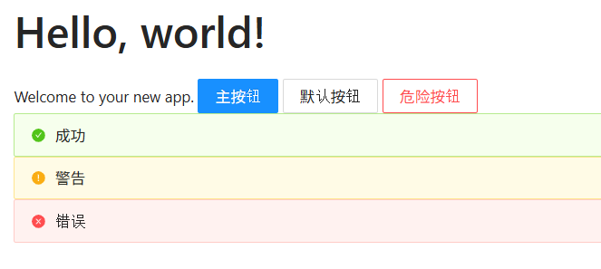
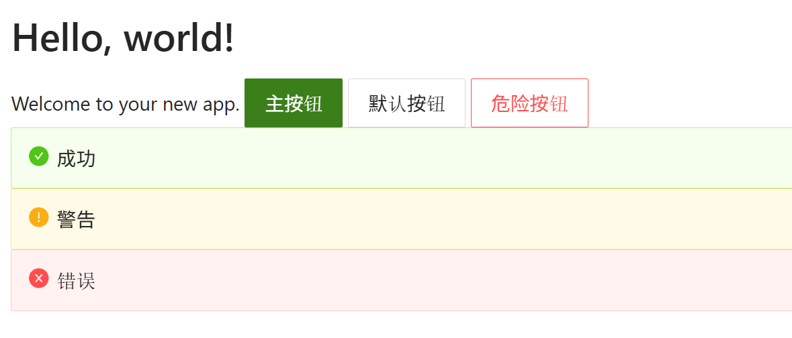

# Blazor 使用 Ant Design Blazor 自訂主題範例

當在使用 AntDesign for Blazor 這個套件時，預設的主題是基於 Ant Design 的預設主題，但有時候我們可能會想要自訂主題以符合我們的品牌或設計需求。幸運的是，AntDesign for Blazor 提供了簡單的方式來自訂主題。

例如，底下的畫面是使用 AntDesign for Blazor 的預設主題所呈現的畫面：



現在想要變更原有的預設主題，

## 建立 Blazor 專案
* 開啟 Visual Studio 2026
* 選擇「建立新專案」
* 在 [建立新專案] 視窗中，在右方清單內，找到並選擇「Blazor Web 應用程式」 項目
* 然後點擊右下方「下一步」按鈕
* 此時將會看到 [設定新的專案] 對話窗
* 在該對話窗的 [專案名稱] 欄位中，輸入專案名稱，例如 [csBlazorCustomTheme]
* 然後點擊右下方「下一步」按鈕
* 接著會看到 [其他資訊] 對話窗
* 在這個對話窗內，確認使用底下的選項
    * 架構：.NET 10.0 (或更新版本)
    * 驗證類型：無
    * 勾選 針對 HTTPS 進行設定
    * 互動式轉譯模式：伺服器
    * 互動功能位置：全球
    * 勾選 包和範例頁面
    * 勾選 不要使用最上層陳述式 (這是我的個人習慣)
    * 不要勾選 在應用程式 URL 中使用 .dev.localhost TLD
    * 不要勾選 在 .NET Aspire 協調流程中登錄
* 然後點擊右下方「建立」按鈕
* 現在，已經完成了這個 Blazor 專案的建立

## 安裝 AntDesign 套件

套件 AntDesign 是一個流行的 UI 組件庫，提供了許多現成的 UI 元件，可以幫助開發者快速建立美觀且功能豐富的使用者介面。在這個專案中，我們將使用 AntDesign Blazor 這個套件來實現自訂主題的功能。

使用底下方式進行安裝此套件

* 在 Visual Studio 的「方案總管」視窗中，右鍵點擊專案名稱
* 從右鍵選單中，選擇「管理 NuGet 套件」
* 在 NuGet 套件管理器視窗中，切換到「瀏覽」標籤頁
* 在搜尋框中，輸入 "AntDesign" 並按下 Enter 鍵
* 從搜尋結果中，找到 "AntDesign" 套件 並點擊它
* 在這裡的範例中，使用該套件的版本為 1.5.0
* 在右側的詳細資訊面板中，點擊「安裝」按鈕

## 建立客製的主題

* 在專案的根目錄下，建立一個新的資料夾，命名為 "wwwroot"
* 在 "wwwroot" 資料夾內，建立一個新的 CSS 檔案，命名為 "site.css"
* 在 "site.css" 檔案中，加入以下 CSS 內容：

```css
:root {
    --ant-primary-color: #3b7f1a;
    --ant-primary-color-hover: #2b5814;
    --ant-primary-color-active: #3b7f1a;
    --ant-link-color: #1DA57A;
    --ant-success-color: #3b7f1a;
    --ant-warning-color: #9714fa;
    --ant-error-color: #ff6a00;
    --ant-font-size-base: 24px;
    --ant-line-height-base: 1.8;
    --ant-border-radius-base: 8px;
    /* 標題字體大小 (基於 24px) */
    --ant-font-size-h1: 48px; /* 2倍 */
    --ant-font-size-h2: 38px; /* 1.6倍 */
    --ant-font-size-h3: 31px; /* 1.3倍 */
    --ant-padding-xs: 10px;
    --ant-padding-sm: 12px;
    --ant-padding-md: 20px;
    --ant-padding-lg: 32px;
}

h1 {
    font-size: var(--ant-font-size-h1);
    line-height: 1.4;
    margin-bottom: 20px;
}

h2 {
    font-size: var(--ant-font-size-h2);
    line-height: 1.4;
}

h3 {
    font-size: var(--ant-font-size-h3);
    line-height: 1.5;
}

.ant-btn,
.ant-btn-default,
.ant-btn-primary,
.ant-btn-dashed,
.ant-btn-link,
.ant-btn-text,
.ant-btn-dangerous {
    font-size: var(--ant-font-size-base);
    padding: 8px 24px;
    height: auto;
    min-height: 48px;
    line-height: var(--ant-line-height-base);
}

.ant-btn-primary {
    background-color: var(--ant-primary-color);
    border-color: var(--ant-primary-color);
}

.ant-btn-primary:hover {
    background-color: var(--ant-primary-color-hover);
    border-color: var(--ant-primary-color-hover);
}

.ant-alert {
    font-size: var(--ant-font-size-base);
    padding: 12px 20px;
    line-height: var(--ant-line-height-base);
}

.ant-alert-message {
    font-size: var(--ant-font-size-base);
    line-height: var(--ant-line-height-base);
}

.ant-alert-icon {
    font-size: 28px;  /* 圖示稍大於文字 */
    line-height: 1.8;
}

.ant-alert-with-description {
    padding: 16px 24px;
}

.ant-alert-description {
    font-size: 20px;  /* 描述文字稍小 */
}

.ant-input,
.ant-select-selector,
.ant-picker {
    font-size: var(--ant-font-size-base);
    padding: 8px 16px;
    line-height: var(--ant-line-height-base);
}

body,
p,
span,
div {
    font-size: var(--ant-font-size-base);
    line-height: var(--ant-line-height-base);

```

* 在專案根目錄下，找到 [App.razor] 檔案，並打開它
* 在 [App.razor] 檔案中
* 找到 `</head>` 加入以下程式碼：

```html
<link href="css/site.css" rel="stylesheet" />
```

## 設定 AntDesign 

* 在專案根目錄下，找到 [App.razor] 檔案，並打開它
* 在 [App.razor] 檔案中
* 找到 `</head>` 加入以下程式碼：

```html
<link href="_content/AntDesign/css/ant-design-blazor.css" rel="stylesheet">
```

* 在 [App.razor] 檔案中
* 找到 `</body>` 加入以下程式碼：

```html
<script src="_content/AntDesign/js/ant-design-blazor.js"></script> 
<script antblazor-js></script>
```

## 修正 Component 頁面

* 在專案根目錄下，找到 [Components] > [Pages] 目錄下
* 找到並且打開 [Home.razor] 檔案
* 在 [Home.razor] 檔案中，將原有的內容全，使用底下程式碼取代：

```razor
@page "/"

<PageTitle>Home</PageTitle>

<h1>Hello, world!</h1>

Welcome to your new app.

<Button Type="@ButtonType.Primary">主按钮</Button>
<Button Type="@ButtonType.Default">默认按钮</Button>
<Button Danger>危险按钮</Button>

<Alert Message="成功" Type="AlertType.Success" ShowIcon="true" />
<Alert Message="警告" Type="AlertType.Warning" ShowIcon="true" />
<Alert Message="错误" Type="AlertType.Error" ShowIcon="true" />
```

## 執行程式

首先先來看這個專案的執行結果：

* 按下 F5 鍵或點擊「開始」按鈕來執行程式
* 現在將會看到底下畫面

