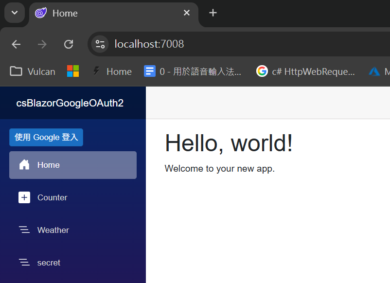
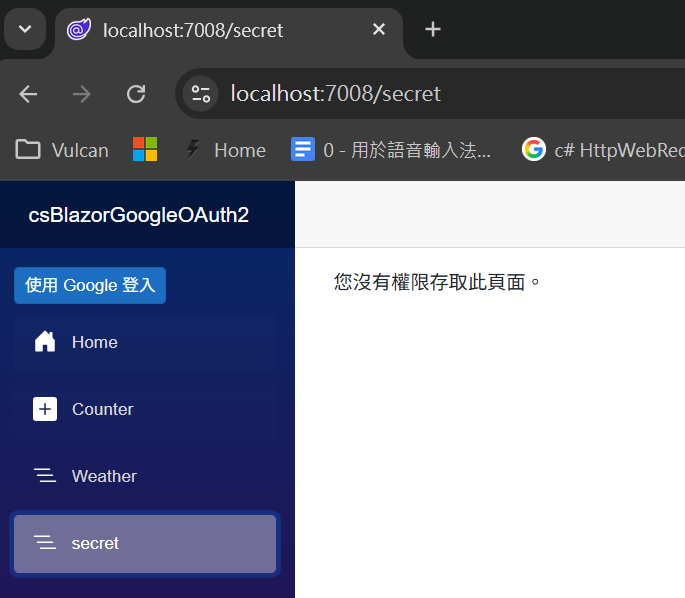
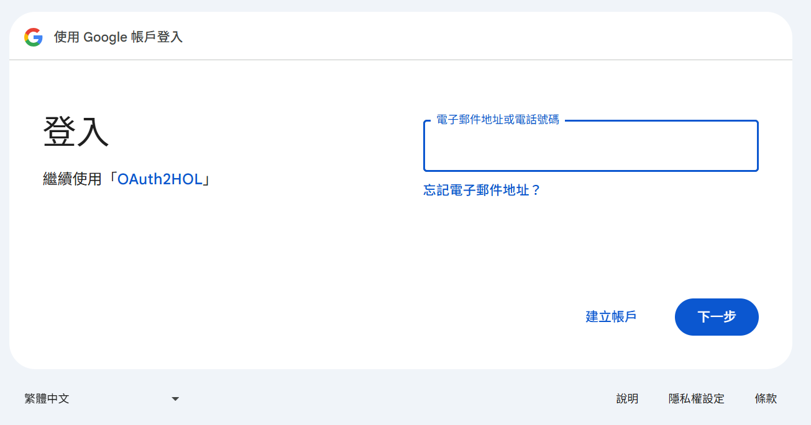
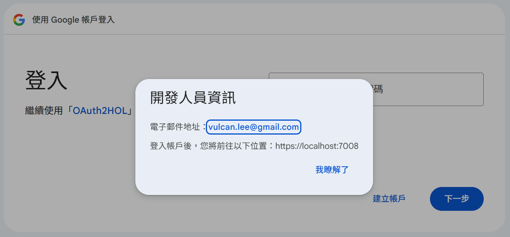
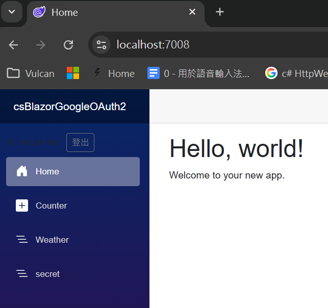
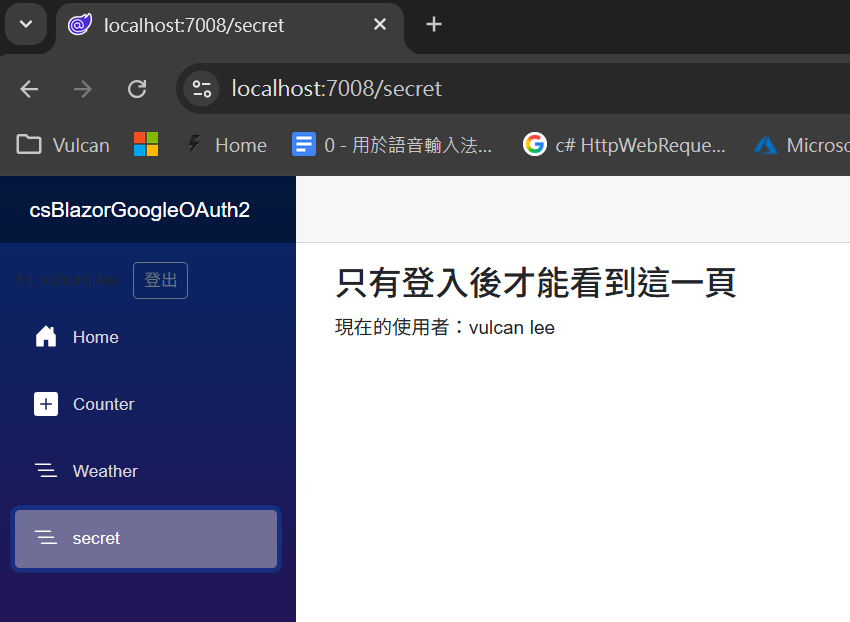

# React 使用 Google OAuth 2.0

在這篇文章中，我們將會建立一個 React Web 應用程式，並且使用 Google OAuth 2.0 來實現使用者的登入功能。這樣使用者就可以使用他們的 Google 帳號來登入我們的應用程式，並且在登入後看到一些受保護的內容。

## 建立 Blazor 專案
* 開啟 Visual Studio 2026
* 選擇「建立新專案」
* 在 [建立新專案] 視窗中，在右方清單內，找到並選擇「Blazor Web 應用程式」 項目
* 然後點擊右下方「下一步」按鈕
* 此時將會看到 [設定新的專案] 對話窗
* 在該對話窗的 [專案名稱] 欄位中，輸入專案名稱，例如 [csBlazorGoogleOAuth2]
* 然後點擊右下方「下一步」按鈕
* 接著會看到 [其他資訊] 對話窗
* 在這個對話窗內，確認使用底下的選項
    * 架構：.NET 10.0 (或更新版本)
    * 驗證類型：無
    * 勾選 針對 HTTPS 進行設定
    * 互動式轉譯模式：伺服器
    * 互動功能位置：全球
    * 勾選 包和範例頁面
    * 勾選 不要使用最上層陳述式 (這是我的個人習慣)
    * 不要勾選 在應用程式 URL 中使用 .dev.localhost TLD
    * 不要勾選 在 .NET Aspire 協調流程中登錄
* 然後點擊右下方「建立」按鈕
* 現在，已經完成了這個 Blazor 專案的建立

## 建立一個展示授權保護的頁面內容元件

* 在專案的 [Components] > [Pages] 資料夾上
* 點擊滑鼠右鍵，選擇 [加入] > [新增項目]
* 在彈出的對話窗中，選擇 [Razor 元件] 項目，將元件命名為 [Secret.razor]，然後點擊「新增」按鈕
* 在 [Secret.razor] 的程式碼區塊內，輸入底下的程式碼：

```razor
@page "/secret"
@using Microsoft.AspNetCore.Authorization
@attribute [Authorize]

<h3>只有登入後才能看到這一頁</h3>

<AuthorizeView>
    <Authorized>
        <p>現在的使用者：@context.User.Identity?.Name</p>
    </Authorized>
    <NotAuthorized>
        <p>尚未登入。</p>
    </NotAuthorized>
</AuthorizeView>
```

這個元件的用途在於展示一個受授權保護的頁面內容，只有當使用者登入後才能看到這個頁面。首先使用了 [@page] 指示詞來定義這個元件的路由為 "/secret"，這樣當使用者訪問這個 URL 時，就會顯示這個元件的內容。接著使用了 [@using] 指示詞來引入 [Microsoft.AspNetCore.Authorization] 命名空間，這樣就可以使用其中的授權相關功能了。然後使用了 [@attribute] 指示詞來添加了 [Authorize] 屬性，這表示這個頁面需要授權才能訪問。在 UI 內容的部分，使用了 [AuthorizeView] 元件來根據使用者的授權狀態顯示不同的內容。如果使用者已經授權（已登入），則會顯示一個段落，內容是當前使用者的名稱；如果使用者尚未授權（未登入），則會顯示一個段落，提示使用者尚未登入。


## 建立登入元件

* 在專案的 [Components] 資料夾上，點擊滑鼠右鍵，選擇「新增」->「Razor 元件」
* 在彈出的對話窗中，將元件命名為 [LoginDisplay.razor]，然後點擊「新增」按鈕
* 在 [LoginDisplay.razor] 的程式碼區塊內，輸入底下的程式碼：

```razor
@using Microsoft.AspNetCore.Components.Authorization
@inject NavigationManager Nav

@{
	var returnUrl = Nav.ToBaseRelativePath(Nav.Uri);
}
<AuthorizeView>
    <Authorized>
        <span class="me-2">Hi, @context.User.Identity?.Name</span>
        <form method="post" action="/logout" class="d-inline">
            <button type="submit" class="btn btn-sm btn-outline-secondary">登出</button>
        </form>
    </Authorized>
    <NotAuthorized>
        <a class="btn btn-sm btn-primary" href="/login?returnUrl=@Nav.ToBaseRelativePath(Nav.Uri)">使用 Google 登入</a>
    </NotAuthorized>
</AuthorizeView>
```

在這個元件內，首先使用 [@using] 指示詞來引入 [Microsoft.AspNetCore.Components.Authorization] 命名空間，這樣就可以使用其中的授權相關功能了。接著使用 [@inject] 指示詞來注入 [NavigationManager] 服務，這個服務可以幫助我們獲取當前的 URL 和進行導航。

在元件的程式碼區塊內，我們定義了一個變數 [returnUrl]，它的值是當前 URL 的相對路徑。這個變數將會在登入連結中使用，當使用者點擊登入按鈕後，系統會將他們重定向回原本的頁面。

在 UI 內容的部分，使用了 [AuthorizeView] 元件來根據使用者的授權狀態顯示不同的內容。如果使用者已經授權（已登入），則會顯示一個歡迎訊息和一個登出按鈕；如果使用者尚未授權（未登入），則會顯示一個登入按鈕，點擊後會將使用者導向到登入頁面，並帶上 [returnUrl] 參數，以便在登入成功後能夠返回原本的頁面。

## 修正側邊功能表 Sidebar

* 從專案節點內，找到 [Components] > [Layout] 資料夾
* 找到並且打開 [NavMenu.razor] 檔案
* 找到這個標記內容 `<nav class="nav flex-column">`
* 在這個標記內容的後面，加入底下的程式碼：

```razor
<div class="nav-item px-3">
    <LoginDisplay/>
</div>
```

這段程式碼的作用是在側邊功能表中加入我們剛剛建立的 [LoginDisplay] 元件，這樣使用者就可以在側邊功能表中看到登入或登出的選項了。

* 找到 `</nav>` 的標記內容
* 在這個標記內容的前面，加入底下的程式碼：

```razor
<div class="nav-item px-3">
    <NavLink class="nav-link" href="secret">
        <span class="bi bi-list-nested-nav-menu" aria-hidden="true"></span> secret
    </NavLink>
</div>
```

## 新增設定服務

* 滑鼠右擊專案的根目錄
* 選擇 [加入] > [新增資料夾]
* 將資料夾命名為 [Services]
* 在 [Services] 資料夾上，點擊滑鼠右鍵，選擇 [加入] > [新增項目]
* 在彈出的對話窗中，選擇 [類別] 項目，將類別命名為 [ConfigurationService.cs]，然後點擊「新增」按鈕
  >這裡將會使用 [顯示精簡檢視] 的方式來選擇類別項目，這樣就不會被其他的類別項目給干擾了
* 在 [ConfigurationService.cs] 的程式碼區塊內，輸入底下的程式碼：

```csharp
namespace csBlazorGoogleOAuth2.Services;

public class ConfigurationService
{
    public string ClientId { get; set; } = "apps.googleusercontent.com";
    public string ClientSecret { get; set; } = "";
}
```

這裡的服務將會提供兩個字串，分別用於存儲 Google OAuth 2.0 的 Client ID 和 Client Secret，這些值是從 Google API Console 中獲取的，並且在後續的程式碼中會使用這些值來設定 Google 驗證的相關選項。

## 修正 OAuth2 需要用到的程式碼
* 從專案跟目錄下，找到並打開 [Program.cs] 檔案
* 在 [Program.cs] 的程式碼區塊內，使用底下程式碼來取代原本的程式碼：

```csharp
using csBlazorGoogleOAuth2.Components;
using csBlazorGoogleOAuth2.Services;
using Microsoft.AspNetCore.Authentication;
using Microsoft.AspNetCore.Authentication.Cookies;
using Microsoft.AspNetCore.Authentication.Google;
using System.Security.Claims;

namespace csBlazorGoogleOAuth2;

public class Program
{
    public static void Main(string[] args)
    {
        var builder = WebApplication.CreateBuilder(args);

        builder.Services.AddRazorComponents()
            .AddInteractiveServerComponents();
        builder.Services.AddSingleton<ConfigurationService>();
        var configService = builder.Services.BuildServiceProvider().GetRequiredService<ConfigurationService>();
        builder.Services.AddAuthentication(options =>
        {
            options.DefaultScheme = CookieAuthenticationDefaults.AuthenticationScheme;
            options.DefaultChallengeScheme = GoogleDefaults.AuthenticationScheme; // 預設以 Google 發起挑戰
        })
        .AddCookie(CookieAuthenticationDefaults.AuthenticationScheme, options =>
        {
            options.LoginPath = "/login";
            options.LogoutPath = "/logout";
            options.AccessDeniedPath = "/denied";
            options.SlidingExpiration = true;
            options.ExpireTimeSpan = TimeSpan.FromDays(7); // 可依需求調整
        })
        .AddGoogle(options =>
        {
            options.ClientId = configService.ClientId;
            options.ClientSecret = configService.ClientSecret;
            options.Scope.Add("openid");
            options.Scope.Add("profile");
            option
s.Scope.Add("email");
            options.SaveTokens = true; // 存 access_token / refresh_token（如有）到 auth properties
            options.ClaimActions.MapJsonKey(ClaimTypes.GivenName, "given_name");
            options.ClaimActions.MapJsonKey(ClaimTypes.Surname, "family_name");
            options.ClaimActions.MapJsonKey(ClaimTypes.NameIdentifier, "sub");

        });

        builder.Services.AddAuthorization();
        builder.Services.AddCascadingAuthenticationState();

        var app = builder.Build();

        if (!app.Environment.IsDevelopment())
        {
            app.UseExceptionHandler("/Error");
            app.UseHsts();
        }

        app.UseHttpsRedirection();

        app.UseAntiforgery();

        app.MapStaticAssets();

        app.UseAuthentication();
        app.UseAuthorization();

        app.MapGet("/login", async context =>
        {
            var returnUrl = context.Request.Query["returnUrl"].ToString();
            if (string.IsNullOrEmpty(returnUrl)) returnUrl = "/";

            var props = new AuthenticationProperties
            {
                RedirectUri = returnUrl,
                Items =
                {
                    { "prompt", "select_account" } // 強制顯示帳號選擇畫面
                }
            };
            await context.ChallengeAsync(GoogleDefaults.AuthenticationScheme, props);
        });

        app.MapPost("/logout", async context =>
        {
            await context.SignOutAsync(CookieAuthenticationDefaults.AuthenticationScheme);
            context.Response.Redirect("/");
        });

        app.MapGet("/denied", () => Results.Content("Access Denied"));

        app.MapRazorComponents<App>()
            .AddInteractiveServerRenderMode();

        app.Run();
    }
}
```

* 在這裡使用了 `builder.Services.AddSingleton<ConfigurationService>();` 敘述來將 [ConfigurationService] 類別註冊為單例服務，這樣在整個應用程式的生命週期內都會使用同一個實例。接著使用 `builder.Services.BuildServiceProvider().GetRequiredService<ConfigurationService>();` 來獲取這個服務的實例，並將其存儲在 `configService` 變數中，以便後續使用。

接著，使用了 `builder.Services.AddAuthentication()` 方法來設定應用程式的驗證機制。這裡指定了預設的驗證方案為 Cookie 驗證，並且將預設的挑戰方案設定為 Google 驗證，這意味著當需要進行驗證挑戰時，系統會自動使用 Google 驗證方案。另外，使用了 `AddCookie()` 方法來設定 Cookie 驗證的相關選項，在此使用了 [LoginPath] 表示了登入頁面的 URL，使用了 [LogoutPath] 表示了登出頁面的 URL，使用了 [AccessDeniedPath] 表示了存取被拒絕時的 URL，用 [SlidingExpiration] 表示了是否啟用滑動過期，其目的在於延長使用者的登入狀態，使用了 [ExpireTimeSpan] 表示了 Cookie 的過期時間，這裡設定了 7 天，這意味著使用者在登入後的 7 天內都不需要重新登入。

然後，使用了 `AddGoogle()` 方法來設定 Google 驗證的相關選項，包括 [ClientId] 和 [ClientSecret]，這些值是從 Google API Console 中獲取的，並且存儲在 [ConfigurationService] 中。使用了 [Scope.Add()] 方法來添加了需要的權限範圍，包括 [openid]、[profile] 和 [email]，這些範圍將會讓應用程式能夠獲取使用者的基本資訊和電子郵件地址。使用了 [SaveTokens] 選項來指定是否將 access_token 和 refresh_token（如果有的話）保存到驗證屬性中，這樣在後續的請求中就可以使用這些令牌來進行授權。最後，使用了 [ClaimActions.MapJsonKey()] 方法來將 Google 返回的 JSON 欄位映射到相應的聲明類型，例如將 "given_name" 映射到 ClaimTypes.GivenName，將 "family_name" 映射到 ClaimTypes.Surname，將 "sub" 映射到 ClaimTypes.NameIdentifier。

對於 [builder.Services.AddAuthorization();]，這行程式碼的作用是將授權服務添加到應用程式的服務容器中。這樣做的目的是為了在應用程式中啟用授權功能，讓我們可以使用 [Authorize] 屬性來保護特定的頁面或 API 端點，只有經過授權的使用者才能訪問這些受保護的資源。

對於 [builder.Services.AddCascadingAuthenticationState();]，這行程式碼的作用是將級聯驗證狀態服務添加到應用程式的服務容器中。這樣做的目的是為了在 Blazor 應用程式中提供一個全局的驗證狀態，讓我們可以在任何組件中使用 [CascadingAuthenticationState] 元件來獲取當前使用者的驗證狀態和相關資訊，這對於實現基於角色或權限的 UI 顯示非常有用。

以上是針對這個 Blazor 專案的相關服務註冊所做的事

在 [var app = builder.Build();] 之後的程式碼主要是設定應用程式的中介軟體管道和路由。

找到這個敘述 [app.MapStaticAssets();] 之後，加入了 `app.UseAuthentication();` & `app.UseAuthorization();` 這兩行程式碼的作用是將驗證和授權中介軟體添加到應用程式的請求處理管道中。這樣做的目的是為了確保在處理每個請求時，系統會先進行驗證，確認使用者的身份，然後再進行授權，確認使用者是否有權訪問特定的資源。

接著加入了三個服務端點 [app.MapGet("/login", ...);]、[app.MapPost("/logout", ...);] 和 [app.MapGet("/denied", ...);]，這些端點分別用於處理登入、登出和存取被拒絕的請求。

在登入端點中，也就是 [/Login] 這個端點，首先建立一個物件 [returnUrl]，它的值是從請求的查詢參數中獲取的 [returnUrl]，這個參數表示了使用者在登入成功後應該被重定向到哪個 URL。如果 [returnUrl] 是空的，那麼就將它設定為根目錄（"/"）。接著，建立了一個 [AuthenticationProperties] 物件 [props]，其中設定了 [RedirectUri] 為 [returnUrl]，這樣在登入成功後，系統就會自動將使用者重定向到指定的 URL。另外，在 [Items] 集合中添加了一個項目，鍵為 "prompt"，值為 "select_account"，這個設定的作用是強制 Google 在登入過程中顯示帳號選擇畫面，讓使用者可以選擇要使用哪個 Google 帳號來登入。最後，使用 `context.ChallengeAsync()` 方法來發起驗證挑戰，指定使用 Google 驗證方案和剛剛建立的驗證屬性。

對於 [/logout] 這個端點，當使用者發送 POST 請求到這個 URL 時，系統會執行 `context.SignOutAsync()` 方法來登出使用者，這裡指定了 Cookie 驗證方案，這樣就會清除與該方案相關的驗證 Cookie。登出完成後，使用 `context.Response.Redirect("/")` 方法將使用者重定向回根目錄。

最後一個服務端點，[/denied]，當使用者嘗試訪問受保護的資源但沒有足夠的權限時，系統會將他們重定向到這個 URL，並且返回一個簡單的 "Access Denied" 訊息。

## 執行程式

首先先來看這個專案的執行結果：

* 按下 F5 鍵或點擊「開始」按鈕來執行程式
* 現在將會看到底下畫面

* 在左方 Sidebar 區域最下方，看到 [secret] 的選項，點擊它
* 將會看到底下畫面，顯示了 [您沒有權限存取此頁面。] 的訊息

* 在左方 Sidebar 區域最上方，看到 [使用 Google 登入] 的按鈕，點擊它
* 這時候將會被導向到 Google 的登入頁面，選擇一個 Google 帳號來登入

* 從畫面上的左方，看到 [OAuth2HOL] 的名稱，點擊它
* 將會看到底下畫面

* 從這裡可以看到這個 OAuth2 的系統是誰開發出來的，還有一些基本的資訊
* 在登入畫面的帳號區域，輸入 Gmail 的帳號，接著點選 [下一步] 按鈕
* 接著，輸入密碼，點選 [下一步] 按鈕
* 這時候將會看到一個授權畫面，詢問使用者是否同意這個應用程式存取他們的 Google 帳號資訊

* 點選 [繼續] 按鈕來同意授權
* 授權完成後，將會被重定向回原本的頁面
* 在這裡可以看到，原本的 [使用 Google 登入] 按鈕已經變成了 [Hi, vulcan lee 登出] 的歡迎訊息，這表示已經成功登入了
* 在側邊欄功能表中，將會看到下圖

* 在左方 Sidebar 區域最下方，看到 [secret] 的選項，點擊它
* 將會看到底下畫面，顯示了 [只有登入後才能看到這一頁] / [現在的使用者：vulcan lee] 的訊息，這表示已經成功登入了



