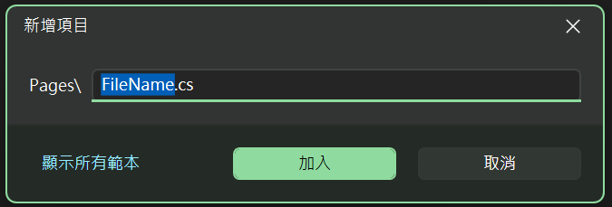
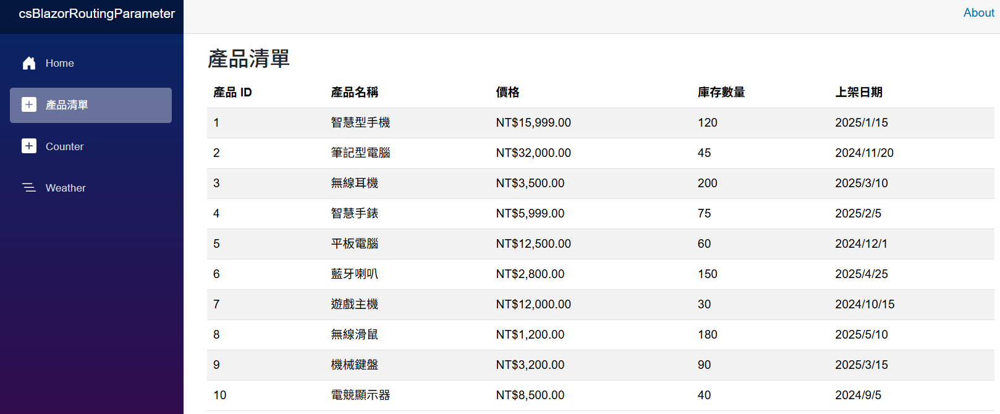
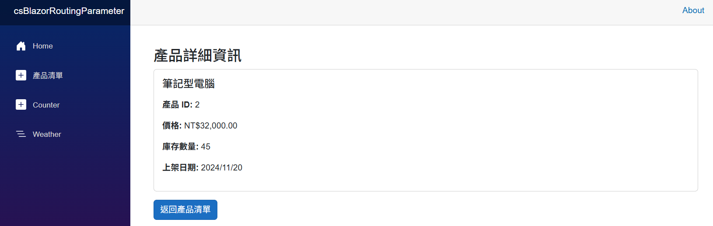

# Blazor 跳轉 2 : 導航切換頁面時候，透過查詢字串，傳遞與接收查詢參數

在上一篇文章中，[Blazor 跳轉 1 : 動態路由參數，傳遞與接收路由參數
](https://csharpkh.blogspot.com/2026/02/csharp-Blazor-Routing-Parameter.html)，當使用者在產品清單頁面點選某一筆產品紀錄時，將會導航到產品詳細頁面，並且在 URL 中傳遞該產品的 ID 參數，這裡使用的方式為 $"/product/{product.Id}"，這樣在 URL 中就會包含該產品的 ID 參數，這樣的方式將會是採用了路由參數的方式，這樣在產品詳細頁面中就可以接收這個參數並且根據這個參數來顯示相應的產品資訊。

在這篇文章中，將會說明另一種在 Blazor 中來傳遞參數的方式，這裡將會使用查詢字串 Query String 的方式來傳遞參數，這樣在 URL 中就會包含一個查詢字串，例如 https://localhost:7124/product?id=2，這樣在產品詳細頁面中就可以接收這個查詢字串中的 id 參數，並且根據這個參數來顯示相應的產品資訊。

## 建立 Blazor 專案
* 開啟 Visual Studio 2026
* 選擇「建立新專案」
* 在 [建立新專案] 視窗中，在右方清單內，找到並選擇「Blazor Web 應用程式」 項目
* 然後點擊右下方「下一步」按鈕
* 此時將會看到 [設定新的專案] 對話窗
* 在該對話窗的 [專案名稱] 欄位中，輸入專案名稱，例如 "csBlazorQueryString"
* 然後點擊右下方「下一步」按鈕
* 接著會看到 [其他資訊] 對話窗
* 在這個對話窗內，確認使用底下的選項
    * 架構：.NET 10.0 (或更新版本)
    * 驗證類型：無
    * 勾選 針對 HTTPS 進行設定
    * 互動式轉譯模式：伺服器
    * 互動功能位置：全球
    * 勾選 包和範例頁面
    * 勾選 不要使用最上層陳述式 (這是我的個人習慣)
    * 不要勾選 在應用程式 URL 中使用 .dev.localhost TLD
    * 不要勾選 在 .NET Aspire 協調流程中登錄
* 然後點擊右下方「建立」按鈕
* 現在，已經完成了這個 Blazor 專案的建立

## 建立 Product 資料模型

當 Blazor 專案建立好之後，接下來將會建立一個 Product 的資料模型，這個資料模型將會用來表示產品的相關資訊，例如產品的 ID、名稱、價格、庫存數量以及上架日期等。

* 在專案根目錄下，滑鼠右擊 [Components] > [Pages] 資料夾
* 從右鍵選單中，選擇「加入」>「新增項目」
* 這裡將會使用 [顯示精簡檢視] 的方式來輸入要新增的項目
* 在 [新增項目] 對話窗內的文字輸入盒內，輸入 [Product.cs]
* 然後點擊「加入」按鈕



* 現在，已經成功建立了 Product.cs 類別檔案
* 接著，打開 Product.cs 類別檔案，並將以下程式碼複製貼上到該檔案中：

```csharp
namespace csBlazorQueryString.Components.Pages;

public class Product
{
    public int Id { get; set; }
    public string Name { get; set; } = string.Empty;
    public decimal Price { get; set; }
    public int StockQuantity { get; set; }
    public DateTime LaunchDate { get; set; }
}
```

## 建立 ProductService 服務

剛剛建立了一個 [Product] 的資料模型，接下來將會建立一個 ProductService 服務，這個服務將會用來提供一些產品的相關資訊，例如產品的清單等。這裡將會在 ProductService 服務中建立一個 GetProducts 方法，這個方法將會回傳所有產品清單，為了簡化這個範例內容，這裡將不會採用資料庫的存取方式來讀取這些產品清單，而是將這些產品紀錄儲存在記憶體中，這些產品清單將會用來在後續的頁面中來顯示產品的相關資訊。

* 滑鼠右擊專案根目錄節點
* 從右鍵選單中，選擇「加入」>「新增資料夾」
* 輸入 [Services] 作為資料夾名稱，然後按下 Enter 鍵
* 現在，已經成功建立了 [Services] 資料夾
* 在專案根目錄下，滑鼠右擊 [Services] 資料夾
* 從右鍵選單中，選擇「加入」>「新增項目」
* 這裡將會使用 [顯示精簡檢視] 的方式來輸入要新增的項目
* 在 [新增項目] 對話窗內的文字輸入盒內，輸入 [ProductService.cs]
* 然後點擊「加入」按鈕
* 現在，已經成功建立了 ProductService.cs 類別檔案
* 接著，打開 ProductService.cs 類別檔案，並將以下程式碼複製貼上到該檔案中：

```csharp
using csBlazorQueryString.Components.Pages;

namespace csBlazorQueryString.Services;

public class ProductService
{
    public List<Product> Products { get; set; } = new();
    public ProductService()
    {
        Products = new List<Product>
    {
        new Product { Id = 1, Name = "智慧型手機", Price = 15999, StockQuantity = 120, LaunchDate = new DateTime(2025, 1, 15) },
        new Product { Id = 2, Name = "筆記型電腦", Price = 32000, StockQuantity = 45, LaunchDate = new DateTime(2024, 11, 20) },
        new Product { Id = 3, Name = "無線耳機", Price = 3500, StockQuantity = 200, LaunchDate = new DateTime(2025, 3, 10) },
        new Product { Id = 4, Name = "智慧手錶", Price = 5999, StockQuantity = 75, LaunchDate = new DateTime(2025, 2, 5) },
        new Product { Id = 5, Name = "平板電腦", Price = 12500, StockQuantity = 60, LaunchDate = new DateTime(2024, 12, 1) },
        new Product { Id = 6, Name = "藍牙喇叭", Price = 2800, StockQuantity = 150, LaunchDate = new DateTime(2025, 4, 25) },
        new Product { Id = 7, Name = "遊戲主機", Price = 12000, StockQuantity = 30, LaunchDate = new DateTime(2024, 10, 15) },
        new Product { Id = 8, Name = "無線滑鼠", Price = 1200, StockQuantity = 180, LaunchDate = new DateTime(2025, 5, 10) },
        new Product { Id = 9, Name = "機械鍵盤", Price = 3200, StockQuantity = 90, LaunchDate = new DateTime(2025, 3, 15) },
        new Product { Id = 10, Name = "電競顯示器", Price = 8500, StockQuantity = 40, LaunchDate = new DateTime(2024, 9, 5) }
    };
    }
    public List<Product> GetProducts()
    {
        return Products;
    }
}
```

在這個 [ProductService] 服務中，建立了一個 [Products] 屬性，這個屬性用來儲存所有的產品清單，並且在建構子中初始化了這些產品清單。

另外，建立了一個 [GetProducts] 方法，這個方法用來回傳所有的產品清單。如此，便可以將這些資料顯示在網頁中。

## 將 ProductService 服務註冊到 DI 容器中

* 打開 Program.cs 類別檔案
* 在該檔案中，找到這個程式碼 `var app = builder.Build();`
* 在這行程式碼的上方，加入底下這行程式碼，將 ProductService 服務註冊到 DI 容器中：

```csharp
builder.Services.AddSingleton<Services.ProductService>();
```

## 建立 ProductListPage 頁面

現在已經建立了 [Product] 的資料模型，以及 [ProductService] 服務，接下來將會建立一個 [ProductListPage] 頁面，這個頁面將會用來顯示所有產品的清單。

接著，將會在每一筆產品紀錄上，提供一個連結，當使用者點選該連結時，將會跳轉到產品詳細資訊的頁面，並且在 URL 中傳遞該產品的 ID 參數。

* 在專案根目錄下，滑鼠右擊 [Components] > [Pages] 資料夾
* 從右鍵選單中，選擇「加入」>「新增項目」
* 這裡將會使用 [顯示精簡檢視] 的方式來輸入要新增的項目
* 在 [新增項目] 對話窗內的文字輸入盒內，輸入 [ProductListPage.razor]
* 然後點擊「加入」按鈕
* 現在，已經成功建立了 ProductListPage.razor 元件
* 接著，打開 ProductListPage.razor 元件，並將以下程式碼複製貼上到該元件中：

```razor
@page "/ProductList"

@inject NavigationManager NavigationManager

@inject csBlazorQueryString.Services.ProductService ProductService
@inject ILogger<ProductListPage> Logger

<h3>產品清單</h3>

<table class="table table-striped">
    <thead>
        <tr>
            <th>產品 ID</th>
            <th>產品名稱</th>
            <th>價格</th>
            <th>庫存數量</th>
            <th>上架日期</th>
        </tr>
    </thead>
    <tbody>
        @foreach (var product in products)
        {
            <tr class="cursor-pointer"
                @onclick="() => OnProductSelected(product)">
                <td>@product.Id</td>
                <td>@product.Name</td>
                <td>@product.Price.ToString("C")</td>
                <td>@product.StockQuantity</td>
                <td>@product.LaunchDate.ToShortDateString()</td>
            </tr>
        }
    </tbody>
</table>

<style>
    .cursor-pointer {
        cursor: pointer;
    }
</style>

@code {

    private List<Product> products = new();

    protected override void OnInitialized()
    {
        products = ProductService.Products;
    }

    void OnProductSelected(Product product)
    {
        // 導航到產品詳細頁面，並傳遞產品 ID
        var queryParams = new Dictionary<string, object?>
        {
            ["id"] = product.Id
        };

        var uri = NavigationManager.GetUriWithQueryParameters("product", queryParams);
        Logger.LogInformation("Navigating Uri: {uri}", uri);
        NavigationManager.NavigateTo(uri);
    }
}
```

在這個 [ProductListPage] 頁面中，使用了 @page 指令來定義這個頁面的路由為 "/ProductList"，這樣當使用者訪問這個 URL 時，就會顯示這個頁面。在這個頁面中，使用了 @inject 指令來注入了 NavigationManager 服務以及 ProductService 服務，這樣就可以在這個頁面中來使用這些服務。 接著，在頁面中使用了一個 HTML 的 table 元素來顯示產品的清單，並且在每一筆產品紀錄上，提供了一個 @onclick 事件處理器，當使用者點選該產品紀錄時，將會呼叫 OnProductSelected 方法，並且在該方法中使用 NavigationManager 服務來導航到產品詳細頁面，並且在 URL 中傳遞該產品的 ID 參數。

在 @code 的 C# 程式碼區塊中，定義了一個 products 的私有欄位，用來儲存從 ProductService 服務中取得的產品清單。在 OnInitialized 方法中，從 ProductService 服務中取得產品清單並賦值給 products 欄位。接著，在 OnProductSelected 方法中，使用 NavigationManager 服務來導航到產品詳細頁面，並且在 URL 中傳遞該產品的 ID 參數，這裡使用的方式為先建立一個資料字典 Dictionary 物件， [queryParams]，然後將產品 ID 參數加入到這個字典中，對於這個 `["id"]` 內容，將會表示為查詢字串中的 id 參數，接著透過 [NavigationManager.GetUriWithQueryParameters] 方法來建立一個包含查詢字串的 URL，這個 URL 將會儲存在 [uri] 變數中，最後使用 NavigationManager.NavigateTo 方法來導航到該 URL。

## 建立 ProductDetail 頁面

接下來，將會建立一個 [ProductDetail] 頁面，這個頁面將會用來顯示產品的詳細資訊。在這個頁面中，將會使用 @page 指令來定義這個頁面的路由，路由定義為 "/product"，這樣在 URL 中就不會包含路由參數，而是透過查詢字串來傳遞參數，例如 https://localhost:7124/product?id=2，這樣在產品詳細頁面中就可以接收這個查詢字串中的 id 參數，並且根據這個參數來顯示相應的產品資訊。

接著，在這個頁面中，將會使用 ProductService 服務來根據接收到的產品 ID 參數來查詢對應的產品資訊，並且在頁面上顯示出該產品的詳細資訊。

* 在專案根目錄下，滑鼠右擊 [Components] > [Pages] 資料夾
* 從右鍵選單中，選擇「加入」>「新增項目」
* 這裡將會使用 [顯示精簡檢視] 的方式來輸入要新增的項目
* 在 [新增項目] 對話窗內的文字輸入盒內，輸入 [ProductDetail.razor]
* 然後點擊「加入」按鈕
* 現在，已經成功建立了 ProductDetail.razor 元件
* 接著，打開 ProductDetail.razor 元件，並將以下程式碼複製貼上到該元件中：

```razor
@page "/product"
@using Microsoft.AspNetCore.Components
@using Microsoft.AspNetCore.Components.Routing
@inject NavigationManager NavigationManager

@inject csBlazorQueryString.Services.ProductService ProductService

<div class="container mt-4">
    @if (product != null)
    {
        <h3>產品詳細資訊</h3>
        <div class="card">
            <div class="card-body">
                <h5 class="card-title">@product.Name</h5>
                <div class="row mt-3">
                    <div class="col-md-6">
                        <p><strong>產品 ID:</strong> @product.Id</p>
                        <p><strong>價格:</strong> @product.Price.ToString("C")</p>
                        <p><strong>庫存數量:</strong> @product.StockQuantity</p>
                        <p><strong>上架日期:</strong> @product.LaunchDate.ToShortDateString()</p>
                    </div>
                </div>
            </div>
        </div>
    }
    else
    {
        <p>找不到指定產品。</p>
    }

    <div class="mt-3">
        <button class="btn btn-primary" @onclick="NavigateToProductList">返回產品清單</button>
    </div>
</div>

@code {
    [SupplyParameterFromQuery]
    public int Id { get; set; }

    private Product? product;

    // 當參數變更時執行
    protected override void OnParametersSet()
    {
        var products = ProductService.Products;
        product = products.FirstOrDefault(p => p.Id == Id);
    }

    // 返回產品清單頁面
    private void NavigateToProductList()
    {
        NavigationManager.NavigateTo("/ProductList");
    }
}
```

在這個頁面的 HTML 部分，透過了資料綁定機制來顯示產品的詳細資訊，並且提供了一個按鈕，當使用者點選該按鈕時，將會導航回產品清單頁面。

在程式碼內，使用了 [SupplyParameterFromQuery] 屬性來定義了一個 Id 的參數，這個參數用來接收從 URL 中傳遞過來的產品 ID 參數。在 OnParametersSet 方法中，從 ProductService 服務中取得所有的產品清單，並且根據接收到的 Id 參數來查詢對應的產品資訊，並且將該產品資訊賦值給 product 欄位，這樣在 HTML 部分就可以顯示出該產品的詳細資訊。

# 執行程式

首先先來看這個專案的執行結果：

* 按下 F5 鍵或點擊「開始」按鈕來執行程式
* 在瀏覽器中，輸入 URL， https://localhost:7124/ProductList
* 現在將會看到底下畫面

* 點選任何一個產品紀錄
* 此時將會切轉到底下畫面，並且在畫面上顯示出該產品的 ID，此時的網址列 URL 將會轉變成為 https://localhost:7124/product?id=2

