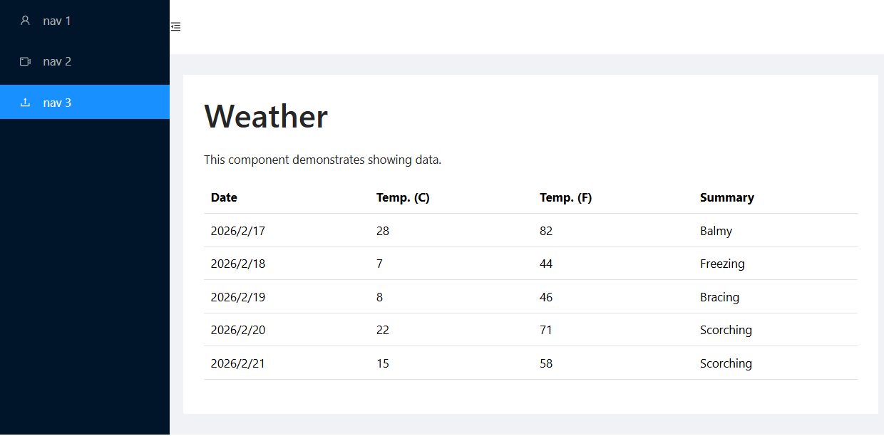
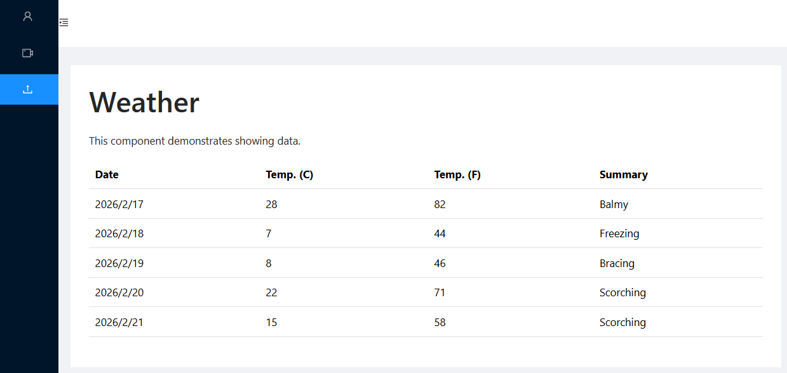

# Blazor 使用 Ant Design Blazor 側邊欄範例

在現代的 Web 網站設計中，對於側邊欄功能表 SiderBar 的需求是非常常見的，這種功能表通常用於提供網站的主要導航選項，讓使用者能夠快速地訪問網站的不同部分。在這個範例中，我們將使用 Blazor 和 Ant Design Blazor 來實現一個具有側邊欄功能表的網站。

## 建立 Blazor 專案
* 開啟 Visual Studio 2026
* 選擇「建立新專案」
* 在 [建立新專案] 視窗中，在右方清單內，找到並選擇「Blazor Web 應用程式」 項目
* 然後點擊右下方「下一步」按鈕
* 此時將會看到 [設定新的專案] 對話窗
* 在該對話窗的 [專案名稱] 欄位中，輸入專案名稱，例如 [csBlazorSiderBar]
* 然後點擊右下方「下一步」按鈕
* 接著會看到 [其他資訊] 對話窗
* 在這個對話窗內，確認使用底下的選項
    * 架構：.NET 10.0 (或更新版本)
    * 驗證類型：無
    * 勾選 針對 HTTPS 進行設定
    * 互動式轉譯模式：伺服器
    * 互動功能位置：全球
    * 勾選 包和範例頁面
    * 勾選 不要使用最上層陳述式 (這是我的個人習慣)
    * 不要勾選 在應用程式 URL 中使用 .dev.localhost TLD
    * 不要勾選 在 .NET Aspire 協調流程中登錄
* 然後點擊右下方「建立」按鈕
* 現在，已經完成了這個 Blazor 專案的建立

## 安裝 AntDesign 套件

套件 AntDesign 是一個流行的 UI 組件庫，提供了許多現成的 UI 元件，可以幫助開發者快速建立美觀且功能豐富的使用者介面。在這個專案中，我們將使用 AntDesign Blazor 這個套件來實現自訂主題的功能。

使用底下方式進行安裝此套件

* 在 Visual Studio 的「方案總管」視窗中，右鍵點擊專案名稱
* 從右鍵選單中，選擇「管理 NuGet 套件」
* 在 NuGet 套件管理器視窗中，切換到「瀏覽」標籤頁
* 在搜尋框中，輸入 "AntDesign" 並按下 Enter 鍵
* 從搜尋結果中，找到 "AntDesign" 套件 並點擊它
* 在這裡的範例中，使用該套件的版本為 1.5.0
* 在右側的詳細資訊面板中，點擊「安裝」按鈕

## 設定 AntDesign 

* 在專案根目錄下，找到 [App.razor] 檔案，並打開它
* 在 [App.razor] 檔案中
* 找到 `</head>` 加入以下程式碼：

```html
<link href="_content/AntDesign/css/ant-design-blazor.css" rel="stylesheet">
```

* 在 [App.razor] 檔案中
* 找到 `</body>` 加入以下程式碼：

```html
<script src="_content/AntDesign/js/ant-design-blazor.js"></script> 
<script antblazor-js></script>
```

為了要能夠在這個 Blazor 專案內使用 [AntDesign] 的元件，這裡需要在這個專案內加入參考 [AntDesign] 的 CSS 和 JavaScript 檔案。這樣才能確保在使用 [AntDesign] 的元件時，能夠正確地載入相關的樣式和功能。

所以，在 [App.razor] 檔案內，這是 [Blazor] 專案的進入點，在這裡首先需要找到 [<head>] 標籤，然後在 [</head>] 標籤前加入一行程式碼，這行代表是用來引入 [AntDesign] 的 CSS 檔案 `<link href="_content/AntDesign/css/ant-design-blazor.css" rel="stylesheet">` 。在這個專案內，使用 [AntDesign] 的元件時，這些元件的樣式都是定義在這個 CSS 檔案中的，所以必須要引入這個 CSS 檔案才能正確地顯示 [AntDesign] 元件的樣式。

接著，需要加入 [AntDesign] 需要用到的 JavaScript 檔案，在 [</body>] 標籤前加入兩行程式碼，這兩行程式碼是用來引入 [AntDesign] 的 JavaScript 檔案，以及啟用 [AntDesign] 的 JavaScript 功能。在這個專案內，可以使用的 [AntDesign] 的 JavaScript 功能，包含了像是彈出式提示、模態框、下拉選單等等，這些功能都是透過 JavaScript 來實現的，所以必須要引入相關的 JavaScript 檔案才能使用這些功能。

## 註冊 AntDesign 的服務
* 在專案根目錄下，找到 [Program.cs] 檔案，並打開它
* 在 [Program.cs] 檔案中，找到 `var app = builder.Build();` 這行程式碼
* 在這行程式碼的上方，加入以下程式碼：

```csharp
builder.Services.AddAntDesign();
```

這行程式碼的作用是將 [AntDesign] 的服務註冊到這個 Blazor 專案的依賴注入容器中。這樣在專案的其他部分，就可以透過依賴注入的方式來使用 [AntDesign] 的功能和元件了。

## 建立新的版面配置頁面

* 在專案根目錄下，找到 [Components] > [Layout] 目錄下
* 滑鼠右擊 [Layout] 目錄
* 從右鍵選單中，選擇「新增項目」
* 找到並且打開 [SilderBarLayout.razor] 檔案
* 在 [SilderBarLayout.razor] 檔案中，將原有的內容全，使用底下程式碼取代：

```razor
@inherits LayoutComponentBase

<Layout>
    <Sider @bind-Collapsed=@collapsed NoTrigger OnCollapse="OnCollapse">
        <div class="logo" />
        <Menu Theme="MenuTheme.Dark" Mode="MenuMode.Inline" DefaultSelectedKeys=@(new[] { "1" })>
            <MenuItem Key="1">
                <Icon Type="@IconType.Outline.User" />
                <span>nav 1</span>
            </MenuItem>
            <MenuItem Key="2">
                <Icon Type="@IconType.Outline.VideoCamera" />
                <span>nav 2</span>
            </MenuItem>
            <MenuItem Key="3">
                <Icon Type="@IconType.Outline.Upload" />
                <span>nav 3</span>
            </MenuItem>
        </Menu>
    </Sider>
    <Layout Class="site-layout">
        <Header Class="site-layout-background" Style="padding: 0;">
            @if (collapsed)
            {
                <Icon Type="@IconType.Outline.MenuUnfold" Class="trigger" OnClick="toggle" />
            }
            else
            {
                <Icon Type="@IconType.Outline.MenuFold" Class="trigger" OnClick="toggle" />
            }
        </Header>
        <Content Class="site-layout-background" Style="margin: 24px 16px;padding: 24px;min-height: 280px;">
            @Body
        </Content>
    </Layout>
</Layout>

<style>
    #components-layout-demo-custom-trigger .trigger {
        font-size: 18px;
        line-height: 64px;
        padding: 0 24px;
        cursor: pointer;
        transition: color 0.3s;
    }

        #components-layout-demo-custom-trigger .trigger:hover {
            color: #1890ff;
        }

    #components-layout-demo-custom-trigger .logo {
        height: 32px;
        background: rgba(255, 255, 255, 0.2);
        margin: 16px;
    }

    .site-layout .site-layout-background {
        background: #fff;
    }
</style>


@code {
    bool collapsed;

    void toggle()
    {
        collapsed = !collapsed;
    }

    void OnCollapse(bool isCollapsed)
    {
        Console.WriteLine($"Collapsed: {isCollapsed}");
    }

}
```

在這個 [SilderBarLayout.razor] 檔案，最上方有宣告 `@inherits LayoutComponentBase`，這表示這個 Razor 組件繼承自 Blazor 的 `LayoutComponentBase` 類別，這是 Blazor 中用來定義版面配置的基底類別。透過繼承 `LayoutComponentBase`，這個組件就可以作為其他頁面的版面配置，讓其他頁面可以使用這個組件定義的結構和樣式。也就是，這個元件可以用於其他頁面，作為這些頁面的版面配置，讓這些頁面能夠共享這個組件定義的結構和樣式。

在 `<Layout>` 標籤之後，使用了 [AntDesign] 的 `<Sider>` 元件來定義側邊欄元件，這個側邊欄可以透過 `@bind-Collapsed` 屬性來綁定一個布林變數 `collapsed`，這個變數用來控制側邊欄的收合狀態。當 `collapsed` 為 `true` 時，側邊欄會收合起來；當 `collapsed` 為 `false` 時，側邊欄會展開。

在 `<Sider>` 元件內，定義了一個 `<Menu>` 元件，這個 `<Menu>` 元件用來顯示側邊欄的功能選單，這裡定義了三個 `<MenuItem>` 元件，分別代表三個功能選項，每個選項都有一個圖示和一個文字標籤。

在這個 `<Layout>` 元件內，還定義了一個 `<Layout>` 元件，用來包裹主要內容區域，包括標頭（Header）和內容（Content）。在標頭（Header）中，根據 `collapsed` 變數的值，顯示不同的圖示按鈕，當側邊欄收合時，顯示展開圖示；當側邊欄展開時，顯示收合圖示。這些圖示按鈕都有一個 `OnClick` 事件處理器 `toggle`，用來切換側邊欄的收合狀態。 

而 `<Content>` 元件則用來顯示主要內容區域，這裡使用了 `@Body` 來表示這個區域會顯示其他頁面的內容，這樣當其他頁面使用這個版面配置時，這些頁面的內容就會顯示在這個 `<Content>` 區域中。 最後，在 `<style>` 標籤內定義了一些 CSS 樣式，用來調整側邊欄和主要內容區域的外觀和佈局。

從這個元件內，可以看到這樣的元件使用結構圖， [Layout] > [Sider] > [Menu] > [MenuItem]，以及 [Layout] > [Layout] > [Header] 和 [Layout] > [Content] 的結構，這些結構定義了整個頁面的佈局和功能。

## 修正 天氣預報 頁面

* 在專案根目錄下，找到 [Components] > [Pages] 目錄下
* 找到並且打開 [Weather.razor] 檔案
* 在 [Weather.razor] 檔案中，將原有的內容全，使用底下程式碼取代：

```razor
@page "/weather"
@layout SilderBarLayout

<PageTitle>Weather</PageTitle>

<h1>Weather</h1>

<p>This component demonstrates showing data.</p>

@if (forecasts == null)
{
    <p><em>Loading...</em></p>
}
else
{
    <table class="table">
        <thead>
            <tr>
                <th>Date</th>
                <th aria-label="Temperature in Celsius">Temp. (C)</th>
                <th aria-label="Temperature in Fahrenheit">Temp. (F)</th>
                <th>Summary</th>
            </tr>
        </thead>
        <tbody>
            @foreach (var forecast in forecasts)
            {
                <tr>
                    <td>@forecast.Date.ToShortDateString()</td>
                    <td>@forecast.TemperatureC</td>
                    <td>@forecast.TemperatureF</td>
                    <td>@forecast.Summary</td>
                </tr>
            }
        </tbody>
    </table>
}

@code {
    private WeatherForecast[]? forecasts;

    protected override async Task OnInitializedAsync()
    {
        // Simulate asynchronous loading to demonstrate a loading indicator
        await Task.Delay(500);

        var startDate = DateOnly.FromDateTime(DateTime.Now);
        var summaries = new[] { "Freezing", "Bracing", "Chilly", "Cool", "Mild", "Warm", "Balmy", "Hot", "Sweltering", "Scorching" };
        forecasts = Enumerable.Range(1, 5).Select(index => new WeatherForecast
        {
            Date = startDate.AddDays(index),
            TemperatureC = Random.Shared.Next(-20, 55),
            Summary = summaries[Random.Shared.Next(summaries.Length)]
        }).ToArray();
    }

    private class WeatherForecast
    {
        public DateOnly Date { get; set; }
        public int TemperatureC { get; set; }
        public string? Summary { get; set; }
        public int TemperatureF => 32 + (int)(TemperatureC / 0.5556);
    }
}
```

在這個 [Weather.razor] 頁面中，首先在 `@page` 指令中使用了 `@layout SilderBarLayout`，這表示這個頁面將使用剛才建立的 [SilderBarLayout] 作為它的版面配置。這樣當這個頁面被訪問時，它就會顯示在 [SilderBarLayout] 定義的結構和樣式中。

## 執行程式

首先先來看這個專案的執行結果：

* 按下 F5 鍵或點擊「開始」按鈕來執行程式
* 現在將會看到底下畫面

* 這個左側功能表清單，也是可以收合起來的
* 點擊左上角的「三」圖示按鈕，將會看到底下畫面

