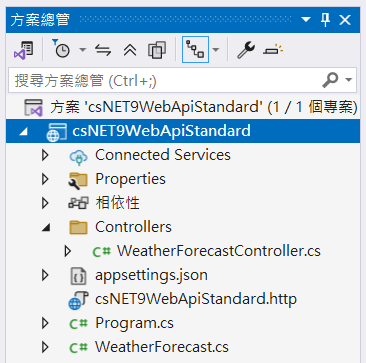
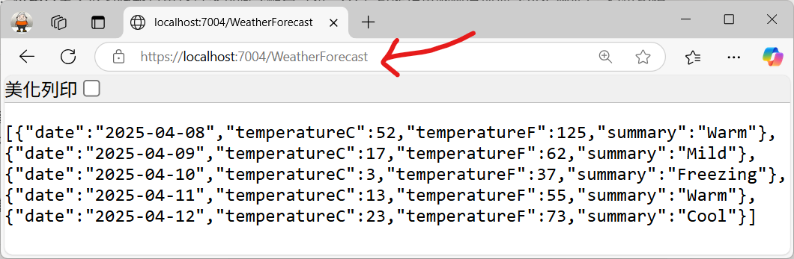
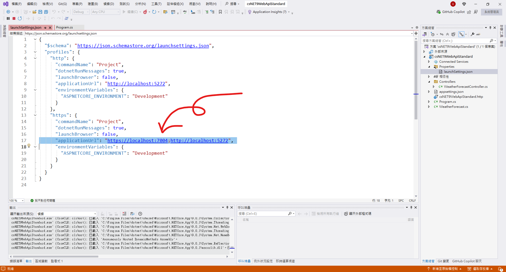
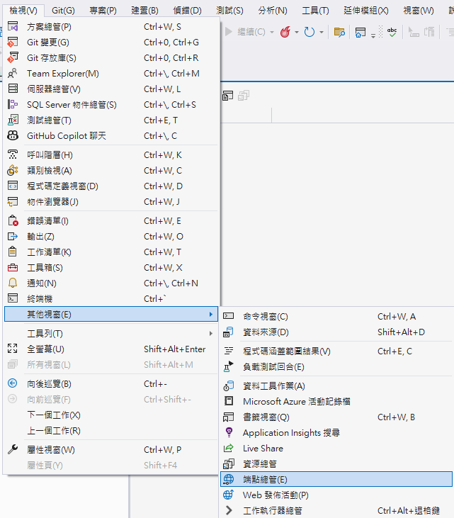
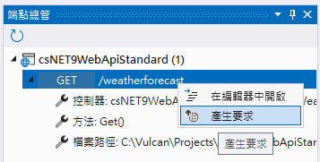
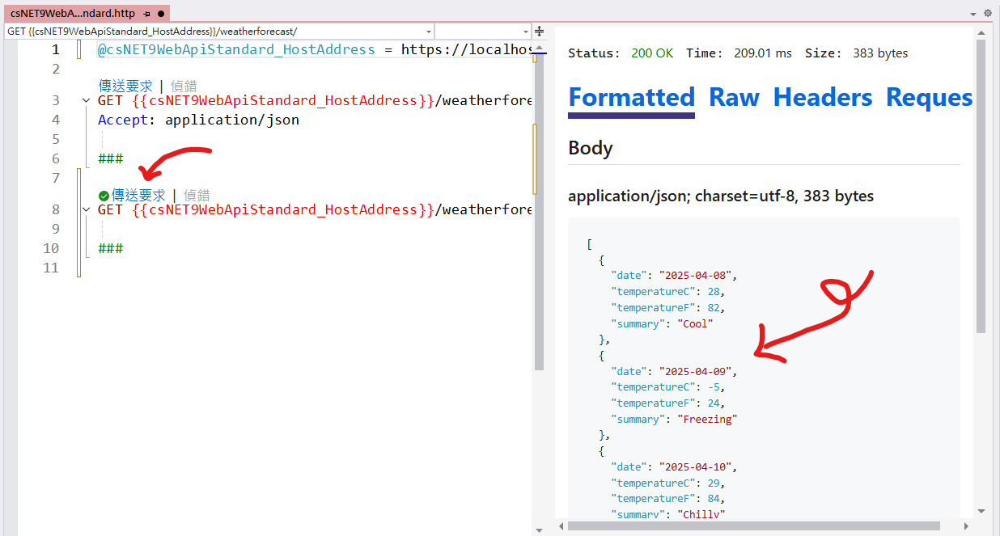

# ASP.NET Core 9 Web API 專案範本


## 建立測試專案

請依照底下的操作，建立起這篇文章需要用到的練習專案

* 打開 Visual Studio 2022 IDE 應用程式
* 從 [Visual Studio 2022] 對話窗中，點選右下方的 [建立新的專案] 按鈕
* 在 [建立新專案] 對話窗右半部
  * 切換 [所有語言 (L)] 下拉選單控制項為 [C#]
  * 切換 [所有專案類型 (T)] 下拉選單控制項為 [Web API]
* 在中間的專案範本清單中，找到並且點選 [ASP.NET Core Web API] 專案範本選項
  > 此專案範本可用於 ASP.NET Core 控制器或最小 API 建立 RESTful Web API，並可選擇性支援 OpenAPI 和驗證
* 點選右下角的 [下一步] 按鈕
* 在 [設定新的專案] 對話窗
* 找到 [解決方案名稱] 欄位，輸入 `csNET9WebApiStandard` 作為專案名稱
* 在剛剛輸入的 [解決方案名稱] 欄位下方，確認沒有勾選 [將解決方案與專案至於相同目錄中] 這個檢查盒控制項
* 點選右下角的 [下一步] 按鈕
* 現在將會看到 [其他資訊] 對話窗
* 在 [架構] 欄位中，請選擇最新的開發框架，這裡選擇的 [架構] 是 : `.NET 9.0 (標準字詞支援)`
* 在 [驗證類型] 選擇無
* 勾選 [啟用 OpenAPI 支援] 這個檢查盒控制項
* 在這個練習中，需要去勾選 [不要使用最上層陳述式(T)] 這個檢查盒控制項
  > 這裡的這個操作，可以由讀者自行決定是否要勾選這個檢查盒控制項
* 勾選 [使用控制器] 這個檢查盒控制項
* 請點選右下角的 [建立] 按鈕

稍微等候一下，這個專案將會建立完成

## 專案結構

建立好的 ASP.NET Core Web API 專案，其結構如下圖



### 專案結構總覽

* Connected Services
  這個節點包含專案連接的外部服務，如 Azure 服務、第三方 API 等。

* Properties
  包含專案的屬性設定，如啟動設定、部署設定等。

* 相依性
  列出專案依賴的所有套件和專案參考。

* Controllers 資料夾
  包含 API 控制器類別，處理 HTTP 請求和回應。
  WeatherForecastController.cs 這是預設生成的控制器範例。

* appsettings.json
  應用程式的主要配置檔案，包含連線字串、日誌設定和其他配置值。

* csNET9WebApiStandard.http
  這可能是一個 HTTP 請求檔案，用於測試 API 端點。

* Program.cs
  這個 ASP.NET Core Web API 的 入口點檔案，包含應用程式的配置、服務註冊和中間件設定。

* WeatherForecast.cs
  一個模型類別，定義了 WeatherForecastController 返回的資料結構。
  這是示範專案自動生成的資料模型。

## Program.cs 類別內容

* 找到並且打開 [Program.cs] 這個檔案

```csharp

namespace csNET9WebApiStandard
{
    public class Program
    {
        public static void Main(string[] args)
        {
            var builder = WebApplication.CreateBuilder(args);

            // Add services to the container.

            builder.Services.AddControllers();
            // Learn more about configuring OpenAPI at https://aka.ms/aspnet/openapi
            builder.Services.AddOpenApi();

            var app = builder.Build();

            // Configure the HTTP request pipeline.
            if (app.Environment.IsDevelopment())
            {
                app.MapOpenApi();
            }

            app.UseHttpsRedirection();

            app.UseAuthorization();


            app.MapControllers();

            app.Run();
        }
    }
}
```

這個檔案是 ASP.NET Core Web API 專案的進入點，包含了應用程式的配置和啟動邏輯

這裡的 [Main] 方法是應用程式的進入點，使用 [WebApplication.CreateBuilder] 方法來建立一個 Web 應用程式的建構器，並且在這裡註冊[服務](https://learn.microsoft.com/zh-tw/aspnet/core/fundamentals/dependency-injection?view=aspnetcore-9.0&WT.mc_id=DT-MVP-5002220)和[中介軟體](https://learn.microsoft.com/zh-tw/aspnet/core/fundamentals/middleware/?view=aspnetcore-9.0&WT.mc_id=DT-MVP-5002220)

對於 `AddControllers()` 這個方法，這是用來註冊控制器服務的，這樣 ASP.NET Core 就知道要使用控制器來處理 HTTP 請求。

這裡的 `AddOpenApi()` 是用來註冊 OpenAPI 支援的，這樣可以自動生成 API 文件。

而 .Build() 方法會建立 Web 應用程式的實例，然後可以使用這個實例來配置中介軟體和路由

透過 .Build() 方法的呼叫，可以得到一個型別為 `WebApplication` 的物件，這個物件是 ASP.NET Core Web 應用程式的主要入口點。

使用 [app.Environment.IsDevelopment()] 來檢查應用程式是否在開發環境中，如果是，就會使用 `app.MapOpenApi()` 來啟用 OpenAPI 支援，這樣可以在開發環境中生成 API 文件。

接下來會看到 [app.UseHttpsRedirection()]，這個方法會啟用 HTTPS 重導向，這樣所有的 HTTP 請求都會被重導向到 HTTPS。

在這個預設專案模板中，會看到 `app.UseAuthorization()`，這個方法會啟用授權中介軟體，這樣可以在應用程式中使用授權功能。

最後，使用 `app.MapControllers()` 來映射控制器路由，這樣 ASP.NET Core 就知道如何將 HTTP 請求路由到對應的控制器和動作方法。

到了這個階段，使用 `app.Run()` 來啟動應用程式，這樣就可以開始接收 HTTP 請求了

## 啟動並執行這個專案

* 在 Visual Studio 2022 IDE 中，按下 `F5` 鍵，或者是在功能表中選擇 [除錯] -> [開始偵錯]，來執行這個程式

當專案啟動之後，並沒有看到任何瀏覽器出現

這裡是專案一啟動之後，Console顯示的 Log 內容


開啟瀏覽器輸入 `https://localhost:7004/WeatherForecast` 這個網址，這時，將會看到瀏覽器顯示 天氣預報資訊 的訊息



這裡使用的 Port 編號，可以在 [Properties] 資料夾中的 [launchSettings.json] 檔案中找到



另外，也可以透過底下方式來進行 API 端點的測試

從功能表的 [檢視] -> [其他視窗] -> [端點總管]，來開啟 HTTP 要求測試器



在 [端點總管] 視窗中，使用滑鼠右擊選擇 [/weatherforecast] 這個 API 端點，然後在彈出功能表清單內，按下 [產生要求] 按鈕



在出線的 [csNET9WebApiStandard.http] 視窗中，找到並且按下 [傳送要求] 按鈕

此時，在該視窗的右方，就可以看到這個 API 端點的執行結果了




