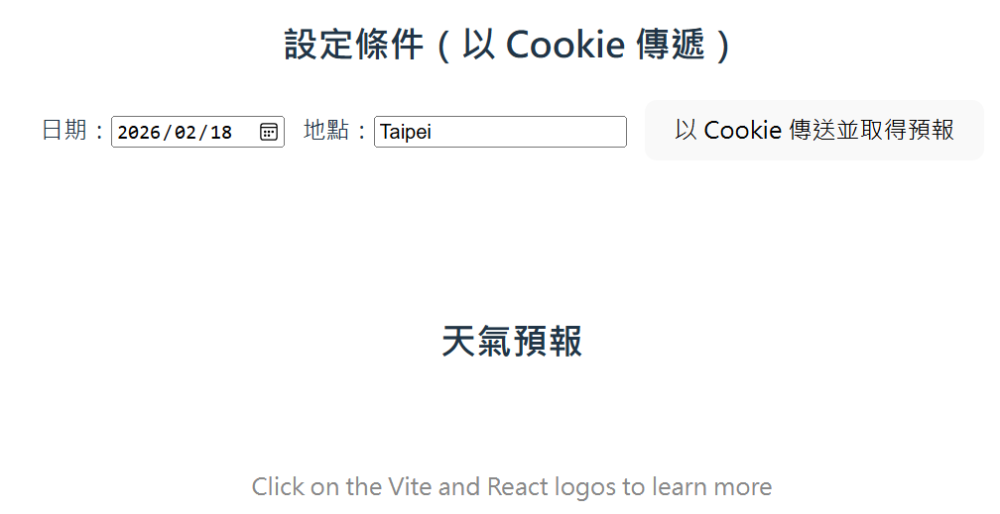
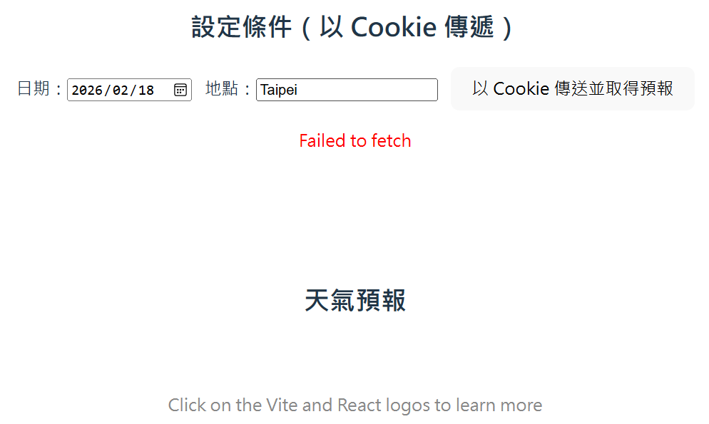
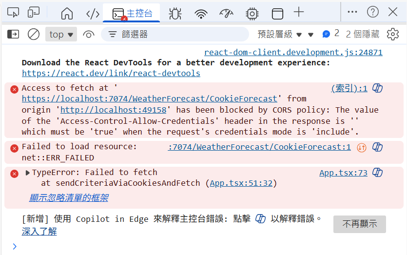
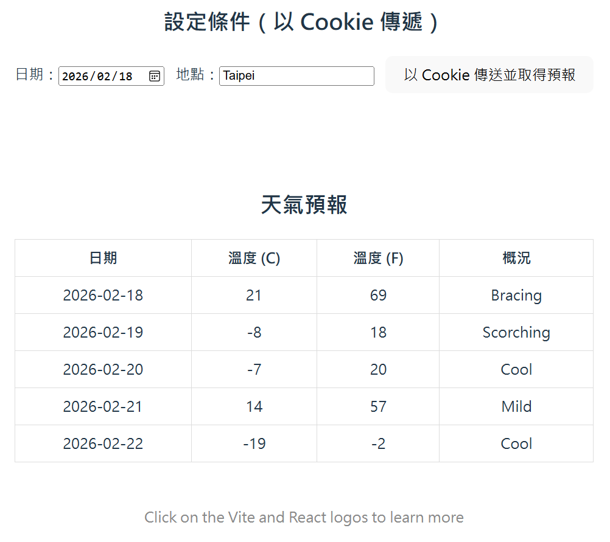

# React API 05 : 呼叫一個 Get 方法 API，傳送與取得 Cookie 的數值

在 React 系列的文章中 [React API 01 : 前端使用 React，後端使用 ASP.NET Core 的測試標準專案](https://csharpkh.blogspot.com/2026/02/csharp-React-Web-Api.html) & [React API 02 : 呼叫一個 Get 方法 API，取得查詢字串內容並將結果渲染到網頁上](https://csharpkh.blogspot.com/2026/02/csharp-React-Get-Query-String.html) & [React API 03 : 呼叫一個 Get 方法 API，取得路由內容並將結果渲染到網頁上](https://csharpkh.blogspot.com/2026/02/csharp-React-Get-Routing-Value.html) & [React API 04 : 呼叫一個 Get 方法 API，傳送與取得 Header 的數值](https://csharpkh.blogspot.com/2026/02/csharp-React-Get-Header.html)  ，我們已經示範了如何在 React 的前端應用程式中，呼叫後端的 API 端點，並且傳送與取得查詢字串、路由參數與 Header 的數值，來達成前後端的資料交換與互動。

在這篇文章中，我們將示範如何在 React 的前端應用程式中，呼叫後端的 API 端點，並且傳送與取得 Cookie 的數值，來達成前後端的資料交換與互動。透過這個範例，你將會學習到如何使用 Cookie 來在前後端之間傳遞資料，以及如何在 React 中解析與使用這些 Cookie 的數值。

另外，這裡也會如同透過 Header 來呼叫 API 的時候，遇到 CORS 的問題一樣，當我們使用 Cookie 來傳遞資料時，也會遇到類似的 CORS 問題，這是因為瀏覽器對於跨站請求攜帶 Cookie 的限制，因此我們也會示範如何在 ASP.NET Core Web API 專案中，設定 CORS 的政策，來允許前端的 React 應用程式攜帶 Cookie 來呼叫後端的 API 端點。

接下來就來嘗試看看這樣的需求如何做到吧！

## 建立 ASP.NET Core Web API 專案
* 開啟 Visual Studio 2026
* 選擇「建立新專案」
* 在 [建立新專案] 視窗中，在右方清單內，找到並選擇「ASP.NET Core Web API」 項目
  >此專案範本可用於使用 ASP.NET Core 控制器或最小 API 建立 RESTful Web API，並可選擇地支援 OpenAPI和驗證
* 然後點擊右下方「下一步」按鈕
* 此時將會看到 [設定新的專案] 對話窗
* 在該對話窗的 [專案名稱] 欄位中，輸入專案名稱，例如 [WebApiDemo]
* 然後點擊右下方「下一步」按鈕
* 接著會看到 [其他資訊] 對話窗
* 在這個對話窗內，確認使用底下的選項
    * 架構：.NET 10.0 (或更新版本)
    * 驗證類型：無
    * 勾選 針對 HTTPS 進行設定
    * 啟用 OpenAPI 支援
    * 勾選 不要使用最上層陳述式 (這是我的個人習慣)
    * 使用控制器
    * 不要勾選 在 .NET Aspire 協調流程中登錄
* 然後點擊右下方「建立」按鈕
* 現在，已經完成了這個 ASP.NET Core Web API 專案的建立

## 修改 API 端點的程式碼
* 在方案總管內，找到並展開 [Controllers] 資料夾
* 找到並打開 [WeatherForecastController.cs] 檔案
* 將該檔案內的程式碼全部刪除，然後將底下的程式碼貼上到該檔案內

```csharp
using Microsoft.AspNetCore.Mvc;
using Microsoft.AspNetCore.Http;
using System.Text.Json;

namespace WebApiDemo.Controllers;

[ApiController]
[Route("[controller]")]
public class WeatherForecastController : ControllerBase
{
    private static readonly string[] Summaries = new[]
    {
        "Freezing", "Bracing", "Chilly", "Cool", "Mild", "Warm", "Balmy", "Hot", "Sweltering", "Scorching"
    };

    private readonly ILogger<WeatherForecastController> _logger;

    public WeatherForecastController(ILogger<WeatherForecastController> logger)
    {
        _logger = logger;
    }

    [HttpGet("CookieForecast")]
    public IActionResult GetForecastFromCookies()
    {
        Request.Cookies.TryGetValue("forecast_date", out var dateStr);
        Request.Cookies.TryGetValue("forecast_location", out var location);

        if (!DateOnly.TryParse(dateStr, out var startDate))
        {
            startDate = DateOnly.FromDateTime(DateTime.Now);
        }

        location ??= "Taipei";

        var forecasts = Enumerable.Range(0, 5).Select(i => new WeatherForecast
        {
            Date = startDate.AddDays(i),
            TemperatureC = Random.Shared.Next(-20, 55),
            Summary = Summaries[Random.Shared.Next(Summaries.Length)]
        }).ToArray();

        var json = JsonSerializer.Serialize(forecasts);

        var cookieOptions = new CookieOptions
        {
            HttpOnly = false,             
            Secure = true,               
            SameSite = SameSiteMode.None,
            Expires = DateTimeOffset.UtcNow.AddMinutes(10),
            Path = "/"
        };

        Response.Cookies.Append("forecast_date", startDate.ToString("yyyy-MM-dd"), cookieOptions);
        Response.Cookies.Append("forecast_location", location, cookieOptions);
        Response.Cookies.Append("forecast_data", json, cookieOptions);
        return NoContent();
    }
}
```

這裡定義了一個新的 API 端點 [GetForecastFromCookies]，它會從 HTTP 請求的 Cookie 中 ( Request.Cookies ) 嘗試讀取名為 [forecast_date] 與 [forecast_location] 的 Cookie 值，來作為產生天氣預報資料的依據。

接著，根據這些參數來產生一組天氣預報資料，並且將這些資料序列化為 JSON 字串後，然後建立一個 [cookieOptions] 的物件，來設定這些 Cookie 的屬性，其中有 [HttpOnly] 代表了這個 Cookie 是否只能被 HTTP 請求存取，不能被 JavaScript 存取；[Secure] 代表了這個 Cookie 是否只能在 HTTPS 的連線下傳送；[SameSite] 代表了這個 Cookie 的 SameSite 屬性，這裡設定為 None，表示允許跨站請求攜帶這個 Cookie；[Expires] 代表了這個 Cookie 的過期時間，這裡設定為 10 分鐘後；[Path] 代表了這個 Cookie 的 Path 屬性，這裡設定為根路徑 /。最後，使用 Response.Cookies.Append 方法來將這些 Cookie 寫入到 HTTP 回應中，並且回傳一個 NoContent 的結果。

## 建立 React 專案
* 滑鼠右擊解決方案 [WebApiDemo]，選擇「加入」>「新增專案」
* 在 [加入新專案] 視窗中，在右方清單內，找到並選擇「React 個應用程式」 項目
  >請注意選擇具有底下的說明項目的專案範本
  >
  >TypeScript React 專案範本，透過執行 npx 的全域安裝來進行啟動載入
* 然後點擊右下方「下一步」按鈕
* 此時將會看到 [設定新的專案] 對話窗
* 在該對話窗的 [專案名稱] 欄位中，輸入專案名稱，例如 [reactdemo]
* 然後點擊右下方「下一步」按鈕
* 然後點擊右下方「建立」按鈕
* 現在，已經完成了這個 React 個應用程式 專案的建立
* 在方案總管內，將會看到有兩個專案建立起來

## 修改 React 專案的程式碼
* 在方案總管內，找到並展開 [reactdemo] 專案
* 找到並打開 [src] 資料夾內的 [App.tsx] 檔案
* 將該檔案內的程式碼全部刪除，然後將底下的程式碼貼上到該檔案內

```tsx
import { useMemo, useState } from 'react'
import reactLogo from './assets/react.svg'
import viteLogo from '/vite.svg'
import './App.css'

interface WeatherForecast {
    Date: string;
    TemperatureC: number;
    TemperatureF: number;
    Summary: string;
}

function parseCookies(): Record<string, string> {
    return Object.fromEntries(
        document.cookie.split('; ').filter(Boolean).map(kv => {
            const idx = kv.indexOf('=')
            const k = kv.substring(0, idx)
            const v = kv.substring(idx + 1)
            return [k, v]
        })
    )
}

function App() {
    const today = useMemo(() => new Date().toISOString().slice(0, 10), [])
    const [date, setDate] = useState<string>(today)
    const [location, setLocation] = useState<string>('Taipei')

    const [forecasts, setForecasts] = useState<WeatherForecast[]>([])
    const [loading, setLoading] = useState(false)
    const [error, setError] = useState('')

    const sendCriteriaViaCookiesAndFetch = async () => {
        setLoading(true)
        setError('')
        setForecasts([])

        try {
            const maxAge = 600
            document.cookie = `forecast_date=${encodeURIComponent(date)}; Path=/; Max-Age=${maxAge}; SameSite=None; Secure`
            document.cookie = `forecast_location=${encodeURIComponent(location)}; Path=/; Max-Age=${maxAge}; SameSite=None; Secure`

            const api = 'https://localhost:7074/WeatherForecast/CookieForecast'
            const resp = await fetch(api, {
                method: 'GET',
                credentials: 'include' // 關鍵：允許帶/收 Cookie
            })

            if (!resp.ok && resp.status !== 204) {
                throw new Error(`API 失敗: ${resp.status}`)
            }

            const cookies = parseCookies()
            const json = cookies['forecast_data']
            if (!json) {
                throw new Error('未取得 forecast_data Cookie')
            }

            const data: WeatherForecast[] = JSON.parse(decodeURIComponent(json))
            setForecasts(data)
        } catch (err) {
            setError(err instanceof Error ? err.message : '取得天氣預報時發生錯誤')
            console.error(err)
        } finally {
            setLoading(false)
        }
    }

    return (
        <>
            <div>
                <a href="https://vite.dev" target="_blank">
                    
                </a>
                <a href="https://react.dev" target="_blank">
                    
                </a>
            </div>
            <h1>Vite + React</h1>

            {/* 條件輸入區 */}
            <div className="card" style={{ marginTop: '20px' }}>
                <h2>設定條件（以 Cookie 傳遞）</h2>
                <div style={{ display: 'flex', gap: 12, alignItems: 'center', flexWrap: 'wrap' }}>
                    <label>
                        日期：
                        <input type="date" value={date} onChange={e => setDate(e.target.value)} />
                    </label>
                    <label>
                        地點：
                        <input type="text" value={location} onChange={e => setLocation(e.target.value)} placeholder="Taipei" />
                    </label>
                    <button onClick={sendCriteriaViaCookiesAndFetch} disabled={loading}>
                        {loading ? '提交中…' : '以 Cookie 傳送並取得預報'}
                    </button>
                </div>

                {error && <p style={{ color: 'red' }}>{error}</p>}
            </div>

            {/* 天氣預報區塊 */}
            <div className="card" style={{ marginTop: '20px' }}>
                <h2>天氣預報</h2>

                {forecasts.length > 0 && (
                    <div style={{ marginTop: '20px' }}>
                        <table style={{ width: '100%', borderCollapse: 'collapse' }}>
                            <thead>
                                <tr>
                                    <th style={{ border: '1px solid #ddd', padding: '8px' }}>日期</th>
                                    <th style={{ border: '1px solid #ddd', padding: '8px' }}>溫度 (C)</th>
                                    <th style={{ border: '1px solid #ddd', padding: '8px' }}>溫度 (F)</th>
                                    <th style={{ border: '1px solid #ddd', padding: '8px' }}>概況</th>
                                </tr>
                            </thead>
                            <tbody>
                                {forecasts.map((forecast, index) => (
                                    <tr key={index}>
                                        <td style={{ border: '1px solid #ddd,', padding: '8px' }}>{forecast.Date}</td>
                                        <td style={{ border: '1px solid #ddd', padding: '8px' }}>{forecast.TemperatureC}</td>
                                        <td style={{ border: '1px solid #ddd', padding: '8px' }}>{forecast.TemperatureF}</td>
                                        <td style={{ border: '1px solid #ddd', padding: '8px' }}>{forecast.Summary}</td>
                                    </tr>
                                ))}
                            </tbody>
                        </table>
                    </div>
                )}
            </div>

            <p className="read-the-docs">
                Click on the Vite and React logos to learn more
            </p>
        </>
    )
}

export default App
```

在這個 [App.tsx] 的程式碼中，我們定義了一個 React 的函式型元件 [App]，在這個元件內，我們使用了 React 的 useState 與 useMemo 來定義一些狀態與變數，其中有 [date] 與 [location] 是用來存放使用者輸入的日期與地點的狀態；[forecasts] 是用來存放從後端 API 取得的天氣預報資料的狀態；[loading] 是用來表示是否正在載入資料的狀態；[error] 是用來存放錯誤訊息的狀態。接著，我們定義了一個名為 [sendCriteriaViaCookiesAndFetch] 的非同步函式，當使用者點擊按鈕時，會呼叫這個函式來執行以下的邏輯：
1) 以 Cookie 寫入日期與地點 (SameSite=None; Secure; Path=/; Max-Age=600)
2) 呼叫 API 讓後端根據 Cookie 產生天氣預報並以 Cookie 回傳
3) 從 Cookie 讀取 forecast_data，解析後渲染

[api] 這個物件代表了後端的 API 端點的 URL，當呼叫 fetch 函式來呼叫這個 API 端點時，會帶上 `credentials: 'include'` 的選項，這是為了讓瀏覽器在跨站請求時也能夠攜帶 Cookie。至於要使用 cookie 傳送過去的日期與地點的值，則是透過直接設定 `document.cookie` 的方式來寫入 Cookie，這裡設定了 Cookie 的名稱、值、Path、Max-Age、SameSite 與 Secure 等屬性，這些屬性的意義代表：[Path=/] 代表了這個 Cookie 的 Path 屬性，這裡設定為根路徑 /；[Max-Age=600] 代表了這個 Cookie 的最大存活時間，這裡設定為 600 秒，也就是 10 分鐘；[SameSite=None] 代表了這個 Cookie 的 SameSite 屬性，這裡設定為 None，表示允許跨站請求攜帶這個 Cookie；[Secure] 代表了這個 Cookie 是否只能在 HTTPS 的連線下傳送，這裡設定為 true，表示只能在 HTTPS 下傳送。

當 API 呼叫完成後，我們會從 `document.cookie` 中解析出名為 [forecast_data] 的 Cookie 值，然後將它解碼並解析成 JSON 物件，最後將這些資料存放到 [forecasts] 的狀態中，以便在網頁上渲染出來。

## 設定同時啟動多個專案
* 在這個方案內，擁有兩個專案，分別是 [WebApiDemo] 與 [reactdemo]
* 前者是 ASP.NET Core Web API 專案，後者是 React 的前端專案
* 因此，我們需要設定 Visual Studio 來同時啟動這兩個專案，才能在開發過程中同時測試前後端的功能
* 在方案總管內，右擊方案 [WebApiDemo]，選擇 [設定啟動專案]
* 在 [方案 'ReactWebApi' 屬性頁] 對話窗內，選擇 [多個啟動專案] 的選項
* 在下方的專案列表內，找到 [WebApiDemo] 與 [reactdemo] 這兩個專案
* 將這兩個專案的 [動作] 欄位都設定為 [啟動]
* 然後點擊右下方的 [確定] 按鈕，來儲存這個設定


## 修正 CORS 的問題
* 這個錯誤訊息表示了，因為 CORS 的政策限制，導致前端的 React 應用程式無法成功呼叫後端的 API 端點
* 為了修正這個問題，我們需要在後端的 ASP.NET Core Web API 專案中，加入對 CORS 的支援
* 打開 [Program.cs] 檔案
* 在該檔案內，找到 `builder.Services.AddOpenApi();` 這一行
* 在這一行的下方，加入底下的程式碼，來設定 CORS 的政策，允許來自 `http://localhost:49158` 的請求

```csharp
builder.Services.AddCors(options =>
{
    options.AddPolicy("AllowReactApp", policy =>
    {
        policy.WithOrigins("http://localhost:49158") // React 應用運行在此端口
                .AllowAnyHeader()
                .AllowAnyMethod()
                ;
    });
});
```

* 這裡使用了 `AddCors` 方法來加入 CORS 的服務，並定義了一個名為 "AllowReactApp" 的政策，該政策允許來自 `http://localhost:49158` 的請求，並且允許任何標頭和方法(這裡使用這些方法 [AllowAnyHeader()] & [AllowAnyMethod()] 是為了簡化測試，實際上在生產環境中，建議根據需求來限制允許的標頭和方法，以增強安全性)
* 接著找到 `app.UseHttpsRedirection();` 這一行
* 在這一行的下方，加入底下的程式碼，來啟用 CORS 的中介軟體，並指定使用剛剛設定的 CORS 政策

```csharp
#region 使用 CORS 中介軟體 - 必須放在管道的早期位置
app.UseCors("AllowReactApp");
#endregion
```

* 這裡使用了 `UseCors` 方法來啟用 CORS 的中介軟體，並指定使用 "AllowReactApp" 這個政策
* 儲存 [Program.cs] 的修改

## 執行程式

* 按下 F5 鍵或點擊「開始」按鈕來執行程式
* 此時，會出現 React 設計的網頁，如下圖所示

* 在網頁最下方，可以看到兩個要輸入的欄位
* 地點與日期，請隨意輸入任何值到這兩個欄位中
* 例如，地點輸入「Taipei」，日期輸入「2024-06-01」
* 然後點擊 [以 Cookie 傳送並取得預報] 的按鈕
* 此時，React 的前端應用程式會呼叫後端的 API 端點，並將地點與日期作為 Cookie 參數傳送給後端
* 後端的 API 端點會根據接收到的地點與日期來產生對應的天氣預報資料，並將這些資料以 JSON 格式`,透過 cookie 回傳給前端
* 理論上，前端接收到這些資料後，會將它們渲染到網頁上，以表格的形式顯示出來
* 可是，因為前面的程式碼有問題，導致網頁上出現了錯誤訊息，提示 [Failed to fetch]

* 並且在瀏覽器的開發者工具的 Console 頁籤內，會看到類似底下的錯誤訊息

* 這個錯誤訊息
```
(索引):1  Access to fetch at 'https://localhost:7074/WeatherForecast/CookieForecast' from origin 'http://localhost:49158' has been blocked by CORS policy: The value of the 'Access-Control-Allow-Credentials' header in the response is '' which must be 'true' when the request's credentials mode is 'include'.
```
* 這個錯誤訊息表示了，因為 CORS 的政策限制，導致前端的 React 應用程式無法成功呼叫後端的 API 端點，這是因為在前端的 fetch 呼叫中，使用了 `credentials: 'include'` 的選項，這表示了前端希望在跨站請求時攜帶 Cookie，但後端的回應中並沒有正確設定 `Access-Control-Allow-Credentials` 標頭為 `true`，因此瀏覽器根據 CORS 的政策限制，阻止了這個請求。
* 為了修正這個問題，我們需要在後端的 ASP.NET Core Web API 專案中，加入對 CORS 的支援，並且正確設定 CORS 的政策，來允許來自 `http://localhost:49158` 的請求攜帶 Cookie。接下來看看如何修正這個問題吧！
* 打開 [Program.cs] 檔案
* 找到 `.AllowAnyMethod()` 這一行
* 在這一行的下方，加入底下的程式碼，來設定 CORS 的政策，允許攜帶 Cookie 

```csharp
.AllowCredentials()
```
* 這裡使用了 `AllowCredentials` 方法來設定 CORS 的政策，允許前端在跨站請求時攜帶 Cookie
* 儲存 [Program.cs] 的修改
* 再次按下 F5 鍵或點擊「開始」按鈕來執行程式
* 現在，當你在 React 的前端應用程式中輸入地點與日期，並且點擊 [以 Cookie 傳送並取得預報] 的按鈕後，應該就可以成功從後端的 API 端點獲取到天氣預報資料，並且將它們渲染到網頁上了

