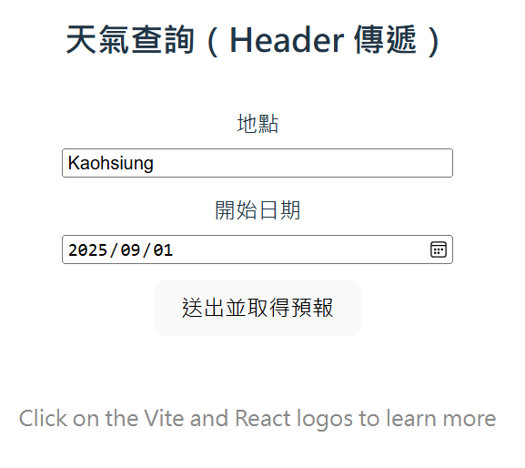
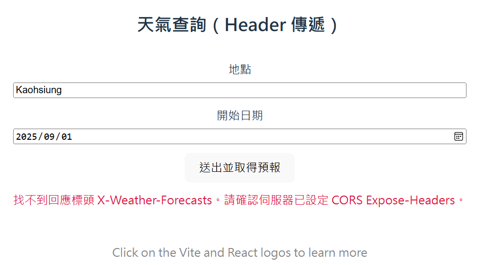
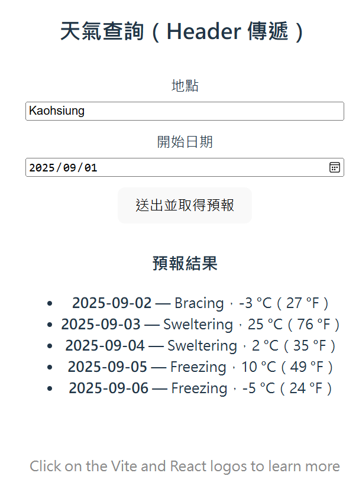

# React API 04 : 呼叫一個 Get 方法 API，傳送與取得 Header 的數值

在 React 系列的文章中 [React API 01 : 前端使用 React，後端使用 ASP.NET Core 的測試標準專案](https://csharpkh.blogspot.com/2026/02/csharp-React-Web-Api.html) & [React API 02 : 呼叫一個 Get 方法 API，取得查詢字串內容並將結果渲染到網頁上](https://csharpkh.blogspot.com/2026/02/csharp-React-Get-Query-String.html) & [React API 03 : 呼叫一個 Get 方法 API，取得路由內容並將結果渲染到網頁上](https://csharpkh.blogspot.com/2026/02/csharp-React-Get-Routing-Value.html) ，同樣是使用 HTTP GET 方法來設計出採用 ASP.NET Core 設計出來的 Web API，並且說明如何做出這樣的設計，接著，也說明如何設計 React 的前端應用程式，來呼叫這個 API 端點，並且將資料渲染到網頁上。透過這些說明，可以同時讓前端與後端的開發者知道如何使用路由參數來進行設計。

現在，我們來看看第四篇文章的內容，這裡同樣是建立一個 ASP.NET Core Web API 專案，並且在其中定義一個 GET 方法的 API 端點，不過這次我們將不會使用查詢字串參數或路由參數的方式來接收來自於前端 App 的參數，而是使用 HTTP Header 的方式來接收傳遞的參數，在經過處理之後，將所產生的天氣預報 JSON 資料，回傳給前端，不過，這裡的回傳的 JSON 物件，將會放到 HTTP Header 上，然後在前端的 React 應用程式中呼叫這個 API 端點，將 Header 參數傳送給後端，當後端 API 處理完成後， React 的前端應用程式會從 HTTP Header 上取得回傳的 JSON 物件，並且將它渲染到網頁上。透過這樣的說明，可以同時讓前端與後端的開發者知道如何使用 HTTP Header 來進行設計。

接下來就來嘗試看看這樣的需求如何做到吧！

## 建立 ASP.NET Core Web API 專案
* 開啟 Visual Studio 2026
* 選擇「建立新專案」
* 在 [建立新專案] 視窗中，在右方清單內，找到並選擇「ASP.NET Core Web API」 項目
  >此專案範本可用於使用 ASP.NET Core 控制器或最小 API 建立 RESTful Web API，並可選擇地支援 OpenAPI和驗證
* 然後點擊右下方「下一步」按鈕
* 此時將會看到 [設定新的專案] 對話窗
* 在該對話窗的 [專案名稱] 欄位中，輸入專案名稱，例如 [WebApiDemo]
* 然後點擊右下方「下一步」按鈕
* 接著會看到 [其他資訊] 對話窗
* 在這個對話窗內，確認使用底下的選項
    * 架構：.NET 10.0 (或更新版本)
    * 驗證類型：無
    * 勾選 針對 HTTPS 進行設定
    * 啟用 OpenAPI 支援
    * 勾選 不要使用最上層陳述式 (這是我的個人習慣)
    * 使用控制器
    * 不要勾選 在 .NET Aspire 協調流程中登錄
* 然後點擊右下方「建立」按鈕
* 現在，已經完成了這個 ASP.NET Core Web API 專案的建立

## 修改 API 端點的程式碼
* 在方案總管內，找到並展開 [Controllers] 資料夾
* 找到並打開 [WeatherForecastController.cs] 檔案
* 將該檔案內的程式碼全部刪除，然後將底下的程式碼貼上到該檔案內

```csharp
using Microsoft.AspNetCore.Mvc;

namespace WebApiDemo.Controllers;

[ApiController]
[Route("[controller]")]
public class WeatherForecastController : ControllerBase
{
    private static readonly string[] Summaries = new[]
    {
        "Freezing", "Bracing", "Chilly", "Cool", "Mild", "Warm", "Balmy", "Hot", "Sweltering", "Scorching"
    };

    private readonly ILogger<WeatherForecastController> _logger;

    public WeatherForecastController(ILogger<WeatherForecastController> logger)
    {
        _logger = logger;
    }

    [HttpGet("GetWeatherForecastWithHeaders", Name = "GetWeatherForecastWithHeaders")]
    public string GetWeatherForecastWithHeaders(
        [FromHeader(Name = "Location")] string location,
        [FromHeader(Name = "StartDate")] DateOnly startDate)
    {
        _logger.LogInformation("Location: {Location}, StartDate: {StartDate}", location, startDate);
        var forecasts = Enumerable.Range(1, 5).Select(index => new WeatherForecast
        {
            Date = startDate.AddDays(index),
            TemperatureC = Random.Shared.Next(-20, 55),
            Summary = Summaries[Random.Shared.Next(Summaries.Length)]
        })
        .ToArray();

        // 將天氣預報結果序列化為 JSON 字串，並且放到 Response Header 中
        var forecastsJson = System.Text.Json.JsonSerializer.Serialize(forecasts);
        Response.Headers.Add("X-Weather-Forecasts", forecastsJson);
        return "OK";
    }
}
```

這裡定義了一個新的 API 端點 [GetWeatherForecastWithHeaders]，這個端點使用了 `[HttpGet]` 的屬性來指定它是一個 GET 方法的 API，並且在路由中指定了 [GetWeatherForecastWithHeaders] 的路徑。這個 API 端點接受兩個 Header 參數，分別是 [Location] 與 [StartDate]，並且使用 `[FromHeader]` 的屬性來告訴 ASP.NET Core 從 Header 中取得這些參數的值。

## 建立 React 專案
* 滑鼠右擊解決方案 [WebApiDemo]，選擇「加入」>「新增專案」
* 在 [加入新專案] 視窗中，在右方清單內，找到並選擇「React 個應用程式」 項目
  >請注意選擇具有底下的說明項目的專案範本
  >
  >TypeScript React 專案範本，透過執行 npx 的全域安裝來進行啟動載入
* 然後點擊右下方「下一步」按鈕
* 此時將會看到 [設定新的專案] 對話窗
* 在該對話窗的 [專案名稱] 欄位中，輸入專案名稱，例如 [reactdemo]
* 然後點擊右下方「下一步」按鈕
* 然後點擊右下方「建立」按鈕
* 現在，已經完成了這個 React 個應用程式 專案的建立
* 在方案總管內，將會看到有兩個專案建立起來

## 修改 React 專案的程式碼
* 在方案總管內，找到並展開 [reactdemo] 專案
* 找到並打開 [src] 資料夾內的 [App.tsx] 檔案
* 將該檔案內的程式碼全部刪除，然後將底下的程式碼貼上到該檔案內

```tsx
import { useState } from 'react'
import reactLogo from './assets/react.svg'
import viteLogo from '/vite.svg'
import './App.css'

interface WeatherForecast {
  date: string
  temperatureC: number
  summary: string
  temperatureF?: number
}

function App() {
  const [count, setCount] = useState(0)

    const [location, setLocation] = useState<string>('Kaohsiung')
    const [startDate, setStartDate] = useState<string>('2025-09-01') 
  const [loading, setLoading] = useState(false)
  const [error, setError] = useState<string | null>(null)
  const [forecasts, setForecasts] = useState<WeatherForecast[]>([])

  const apiBase = 'https://localhost:7074'

  const fetchForecasts = async () => {
    setLoading(true)
    setError(null)
    setForecasts([])

    try {
      if (!location.trim()) {
        throw new Error('請輸入地點')
      }
      if (!startDate) {
        throw new Error('請選擇日期')
      }

      const resp = await fetch(`${apiBase}/weatherforecast/GetWeatherForecastWithHeaders`, {
        method: 'GET',
        headers: {
          'Location': location.trim(),
          'StartDate': startDate,
          'Accept': 'text/plain'
        }
      })

      if (!resp.ok) {
        throw new Error(`請求失敗：${resp.status} ${resp.statusText}`)
      }

      const headerVal = resp.headers.get('X-Weather-Forecasts')
      if (!headerVal) {
        throw new Error('找不到回應標頭 X-Weather-Forecasts。請確認伺服器已設定 CORS Expose-Headers。')
      }

      const raw = JSON.parse(headerVal) as any[]

      const normalized: WeatherForecast[] = raw.map((x: any) => ({
        date: x.Date ?? x.date,
        temperatureC: x.TemperatureC ?? x.temperatureC,
        summary: x.Summary ?? x.summary,
        temperatureF: x.TemperatureF ?? x.temperatureF
      }))

      setForecasts(normalized)
    } catch (e: any) {
      setError(e?.message ?? String(e))
    } finally {
      setLoading(false)
    }
  }

  return (
    <>
      <div>
        <a href="https://vite.dev" target="_blank">
          
        </a>
        <a href="https://react.dev" target="_blank">
          
        </a>
      </div>

      <h1>Vite + React</h1>

      <div className="card" style={{ display: 'grid', gap: 12 }}>
        <div>
          <button onClick={() => setCount((count) => count + 1)}>
            count is {count}
          </button>
        </div>

        <hr />

        <h2>天氣查詢（Header 傳遞）</h2>

        <label style={{ display: 'grid', gap: 6 }}>
          <span>地點</span>
          <input
            type="text"
            placeholder="例如：Kaohsiung"
            value={location}
            onChange={(e) => setLocation(e.target.value)}
          />
        </label>

        <label style={{ display: 'grid', gap: 6 }}>
          <span>開始日期</span>
          <input
            type="date"
            value={startDate}
            onChange={(e) => setStartDate(e.target.value)}
          />
        </label>

        <div>
          <button onClick={fetchForecasts} disabled={loading}>
            {loading ? '查詢中…' : '送出並取得預報'}
          </button>
        </div>

        {error && (
          <div style={{ color: 'crimson' }}>
            {error}
          </div>
        )}

        {forecasts.length > 0 && (
          <div>
            <h3>預報結果</h3>
            <ul>
              {forecasts.map((f) => (
                <li key={`${f.date}-${f.summary}`}>
                  <strong>{f.date}</strong> — {f.summary}，{f.temperatureC} °C{typeof f.temperatureF === 'number' ? `（${f.temperatureF} °F）` : ''}
                </li>
              ))}
            </ul>
          </div>
        )}
      </div>

      <p className="read-the-docs">
        Click on the Vite and React logos to learn more
      </p>
    </>
  )
}

export default App
```

在這個 [App.tsx] 的程式碼中，定義了一個 `WeatherForecast` 的 TypeScript 介面，來對應後端 API 回傳的資料結構。接著，使用 React 的 `useState` Hook 來管理天氣預報資料、載入狀態和錯誤訊息。

這裡設定 [apiBase] 變數為後端 API 的基本 URL，這樣在呼叫 API 的時候就可以使用這個變數來組合完整的 API 端點 URL。另外，使用了 const resp = await fetch(`${apiBase}/weatherforecast/GetWeatherForecastWithHeaders` 的方式來呼叫後端的 API 端點，並且將地點與日期作為 Header 參數傳送給後端。

另外，定義了一個 `fetchForecasts` 的非同步函數，來呼叫後端的 API 端點，並將回傳的資料存到 `forecasts` 的狀態中。如果在呼叫 API 的過程中發生錯誤，會將錯誤訊息存到 `error` 的狀態中。在 JSX 的部分，建立了一個按鈕，當使用者點擊時會呼叫 `fetchForecasts` 函數來獲取天氣預報資料。當資料成功獲取後，會將資料以列表的形式顯示在畫面上。如果在獲取資料的過程中發生錯誤，我們會在畫面上顯示錯誤訊息。

對於這個敘述 const headerVal = resp.headers.get('X-Weather-Forecasts') 的部分，這裡是從 HTTP 回應的 Header 中，取得名為 [X-Weather-Forecasts] 的自訂標頭的值，這個標頭是後端 API 端點在處理完請求後，將天氣預報資料序列化為 JSON 字串後，放到這個標頭上回傳給前端的。接著，我們會將這個 JSON 字串解析回 JavaScript 物件，並且將它存到 `forecasts` 的狀態中，以便在畫面上渲染出來。

## 設定同時啟動多個專案
* 在這個方案內，擁有兩個專案，分別是 [WebApiDemo] 與 [reactdemo]
* 前者是 ASP.NET Core Web API 專案，後者是 React 的前端專案
* 因此，我們需要設定 Visual Studio 來同時啟動這兩個專案，才能在開發過程中同時測試前後端的功能
* 在方案總管內，右擊方案 [WebApiDemo]，選擇 [設定啟動專案]
* 在 [方案 'ReactWebApi' 屬性頁] 對話窗內，選擇 [多個啟動專案] 的選項
* 在下方的專案列表內，找到 [WebApiDemo] 與 [reactdemo] 這兩個專案
* 將這兩個專案的 [動作] 欄位都設定為 [啟動]
* 然後點擊右下方的 [確定] 按鈕，來儲存這個設定


## 修正 CORS 的問題
* 這個錯誤訊息表示了，因為 CORS 的政策限制，導致前端的 React 應用程式無法成功呼叫後端的 API 端點
* 為了修正這個問題，我們需要在後端的 ASP.NET Core Web API 專案中，加入對 CORS 的支援
* 打開 [Program.cs] 檔案
* 在該檔案內，找到 `builder.Services.AddOpenApi();` 這一行
* 在這一行的下方，加入底下的程式碼，來設定 CORS 的政策，允許來自 `http://localhost:49158` 的請求

```csharp
builder.Services.AddCors(options =>
{
    options.AddPolicy("AllowReactApp", policy =>
    {
        policy.WithOrigins("http://localhost:49158") // React 應用運行在此端口
                .AllowAnyHeader()
                .AllowAnyMethod()
                ;
    });
});
```

* 這裡使用了 `AddCors` 方法來加入 CORS 的服務，並定義了一個名為 "AllowReactApp" 的政策，該政策允許來自 `http://localhost:49158` 的請求，並且允許任何標頭和方法(這裡使用這些方法 [AllowAnyHeader()] & [AllowAnyMethod()] 是為了簡化測試，實際上在生產環境中，建議根據需求來限制允許的標頭和方法，以增強安全性)
* 接著找到 `app.UseHttpsRedirection();` 這一行
* 在這一行的下方，加入底下的程式碼，來啟用 CORS 的中介軟體，並指定使用剛剛設定的 CORS 政策

```csharp
#region 使用 CORS 中介軟體 - 必須放在管道的早期位置
app.UseCors("AllowReactApp");
#endregion
```

* 這裡使用了 `UseCors` 方法來啟用 CORS 的中介軟體，並指定使用 "AllowReactApp" 這個政策
* 儲存 [Program.cs] 的修改

## 執行程式

* 按下 F5 鍵或點擊「開始」按鈕來執行程式
* 此時，會出現 React 設計的網頁，如下圖所示

* 在網頁最下方，可以看到兩個要輸入的欄位
* 地點與日期，請隨意輸入任何值到這兩個欄位中
* 例如，地點輸入「Taipei」，日期輸入「2024-06-01」
* 然後點擊 [送出並取得預報] 的按鈕
* 此時，React 的前端應用程式會呼叫後端的 API 端點，並將地點與日期作為 Header 參數傳送給後端
* 後端的 API 端點會根據接收到的地點與日期來產生對應的天氣預報資料，並將這些資料以 JSON 格式回傳給前端
* 理論上，前端接收到這些資料後，會將它們渲染到網頁上，以表格的形式顯示出來
* 可是，因為前面的程式碼有問題，導致網頁上出現了錯誤訊息，提示 [找不到回應標頭 X-Weather-Forecasts。請確認伺服器已設定 CORS Expose-Headers。]

* 這個錯誤訊息表示了，前端的 React 應用程式無法從 HTTP 回應的 Header 中，取得名為 [X-Weather-Forecasts] 的自訂標頭的值，這是因為 CORS 的政策限制，導致前端無法存取這個標頭
* 為了修正這個問題，我們需要在後端的 ASP.NET Core Web API 專案中，設定 CORS 的 Expose-Headers，來允許前端存取 [X-Weather-Forecasts] 這個自訂標頭
* 打開 [Program.cs] 檔案
* 找到 `.AllowAnyMethod()` 這一行
* 在這一行的下方，加入底下的程式碼，來設定 CORS 的 Expose-Headers，允許前端存取 [X-Weather-Forecasts] 這個自訂標頭

```csharp
.WithExposedHeaders("X-Weather-Forecasts")
```
* 這裡使用了 `WithExposedHeaders` 方法來設定 CORS 的 Expose-Headers，並指定允許前端存取 [X-Weather-Forecasts] 這個自訂標頭
* 儲存 [Program.cs] 的修改
* 再次按下 F5 鍵或點擊「開始」按鈕來執行程式
* 現在，當你在 React 的前端應用程式中輸入地點與日期，並且點擊 [送出並取得預報] 的按鈕後，應該就可以成功從後端的 API 端點獲取到天氣預報資料，並且將它們渲染到網頁上了

