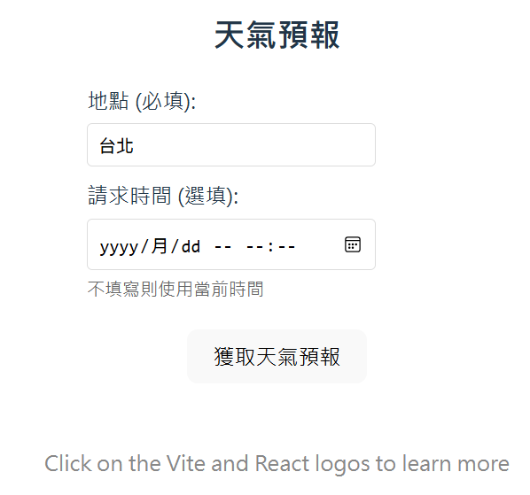
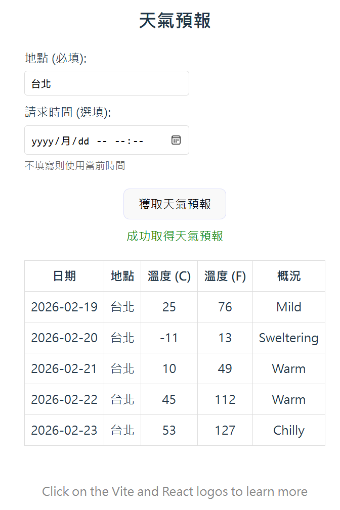

# React API 06 : 呼叫一個 Post 方法 API，傳送 JSON 資料並取得回應

在 React 系列的文章中 [React API 01 : 前端使用 React，後端使用 ASP.NET Core 的測試標準專案](https://csharpkh.blogspot.com/2026/02/csharp-React-Web-Api.html) & [React API 02 : 呼叫一個 Get 方法 API，取得查詢字串內容並將結果渲染到網頁上](https://csharpkh.blogspot.com/2026/02/csharp-React-Get-Query-String.html) & [React API 03 : 呼叫一個 Get 方法 API，取得路由內容並將結果渲染到網頁上](https://csharpkh.blogspot.com/2026/02/csharp-React-Get-Routing-Value.html) & [React API 04 : 呼叫一個 Get 方法 API，傳送與取得 Header 的數值](https://csharpkh.blogspot.com/2026/02/csharp-React-Get-Header.html)  & [React API 05 : 呼叫一個 Get 方法 API，傳送與取得 Cookie 的數值](https://csharpkh.blogspot.com/2026/02/csharp-React-Get-Cookie.html) ，我們已經示範了如何在 React 的前端應用程式中，呼叫後端的 API 端點，並且傳送與取得查詢字串、路由參數、Header 與 Cookie 的數值，來達成前後端的資料交換與互動。

在這篇文章中，我們將示範如何在 React 的前端應用程式中，呼叫後端的 API 端點，並且傳送 JSON 格式的資料，來達成前後端的資料交換與互動。透過這個範例，你將會學習到如何使用 HTTP POST 方法來呼叫 API 端點，並且在請求的 Body 中傳送 JSON 格式的資料，以及如何在 React 中解析與使用從後端回傳的 JSON 資料。

接下來就來嘗試看看這樣的需求如何做到吧！

## 建立 ASP.NET Core Web API 專案
* 開啟 Visual Studio 2026
* 選擇「建立新專案」
* 在 [建立新專案] 視窗中，在右方清單內，找到並選擇「ASP.NET Core Web API」 項目
  >此專案範本可用於使用 ASP.NET Core 控制器或最小 API 建立 RESTful Web API，並可選擇地支援 OpenAPI和驗證
* 然後點擊右下方「下一步」按鈕
* 此時將會看到 [設定新的專案] 對話窗
* 在該對話窗的 [專案名稱] 欄位中，輸入專案名稱，例如 [WebApiDemo]
* 然後點擊右下方「下一步」按鈕
* 接著會看到 [其他資訊] 對話窗
* 在這個對話窗內，確認使用底下的選項
    * 架構：.NET 10.0 (或更新版本)
    * 驗證類型：無
    * 勾選 針對 HTTPS 進行設定
    * 啟用 OpenAPI 支援
    * 勾選 不要使用最上層陳述式 (這是我的個人習慣)
    * 使用控制器
    * 不要勾選 在 .NET Aspire 協調流程中登錄
* 然後點擊右下方「建立」按鈕
* 現在，已經完成了這個 ASP.NET Core Web API 專案的建立

## 修改 API 端點的程式碼
* 在方案總管內，找到並展開 [Controllers] 資料夾
* 找到並打開 [WeatherForecastController.cs] 檔案
* 將該檔案內的程式碼全部刪除，然後將底下的程式碼貼上到該檔案內

```csharp
using Microsoft.AspNetCore.Mvc;

namespace WebApiDemo.Controllers;

[ApiController]
[Route("[controller]")]
public class WeatherForecastController : ControllerBase
{
    private static readonly string[] Summaries = new[]
    {
        "Freezing", "Bracing", "Chilly", "Cool", "Mild", "Warm", "Balmy", "Hot", "Sweltering", "Scorching"
    };

    private readonly ILogger<WeatherForecastController> _logger;

    public WeatherForecastController(ILogger<WeatherForecastController> logger)
    {
        _logger = logger;
    }

    [HttpPost(Name = "PostWeatherForecast")]
    public ApiResult<IEnumerable<WeatherForecast>> Post([FromBody] WeatherRequest request)
    {
        try
        {
            // 驗證輸入資料
            if (string.IsNullOrWhiteSpace(request.Location))
            {
                return ApiResult<IEnumerable<WeatherForecast>>.Failure("地點不能為空");
            }

            // 使用請求的時間作為起始日期，如果沒有提供則使用當前時間
            DateTime startDate = request.RequestTime ?? DateTime.Now;

            // 產生五天天氣預報
            var forecasts = Enumerable.Range(1, 5).Select(index => new WeatherForecast
            {
                Date = DateOnly.FromDateTime(startDate.AddDays(index)),
                TemperatureC = Random.Shared.Next(-20, 55),
                Summary = Summaries[Random.Shared.Next(Summaries.Length)],
                Location = request.Location
            })
            .ToArray();

            _logger.LogInformation("為地點 '{Location}' 在時間 '{RequestTime}' 產生天氣預報",
                request.Location, startDate);

            return ApiResult<IEnumerable<WeatherForecast>>.Success(forecasts, "成功取得天氣預報");
        }
        catch (Exception ex)
        {
            _logger.LogError(ex, "取得天氣預報時發生錯誤");
            return ApiResult<IEnumerable<WeatherForecast>>.Failure("取得天氣預報時發生錯誤");
        }
    }
}

public class WeatherRequest
{
    public string Location { get; set; } = string.Empty;
    public DateTime? RequestTime { get; set; }
}

public class ApiResult<T>
{
    public bool IsSuccess { get; set; }
    public string Message { get; set; } = string.Empty;
    public T? Data { get; set; }
    public DateTime Timestamp { get; set; } = DateTime.UtcNow;

    public static ApiResult<T> Success(T data, string message = "操作成功")
    {
        return new ApiResult<T>
        {
            IsSuccess = true,
            Message = message,
            Data = data
        };
    }

    public static ApiResult<T> Failure(string message)
    {
        return new ApiResult<T>
        {
            IsSuccess = false,
            Message = message,
            Data = default(T)
        };
    }
}
```

這裡定義了一個新的 API 端點 [Post]，它會從 HTTP 請求的 Body 中嘗試讀取一個 JSON 物件，因為在這裡使用了 `[FromBody]` 屬性，因此將會將 Body Payload 資料與 [request] 進行綁定，並且將它反序列化為一個 [WeatherRequest] 的物件，這個物件包含了地點與請求時間兩個屬性。

接著，根據這些參數來產生一組天氣預報資料，並且將這些資料包裝在一個 [ApiResult] 的物件中，這個物件包含了操作是否成功的狀態、訊息、資料以及時間戳記等資訊。最後，將這個 [ApiResult] 物件作為 HTTP 回應的內容回傳給前端。

在這裡對於 [ApiResult] 類別設計一個有泛型與沒有泛型的版本，這樣在需要回傳資料的 API 端點中，就可以使用有泛型的版本來回傳資料，而在不需要回傳資料的 API 端點中，就可以使用沒有泛型的版本來回傳操作結果的狀態與訊息。另外，在這裡也建立了一些方法，[Success] 代表了操作成功的結果，並且可以帶入資料與訊息；[Failure] 代表了操作失敗的結果，並且可以帶入錯誤訊息。

## 建立 React 專案
* 滑鼠右擊解決方案 [WebApiDemo]，選擇「加入」>「新增專案」
* 在 [加入新專案] 視窗中，在右方清單內，找到並選擇「React 個應用程式」 項目
  >請注意選擇具有底下的說明項目的專案範本
  >
  >TypeScript React 專案範本，透過執行 npx 的全域安裝來進行啟動載入
* 然後點擊右下方「下一步」按鈕
* 此時將會看到 [設定新的專案] 對話窗
* 在該對話窗的 [專案名稱] 欄位中，輸入專案名稱，例如 [reactdemo]
* 然後點擊右下方「下一步」按鈕
* 然後點擊右下方「建立」按鈕
* 現在，已經完成了這個 React 個應用程式 專案的建立
* 在方案總管內，將會看到有兩個專案建立起來

## 修改 React 專案的程式碼
* 在方案總管內，找到並展開 [reactdemo] 專案
* 找到並打開 [src] 資料夾內的 [App.tsx] 檔案
* 將該檔案內的程式碼全部刪除，然後將底下的程式碼貼上到該檔案內

```tsx
import { useState } from 'react'
import reactLogo from './assets/react.svg'
import viteLogo from '/vite.svg'
import './App.css'

interface WeatherForecast {
    date: string;
    temperatureC: number;
    temperatureF: number;
    summary: string;
    location?: string;
}

interface ApiResult<T> {
    isSuccess: boolean;
    message: string;
    data: T;
    timestamp: string;
}

interface WeatherRequest {
    location: string;
    requestTime?: string;
}

function App() {
    const [count, setCount] = useState(0)
    const [forecasts, setForecasts] = useState<WeatherForecast[]>([])
    const [loading, setLoading] = useState(false)
    const [error, setError] = useState('')
    const [location, setLocation] = useState('台北')
    const [requestTime, setRequestTime] = useState('')
    const [apiMessage, setApiMessage] = useState('')

    const fetchWeatherForecast = async () => {
        if (!location.trim()) {
            setError('請輸入地點')
            return
        }

        setLoading(true)
        setError('')
        setApiMessage('')

        try {
            const requestData: WeatherRequest = {
                location: location.trim(),
                requestTime: requestTime || undefined
            }

            const response = await fetch('https://localhost:7074/weatherforecast', {
                method: 'POST',
                headers: {
                    'Content-Type': 'application/json',
                },
                body: JSON.stringify(requestData)
            })

            if (!response.ok) {
                throw new Error(`API 請求失敗: ${response.status}`)
            }

            const apiResult: ApiResult<WeatherForecast[]> = await response.json()
            
            if (apiResult.isSuccess) {
                setForecasts(apiResult.data || [])
                setApiMessage(apiResult.message)
            } else {
                setError(apiResult.message)
            }
        } catch (err) {
            setError(err instanceof Error ? err.message : '獲取天氣預報時發生錯誤')
            console.error('獲取天氣預報時發生錯誤:', err)
        } finally {
            setLoading(false)
        }
    }

    const getCurrentDateTime = () => {
        const now = new Date()
        return now.toISOString().slice(0, 16) // YYYY-MM-DDTHH:mm 格式
    }

    return (
        <>
            <div>
                <a href="https://vite.dev" target="_blank">
                    
                </a>
                <a href="https://react.dev" target="_blank">
                    
                </a>
            </div>
            <h1>Vite + React</h1>
            <div className="card">
                <button onClick={() => setCount((count) => count + 1)}>
                    count is {count}
                </button>
                <p>
                    Edit <code>src/App.tsx</code> and save to test HMR
                </p>
            </div>

            {/* 天氣預報區塊 */}
            <div className="card" style={{ marginTop: '20px' }}>
                <h2>天氣預報</h2>
                
                {/* 輸入表單 */}
                <div style={{ marginBottom: '20px', textAlign: 'left' }}>
                    <div style={{ marginBottom: '10px' }}>
                        <label style={{ display: 'block', marginBottom: '5px' }}>
                            地點 (必填):
                        </label>
                        <input
                            type="text"
                            value={location}
                            onChange={(e) => setLocation(e.target.value)}
                            placeholder="請輸入地點，例如：台北"
                            style={{ 
                                padding: '8px', 
                                width: '200px',
                                border: '1px solid #ddd',
                                borderRadius: '4px'
                            }}
                        />
                    </div>
                    
                    <div style={{ marginBottom: '10px' }}>
                        <label style={{ display: 'block', marginBottom: '5px' }}>
                            請求時間 (選填):
                        </label>
                        <input
                            type="datetime-local"
                            value={requestTime}
                            onChange={(e) => setRequestTime(e.target.value)}
                            placeholder={getCurrentDateTime()}
                            style={{ 
                                padding: '8px', 
                                width: '200px',
                                border: '1px solid #ddd',
                                borderRadius: '4px'
                            }}
                        />
                        <small style={{ display: 'block', color: '#666', marginTop: '5px' }}>
                            不填寫則使用當前時間
                        </small>
                    </div>
                </div>

                <button onClick={fetchWeatherForecast} disabled={loading}>
                    {loading ? '獲取中...' : '獲取天氣預報'}
                </button>

                {error && <p style={{ color: 'red', marginTop: '10px' }}>{error}</p>}
                {apiMessage && <p style={{ color: 'green', marginTop: '10px' }}>{apiMessage}</p>}

                {forecasts.length > 0 && (
                    <div style={{ marginTop: '20px' }}>
                        <table style={{ width: '100%', borderCollapse: 'collapse' }}>
                            <thead>
                                <tr>
                                    <th style={{ border: '1px solid #ddd', padding: '8px' }}>日期</th>
                                    <th style={{ border: '1px solid #ddd', padding: '8px' }}>地點</th>
                                    <th style={{ border: '1px solid #ddd', padding: '8px' }}>溫度 (C)</th>
                                    <th style={{ border: '1px solid #ddd', padding: '8px' }}>溫度 (F)</th>
                                    <th style={{ border: '1px solid #ddd', padding: '8px' }}>概況</th>
                                </tr>
                            </thead>
                            <tbody>
                                {forecasts.map((forecast, index) => (
                                    <tr key={index}>
                                        <td style={{ border: '1px solid #ddd', padding: '8px' }}>{forecast.date}</td>
                                        <td style={{ border: '1px solid #ddd', padding: '8px' }}>{forecast.location || '未指定'}</td>
                                        <td style={{ border: '1px solid #ddd', padding: '8px' }}>{forecast.temperatureC}</td>
                                        <td style={{ border: '1px solid #ddd', padding: '8px' }}>{forecast.temperatureF}</td>
                                        <td style={{ border: '1px solid #ddd', padding: '8px' }}>{forecast.summary}</td>
                                    </tr>
                                ))}
                            </tbody>
                        </table>
                    </div>
                )}
            </div>

            <p className="read-the-docs">
                Click on the Vite and React logos to learn more
            </p>
        </>
    )
}

export default App
```

在這個 [App.tsx] 的程式碼中，我們定義了一個 React 的功能性元件 [App]，在這個元件內，我們使用了 React 的 `useState` Hook 來定義了一些狀態變數，例如 [count]、[forecasts]、[loading]、[error]、[location]、[requestTime] 與 [apiMessage] 等等，這些變數分別用來儲存按鈕點擊的次數、從 API 取得的天氣預報資料、是否正在載入資料、錯誤訊息、輸入的地點、輸入的請求時間以及 API 回傳的訊息等等。

在這個元件內，我們定義了一個名為 [fetchWeatherForecast] 的非同步函數，當使用者點擊「獲取天氣預報」按鈕時，會呼叫這個函數來向後端的 API 端點發送一個 POST 請求，並且將輸入的地點與請求時間作為 JSON 資料放在請求的 Body 中傳送給後端。這裡使用了 await fetch('https://localhost:7074/weatherforecast') 來呼叫後端的 API 端點，並且使用了 JSON.stringify(requestData) 來將請求資料轉換成 JSON 字串。而在 [fetch] 函數中，我們也設定了請求的 HTTP 方法為 POST，並且設定了 Content-Type 為 application/json，以告訴後端這是一個 JSON 格式的請求。

當後端處理完成後，會回傳一個 [ApiResult] 格式的 JSON 物件，前端會根據這個物件的內容來更新狀態變數，並且將天氣預報資料渲染到網頁上。

## 設定同時啟動多個專案
* 在這個方案內，擁有兩個專案，分別是 [WebApiDemo] 與 [reactdemo]
* 前者是 ASP.NET Core Web API 專案，後者是 React 的前端專案
* 因此，我們需要設定 Visual Studio 來同時啟動這兩個專案，才能在開發過程中同時測試前後端的功能
* 在方案總管內，右擊方案 [WebApiDemo]，選擇 [設定啟動專案]
* 在 [方案 'ReactWebApi' 屬性頁] 對話窗內，選擇 [多個啟動專案] 的選項
* 在下方的專案列表內，找到 [WebApiDemo] 與 [reactdemo] 這兩個專案
* 將這兩個專案的 [動作] 欄位都設定為 [啟動]
* 然後點擊右下方的 [確定] 按鈕，來儲存這個設定


## 修正 CORS 的問題
* 這個錯誤訊息表示了，因為 CORS 的政策限制，導致前端的 React 應用程式無法成功呼叫後端的 API 端點
* 為了修正這個問題，我們需要在後端的 ASP.NET Core Web API 專案中，加入對 CORS 的支援
* 打開 [Program.cs] 檔案
* 在該檔案內，找到 `builder.Services.AddOpenApi();` 這一行
* 在這一行的下方，加入底下的程式碼，來設定 CORS 的政策，允許來自 `http://localhost:49158` 的請求

```csharp
builder.Services.AddCors(options =>
{
    options.AddPolicy("AllowReactApp", policy =>
    {
        policy.WithOrigins("http://localhost:49158") // React 應用運行在此端口
                .AllowAnyHeader()
                .AllowAnyMethod()
                ;
    });
});
```

* 這裡使用了 `AddCors` 方法來加入 CORS 的服務，並定義了一個名為 "AllowReactApp" 的政策，該政策允許來自 `http://localhost:49158` 的請求，並且允許任何標頭和方法(這裡使用這些方法 [AllowAnyHeader()] & [AllowAnyMethod()] 是為了簡化測試，實際上在生產環境中，建議根據需求來限制允許的標頭和方法，以增強安全性)
* 接著找到 `app.UseHttpsRedirection();` 這一行
* 在這一行的下方，加入底下的程式碼，來啟用 CORS 的中介軟體，並指定使用剛剛設定的 CORS 政策

```csharp
#region 使用 CORS 中介軟體 - 必須放在管道的早期位置
app.UseCors("AllowReactApp");
#endregion
```

* 這裡使用了 `UseCors` 方法來啟用 CORS 的中介軟體，並指定使用 "AllowReactApp" 這個政策
* 儲存 [Program.cs] 的修改

## 執行程式

* 按下 F5 鍵或點擊「開始」按鈕來執行程式
* 此時，會出現 React 設計的網頁，如下圖所示

* 在網頁最下方，可以看到兩個要輸入的欄位
* 地點與請求時間，請隨意輸入任何值到這兩個欄位中
* 例如，地點輸入「Taipei」，日期輸入「2024-06-01」
* 然後點擊 [獲取天氣預報] 的按鈕
* 此時，React 的前端應用程式會呼叫後端的 API 端點，並將地點與日期作為 Cookie 參數傳送給後端
* 後端的 API 端點會根據接收到的地點與日期來產生對應的天氣預報資料，並將這些資料以 JSON 格式`,透過 cookie 回傳給前端
* 現在應該就可以成功從後端的 API 端點獲取到天氣預報資料，並且將它們渲染到網頁上了

