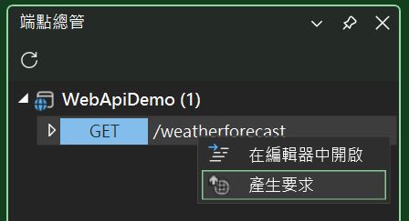
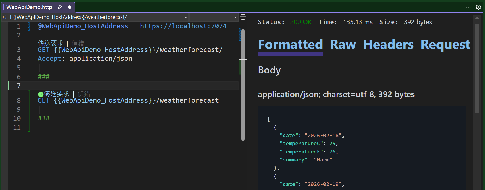
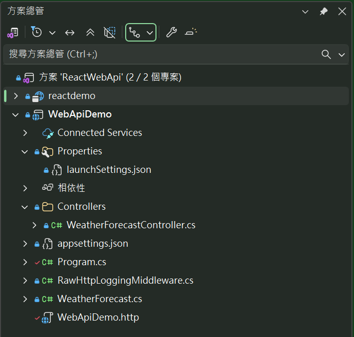
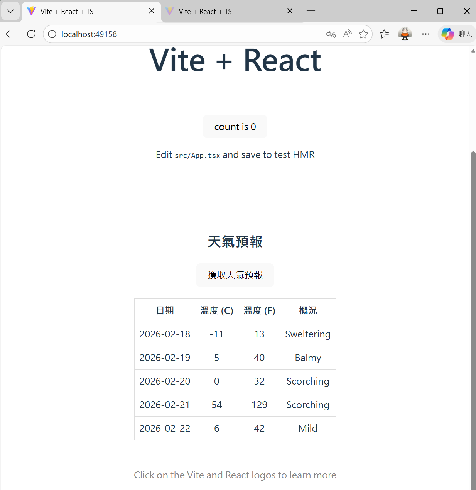

# React API 01 : 前端使用 React，後端使用 ASP.NET Core 的測試標準專案

在這個文章中，將會一開始建立一個 [ASP.NET Core Web API] 專案，並在同一個解決方案內，再建立一個 [React 個應用程式] 的專案。接著，會修改 React 專案的程式碼，來呼叫後端的 API 端點，並將回傳的資料渲染到網頁上。

在這裡不會新建立一個 Web API，而是直接使用 Visual Studio 2026 所提供的 [ASP.NET Core Web API] 專案範本，來建立一個預設的 Web API 專案。這個專案範本已經包含了一個預設的 API 端點 [GET /WeatherForecast]，當呼叫這個 API 端點時，會回傳一個天氣預報的資料清單。

當然，這裡也會建立一個新的 [React 個應用程式] 專案，並修改該專案的程式碼，來呼叫後端的 [GET /WeatherForecast] API 端點，並將回傳的天氣預報資料渲染到網頁上。

在整個開發與測試過程中，將會遇到 [CORS] 的問題，因為前端的 React 應用程式和後端的 ASP.NET Core Web API 是在不同的埠號上運行的，所以會受到瀏覽器的同源政策限制。為了解決這個問題，我們需要在後端的 ASP.NET Core Web API 專案中，加入對 CORS 的支援，來允許來自 React 應用程式的請求。

## 建立 ASP.NET Core Web API 專案
* 開啟 Visual Studio 2026
* 選擇「建立新專案」
* 在 [建立新專案] 視窗中，在右方清單內，找到並選擇「ASP.NET Core Web API」 項目
  >此專案範本可用於使用 ASP.NET Core 控制器或最小 API 建立 RESTful Web API，並可選擇地支援 OpenAPI和驗證
* 然後點擊右下方「下一步」按鈕
* 此時將會看到 [設定新的專案] 對話窗
* 在該對話窗的 [專案名稱] 欄位中，輸入專案名稱，例如 [WebApiDemo]
* 然後點擊右下方「下一步」按鈕
* 接著會看到 [其他資訊] 對話窗
* 在這個對話窗內，確認使用底下的選項
    * 架構：.NET 10.0 (或更新版本)
    * 驗證類型：無
    * 勾選 針對 HTTPS 進行設定
    * 啟用 OpenAPI 支援
    * 勾選 不要使用最上層陳述式 (這是我的個人習慣)
    * 使用控制器
    * 不要勾選 在 .NET Aspire 協調流程中登錄
* 然後點擊右下方「建立」按鈕
* 現在，已經完成了這個 ASP.NET Core Web API 專案的建立

## 執行程式

首先先來看這個專案的執行結果：

* 按下 F5 鍵或點擊「開始」按鈕來執行程式
* 點選功能表 [檢視] > [其他視窗] > [端點總管]，開啟 [端點總管] 視窗


* 在 [端點總管] 視窗內，將會看到已經有一些預設的 API 端點建立起來了
* 從 [端點總管] 視窗內，滑鼠右擊 [GET /WeatherForecast] 這個 API 端點
* 從彈出視窗內，點選 [產生要求]，來產生一個 API 呼叫的要求



* 從 [WebApiDemo.http] 的編輯器視窗內，找到 `GET {{WebApiDemo_HostAddress}}/weatherforecast` 這一行
* 點擊 [傳送要求] 按鈕，來執行這個 API 呼叫的要求
* 此時，從該視窗的右方，將會看到呼叫此 API 的執行結果，包含 HTTP 狀態碼、回應內容等資訊



* 若可以看到這些內容，就表示這個 API 呼叫的要求已經成功執行了

## 建立 React 專案
* 滑鼠右擊解決方案 [WebApiDemo]，選擇「加入」>「新增專案」
* 在 [加入新專案] 視窗中，在右方清單內，找到並選擇「React 個應用程式」 項目
  >請注意選擇具有底下的說明項目的專案範本
  >
  >TypeScript React 專案範本，透過執行 npx 的全域安裝來進行啟動載入
* 然後點擊右下方「下一步」按鈕
* 此時將會看到 [設定新的專案] 對話窗
* 在該對話窗的 [專案名稱] 欄位中，輸入專案名稱，例如 [reactdemo]
* 然後點擊右下方「下一步」按鈕
* 然後點擊右下方「建立」按鈕
* 現在，已經完成了這個 React 個應用程式 專案的建立
* 在方案總管內，將會看到有兩個專案建立起來
  

## 修改 React 專案的程式碼
* 在方案總管內，找到並展開 [reactdemo] 專案
* 找到並打開 [src] 資料夾內的 [App.tsx] 檔案
* 將該檔案內的程式碼全部刪除，然後將底下的程式碼貼上到該檔案內

```tsx
import { useState } from 'react'
import reactLogo from './assets/react.svg'
import viteLogo from '/vite.svg'
import './App.css'

// 定義 WeatherForecast 型別，對應後端的資料結構
interface WeatherForecast {
    date: string;
    temperatureC: number;
    temperatureF: number;
    summary: string;
}

function App() {
    const [count, setCount] = useState(0)
    const [forecasts, setForecasts] = useState<WeatherForecast[]>([])
    const [loading, setLoading] = useState(false)
    const [error, setError] = useState('')

    // 獲取天氣預報資料的函數
    const fetchWeatherForecast = async () => {
        setLoading(true)
        setError('')

        try {
            const response = await fetch('https://localhost:7074/weatherforecast')

            if (!response.ok) {
                throw new Error(`API 請求失敗: ${response.status}`)
            }

            const data = await response.json()
            setForecasts(data)
        } catch (err) {
            setError(err instanceof Error ? err.message : '獲取天氣預報時發生錯誤')
            console.error('獲取天氣預報時發生錯誤:', err)
        } finally {
            setLoading(false)
        }
    }

    return (
        <>
            <div>
                <a href="https://vite.dev" target="_blank">
                    
                </a>
                <a href="https://react.dev" target="_blank">
                    
                </a>
            </div>
            <h1>Vite + React</h1>
            <div className="card">
                <button onClick={() => setCount((count) => count + 1)}>
                    count is {count}
                </button>
                <p>
                    Edit <code>src/App.tsx</code> and save to test HMR
                </p>
            </div>

            {/* 天氣預報區塊 */}
            <div className="card" style={{ marginTop: '20px' }}>
                <h2>天氣預報</h2>
                <button onClick={fetchWeatherForecast} disabled={loading}>
                    {loading ? '獲取中...' : '獲取天氣預報'}
                </button>

                {error && <p style={{ color: 'red' }}>{error}</p>}

                {forecasts.length > 0 && (
                    <div style={{ marginTop: '20px' }}>
                        <table style={{ width: '100%', borderCollapse: 'collapse' }}>
                            <thead>
                                <tr>
                                    <th style={{ border: '1px solid #ddd', padding: '8px' }}>日期</th>
                                    <th style={{ border: '1px solid #ddd', padding: '8px' }}>溫度 (C)</th>
                                    <th style={{ border: '1px solid #ddd', padding: '8px' }}>溫度 (F)</th>
                                    <th style={{ border: '1px solid #ddd', padding: '8px' }}>概況</th>
                                </tr>
                            </thead>
                            <tbody>
                                {forecasts.map((forecast, index) => (
                                    <tr key={index}>
                                        <td style={{ border: '1px solid #ddd', padding: '8px' }}>{forecast.date}</td>
                                        <td style={{ border: '1px solid #ddd', padding: '8px' }}>{forecast.temperatureC}</td>
                                        <td style={{ border: '1px solid #ddd', padding: '8px' }}>{forecast.temperatureF}</td>
                                        <td style={{ border: '1px solid #ddd', padding: '8px' }}>{forecast.summary}</td>
                                    </tr>
                                ))}
                            </tbody>
                        </table>
                    </div>
                )}
            </div>

            <p className="read-the-docs">
                Click on the Vite and React logos to learn more
            </p>
        </>
    )
}

export default App
```

在這個 [App.tsx] 的程式碼中，定義了一個 `WeatherForecast` 的 TypeScript 介面，來對應後端 API 回傳的資料結構。接著，使用 React 的 `useState` Hook 來管理天氣預報資料、載入狀態和錯誤訊息。

另外，定義了一個 `fetchWeatherForecast` 的非同步函數，來呼叫後端的 API 端點，並將回傳的資料存到 `forecasts` 的狀態中。如果在呼叫 API 的過程中發生錯誤，會將錯誤訊息存到 `error` 的狀態中。在 JSX 的部分，建立了一個按鈕，當使用者點擊時會呼叫 `fetchWeatherForecast` 函數來獲取天氣預報資料。當資料成功獲取後，會將資料以表格的形式顯示在畫面上。如果在獲取資料的過程中發生錯誤，我們會在畫面上顯示錯誤訊息。

## 執行程式

首先先來看這個專案的執行結果：

* 滑鼠右擊 [reactdemo] 專案，選擇 [偵錯] > [啟動新的執行個體]，來啟動這個 React 專案
* 此時，將會開啟一個新的瀏覽器視窗，並載入 React 的應用程式

* 在該視窗內，找到並點擊「獲取天氣預報」的按鈕
* 可是，卻看到了一個錯誤訊息，顯示 [Failed to fetch]
* 這表示了，React 的前端應用程式無法成功呼叫後端的 API 端點，來獲取天氣預報資料
* 在網頁上啟動 [開發人員]工具，切換到 [Console] 分頁
* 在 [Console] 分頁內，將會看到一個錯誤訊息，顯示 [Access to fetch at 'https://localhost:7074/weatherforecast' from origin 'http://localhost:49158' has been blocked by CORS policy: No 'Access-Control-Allow-Origin' header is present on the requested resource.]


## 修正 CORS 的問題
* 這個錯誤訊息表示了，因為 CORS 的政策限制，導致前端的 React 應用程式無法成功呼叫後端的 API 端點
* 為了修正這個問題，我們需要在後端的 ASP.NET Core Web API 專案中，加入對 CORS 的支援
* 打開 [Program.cs] 檔案
* 在該檔案內，找到 `builder.Services.AddOpenApi();` 這一行
* 在這一行的下方，加入底下的程式碼，來設定 CORS 的政策，允許來自 `http://localhost:49158` 的請求

```csharp
builder.Services.AddCors(options =>
{
    options.AddPolicy("AllowReactApp", policy =>
    {
        policy.WithOrigins("http://localhost:49158") // React 應用運行在此端口
                .AllowAnyHeader()
                .AllowAnyMethod();
    });
});
```

* 這裡使用了 `AddCors` 方法來加入 CORS 的服務，並定義了一個名為 "AllowReactApp" 的政策，該政策允許來自 `http://localhost:49158` 的請求，並且允許任何標頭和方法(這裡使用這些方法 [AllowAnyHeader()] & [AllowAnyMethod()] 是為了簡化測試，實際上在生產環境中，建議根據需求來限制允許的標頭和方法，以增強安全性)
* 接著找到 `app.UseHttpsRedirection();` 這一行
* 在這一行的下方，加入底下的程式碼，來啟用 CORS 的中介軟體，並指定使用剛剛設定的 CORS 政策

```csharp
#region 使用 CORS 中介軟體 - 必須放在管道的早期位置
app.UseCors("AllowReactApp");
#endregion

```

* 這裡使用了 `UseCors` 方法來啟用 CORS 的中介軟體，並指定使用 "AllowReactApp" 這個政策
* 儲存 [Program.cs] 的修改

## 執行程式

* 停止這個專案
* 再次按下 F5 鍵或點擊「開始」按鈕來執行程式
* 使用滑鼠右擊 React 專案 [reactdemo]，選擇 [偵錯] > [啟動新的執行個體]，來啟動這個 React 專案
* 此時，將會開啟一個新的瀏覽器視窗，並載入 React 的應用程式
* 在該視窗內，找到並點擊「獲取天氣預報」的按鈕
* 現在，已經成功獲取了天氣預報資料，並將資料以表格的形式顯示在畫面上了

