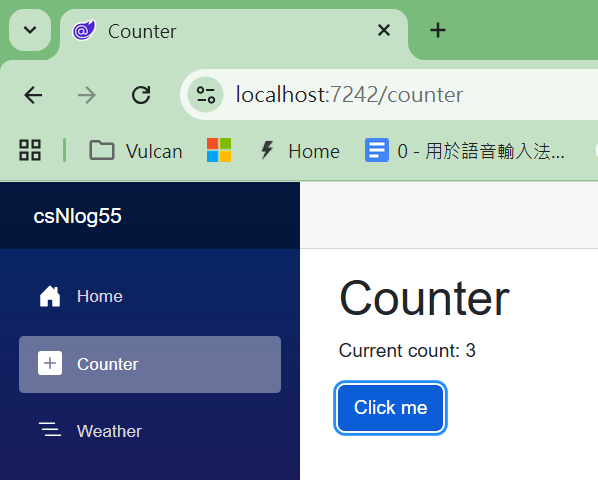

# 在 ASP.NET Core 框架下，如何使用 NLog 5.5 進行日誌記錄

對於一個 Web 系統開發中，日誌記錄是一個非常重要的功能，它可以幫助開發者了解應用程式的運行狀態、追蹤錯誤、分析性能等。在 ASP.NET Core 框架下，NLog 是一個流行的日誌記錄庫，提供了豐富的功能來幫助開發者實現高效的日誌記錄。

想要能夠使用與操作 NLog 5.5 來進行日誌記錄，首先需要在 ASP.NET Core 專案中安裝 NLog.Web.AspNetCore 套件，然後建立 NLog 的配置檔案來定義日誌的格式、級別、目標等。接下來，在程式碼中使用 NLog 的 API 來記錄日誌，例如在 Counter 元件中記錄當前計數的值。

## 建立 Blazor 專案
* 開啟 Visual Studio 2026
* 選擇「建立新專案」
* 在 [建立新專案] 視窗中，在右方清單內，找到並選擇「Blazor Web 應用程式」 項目
* 然後點擊右下方「下一步」按鈕
* 此時將會看到 [設定新的專案] 對話窗
* 在該對話窗的 [專案名稱] 欄位中，輸入專案名稱，例如 [csNlog55]
* 然後點擊右下方「下一步」按鈕
* 接著會看到 [其他資訊] 對話窗
* 在這個對話窗內，確認使用底下的選項
    * 架構：.NET 10.0 (或更新版本)
    * 驗證類型：無
    * 勾選 針對 HTTPS 進行設定
    * 互動式轉譯模式：伺服器
    * 互動功能位置：全球
    * 勾選 包和範例頁面
    * 勾選 不要使用最上層陳述式 (這是我的個人習慣)
    * 不要勾選 在應用程式 URL 中使用 .dev.localhost TLD
    * 不要勾選 在 .NET Aspire 協調流程中登錄
* 然後點擊右下方「建立」按鈕
* 現在，已經完成了這個 Blazor 專案的建立

## 安裝 NLog.Web.AspNetCore 套件

套件 NLog 是一個流行的日誌記錄庫，提供了豐富的功能來幫助開發者記錄應用程式的運行狀態。這個套件的特色有：
* 支援多種日誌目標：NLog 可以將日誌輸出到多種目標，例如檔案、資料庫、控制台、電子郵件等，讓開發者可以根據需求選擇適合的日誌存儲方式。
* 高度可配置：NLog 提供了靈活的配置選項，開發者可以通過 XML 或程式碼來配置日誌的格式、級別、目標等，滿足不同應用程式的需求。
* 性能優越：NLog 的設計注重性能，能夠高效地處理大量的日誌記錄，並且支持異步日誌記錄，減少對應用程式性能的影響。

在這個專案中，將使用 NLog.Web.AspNetCore 這個套件來實現日誌記錄的功能。

使用底下方式進行安裝此套件

* 在 Visual Studio 的「方案總管」視窗中，右鍵點擊專案名稱
* 從右鍵選單中，選擇「管理 NuGet 套件」
* 在 NuGet 套件管理器視窗中，切換到「瀏覽」標籤頁
* 在搜尋框中，輸入 "NLog.Web.AspNetCore" 並按下 Enter 鍵
* 從搜尋結果中，找到 "NLog.Web.AspNetCore" 套件 並點擊它
* 在這裡的範例中，使用該套件的版本為 5.5.0
* 在右側的詳細資訊面板中，點擊「安裝」按鈕

## 建立 NLog 配置檔案
* 滑鼠右擊專案根目錄節點
* 從右鍵選單中，選擇 [加入] > [新增項目]
  >使用 [顯示精簡模式]
* 在 [加入新項目] 對話窗的搜尋框中，輸入 "nlog.config" 並按下 Enter 鍵
* 打開這個檔案，將底下的 XML 配置內容複製並貼上到這個檔案中：

```xml
<?xml version="1.0" encoding="utf-8" ?>
<nlog xmlns="http://www.nlog-project.org/schemas/NLog.xsd"
	  xmlns:xsi="http://www.w3.org/2001/XMLSchema-instance"
	  autoReload="true"
      throwConfigExceptions="true"
      internalLogLevel="Info">

	<extensions>
		<add assembly="NLog.Web.AspNetCore"/>
	</extensions>

	<targets>
		<!-- 文件输出目标 -->
		<target xsi:type="AsyncWrapper" name="file_async"
				overflowAction="Discard"
				queueLimit="10000"
				batchSize="1"
				timeToSleepBetweenBatches="50"
				optimizeBufferReuse="true"
				fullBatchSizeWriteLimit="5"
				>
			<target name="file" xsi:type="File"
					fileName="${var:BasePath}/${var:LogFilenamePrefix}-${shortdate}.log"
					layout="${longdate}|${aspnet-TraceIdentifier}|${level:uppercase=true}|${threadid}|${logger}|${message}|${exception:format=toString,StackTrace:maxInnerExceptionLevel=5}"
					keepFileOpen="true"
					concurrentWrites="false"
					openFileCacheTimeout="30"
					enableFileDelete="true"
					autoFlush="true"
					bufferSize="8192"
					archiveDateFormat="yyyy-MM-dd"
					archiveNumbering="Date"
					encoding="utf-8"
					archiveEvery="Day"
					maxArchiveDays="30"
					archiveAboveSize="104857600"
					enableArchiveFileCompression="true"/>
		</target>
		<!-- 控制台输出目标 -->
		<target xsi:type="AsyncWrapper" name="console_async"
		overflowAction="Discard"
		queueLimit="500000"
		batchSize="500">
			<target name="console" xsi:type="Console"
				layout="${longdate}|${mdlc:TraceId}|${level:uppercase=true}|${logger}|${threadid}|${message}|${exception:format=toString,StackTrace}" />
		</target>
	</targets>

	<rules>
		 1. Microsoft.Hosting.Lifetime - 明确记录 Info 及以上 
		<logger name="Microsoft.Hosting.Lifetime*" minlevel="Info" writeTo="file_async,console_async" final="true" />

		 2. 抑制其他 Microsoft.* 和 System.* 的 Info 级别日志，只记录 Warn 及以上 
		<logger name="Microsoft.AspNetCore.Hosting.Diagnostics" finalMinLevel="Warn" />
		<logger name="Microsoft.AspNetCore.Routing.*" finalMinLevel="Warn" />
		<logger name="Microsoft.AspNetCore.StaticAssets.*" finalMinLevel="Warn" />
		<logger name="Microsoft.*" minlevel="Warn" writeTo="file_async,console_async" final="true" />
		<logger name="System.*" minlevel="Warn" writeTo="file_async,console_async" final="true" />

		 3. 其他所有应用程序日志 - 记录 Info 及以上 
		<logger name="*" minlevel="Info" writeTo="file_async,console_async" />
	</rules>


</nlog>
```

* 現在來詳細了解這個設定檔案的內容
* 在這個 [nlog] 節點下有這些屬性 [autoReload] 表示當配置文件發生變化時，NLog 會自動重新加載配置，這樣就不需要重啟應用程式來應用新的配置。 [throwConfigExceptions] 表示當配置文件中存在錯誤時，NLog 會拋出異常，這有助於開發者及時發現和修正配置問題。 [internalLogLevel] 設置了 NLog 的內部日誌記錄級別，這裡設置為 "Info"，表示 NLog 會記錄信息級別及以上的內部日誌。
* 在 [extensions] 節點中，添加了 NLog.Web.AspNetCore 擴展，這樣就可以使用這個擴展提供的功能來記錄 ASP.NET Core 應用程式的日誌。
* 在 [targets] 節點中，定義了兩個日誌目標，一個是文件輸出目標，另一個是控制台輸出目標。
* 日誌檔案輸出目標使用了 AsyncWrapper 包裝器來實現異步日誌記錄，這樣可以提高性能並減少對應用程式的影響。
*控制台輸出目標也使用了 AsyncWrapper 包裝器來實現異步日誌記錄。
* 載名稱為 [file_async] 的 [AsyncWrapper]，這裡宣告了 [overflowAction] 屬性，表示了當日誌記錄隊列滿了之後的處理方式，這裡設置為 "Discard"，表示丟棄新的日誌記錄。 [queueLimit] 表示日誌記錄隊列的最大長度，這裡設置為 10000。 [batchSize] 表示每批次處理的日誌記錄數量，這裡設置為 1。 [timeToSleepBetweenBatches] 表示每批次處理之間的休眠時間，這裡設置為 50 毫秒。 [optimizeBufferReuse] 表示是否優化緩衝區重用，這裡設置為 true。 [fullBatchSizeWriteLimit] 表示在寫入日誌記錄時，如果批次大小達到這個限制，就會強制寫入，即使 batchSize 還沒有達到。
* 在 [file] 目標中，定義了日誌檔案的名稱、格式、緩衝區大小、歸檔規則等屬性。 [fileName] 屬性使用了 NLog 的變量來定義日誌檔案的路徑和名稱，這裡使用了 ${var:BasePath} 和 ${var:LogFilenamePrefix} 兩個變量來組合出日誌檔案的完整路徑和名稱。[keepFileOpen] 表示是否保持文件打開狀態，這裡設置為 true。 [concurrentWrites] 表示是否允許多個線程同時寫入日誌文件，這裡設置為 false。 [openFileCacheTimeout] 表示文件緩存的超時時間，這裡設置為 30 秒。 [enableFileDelete] 表示是否允許刪除日誌文件，這裡設置為 true。 [autoFlush] 表示是否自動刷新日誌記錄到文件，這裡設置為 true。 [bufferSize] 表示日誌記錄的緩衝區大小，這裡設置為 8192 字節。 [archiveDateFormat] 表示歸檔文件的日期格式，這裡設置為 "yyyy-MM-dd"。 [archiveNumbering] 表示歸檔文件的編號方式，這裡設置為 "Date"，表示按照日期來編號。 [archiveEvery] 表示歸檔的頻率，這裡設置為 "Day"，表示每天進行一次歸檔。 [maxArchiveDays] 表示保留的歸檔文件的最大天數，這裡設置為 30 天。 [archiveAboveSize] 表示當日誌文件大小超過這個值時進行歸檔，這裡設置為 104857600 字節（100 MB）。 [enableArchiveFileCompression] 表示是否啟用歸檔文件壓縮，這裡設置為 true。
 
 [layout] 屬性定義了日誌記錄的格式，這裡使用了多種 NLog 的佔位符來組合出日誌記錄的內容，例如 ${longdate} 表示長日期格式，${aspnet-TraceIdentifier} 表示 ASP.NET Core 的 Trace Identifier，${level:uppercase=true} 表示日誌級別並轉換為大寫，${threadid} 表示線程 ID，${logger} 表示記錄器名稱，${message} 表示日誌消息，${exception:format=toString,StackTrace:maxInnerExceptionLevel=5} 表示異常信息的格式。 
 
* 在 [rules] 節點中，定義了日誌記錄的規則，這裡定義了三條規則。第一條規則明確記錄 Microsoft.Hosting.Lifetime 的 Info 及以上級別的日誌，並且將這些日誌寫入到 file_async 和 console_async 這兩個目標中。第二條規則抑制其他 Microsoft.* 和 System.* 的 Info 級別日誌，只記錄 Warn 及以上級別的日誌。第三條規則表示其他所有應用程式的日誌，記錄 Info 及以上級別的日誌，並且寫入到 file_async 和 console_async 這兩個目標中。

## 修正 Program.cs 檔案
* 在專案根目錄下，找到 [Program.cs] 檔案並打開它
* 在這個檔案中，將原有的內容全，使用底下程式碼取代：

```csharp
using csNlog55.Components;
using NLog;
using NLog.Web;

namespace csNlog55;

public class Program
{
    public static void Main(string[] args)
    {
        try
        {
            var builder = WebApplication.CreateBuilder(args);

            #region NLog 相關設定
            var nlogBasePrefixPath = builder.Configuration.GetValue<string>("NLog:BasePath");
            var baseNamespace = typeof(Program).Namespace;

            string nlogBasePath = null;
            if (!string.IsNullOrWhiteSpace(nlogBasePrefixPath))
            {
                nlogBasePath = Path.Combine(nlogBasePrefixPath, baseNamespace);
                Directory.CreateDirectory(nlogBasePath);

                NLog.Common.InternalLogger.LogLevel = NLog.LogLevel.Info;
                NLog.Common.InternalLogger.LogFile = Path.Combine(nlogBasePath, $"{baseNamespace}-nlog-internal.log");

                LogManager.Configuration.Variables["BasePath"] = nlogBasePath;
                LogManager.Configuration.Variables["LogFilenamePrefix"] = $"{baseNamespace}-logfile";

            }

            builder.Logging.ClearProviders();
            builder.Host.UseNLog();
            #endregion

            // Add services to the container.
            builder.Services.AddRazorComponents()
                .AddInteractiveServerComponents();

            var app = builder.Build();

            LogManager.GetCurrentClassLogger().Info("Application built successfully");

            // Configure the HTTP request pipeline.
            if (!app.Environment.IsDevelopment())
            {
                app.UseExceptionHandler("/Error");
                // The default HSTS value is 30 days. You may want to change this for production scenarios, see https://aka.ms/aspnetcore-hsts.
                app.UseHsts();
            }

            app.UseStatusCodePagesWithReExecute("/not-found", createScopeForStatusCodePages: true);
            app.UseHttpsRedirection();

            app.UseAntiforgery();

            app.MapStaticAssets();
            app.MapRazorComponents<App>()
                .AddInteractiveServerRenderMode();

            app.Run();
        }
        catch (Exception ex)
        {
            LogManager.GetCurrentClassLogger().Error(ex, "Stopped program because of an exception");
            throw;
        }
        finally
        {
            LogManager.Shutdown();
        }
    }
}
```

* 現在來詳細了解這段程式碼的內容
* 在這段程式碼中，首先在 Main 方法中使用 try-catch-finally 結構來確保在應用程式運行過程中能夠捕獲異常並進行適當的處理，最後確保 NLog 的資源能夠正確釋放。
* 在 try 區塊中，創建了一個 WebApplicationBuilder 實例 `var builder = WebApplication.CreateBuilder(args);`，這是 ASP.NET Core 10.0 中用於構建 Web 應用程式的主要入口點。
* 在這個 #region NLog 相關設定 區塊中
* 從配置中獲取了 NLog 的基礎路徑 `var nlogBasePrefixPath = builder.Configuration.GetValue<string>("NLog:BasePath");`，這個值可以在 appsettings.json 或其他配置源中進行設置。
* 然後獲取了當前類的命名空間 `var baseNamespace = typeof(Program).Namespace;`，這樣就可以將日誌文件存儲在一個以命名空間為基礎的目錄中。
* 接下來，檢查了 nlogBasePrefixPath 是否為空，如果不為空，就組合出完整的 nlogBasePath，並且創建這個目錄 `Directory.CreateDirectory(nlogBasePath);`。
* 然後設置了 NLog 的內部日誌記錄級別和內部日誌文件的路徑，這樣就可以記錄 NLog 自身的運行狀態，這對於調試和監控 NLog 的運行非常有幫助。
* 接下來，將 NLog 配置中的變量 BasePath 和 LogFilenamePrefix 設置為剛剛計算出的值，這樣在 nlog.config 中使用這些變量的地方就會被替換為指定的路徑和文件名前綴。
* 最後，清除了 ASP.NET Core 預設的日誌提供程序 `builder.Logging.ClearProviders();`，並且使用 NLog 作為的日誌提供程序 `builder.Host.UseNLog();`。
* 在應用程式構建成功後，使用 NLog 記錄了一條信息級別的日誌 `LogManager.GetCurrentClassLogger().Info("Application built successfully");`，這樣就可以在日誌中看到應用程式成功構建的消息。
* 在 catch 區塊中，捕獲了任何異常，並使用 NLog 記錄了一條錯誤級別的日誌，包含了異常信息 `LogManager.GetCurrentClassLogger().Error(ex, "Stopped program because of an exception");`，這樣就可以在日誌中看到應用程式因為異常而停止的消息以及異常的詳細信息。
* 在 finally 區塊中，調用了 `LogManager.Shutdown();`，這樣可以確保 NLog 的資源能夠正確釋放，並且在應用程式結束時能夠完成所有的日誌記錄操作。

## 修正 appsettings.json 檔案
* 在專案根目錄下，找到 [appsettings.json] 檔案並打開它
* 在這個檔案中，將原有的內容全，使用底下程式碼取代：

```json
{
    "Logging": {
        "LogLevel": {
            "Default": "Information",
            "Microsoft.AspNetCore": "Warning"
        }
    },
    "AllowedHosts": "*",
    "NLog": {
        "BasePath": "D:\\Logs"
    }
}
```

## 修正 Counter 元件
* 在專案根目錄下，滑鼠右擊 [Components] > [Pages] 資料夾
* 從右鍵選單中，選擇 [加入] > [新增項目]
  >使用 [顯示精簡模式]
* 在 [加入新項目] 對話窗的搜尋框中，輸入 "Counter.razor.cs" 並按下 Enter 鍵
* 打開這個檔案，將底下的 C# 程式碼複製並貼上到這個檔案中：

```csharp
using Microsoft.AspNetCore.Components;

namespace csNlog55.Components.Pages;

public partial class Counter
{
    private int currentCount = 0;

    [Inject]
    private ILogger<Counter> Logger { get; set; } = default!;

    private void IncrementCount()
    {
        currentCount++;
        Logger.LogInformation("Current count: {CurrentCount}", currentCount);
    }

}
```

* 在同樣資料夾下，打開 [Counter.razor] 檔案，將底下的 Razor 程式碼複製並貼上到這個檔案中：

```razor
@page "/counter"

<PageTitle>Counter</PageTitle>

<h1>Counter</h1>

<p role="status">Current count: @currentCount</p>

<button class="btn btn-primary" @onclick="IncrementCount">Click me</button>
```

## 執行程式

首先先來看這個專案的執行結果：

* 按下 F5 鍵或點擊「開始」按鈕來執行程式
* 在瀏覽器中，導航到 /counter 頁面
* 每次點擊「Click me」按鈕，Counter 元件中的 IncrementCount 方法都會被調用，並且會記錄當前計數的值到日誌中
* 這裡要點擊三次
* 現在將會看到底下畫面

* 在這個目錄 [D:\Logs\csNlog55] 下
* 打開最新的一個日誌文件，例如 [csNcsNlog55-nlog-internal.log]
* 在這個日誌文件中，將會看到類似底下的日誌

```
2026-02-20 21:12:39.0259 Info Loading NLog config from XML file: D:\Vulcan\GitHub\CSharp2025\csNlog55\csNlog55\bin\Debug\net10.0\NLog.config
2026-02-20 21:12:39.0544 Info Loading assembly name: NLog.Web.AspNetCore
2026-02-20 21:12:39.0544 Info NLog.Web.AspNetCore, Version=5.0.0.0, Culture=neutral, PublicKeyToken=5120e14c03d0593c. File version: 5.5.0.1230. Product version: 5.5.0+9fe9421708749962bac8393d7cec5df976518ccb. GlobalAssemblyCache: False
2026-02-20 21:12:39.0913 Info Registered target NLog.Targets.FileTarget(Name=file)
2026-02-20 21:12:39.0913 Info Registered target NLog.Targets.Wrappers.AsyncTargetWrapper(Name=file_async)
2026-02-20 21:12:39.0913 Info Registered target NLog.Targets.ConsoleTarget(Name=console)
2026-02-20 21:12:39.0913 Info Registered target NLog.Targets.Wrappers.AsyncTargetWrapper(Name=console_async)
2026-02-20 21:12:39.1102 Info NLog, Version=5.0.0.0, Culture=neutral, PublicKeyToken=5120e14c03d0593c. File version: 5.5.0.3962. Product version: 5.5.0+1873145cbc26e0312d9481234d69ce7dc68aac4e. GlobalAssemblyCache: False
2026-02-20 21:12:39.1102 Info Validating config: TargetNames=file_async, console_async, ConfigItems=46, FilePath=D:\Vulcan\GitHub\CSharp2025\csNlog55\csNlog55\bin\Debug\net10.0\NLog.config
2026-02-20 21:12:39.1281 Info Configuration initialized.
2026-02-20 21:12:39.1947 Info Validating config: TargetNames=file_async, console_async, ConfigItems=50, FilePath=D:\Vulcan\GitHub\CSharp2025\csNlog55\csNlog55\bin\Debug\net10.0\NLog.config
```

* 打開最新的日誌文件，例如 [csNlog55-logfile-2026-02-20.log]
* 在這個日誌文件中，將會看到類似底下的日誌

```
2026-02-20 21:12:39.2237||INFO|2|csNlog55.Program|Application built successfully|
2026-02-20 21:12:39.2507||INFO|2|Microsoft.AspNetCore.DataProtection.KeyManagement.XmlKeyManager|User profile is available. Using 'C:\Users\vulca\AppData\Local\ASP.NET\DataProtection-Keys' as key repository and Windows DPAPI to encrypt keys at rest.|
2026-02-20 21:12:39.5523||INFO|2|Microsoft.Hosting.Lifetime|Now listening on: https://localhost:7242|
2026-02-20 21:12:39.5523||INFO|2|Microsoft.Hosting.Lifetime|Now listening on: http://localhost:5186|
2026-02-20 21:12:39.5523||INFO|2|Microsoft.AspNetCore.Mvc.Infrastructure.DefaultActionDescriptorCollectionProvider|No action descriptors found. This may indicate an incorrectly configured application or missing application parts. To learn more, visit https://aka.ms/aspnet/mvc/app-parts|
2026-02-20 21:12:39.5748||INFO|2|Microsoft.Hosting.Lifetime|Application started. Press Ctrl+C to shut down.|
2026-02-20 21:12:39.5748||INFO|2|Microsoft.Hosting.Lifetime|Hosting environment: Development|
2026-02-20 21:12:39.5748||INFO|2|Microsoft.Hosting.Lifetime|Content root path: D:\Vulcan\GitHub\CSharp2025\csNlog55\csNlog55|
2026-02-20 21:12:43.0099|0HNJGG6SM33H8:00000015|INFO|22|csNlog55.Components.Pages.Counter|Current count: 1|
2026-02-20 21:12:43.4655|0HNJGG6SM33H8:00000015|INFO|21|csNlog55.Components.Pages.Counter|Current count: 2|
2026-02-20 21:12:43.9694|0HNJGG6SM33H8:00000015|INFO|21|csNlog55.Components.Pages.Counter|Current count: 3|
```