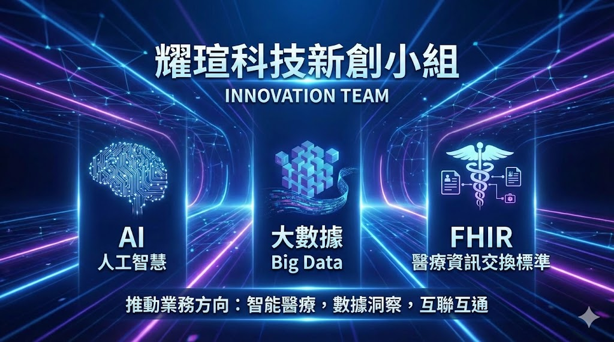

# 耀瑄科技新創小組介紹

## 耀瑄科技新創小組｜以 FHIR × AI × 大數據，打造新一代醫療數據應用

在醫療數位轉型快速推進的浪潮中，**耀瑄科技 新創小組**，扮演著「實驗室」與「先鋒部隊」的角色。我們專注於將國際標準、前沿 AI 技術與醫療場域的真實需求結合，讓過去「做不到、很困難、成本太高」的醫療應用，成為可以在臨床落地、可擴展、可複製的系統方案。

---

## 2025 年度核心開發成果總覽

2025 年，新創小組以 **FHIR × 病人導向 × AI 應用** 為主軸，完成了多項已實際運作或進入驗證階段的系統，涵蓋臨床照護、研究、安寧療護與運動科技等領域。

### 一、FHIR × 病人導向時序圖應用

我們開發了以「病人為核心」的時序圖系統，整合 **Encounter、Condition、Observation、Medication、Procedure、ImagingStudy** 等 FHIR 資源，將多年就醫紀錄轉化為**一眼可理解的時間軸視覺化**。
這套應用讓醫師、個管師與研究人員能快速掌握病程演進、治療決策與關鍵轉折點，是 FHIR 在臨床應用層面的代表性成果。

### 二、SMART on FHIR × 身體組成 AI 分析應用

結合 **SMART on FHIR 標準流程** 與 AI 影像推論模型，建立一套可從 EHR 啟動的身體組成分析 App。
使用者可上傳 L3 腹部 CT 影像，系統自動完成：

* 骨骼肌面積、脂肪分布等量化分析
* 推論結果回寫 FHIR（Observation / ImagingStudy）
* 以臨床友善的介面呈現結果

此應用已通過沙盒測試，展示了 **SMART on FHIR + AI** 在醫療影像分析上的實際可行性。

### 三、AI 臨床試驗與婦產科癌症治療平台

針對婦產科癌症臨床試驗需求，新創小組打造一套整合式平台，涵蓋：

* 病患基本臨床資料與治療歷程
* 檢驗數據追蹤與副作用紀錄
* AI 輔助風險評估與療效觀察

此平台不僅支援研究流程，也讓臨床團隊能在同一系統中完成「照護 × 試驗 × 分析」。

### 四、安寧 AI 與 FHIR 支援系統

在安寧療護與 PCOC 場景中，我們導入 AI 模型輔助病人狀態分析，並以 FHIR 作為資料交換基礎，支援：

* 症狀評估與照護指標分析
* 跨系統資料整合
* 長期追蹤與決策支援

這是一個將 **人文照護 × AI × 標準化資料** 結合的重要實踐。

### 五、運動科技健康管理儀表板

延伸醫療資料整合能力，新創小組也完成運動科技健康管理儀表板，整合生理量測、訓練紀錄與 AI 分析，應用於：

* 運動員健康監測
* 表現與風險分析
* 長期數據視覺化

### 六、病患篩選第二期系統開發

在既有病患篩選平台基礎上，第二期系統進一步強化：

* 大規模資料處理效能（Big Data / Elasticsearch）
* 複雜條件查詢與 Cohort 定義
* 支援臨床研究與試驗收案需求

這套系統已成為研究單位與臨床團隊的重要工具。

---

## 三大技術主軸：AI × FHIR × Big Data

新創小組的研發方向，始終圍繞三個核心能力：

1. **AI 人工智慧**

   * 醫療影像分析
   * 臨床決策輔助
   * 風險評估與預測模型

2. **FHIR / SMART on FHIR 標準應用**

   * 與院內 HIS / EMR 共存
   * 跨系統資料互通
   * 快速開發可重用的醫療 App

3. **Big Data 大數據平台**

   * 高效能資料整合與查詢
   * 支援研究、試驗與管理決策
   * 從資料倉儲走向即時分析

---

## 邁向下一步：數據中台與可擴展應用生態

展望未來，新創小組正積極規劃 **醫療數據中台** 相關應用，目標是：

* 降低各系統之間的整合成本
* 讓 AI 與 FHIR 應用可以快速接上資料
* 形成可複製、可擴展的解決方案架構

數據中台不只是技術專案，而是支撐未來 5–10 年醫療應用創新的核心基礎。

---

## 新創小組可提供的服務與業務目標

### 可提供的服務

* FHIR / SMART on FHIR 系統設計與開發
* AI 醫療應用（影像、分析、決策支援）
* 病人導向視覺化與時序應用
* 臨床試驗與研究平台建置
* 大數據平台與病患篩選系統
* 醫療數據中台規劃與顧問服務

### 業務與長期目標

* 協助醫院快速落地國際標準應用
* 將 AI 從展示階段推進到臨床實用
* 打造可複製、可規模化的醫療軟體產品
* 成為醫療單位在 **FHIR × AI × 大數據** 領域最值得信賴的夥伴

---

## 結語

耀瑄科技新創小組不是單純「做系統」，而是專注於 **把未來醫療需要的能力，提前做出來**。
在 FHIR 成為基礎設施、AI 成為標準工具、大數據成為決策核心的時代，我們希望與更多醫院、研究單位與合作夥伴，一起打造真正改變臨床現場的醫療應用。

