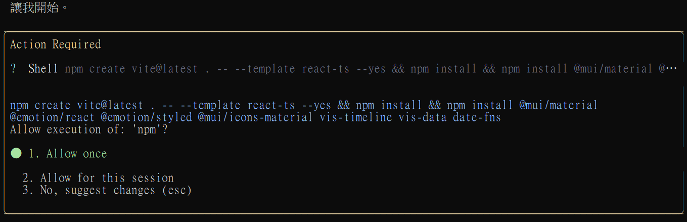
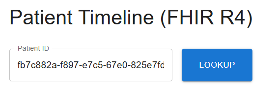
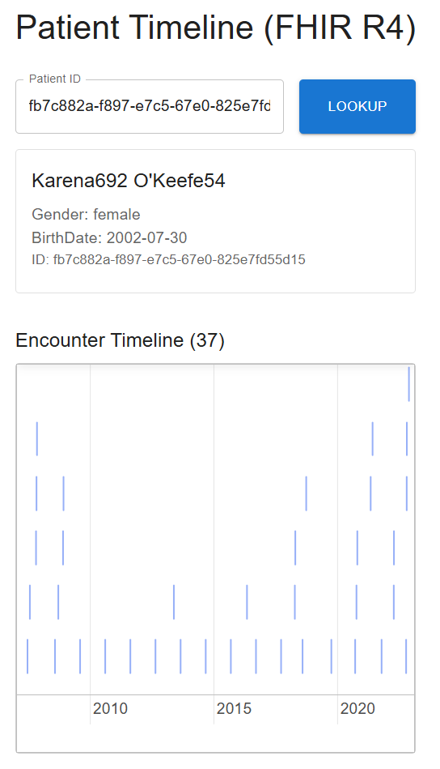

# 使用 Gemini CLI 與透過自然語言來動手實作進行開發出一個 FHIR 為基礎的病人時序圖應用系統

先說結論，在這裡使用了 Gemini CLI 在一個小時之內，開發出一個病人時序圖網頁系統，可是，產生出來的結果不如預期且功能欠缺很多，但是，整體操作過程上也不會很複雜，但是相較於 OpenAI Codex 來說，說實在的還是有點繁瑣。

在上一篇 [使用 OpenAI Codex 與透過自然語言來動手實作進行開發出一個 FHIR 為基礎的病人時序圖應用系統](https://csharpkh.blogspot.com/2026/02/openai-codex-fhir.html) 文章中，我使用了 OpenAI Codex 來開發這個病人時序圖的前端應用程式，並且在這個過程中，我也對於 OpenAI Codex 的使用有了初步的認識與體驗，這些經驗對於未來如果要再次使用 OpenAI Codex 來進行專案開發，將會有很大的幫助。

在這篇文章中，將會使用 Gemini CLI 來開發這個病人時序圖的前端應用程式，使用的體驗也與使用 OpenAI Codex 相同，在使用之前，並沒有 Gemini CLI 的使用經驗與知識，因此，在使用的過程中，會先閱讀 Gemini CLI 的官方文件，來了解 Gemini CLI 的基本概念、功能以及使用方法，這些文件將會幫助我快速地上手 Gemini CLI，並且讓我能夠順利地使用 Gemini CLI 來開發這個病人時序圖的前端應用程式。

從無到有，總共花費的時間同樣的也是在 1 個小時內可以完成，雖然說完成的結果不如預期，但是，整體的操作過程上也不會很複雜，不過，這個過程讓我對於 Gemini CLI 的使用有了初步的認識與體驗，也讓我了解了在使用 Gemini CLI 來進行專案開發時，需要注意的一些事項和步驟，這些經驗對於未來如果要再次使用 Gemini CLI 來進行專案開發，將會有很大的幫助。

## 事前準備

在前一周，我下載的 Synthea™ 產生出來的 10 個模擬 FHIR 病人就醫紀錄，並且將這些紀錄匯入到網路上的免費 FHIR Server 上 ( https://server.fire.ly )，這些模擬病人就醫紀錄資料將會包含這些 FHIR 資源，包括 Organization、Location、Practitioner、PractitionerRole、Patient、Encounter、Condition、AllergyIntolerance、Immunization、Device、Observation、Procedure、DiagnosticReport、DocumentReference 以及 MedicationRequest 等等，這些資料將會成為我們開發病人時序圖應用系統的測試資料，讓我們能夠在開發過程中有實際的資料來進行測試和驗證。

## 使用 OpenAI Codex 來進行病人時序圖開發

* 由於我毫無 Gemini CLI 的經驗與知識，因此，我打開了 [Gemini CLI documentation](https://geminicli.com/docs/) 這個平網頁面，來閱讀 Gemini CLI 的官方文件，並且了解 Gemini CLI 的基本概念、功能以及使用方法，這些文件將會幫助我快速地上手 Gemini CLI，並且讓我能夠順利地使用 Gemini CLI 來開發這個病人時序圖的前端應用程式。
* 在這裡想要產生一個 [GEMINI.md] 檔案，這個檔案將會包含這個專案的目標、需求、開發工具與環境設定，以及每一個步驟的詳細說明，讓我可以順利地使用 Gemini CLI 來開發這個病人時序圖的前端應用程式。
* 所以，在這裡先把想要開發出來的 App 需求整理出來，可以參考底下所述

```
我從 Synthea™ Patient Generator (GitHub) 下載了 Synthea™ 生成的 FHIR 資料，並使用 HAPI FHIR CLI 工具將資料匯入到 Firely Server 上 ( https://server.fire.ly )。以下是匯入的 FHIR Resource :
   * Organization ： 模擬的醫療機構資料。
   * Location ： 模擬的醫療機構地點資料。
   * Practitioner ： 模擬的醫療人員資料。
   * PractitionerRole ： 模擬的醫療人員角色資料。
   * Patient ： 模擬的病人資料。
   * Encounter ： 模擬的就診事件資料。
   * Condition ： 模擬的疾病或健康狀態資料。
   * AllergyIntolerance ： 模擬的過敏或不耐受資料。
   * Immunization ： 模擬的疫苗接種資料。
   * Device ： 模擬的醫療設備資料。
   * Observation ： 模擬的觀察資料。
   * Procedure ： 模擬的醫療程序資料。
   * DiagnosticReport ： 模擬的診斷報告資料。
   * DocumentReference ： 模擬的文件參考資料。
   * MedicationRequest ： 模擬的用藥請求資料。

我需要一份使用 Gemini CLI 來進行詳細操作指引規劃文件，可以參考 https://geminicli.com/docs/ 官方文件的操作與建議說明，在這裡需要開發一個採用 React / TypeScript 的前端應用程式，該系統是病人時序圖，用於展示病人從就診到治療的整個過程。在這裡可以輸入病人 ID，如 fb7c882a-f897-e7c5-67e0-825e7fd55d15，然後從 Firely Server 上獲取該病人的相關 FHIR 資料，並將這些資料以時序圖的形式展示出來。例如，這個病人可以從這個 URL 取得 https://server.fire.ly/Patient/fb7c882a-f897-e7c5-67e0-825e7fd55d15

從病人時序圖畫面，可以看到指定區間內該病人的所有就醫紀錄與該病人的綜合摘要說明，並且可以點擊每一筆就醫紀錄來查看該就醫紀錄的詳細資訊。這些就醫紀錄可以包括病人就診的日期、就診的醫療機構、就診的醫療人員、就診的疾病或健康狀態、就診的過敏或不耐受、就診的疫苗接種、就診的醫療設備、就診的觀察、就診的醫療程序、就診的診斷報告、就診的文件參考以及就診的用藥請求等資訊。

由於我沒有使用過 Gemini CLI 工具的經驗，需要列出如何安裝那些工具與軟體或檔案，輸入那些指令，在哪裡做甚麼操作， Prompt 該輸入甚麼內容，每一個步驟的詳細說明，讓我可以順利地使用 Gemini CLI 來開發這個病人時序圖的前端應用程式。開發工具將會採用 VS Code

最後，產生一個 markdown 檔案，告訴 Gemini CLI，這個專案的目標、需求、開發工具與環境設定，以及每一個步驟的詳細說明，讓我可以順利地使用 Gemini CLI 來開發這個病人時序圖的前端應用程式。
```

* 在這裡先把這些內容送到 LLM 內，產生出一個 [GEMINI.md]

```markdown
# Project: Patient Timeline (React + TypeScript) for Firely Server (FHIR R4)
> Repo Context File for Gemini CLI (GEMINI.md)

## 0) 專案目標（Goal）
建立一個使用 React + TypeScript 的前端 Web App（Vite），用來：
1. 輸入 Patient ID（例如：fb7c882a-f897-e7c5-67e0-825e7fd55d15）
2. 從 Firely Server 取得該病人相關 FHIR 資料
3. 以「病人時序圖」呈現指定區間內的所有就醫紀錄（Encounter 為主軸，並整合/關聯其他 resources）
4. 提供「病人綜合摘要」以及「點擊某次就醫即可查看詳情」的互動 UI

FHIR Server 基底：
- https://server.fire.ly
示例病人：
- https://server.fire.ly/Patient/fb7c882a-f897-e7c5-67e0-825e7fd55d15

匯入的資源類型（Synthea 生成並已匯入）：
Organization, Location, Practitioner, PractitionerRole, Patient, Encounter, Condition,
AllergyIntolerance, Immunization, Device, Observation, Procedure, DiagnosticReport,
DocumentReference, MedicationRequest

## 1) 使用者故事（User Stories）
### US-01：查詢病人
- 我可以輸入 Patient ID
- 系統會顯示病人基本資料（姓名、性別、年齡/生日、識別碼等）
- 若 Patient 不存在，顯示清楚的錯誤訊息

### US-02：指定區間時序圖
- 我可以選擇日期區間（預設：最近 1 年，或由資料最早到最晚）
- 時序圖以 Encounter 為主（每筆 Encounter 是一個 timeline item）
- item 上顯示：日期/期間、機構、就醫類型（門診/急診/住院等）、關鍵摘要（診斷/處置/用藥等）

### US-03：就醫詳情檢視
- 點擊某一筆 Encounter（或事件）後，右側 Drawer/Modal 顯示：
  - Encounter details
  - 關聯到該 Encounter 的 Condition / Observation / Procedure / DiagnosticReport / DocumentReference / MedicationRequest 等
  - 顯示關聯依據（reference / encounter / context 等欄位）

### US-04：病人摘要（Summary）
- 左側或上方顯示病人摘要卡（可折疊）：
  - Demographics
  - 近期重大診斷（Condition）
  - 過敏（AllergyIntolerance）
  - 近期用藥（MedicationRequest）
  - 近期檢驗（Observation / DiagnosticReport）

## 2) 系統與技術選型（Tech Stack）
- Frontend: React + TypeScript + Vite
- UI: 建議先用簡單方案（例如 MUI / Ant Design / Chakra）其一，避免自刻太多 UI
- Timeline 視覺化：優先選擇具備縮放/拖曳/群組功能的 timeline library（例如 vis-timeline），避免只用靜態列表
- HTTP Client：fetch 或 axios 均可，但需有清楚的錯誤處理與 retry/backoff（可選）
- FHIR 資料處理：以 FHIR JSON（R4）為主，不使用後端 proxy 亦可，但需處理 CORS；若 CORS 被擋，改用 Vite dev proxy

## 3) 目錄結構（Target Structure）
repo-root/
  GEMINI.md
  package.json
  vite.config.ts
  src/
    main.tsx
    app/
      App.tsx
      routes.tsx
    features/
      patient-lookup/
      timeline/
      encounter-details/
      summary/
    fhir/
      client.ts           # Firely Server base + fetch wrapper
      types.ts            # 最小必要的 FHIR typings（或直接用 any，但要有 guard）
      normalize.ts        # 轉換 Bundle/Resources -> domain model
      index.ts
    models/
      timeline.ts         # TimelineEvent, Group, etc.
    utils/
      date.ts
      errors.ts
  README.md

## 4) FHIR 資料取得策略（Data Fetch Strategy）
### 4.1 優先方案：使用 Patient/$everything（若 server 支援）
- GET /Patient/{id}/$everything
- 優點：一次拿到多數相關資料（Encounter, Condition, Observation...）
- 缺點：資料量可能大；需要分頁（next link）處理；不一定包含所有你想要的關聯（依 server 行為）

### 4.2 保底方案：以 Encounter 為中心逐步查
最穩定可控的方式（建議實作）：
1) 先抓 Patient
- GET /Patient/{id}

2) 抓 Encounter（指定日期區間 + 病人）
- GET /Encounter?patient={id}&date=ge{from}&date=le{to}&_count=200
- 需要處理 Bundle 分頁（link[relation="next"]）

3) 針對該區間，平行抓相關 resources（依需求）
常見查法（視 server 支援）：
- Condition?patient={id}&recorded-date=ge...&recorded-date=le...
- Observation?patient={id}&date=ge...&date=le...
- Procedure?patient={id}&date=ge...&date=le...
- DiagnosticReport?patient={id}&date=ge...&date=le...
- DocumentReference?patient={id}&date=ge...&date=le...
- MedicationRequest?patient={id}&_count=200 (可用 authoredon/date filter 若支援)

4) 將上述 resources 以「參考欄位」做 Encounter 關聯（normalize）
常見關聯線索：
- resource.encounter (Reference -> Encounter)
- resource.context.encounter (部分資源)
- DiagnosticReport.encounter
- DocumentReference.context.encounter

若沒有 encounter reference，則以時間落點（effective[x], issued, performed[x], authoredOn）做近似歸屬（但要清楚標註是 heuristic）。

## 5) Timeline 規格（UI/UX Spec）
### 5.1 主畫面布局（建議）
- Header：Patient ID input + Date Range picker + Fetch button
- Left/Top：Patient Summary (cards)
- Center：Timeline（縮放/拖曳/群組）
- Right：Encounter Detail Drawer（點擊 timeline item 開啟）

### 5.2 Timeline 事件定義（Domain Model）
TimelineEvent:
- id: string
- type: "Encounter" | "Condition" | "Observation" | "Procedure" | "DiagnosticReport" | "DocumentReference" | "MedicationRequest" | ...
- start: Date
- end?: Date
- title: string (短標題)
- subtitle?: string
- encounterId?: string (若可關聯)
- resourceRef: { resourceType: string; id: string }
- raw?: any (保留原始 resource 方便 detail panel)

### 5.3 顯示策略
- 第一階段：只顯示 Encounter item（最清楚）
- 第二階段：同一條 timeline 上，加上關聯事件（Observation/Procedure…）做小點/標記（可分 group）
- 第三階段：可加 filter（只看用藥/只看檢驗/只看報告）

## 6) CORS / Proxy（非常重要）
若前端直接呼叫 https://server.fire.ly 被 CORS 擋：
- 使用 Vite dev proxy：
  - 前端改呼叫 /fhir/Patient/{id}
  - Vite proxy 轉發到 https://server.fire.ly

vite.config.ts（示例）：
- server.proxy = {
    "/fhir": {
      target: "https://server.fire.ly",
      changeOrigin: true,
      secure: true,
      rewrite: (path) => path.replace(/^\/fhir/, "")
    }
  }

## 7) 程式碼規範（Coding Conventions）
- TypeScript strict 模式（能開就開）
- Component 命名 PascalCase
- 每個 feature 用資料夾隔離（feature-first）
- 所有 fetch 都要：
  - timeout（可選）
  - status code handling
  - OperationOutcome 顯示（若回傳）
- UI 不要一次做太花：先完成資料正確性與互動，再美化

## 8) 測試與品質門檻（Quality Gate）
每次改動完成後，務必執行：
- npm run lint
- npm run build
- npm run test（若已導入 vitest）

## 9) Gemini CLI：安裝與使用（給「人」的操作手冊）
> 這段是「你照做就能跑起來」的步驟；同時也讓 Gemini CLI 理解你希望它怎麼帶你做事。

### 9.1 安裝清單（Windows + VS Code）
你需要先安裝：
1) Git
2) Node.js（建議使用 Node 20+）
3) VS Code（含內建 terminal）

Gemini CLI 安裝（npm 全域安裝）：
- npm install -g @google/gemini-cli
驗證：
- gemini --version

啟動 Gemini CLI：
- gemini

首次啟動會引導你用 Google account 認證（free tier）。  
（若公司/特殊帳號要求 Google Cloud project，依 Gemini CLI Authentication 文件處理。）

### 9.2 建議工作流程（像「結對程式設計」）
你在 repo root 以 gemini 開啟互動後，採用「小步快跑」：
- 每次只做一個可驗證的小任務
- 讓 Gemini 先「提 plan」再「產生 patch」
- 每次 patch 後你都跑 lint/build，確保沒壞

請 Gemini 的固定開場 prompt（每次進新 repo 建議跑一次）：
「請先閱讀 GEMINI.md，理解專案目標與規範。接著列出你打算用 8~12 個 step 完成 MVP 的計畫（每個 step 有可驗證產出）。先不要改 code。」

### 9.3 你要輸入的關鍵 Prompt 模板（直接複製貼上）
#### (A) 初始化專案（Vite React TS）
「請在 repo root 建立 Vite + React + TypeScript 專案（npm）。完成後告訴我執行與驗證指令，並確保專案能 npm run dev 跑起來。」

#### (B) 加入 Vite proxy（避免 CORS）
「請在 vite.config.ts 加入 /fhir -> https://server.fire.ly 的 proxy（rewrite 移除 /fhir）。並把 FHIR client 的 baseUrl 改成 /fhir。」

#### (C) 建立 FHIR client（帶錯誤處理）
「請在 src/fhir/client.ts 建立 getJson<T>() 封裝 fetch：包含 status code 檢查、FHIR OperationOutcome 的錯誤訊息萃取、以及可重用的 baseUrl。」

#### (D) Patient Lookup + Summary 卡
「請建立 PatientLookup 元件：輸入 Patient ID、按下查詢後顯示 Patient summary（至少 name/gender/birthDate/identifier）。錯誤要顯示在 UI。」

#### (E) 抓 Encounter + Timeline MVP
「請建立 Timeline MVP：抓 Encounter?patient={id}&date=ge...&date=le...，把每筆 Encounter 轉成 timeline item。先用簡單列表/時間軸皆可，但要能點擊 item。」

#### (F) Encounter Detail Drawer + 關聯資源
「點擊 Encounter 後：右側 Drawer 顯示 Encounter 原始 JSON（可折疊）+ 關聯 resources（Condition/Observation/Procedure/DiagnosticReport/DocumentReference/MedicationRequest）。關聯優先用 resource.encounter reference；沒有則先略過。」

#### (G) Bundle 分頁
「請把 FHIR Bundle 分頁(next link) 支援起來，確保 Encounter 查詢能完整抓完指定區間內資料。」

### 9.4 每一輪迭代你要做的固定驗證
你每次接受變更後，請在 terminal 執行：
- npm install
- npm run dev
- npm run build
- npm run lint

如果 build/lint 有錯，把錯誤貼回 Gemini：
「我執行 npm run build 失敗，錯誤如下：...。請修到通過為止，並解釋你改了什麼。」

## 10) Gemini CLI：對 Agent 的行為要求（給模型看的硬規則）
- 每次大改動前先提出 plan（含檔案列表與改動點）
- 優先做 MVP 可跑起來，再逐步加功能
- 任何 FHIR 查詢都要：
  - 在程式內集中管理（不要散落在各元件）
  - 有清楚型別/guards（至少對 resourceType/id/date 欄位）
- UI 互動最小可用即可，先把資料正確性做穩

## 11) MVP Done Definition（完成定義）
以下全部達成即算 MVP：
- 可輸入 Patient ID
- 顯示 Patient summary
- 可選日期區間
- 可取得並顯示 Encounter timeline
- 點擊 Encounter 可看到詳細資訊（至少 Encounter 本身 + 關聯 resources 清單或 raw JSON）
- 能處理分頁（next link）
- npm run build / lint 通過
```

* 我在 Github 網頁上建立一個新的 Repository [PatientTimelineGemini](https://github.com/vulcanlee/PatientTimelineGemini)
* 接著將這個 Repository 複製 Clone 到本地端的電腦上，並且在本地端的電腦上使用 VS Code 開啟這個 Repository 的資料夾，準備開始進行開發工作。
* 將剛剛產生的 [GEMINI.md] 檔案放到這個 Repository 的根目錄下，並且將這個檔案的內容貼上剛剛產生的內容，然後將這個檔案進行 Commit 並且 Push 到 Github 上，讓這個檔案成為這個 Repository 的一部分，並且讓其他人也能夠看到這個檔案的內容。
* 由於是第一次使用，因此，使用底下命令安裝 Gemini CLI 工具

```bash
npm install -g @google/gemini-cli
```

* 這裡是安裝過程

```
npm warn deprecated node-domexception@1.0.0: Use your platform's native DOMException instead
npm warn deprecated glob@10.5.0: Old versions of glob are not supported, and contain widely publicized security vulnerabilities, which have been fixed in the current version. Please update. Support for old versions may be purchased (at exorbitant rates) by contacting i@izs.me
npm warn deprecated prebuild-install@7.1.3: No longer maintained. Please contact the author of the relevant native addon; alternatives are available.

added 627 packages in 30s

175 packages are looking for funding
  run `npm fund` for details
```

* 在這個 Repository 目錄下，開啟一個命令提示字元視窗
* 在命令提示字元視窗中，輸入命令 `gemini` 來啟動 GEMINI CLI
* 詳細過程就不再紀錄了
* 當出現 `How would you like to authenticate for this project?` 的提示時，選擇 `Login with Google`，然後按照提示進行 Google 帳戶的認證過程，完成認證後，GEMINI CLI 就會成功地連接到你的 Google 帳戶，並且可以開始使用 GEMINI CLI 來進行專案的開發工作了。
*  這裡看到了 `You have successfully logged in with Google. Gemini CLI needs to be restarted. Press 'r' to restart, or 'escape' to  │
│ choose a different auth method.` 的提示，按下 `r` 鍵來重新啟動 GEMINI CLI，讓 GEMINI CLI 能夠使用剛剛完成的 Google 認證來進行專案的開發工作。
* 輸入底下內容給 GEMINI CLI ： [參考 GEMINI.md 的內容，開發出所需要的病人時序圖網頁]


* 若出現 `Allow execution of: 'npm'?` 的提示，選擇 `Allow for this session` 來允許 GEMINI CLI 執行 npm 命令，這樣 GEMINI CLI 就能夠使用 npm 來安裝專案所需要的依賴包，並且進行專案的開發工作了。



* 完成之後，啟動這個專案，並開啟網頁 [http://localhost:5173]
* 現在會看到網頁畫面



* 輸入完病人 ID 後，點選 [LOOKUP] 按鈕，會看到病人時序圖的畫面




