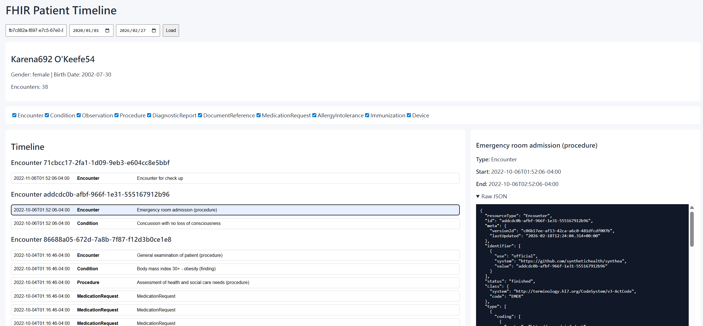
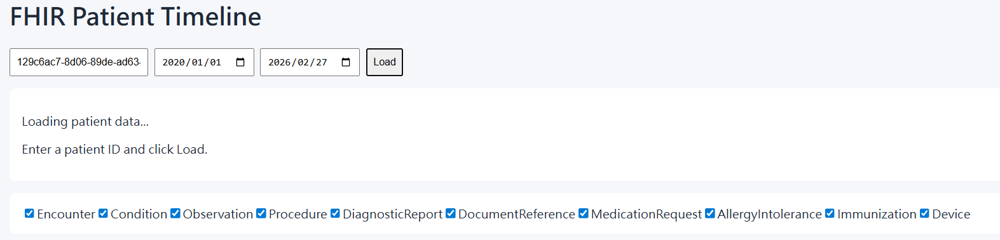

# 使用 OpenAI Codex 與透過自然語言來動手實作進行開發出一個 FHIR 為基礎的病人時序圖應用系統

3分27秒代表甚麼意思？開發出來一個系統僅需要 3分27秒？這是什麼樣的魔法？先說我的感想，對於我而言，世界末日已經到了，不是正在來臨，我現在變成了 龜苓膏，我用我的 30年的歲月所建立起來的自我技能、技術、能力，經驗等等，在今天一天已經完全歸零了，我真的不知道未來如何來應對這個新的世界了，不過，再過兩年，我也60歲了，或許也不需要再去適應這個新的世界了，反正我也不會有什麼損失了，哈哈哈。

這裡是花了兩個星期做出的系統


這裡是花了3分27秒做出的系統



在 2026 年一開年，整個 Vibe Coding 應用造成許多的震撼，其中莫過於在 2026 年之後，AI將會接管許多之前必須要透過人才能夠開發出來的工作，而且做得更好，更快，甚至更便宜。這個趨勢在軟體開發領域造成的震撼是前所未有，而且是超乎大家的想像，這不是危言聳聽，軟體開發領域的天要塌下來了。面對一些重複性高、規則明確的工作，AI 可以幫助我們快速地完成這些工作，並且讓我們有更多的時間去思考和創造。

在 2025 一整年，我一直忙於公司的專案開發與雜事工作，說實在的，我沒有太多的時間去學習和使用 Vibe Coding 這類工具，雖然我知道它的威力和潛力，但我一直沒有機會去真正地體驗它的強大。這個比喻一點都不誇張，我在家裡半年不出門，今年一出門，卻不知道如何過生活，因為，以往我孰悉、精通的做事方式、生活態度、知識認知等等，發生了巨大變化，我突然變成了 龜苓膏 (是的，我真的歸零了)，我以前自豪的技能、技術、能力，經驗等等，現在都變得毫無用處了，我需要重新學習和適應這個新的世界，這是一個非常大的挑戰，但也是一個非常有趣的冒險。

在這個 228 連續三天假期中，我想要來嘗試一下使用三種 Vibe Coding 技術，分別是 OpenAI Codex，Claude Code和 Gemini CLI 這三種工具，我想要用它們來進行開發出我之前一行一行慢慢做出來的以 FHIR 為基礎的病人時序圖應用系統，雖然之前手作的版本已經完成了，使用起來相當的有溫度且體驗感也不錯，因為當初設定想要在 2 個星期內快速開發出來，讓身旁的人可以知道 FHIR 為基礎的應用系統，可以做出甚麼樣的變化，因此，我做了關於 Patient、Encounter、Condition、Observation 這四類的資訊在病人時序圖中，當然，當初是期望能夠顯示更多的資訊，例如 AllergyIntolerance、Immunization、Device、Procedure、DiagnosticReport、DocumentReference、MedicationRequest 等等，但由於時間的限制，最後只能先做出這四類資訊的顯示，當然，這些資訊的顯示也不是很完整，還有很多細節沒有做出來，例如就診的醫療機構、就診的醫療人員等等，這些都是我想要在未來的版本中再慢慢補齊的。

今天，對於我從來沒有用過 Vibe Coding 的相關技術，從一開始到完成，累計花了約4個小時，邊學邊做，就完成了我之前與同事共同協作花了約兩個星期才完成的以 FHIR 為基礎的病人時序圖應用系統，這是一個非常驚人的成就，因為它展示了 Vibe Coding 技術的強大威力和潛力，讓我獨自一人就能夠在短時間內完成一個功能完整、易於使用的病人時序圖應用系統，這是我之前完全無法想像的。

這次，我先採用 OpenAI 推出的 Codex 來進行開發這個病人時序圖系統，之後，會再來體驗採用 Claude Code 和 Gemini CLI 這兩種工具來進行開發，看看它們的表現如何，是否能夠達到和 OpenAI Codex 一樣的效果，或者甚至更好。無論如何，我相信這些工具都會給我們帶來非常驚人的體驗，讓我們能夠在軟體開發領域中有更多的創造力和效率。

採用 OpenAI Codex 來開發一個 FHIR 為基礎的病人時序圖應用系統，這是一個非常有趣和有挑戰性的專案，因為它需要我們從 FHIR 的資料中提取出病人的就診紀錄，並且將這些紀錄以時序圖的形式展示出來。這個專案的目標是讓我們能夠快速地開發出一個功能完整、易於使用的病人時序圖應用系統，並且讓我們能夠體驗到 OpenAI Codex 在軟體開發領域的強大威力和潛力。

直到最近，我終於有機會去使用 OpenAI Codex 來開發一個 FHIR 為基礎的病人時序圖應用系統，這是一個非常有趣和有挑戰性的專案，面對一切未知與不清楚如何著手來做，我也不知道是否完成這樣的挑戰，不過，若真的要由以往的知識、經驗、技術來開發出來病人時序圖的系統，那麼，這個專案的開發過程將會非常的漫長和艱難，因為它需要我們從 FHIR 的資料中提取出病人的就診紀錄，並且將這些紀錄以時序圖的形式展示出來，這是一個非常複雜和繁瑣的工作，需要我們有非常深入的 FHIR 知識和經驗，以及非常熟悉 React 和 TypeScript 的技能，才能夠完成這樣的專案。

## 事前準備

在前一周，我下載的 Synthea™ 產生出來的 10 個模擬 FHIR 病人就醫紀錄，並且將這些紀錄匯入到網路上的免費 FHIR Server 上 ( https://server.fire.ly )，這些模擬病人就醫紀錄資料將會包含這些 FHIR 資源，包括 Organization、Location、Practitioner、PractitionerRole、Patient、Encounter、Condition、AllergyIntolerance、Immunization、Device、Observation、Procedure、DiagnosticReport、DocumentReference 以及 MedicationRequest 等等，這些資料將會成為我們開發病人時序圖應用系統的測試資料，讓我們能夠在開發過程中有實際的資料來進行測試和驗證。

## 使用 OpenAI Codex 來進行病人時序圖開發

* 由於我毫無 OpenAI Codex 的經驗與知識，因此，我採用的是網頁版的 [https://openai.com/zh-Hant/codex/](https://openai.com/zh-Hant/codex/) 這個平台來進行開發，因為它提供了一個非常簡單和易於使用的界面，讓我們能夠快速地開始使用 OpenAI Codex 來進行開發，並且它還提供了許多範例和教學資源，讓我們能夠更好地理解和使用 OpenAI Codex 的功能和特性。
* 使用網頁開啟 OpenAI Codex 的平台後，並且登入到平台上
* 我在 Github 網頁上建立一個新的 Repository [PatientTimeline](https://github.com/vulcanlee/PatientTimeline)
* 在 OpenAI Codex 網頁上，設定與綁定此次要做的後續工作，將會在這個 Repository 內來呈現
* 在 OpenAI Codex 網頁上，介面相當的簡單，如同 ChatGPT 一樣，就只有一個文字輸入框
* 然後在這個文字輸入框裡面，我就可以輸入我想要 OpenAI Codex 來幫我完成的工作內容，這些工作內容可以是一些具體的指令，例如「建立一個 React / TypeScript 的前端應用程式」，或者是一些更抽象的描述，例如「開發一個 FHIR 為基礎的病人時序圖應用系統」，無論是什麼樣的內容，我都可以直接在這個文字輸入框裡面輸入，然後 OpenAI Codex 就會根據我的輸入來生成相應的程式碼和文件，讓我能夠快速地完成我的專案開發。
* 我將底下的內容輸入到這個文字輸入框裡面，讓 OpenAI Codex 來幫我完成這個專案的開發，這些內容包括了專案的目標、需求、開發工具與環境設定，以及每一個步驟的詳細說明，讓我能夠順利地使用 OpenAI Codex 來開發這個病人時序圖的前端應用程式。

```
我從 Synthea™ Patient Generator (GitHub) 下載了 Synthea™ 生成的 FHIR 資料，並使用 HAPI FHIR CLI 工具將資料匯入到 Firely Server 上 ( https://server.fire.ly )。以下是匯入的 FHIR Resource :
   * Organization ： 模擬的醫療機構資料。
   * Location ： 模擬的醫療機構地點資料。
   * Practitioner ： 模擬的醫療人員資料。
   * PractitionerRole ： 模擬的醫療人員角色資料。
   * Patient ： 模擬的病人資料。
   * Encounter ： 模擬的就診事件資料。
   * Condition ： 模擬的疾病或健康狀態資料。
   * AllergyIntolerance ： 模擬的過敏或不耐受資料。
   * Immunization ： 模擬的疫苗接種資料。
   * Device ： 模擬的醫療設備資料。
   * Observation ： 模擬的觀察資料。
   * Procedure ： 模擬的醫療程序資料。
   * DiagnosticReport ： 模擬的診斷報告資料。
   * DocumentReference ： 模擬的文件參考資料。
   * MedicationRequest ： 模擬的用藥請求資料。

我需要一份使用 OpenAI Codex 來進行詳細操作指引規劃文件，可以參考 https://developers.openai.com/codex 官方文件的操作與建議說明，在這裡需要開發一個採用 React / TypeScript 的前端應用程式，該系統是病人時序圖，用於展示病人從就診到治療的整個過程。在這裡可以輸入病人 ID，如 129c6ac7-8d06-89de-ad63-0204a93e76c3，然後從 Firely Server 上獲取該病人的相關 FHIR 資料，並將這些資料以時序圖的形式展示出來。例如，這個病人可以從這個 URL 取得 https://server.fire.ly/Patient/129c6ac7-8d06-89de-ad63-0204a93e76c3

從病人時序圖畫面，可以看到指定區間內該病人的所有就醫紀錄與該病人的綜合摘要說明，並且可以點擊每一筆就醫紀錄來查看該就醫紀錄的詳細資訊。這些就醫紀錄可以包括病人就診的日期、就診的醫療機構、就診的醫療人員、就診的疾病或健康狀態、就診的過敏或不耐受、就診的疫苗接種、就診的醫療設備、就診的觀察、就診的醫療程序、就診的診斷報告、就診的文件參考以及就診的用藥請求等資訊。

由於我沒有使用過 OpenAI Codex 工具的經驗，需要列出如何安裝那些工具與軟體或檔案，輸入那些指令，在哪裡做甚麼操作， Prompt 該輸入甚麼內容，每一個步驟的詳細說明，讓我可以順利地使用 OpenAI Codex 來開發這個病人時序圖的前端應用程式。開發工具將會採用 VS Code，並且已經安裝 https://marketplace.visualstudio.com/items?itemName=openai.chatgpt 這個 VS Code 擴充套件來使用 OpenAI Codex 進行 開發與完成此專案。

最後，產生一個 markdown 檔案，告訴 OpenAI Codex，這個專案的目標、需求、開發工具與環境設定，以及每一個步驟的詳細說明，讓我可以順利地使用 OpenAI Codex 來開發這個病人時序圖的前端應用程式。
```

* OpenAI Codex 會根據我輸入的內容來生成相應的程式碼和文件，開始進行相關工作
* 接著，就只看到 OpenAI Codex 正在進行開發的訊息
* 花了約 3分27秒，整個開發工作就完成了，底下就是 OpenAI Codex 的處理過程摘要
  * Summary
  * 建立了完整的 Vite + React + TypeScript 專案骨架，包含 scripts、依賴宣告、TypeScript/Vite/ESLint 設定，讓專案可作為前端 MVP 起點。.
  * 新增 FHIR 型別與 client（VITE_FHIR_BASE_URL、fetch、FHIR search helper），可直接對 Firely Server 進行 Patient/Bundle 查詢。.
  * 實作 React Query 的資料整合 hook，一次拉取 Patient、Encounter 與多種臨床資源（Condition/Observation/Procedure/DiagnosticReport/DocumentReference/MedicationRequest/AllergyIntolerance/Immunization/Device），並輸出 timeline 所需資料。.
  * 完成 timeline 映射邏輯：把多種 FHIR resource 正規化成 TimelineItem，支援 encounter reference 連結與 patient-level fallback 分組。.
  * 完成 MVP UI：Patient ID + 日期區間查詢、病人摘要、類型過濾、以 Encounter 分組事件清單，以及右側細節面板（含 raw JSON）。.
  * 補上 README 操作說明，並已提交 commit：40fb003；另外已建立 PR 訊息（依要求呼叫 make_pr）。.
  * Testing
  * ⚠️ npm install（環境對 npm registry 回傳 403，無法下載依賴）
  * ⚠️ npm run build（因依賴安裝受限，react/vite 等模組缺失導致建置失敗）
  * ⚠️ Playwright screenshot 嘗試連線 http://127.0.0.1:5173（因無法啟動 dev server，瀏覽器連線 ERR_EMPTY_RESPONSE）
* 整個過程將會產生出來約 20 個程式碼檔案，包含了專案的骨架、前端的 React 組件、FHIR client 的實作、資料整合的 hook，以及 README 的操作說明等等，這些程式碼檔案將會構成整個病人時序圖應用系統的前端部分，讓我們能夠快速地開發出一個功能完整、易於使用的病人時序圖應用系統，並且讓我們能夠體驗到 OpenAI Codex 在軟體開發領域的強大威力和潛力。
* 產生出來的程式已經發出一個 Pull Request，等待後續的 review 與 merge，這個 Pull Request 包含了整個病人時序圖應用系統的前端部分的程式碼
* 我當然先不做做任何檢查，先直接接受這個 PR，然後直接 merge 到 main 分支，這樣就完成了整個專案的開發過程
* 透過專案內的 README 操作說明，來啟動這個病人時序圖應用系統，並且進行測試，看看是否能夠成功地從 Firely Server 上獲取到指定病人的相關 FHIR 資料，並且將這些資料以時序圖的形式展示出來，看看整個系統的功能是否正常運作，以及使用體驗是否良好。

```bash
npm install
cp .env.example .env.local
npm run dev
```

* 執行後，將會看到底下的內容

```
 VITE v6.4.1  ready in 298 ms

  ➜  Local:   http://localhost:5173/
  ➜  Network: use --host to expose
  ➜  press h + enter to show help
```

* 打開瀏覽器，輸入 http://localhost:5173/ 來訪問這個病人時序圖應用系統，看看是否能夠成功地從 Firely Server 上獲取到指定病人的相關 FHIR 資料，並且將這些資料以時序圖的形式展示出來，看看整個系統的功能是否正常運作，以及使用體驗是否良好。
* 由於病歷號已經預設在畫面上了，這裡將僅輸入開始與結束時間
* 點擊 [Load] 按鈕之後，將會出現這個畫面，表示正在載入資料中

* 等待資料載入完成之後，將會看到這個畫面，表示已經成功地從 Firely Server 上獲取到指定病人的相關 FHIR 資料，並且將這些資料以時序圖的形式展示出來，看看整個系統的功能是否正常運作，以及使用體驗是否良好。
