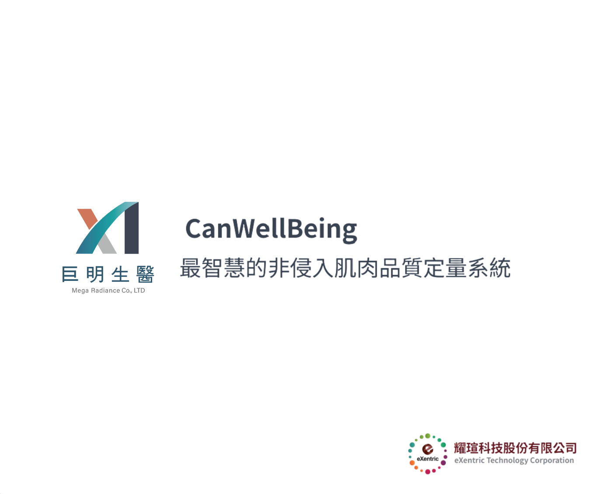
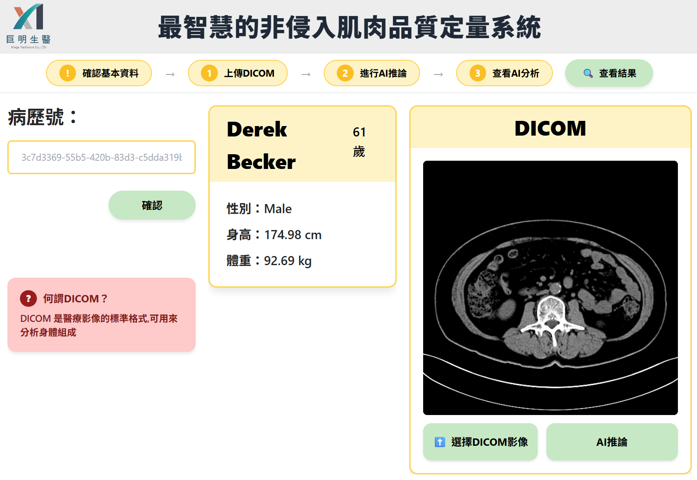
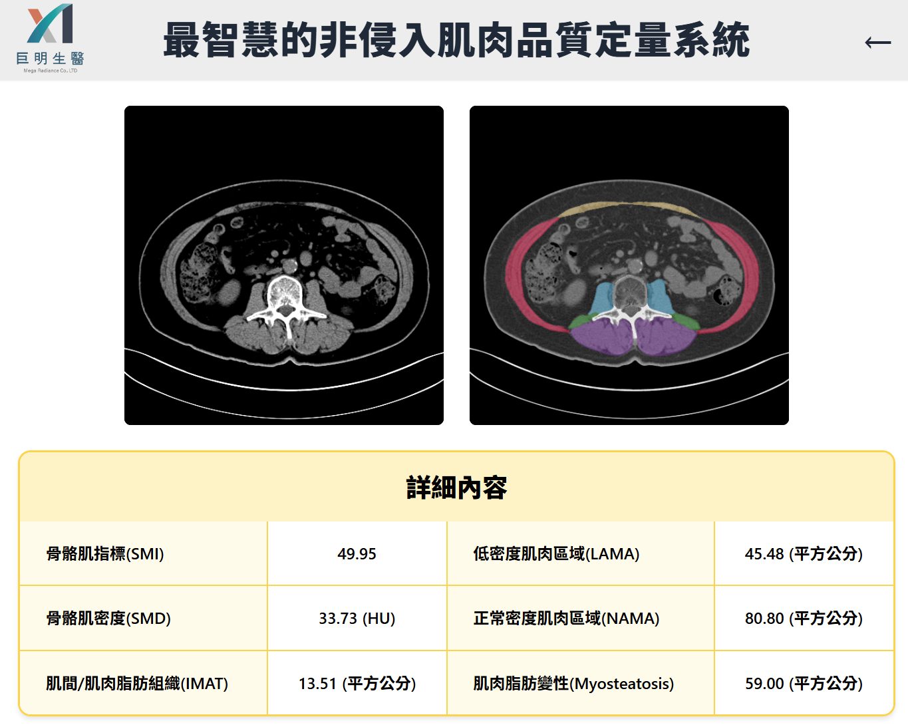

# SMART on FHIR 應用 : 最智慧的非侵入肌肉品質定量系統

---

# 從一個「身體組成 AI 推論系統」談起

## 為什麼 **SMART on FHIR**，會成為下一世代醫療應用的關鍵基礎

這篇文章，想用一個**已經實際落地、通過衛福部沙盒測試的 SMART on FHIR 應用實例**，來完整說明：

* SMART on FHIR 是什麼？
* 為什麼現在才「做得到」？
* 過去為什麼這類醫療 AI 應用極度困難？
* 對醫院、資訊單位、臨床與管理層的真正價值是什麼？
* 耀瑄科技新創小組，已經做到哪些事？

本文將以**「最智慧的非侵入肌肉品質定量系統（身體組成 AI 推論）」**為核心案例，專為：

* 醫院人員
* 資訊室 / HIS 團隊
* 臨床醫師、研究人員
* **第一次接觸 SMART on FHIR 的初心者**

而寫。

---

## 一、這是一個什麼樣的 SMART on FHIR 應用？

這是一套 **結合醫學影像（DICOM）與 AI 推論** 的臨床應用系統，主要目標是：

> **用既有的 CT 影像，非侵入式地量化病人的肌肉品質與身體組成狀態**

### 系統能做什麼？

* 從醫院系統取得病人基本資料（透過 FHIR）
* 上傳或串接腹部 CT DICOM 影像
* 由 AI 模型自動辨識：

  * 骨骼肌
  * 脂肪分布
  * 肌肉密度
* 產生**結構化、可追蹤、可比較的量化指標**

例如：

* SMI（骨骼肌指數）
* SMD（骨骼肌密度，HU）
* IMAT（肌間脂肪）
* LAMA / NAMA
* Myosteatosis（肌肉脂肪變性）

👉 **這不是單純影像展示，而是「臨床可用的數據化 AI 結果」。**

---

## 二、為什麼要用 SMART on FHIR 來做這件事？

### 關鍵一句話先給你：

> **SMART on FHIR 解決的，不是 AI 做不到，而是「AI 無法順利進入臨床系統」的問題。**

---

## 三、過去為什麼這類應用「幾乎做不到」？

### 1️⃣ 病人身分與影像系統完全分離

傳統狀況：

* 病人資料在 HIS / EMR
* 影像在 PACS
* AI 系統通常是「外掛工具」

結果是：

* 病人對不起來
* 研究能做，臨床難用
* 無法成為正式醫療流程的一環

---

### 2️⃣ AI 結果「回不去」臨床系統

即使 AI 分析完成：

* 結果多半只是一張圖
* 或一份 PDF
* 或存在某個獨立資料庫

👉 **無法被 EMR / HIS / 臨床系統真正使用**

---

### 3️⃣ 每家醫院、每套系統都要重做一次

沒有標準：

* 病人 ID 不同
* 欄位定義不同
* API 規格不同

👉 **導致 AI 只能停留在 POC 或研究階段**

---

## 四、SMART on FHIR 做對了哪三件關鍵的事？

---

### ✅ 第一件事：用「標準方式」進入醫院系統

SMART on FHIR 提供：

* 標準 OAuth 2.0 認證流程
* EHR Launch / Standalone Launch
* 明確的使用者與病人上下文（Context）

也就是：

> **AI App 不再是「外掛」，而是正式的醫療應用程式**

---

### ✅ 第二件事：所有資料都有「FHIR 語言」

在這個系統中：

* 病人基本資料 → `Patient`
* 就診脈絡 → `Encounter`
* AI 推論結果 → `Observation`
* 影像關聯 → `ImagingStudy`

👉 **AI 結果第一次成為「FHIR 資源」，而不是附件**

---

### ✅ 第三件事：一次開發，多院可用

只要醫院：

* 有 FHIR Server
* 或有 FHIR Gateway

這個 SMART on FHIR App 就可以：

* 不改程式
* 不重寫邏輯
* 直接部署

👉 **這是醫療 App 生態系的起點**

---

## 五、對醫院來說，SMART on FHIR 的價值在哪？

### 🏥 對臨床人員

* 不需要學新系統
* AI 結果就在熟悉的臨床流程中
* 可以追蹤病人變化，而非單次判讀

---

### 🧑‍💼 對管理層

* AI 不再是展示用
* 而是可以納入正式醫療服務
* 可用於：

  * 高齡醫療
  * 癌症治療評估
  * 術前風險評估
  * 長期照護指標

---

### 💻 對資訊單位

* 不必一次汰換 HIS
* 不必被單一廠商綁死
* 可以逐步引入創新應用

---

## 六、這個系統，為什麼特別有代表性？

因為它同時具備：

* ✅ AI 實際臨床價值
* ✅ SMART on FHIR 正規整合
* ✅ 通過衛福部沙盒測試
* ✅ 可擴充、可商品化

這代表：

> **SMART on FHIR 已經不是未來式，而是現在進行式**

---

## 七、耀瑄科技新創小組的 FHIR & SMART on FHIR 研發成果

耀瑄科技新創小組，並不是只做一個 App，而是持續投入在：

### 🔹 FHIR 基礎建設

* FHIR Server 規劃
* FHIR Gateway 與既有 HIS 串接
* 病人為主的資料模型設計

### 🔹 SMART on FHIR 應用

* 病人時序圖應用
* AI 身體組成分析
* 臨床研究支援工具

### 🔹 AI × 醫療整合

* DICOM → AI → FHIR
* 結果結構化、可回寫、可追蹤
* 真正進入臨床流程

---

## 八、給第一次接觸 SMART on FHIR 的你，一個簡單結論

> **FHIR 解決的是「資料怎麼來」**
> **SMART on FHIR 解決的是「應用怎麼進來」**

當這兩件事都被解決：

* AI 才能真正落地
* 創新才能規模化
* 醫療系統才能真正進化

---

## 九、結語：SMART on FHIR，不只是技術，而是一種「新秩序」

SMART on FHIR 帶來的不是：

* 一個新標準
* 一個新 API

而是：

> **讓醫療應用可以像 App Store 一樣被建立、被選擇、被淘汰、被進化**

而耀瑄科技新創小組，正站在這個轉折點上。

