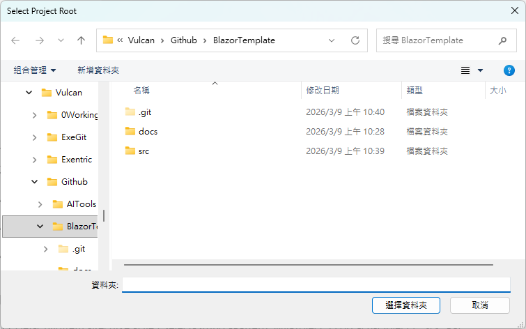
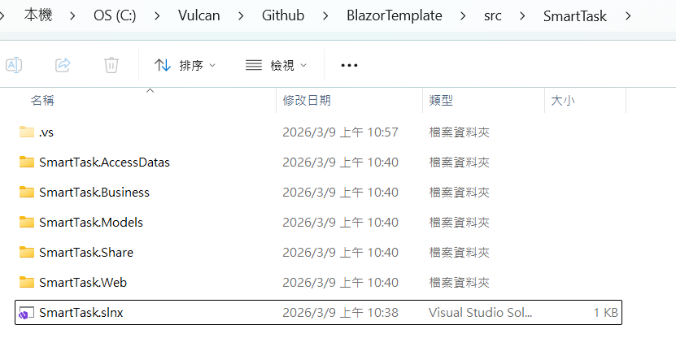

# 使用 Codex 指定專案範本來創建一個全新的專案

最近正在使用 Codex 將之前做出的一個 .NET 8 Blazor 專案，改寫成為 .NET 10 的版本，其中將會從原先使用的 Syncfusion 元件，改寫成為使用 Ant Design 元件，並且該專案預設具有各種未來專案需要開發的設計模型、Web API、使用者與角色的 CRUD、授權與認證等需求的功能，在未來面對到新的專案需求時，一些基礎架構與設計模式都已經在這個專案中實作完成，就可以直接複製這個專案的結構與程式碼，來快速建立一個新的專案。

在三、四年前，我也確實開發了這樣的專案範本，可是當要套用到一個新的專案時候，還是需要花費一些時間來修改專案名稱、命名空間、檔案名稱等等，這些都是一些重複性的工作，在以往這些工作都是要透過人工來一步一步的實踐，現在我想要使用 Codex 來幫助我完成這些重複性的工作，讓我可以更快速的建立一個新的專案，如此，我便可以擁有一個多樣性與多變化的專案範本，來應對未來不同的專案需求。

當然，顯而易見的就是，這些 AI 工具將會帶來前所未有的工作效率提升、消除了之前需要大量人工作的事情、將重複性的工作一次性解決等等好處，這些都是非常棒的優點，但同時也會帶來一些新的挑戰，例如：如何確保 AI 工具生成的程式碼是正確的、如何確保 AI 工具生成的程式碼是安全的、如何確保 AI 工具生成的程式碼是可維護的等等，這些都是需要我們在使用 AI 工具時候要注意的事項。

在這篇文章中，我並不是從無到有的建立一個 MVP 專案，而是從一個已經存在的專案範本，來複製出一個新的專案，這樣的好處是，我們可以確保新專案的結構與功能是正確的，而且許多的處理邏輯與方法都已經具備了，因此，我們便可以更關心在這個新專案的需求、處理流程、測試與確認結果上，而不是一直持續在專注於基礎系統架構、設計模式、程式碼的撰寫等等，當然，更快速與有效的開發出系統，也是重要的目標之一。

這裡將會使用 Codex 來復刻出 [NET10-Blazor-Starter](https://github.com/vulcanlee/NET10-Blazor-Starter) 這個專案，將方案、專案、命名空間等名詞，一次性的自動作出修改，因此，在使用 Codex 來幫助我們建立一個新的專案時候，我們也需要注意這些事項，確保我們生成的程式碼是正確的、安全的、可維護的，這樣才能真正的享受到 AI 工具帶來的好處。

## 重新生成出一個全新專案
* 首先，我們需要先將原先的專案範本，從 Github 中，複製出一個新的專案到本機電腦上
* 在這裡將會把相關 GIT 的目錄與檔案都刪除掉(這樣的目的，指未做測試之用)
* 接著，安裝桌機版本的 Codex 軟體
* 安裝完成後，打開 Codex 軟體
* 在 Codex 左邊上方區域，找到 [對話串] 的區域
* 在其右邊有個 [新增新的專案] 圖示
* 點擊圖示按鈕，將會看到 [Select Project Root] 對話窗

* 選擇剛剛複製出來的 Repository 目錄
* 接著點選 [選擇資料夾] 按鈕
* 現在，在 [對話串] 下面，就會看到這個 [BlazorTemplate] 專案的名稱
* 在 Codex 視窗右下角，找到 [建立 git 儲存庫]
* 點擊這個文字按鈕，將會看到 [master]
* 在最下方的中間區域，切換 [存取權限] 的選項，從 [預設權限] 切換成 [完整存取權]
*在輸入提示詞的區域，輸入以下的提示詞

```
這個方案名稱為 MyProject ，在此方案內的所有專案都會有 MyProject 的前綴名稱，例如 MyProject.Web、MyProject.Business 等等。我想要將這個 .NET Blazor 方案/專案，改成都使用 SmartTask 的命名規則，所有之前有用到 MyProject 的地方都改成 SmartTask，例如 方案名稱、各種檔案名稱、命名空間等等，當變更檔案名稱之後，原有的專案參考規則也需要保留下來，確保專案之間的引用不會出現問題。
```

* 按下 [Enter] 鍵，將會看到 Codex 開始進行處理

```plaintext
我會先讀取方案結構與 ASP.NET Core 技能說明，找出所有 MyProject 命名出現的位置，再做整體更名並驗證專案參考是否仍然正確。

rg 在這個環境無法執行，我改用 PowerShell 掃描檔案與內容。接著會盤點 .sln、.csproj、命名空間與實體檔名，避免只改文字卻漏掉專案參考。

我已確認這是多專案 Blazor 方案，核心需要同步處理 MyProject.slnx、五個 .csproj、原始碼命名空間，以及整個 src/MyProject 目錄下的專案資料夾名稱。下一步會先檢查 git 狀態與各 .csproj 的相依關係，再進行批次更名。

接下來我會做兩件事：先在原始碼與文件中批次替換 MyProject -> SmartTask，再把含有 MyProject 的方案/專案檔與資料夾名稱一起改掉。最後會清掉 bin/obj 這類舊產物，重新建置確認跨專案引用沒斷。

我現在開始實際更名：先替換可讀文字檔內容，再把方案、專案檔與專案資料夾改名，最後移除舊的 bin/obj 產物，避免殘留 MyProject 字樣誤導後續建置。

批次命令被執行政策擋下，我改成建立一個臨時 PowerShell 腳本再執行，同樣的操作但可控性更高。接著我會跑完更名並立即檢查結果。

內部專案檔與內容已經先改掉，卡住的是最外層 src/MyProject 資料夾重新命名。這通常是目錄被目前工作階段或索引程序佔用；我先檢查目前已完成的更名範圍，再從上一層目錄重試外層資料夾改名。

我找到一個中途狀態：子專案資料夾已複製成 SmartTask.*，但部分檔名還是舊的，而且 src/MyProject 根目錄下還殘留 .vs/bin/obj 與空的舊資料夾。現在會做一次收尾整理，把舊目錄移除、剩餘檔名改掉，然後再把方案根資料夾改成 src/SmartTask。

我改成保守方案：不直接碰被鎖住的 .vs，而是把已更名的內容搬到新的 src/SmartTask 根目錄，這樣可以確保實際可用的方案與專案路徑都已經是 SmartTask。之後再驗證沒有任何原始碼或專案引用殘留 MyProject。

目前可用內容已在 src/SmartTask，但那裡還混有從舊根目錄搬過去的空 MyProject.* 資料夾。我要把這些殘留空目錄和臨時腳本清掉，再做最後一次建置驗證。

核心命名替換看起來已完成，我現在做最後檢查：全域搜尋殘留字樣、移除臨時腳本，然後用新的方案檔 src/SmartTask/SmartTask.slnx 建置確認參考路徑。

已完成命名重構，方案與專案現在使用 SmartTask 命名，並且專案參考仍可正常解析。新的方案入口是 SmartTask.slnx，各專案也已改成像 SmartTask.Web.csproj、SmartTask.Business.csproj 這種命名；原始碼命名空間、Razor @using、ProjectReference、appsettings.json 內的路徑字串也都已同步替換。

我用 dotnet build C:\Vulcan\Github\BlazorTemplate\src\SmartTask\SmartTask.slnx 驗證過，建置成功，沒有專案引用斷裂。現在在原始碼範圍內排除 bin/obj/.vs 後，已搜尋不到 MyProject 殘留字樣。

唯一殘留的是舊目錄 src/MyProject，裡面只剩被其他程序鎖住的 .vs 隱藏資料夾，不影響方案建置或執行。如果你要，我可以下一步再幫你處理這個 Visual Studio 暫存目錄。
```

* 上述過程總共花費了 4m 38s
* Codex 先掃描整個方案結構與 ASP.NET Core 專案內容，盤點所有 `MyProject` 命名出現的位置（包含 `.slnx`、`.csproj`、命名空間、專案資料夾與原始碼），在無法使用 `rg` 的情況下改用 PowerShell 搜尋與批次處理，接著將所有文字與專案相關命名統一替換為 `SmartTask`，同步重新命名方案檔、專案檔與專案資料夾並調整 `ProjectReference`、Razor `@using` 與設定檔路徑，過程中因執行政策與資料夾鎖定問題改以臨時 PowerShell 腳本與搬移目錄方式完成重構，最後清理 `bin/obj` 舊產物、移除殘留檔案並以 `dotnet build src/SmartTask/SmartTask.slnx` 驗證專案成功建置且已無 `MyProject` 殘留字樣（僅剩不影響運作的 `.vs` 暫存目錄）。
* 這裡是完成後的專案目錄內容

* 其中，產生出來的 [rename-myproject-to-smarttask.ps1
] 內容為
```powershell
$ErrorActionPreference = 'Stop'

$oldRoot = Join-Path (Get-Location) 'src\MyProject'
$newRoot = Join-Path (Split-Path $oldRoot -Parent) 'SmartTask'
$extensions = @('.slnx', '.csproj', '.csproj.user', '.cs', '.razor', '.css', '.js', '.json', '.config', '.md')

Get-ChildItem -Path . -Recurse -File |
    Where-Object { $_.FullName -notmatch '\\bin\\|\\obj\\|\\.git\\|\\.vs\\' -and $extensions -contains $_.Extension } |
    ForEach-Object {
        $content = [System.IO.File]::ReadAllText($_.FullName)
        if ($content.Contains('MyProject')) {
            $updated = $content.Replace('MyProject', 'SmartTask')
            if ($updated -ne $content) {
                [System.IO.File]::WriteAllText($_.FullName, $updated, [System.Text.UTF8Encoding]::new($false))
            }
        }
    }

Get-ChildItem -Path $oldRoot -Recurse -File |
    Where-Object { $_.FullName -notmatch '\\bin\\|\\obj\\|\\.vs\\' -and $_.Name -like '*MyProject*' } |
    Sort-Object FullName -Descending |
    ForEach-Object {
        $newName = $_.Name.Replace('MyProject', 'SmartTask')
        Rename-Item -LiteralPath $_.FullName -NewName $newName
    }

Get-ChildItem -Path $oldRoot -Directory |
    Where-Object { $_.Name -like '*MyProject*' } |
    Sort-Object FullName -Descending |
    ForEach-Object {
        $newName = $_.Name.Replace('MyProject', 'SmartTask')
        if (-not (Test-Path (Join-Path $oldRoot $newName))) {
            Rename-Item -LiteralPath $_.FullName -NewName $newName
        }
    }

if (-not (Test-Path $newRoot)) {
    New-Item -ItemType Directory -Path $newRoot | Out-Null
}

Get-ChildItem -Path $oldRoot -Force |
    Where-Object { $_.Name -notin @('.vs', 'bin', 'obj') } |
    ForEach-Object {
        $destination = Join-Path $newRoot $_.Name
        if (Test-Path $destination) {
            Remove-Item -LiteralPath $destination -Recurse -Force
        }
        Move-Item -LiteralPath $_.FullName -Destination $destination
    }

Get-ChildItem -Path $newRoot -Directory -Recurse |
    Where-Object { $_.Name -in @('bin', 'obj') } |
    Sort-Object FullName -Descending |
    Remove-Item -Recurse -Force
```

